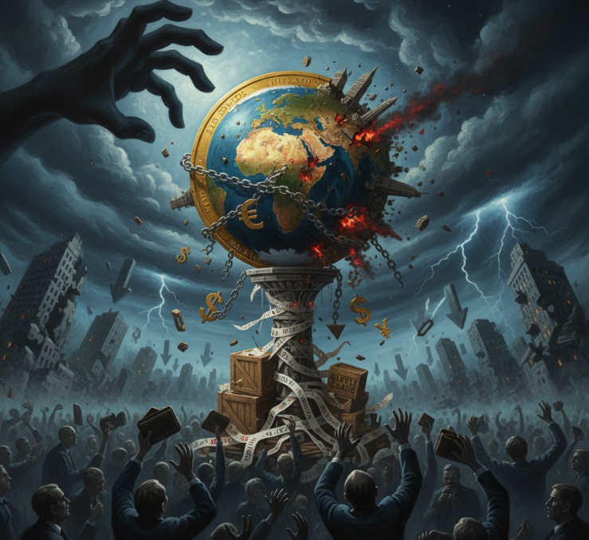

ジムロジャーやバフェットが経済危機への危機感を強めている現状、気になってくるのは経済危機です。
歴史を紐解くと過去何度となく経済危機は起きていたようです。
今日はそんな経済危機について説明します。

## 概要

「経済危機」とは、**一国または世界規模で、経済活動が大きく悪化し、金融・実体経済の両面で深刻な混乱が生じる状態**を指す、かなり広い概念です。

### 経済危機の一般的な定義

経済学では、次のような特徴を持つ状態を「経済危機」と呼ぶことが多いです。

- **経済活動の急激な悪化**  
  国内総生産（GDP）の大幅なマイナス成長、失業率の急上昇、企業倒産の増加など、経済全体のパフォーマンスが大きく落ち込むこと。

- **金融システムの不安定化**  
  銀行の破綻、金融市場の暴落、信用収縮（クレジットクランチ）など、お金の流れが滞り、金融システムが機能不全に陥ること。

- **資産価格の急落**  
  株価・不動産価格などが急激に下落し、多くの人が資産を失うこと。

- **通貨価値の不安定化**  
  自国通貨の急激な下落（通貨危機）、ハイパーインフレなど、貨幣の価値が大きく揺らぐこと。

- **政府・企業・家計の債務問題**  
  政府債務のデフォルト（債務不履行）、企業や家計の過剰債務による破綻・返済不能など。

これらが**同時に、あるいは連鎖的に発生**し、経済全体が「危機的」な状態に陥ったとき、「経済危機」と呼ぶのが一般的です。

### 経済危機の主なタイプ

「経済危機」は、原因や中心となる現象によって、いくつかのタイプに分けられます。

#### 1. 金融危機（Financial Crisis）
- 銀行や証券会社など金融機関が破綻したり、金融市場が暴落するなど、**金融システムそのものが危険な状態**になること。
- 例：銀行の取り付け騒ぎ、金融機関の連鎖倒産など。

#### 2. 通貨危機（Currency Crisis）
- 自国通貨の価値が急激に下落し、為替レートが大きく変動する状態。
- 外国為替市場で通貨が売られ、政府が外貨準備を投入しても支えきれないような状況。

#### 3. 債務危機（Debt Crisis）
- 政府や企業が借金を返せなくなり、**デフォルト（債務不履行）**に陥る状態。
- 国債の利払いができなくなる「ソブリン危機」も含まれます。

#### 4. バブル崩壊（Bubble Burst）
- 株価・不動産価格などが実体経済から大きく乖離して高騰し、その後一気に崩れること。
- 資産価格の急落が、金融機関や家計・企業のバランスシートを悪化させ、経済全体に悪影響を及ぼします。

#### 5. 世界経済危機（Global Economic Crisis）
- 一国だけでなく、**複数の国や世界全体に広がる**経済危機。
- 例：1929年の世界大恐慌、2008年の世界金融危機（リーマン・ショック）など。

### 経済危機の影響

- **失業の増加**：企業が倒産・縮小し、雇用が失われる。
- **資産価値の減少**：株・不動産などが下落し、多くの人が資産を失う。
- **生活水準の低下**：物価上昇や賃金低下により、生活が苦しくなる。
- **政治的・社会的な不安定化**：政権交代や社会不安、暴動などにつながることもある。

## 発生のメカニズム

経済危機の「きっかけ」は一つではなく、**いくつかの要因が重なって**起こることが多いです。  
代表的なきっかけと、そこから経済全体に広がるメカニズムを順に説明します。

### 1. きっかけになりやすいもの

#### ① 資産バブルの発生と崩壊

- **きっかけ**：株や不動産などの資産価格が、実体経済から大きく乖離して高騰し、「バブル」が生まれる。  
- **メカニズム**：  
  - バブル期：  
    - 値上がり期待から投機が加速し、さらに価格が上がる。  
    - 企業・家計が「将来も値上がりする」と信じて借金を増やし、投資・消費を拡大する。  
  - バブル崩壊：  
    - 何らかのきっかけ（利上げ、景気後退、事件など）で「もう上がらない」と気づくと、一斉に売りが出て価格が急落。  
    - 借金を抱えたまま資産価値が減り、**バランスシート（資産と負債のバランス）が悪化**。  
    - 企業は投資を控え、家計は消費を抑え、経済全体が冷え込む。

- **例**：日本の1990年代のバブル崩壊、2000年代のアメリカの住宅バブル（サブプライムローン問題）など。

#### ② 金融システムの脆弱性

- **きっかけ**：銀行や証券会社などが、リスクの高い融資・投資を積み増し、レバレッジ（借金）を高めている。  
- **メカニズム**：  
  - 景気が良いうちは問題にならないが、  
  - 景気悪化や資産価格下落で不良債権が増えると、金融機関の自己資本が目減り。  
  - 金融機関が**貸し渋り・貸し剥がし**を始め、企業や家計にお金が回らなくなる（信用収縮）。  
  - 資金繰りが悪化した企業が倒産し、失業が増える。

- **例**：2008年のリーマン・ショックでは、サブプライムローン関連商品の損失が金融機関を直撃し、世界的な信用収縮を引き起こしました。

#### ③ 過剰債務（政府・企業・家計）

- **きっかけ**：政府・企業・家計のいずれか、あるいは複数が、返済能力を超える借金を抱える。  
- **メカニズム**：  
  - 景気が悪化すると、税収や売上が減り、債務返済が困難になる。  
  - 債務のデフォルト（債務不履行）が起きると、債権を持つ金融機関や投資家が大きな損失を被る。  
  - それが連鎖して、金融システム全体が不安定化する。

- **例**：2010年代の欧州債務危機（ギリシャなど）、1990年代後半のアジア通貨危機（過剰な外貨建て債務）。

#### ④ 通貨危機（為替レートの急落）

- **きっかけ**：自国通貨が急激に売られ、為替レートが暴落する。  
- **メカニズム**：  
  - 自国通貨建ての資産価値が目減りし、輸入品価格が急騰してインフレが加速。  
  - 外貨建て債務を抱える国・企業は、返済負担が急増して破綻リスクが高まる。  
  - 金融機関や企業の破綻が連鎖し、経済全体が混乱する。

- **例**：1997年のアジア通貨危機、1994年のメキシコ通貨危機など。

#### ⑤ 外部ショック（戦争・パンデミック・資源価格の急変など）

- **きっかけ**：戦争、感染症の大流行、原油価格の急騰・急落など、経済の外側から大きな打撃が来る。  
- **メカニズム**：  
  - 供給網が寸断されたり、需要が急減したりして、生産・消費が急停止。  
  - 企業収益が悪化し、失業が増え、金融市場も不安定化する。  
  - これが金融システムや債務問題と結びつくと、より深刻な経済危機に発展する。

- **例**：2020年の新型コロナウイルスによる世界的な経済ショック、1970年代のオイルショックなど。

### 2. メカニズムの連鎖（典型的な流れ）

経済危機は、だいたい次のような**連鎖**で広がることが多いです。

1. **きっかけの発生**  
   - バブル崩壊、金融機関の破綻、債務デフォルト、通貨暴落、外部ショックなど。

2. **金融市場の混乱**  
   - 株価・債券価格の急落、金融機関の損失拡大、信用収縮（お金が回らなくなる）。

3. **実体経済への波及**  
   - 企業が資金繰り悪化で投資・雇用を削減。  
   - 家計が資産価値減少や失業で消費を控える。

4. **景気後退・不況の深刻化**  
   - GDPがマイナス成長、失業率上昇、企業倒産が増加。

5. **政策対応と回復（または長期停滞）**  
   - 政府・中央銀行が財政出動・金融緩和で対応するが、  
   - 対応が遅れたり、構造問題が大きいと、長期の不況（「失われた10年」など）に陥ることもある。

### 3. まとめ

- **きっかけ**：  
  - 資産バブルの崩壊  
  - 金融システムの脆弱性（過剰レバレッジ・不良債権）  
  - 過剰債務（政府・企業・家計）  
  - 通貨危機（為替暴落）  
  - 外部ショック（戦争・パンデミック・資源価格変動など）

- **メカニズム**：  
  - きっかけ → 金融市場の混乱 → 信用収縮 → 実体経済の悪化 → 景気後退・不況  
  - これらが**連鎖的に広がる**ことで、「経済危機」と呼ばれる状態になります。

- 重要なのは、**一つのきっかけが、金融・実体経済・社会全体に波及する**点です。  
  そのため、経済危機を防ぐには、バブルの早期発見、金融システムの健全性維持、債務管理、外部ショックへの備えなど、複数の視点からの対策が必要になります。

## 過去の経済危機のアナロジー

先に説明した「経済危機のメカニズム」の枠組み（バブル崩壊、金融システムの脆弱性、債務問題、通貨危機、外部ショックなど）に沿って、**過去の世界的な経済危機**を整理します。

代表的な例として、以下4つを取り上げます。

- 世界大恐慌（1929年〜1930年代）
- アジア通貨危機（1997年〜）
- 世界金融危機（リーマン・ショック、2008年〜）
- コロナショック（2020年〜）

### 1. 世界大恐慌（1929年〜1930年代）

__

- **きっかけの類型**：  
  - **資産バブルの崩壊**（株式バブル）  
  - **金融システムの脆弱性**（銀行の連鎖倒産）  
  - **債務デフレ**（物価下落で実質債務が増える）

- **流れ**：  
  1. 1920年代のアメリカで、低金利と過剰な信用拡大により**株式バブル**が形成。[世界恐慌 - Wikipedia](https://ja.wikipedia.org/wiki/%E4%B8%96%E7%95%8C%E6%81%90%E6%85%8C)  
  2. 1929年10月、ニューヨーク株式市場が大暴落（ブラック・サーズデー／ブラック・チューズデー）。[世界恐慌 - Wikipedia](https://ja.wikipedia.org/wiki/%E4%B8%96%E7%95%8C%E6%81%90%E6%85%8C)  
  3. 株価暴落で投資家・金融機関が巨額損失を被り、**銀行の取り付け騒ぎ・連鎖倒産**が発生。[世界恐慌 - Wikipedia](https://ja.wikipedia.org/wiki/%E4%B8%96%E7%95%8C%E6%81%90%E6%85%8C)  
  4. 物価が下落し、**債務の実質価値が増大**する「デットデフレーション」が深刻化。[大恐慌は繰り返すか ～金融危機をどう見るか～(後編)](https://www.tr.mufg.jp/houjin/jutaku/pdf/c200905_2.pdf)  
  5. 各国が保護貿易（スムート・ホーリー法など）を強化し、**世界貿易が縮小**、恐慌が世界に波及。[世界恐慌 - Wikipedia](https://ja.wikipedia.org/wiki/%E4%B8%96%E7%95%8C%E6%81%90%E6%85%8C)

__インパクト__

- **経済面**：  
  - アメリカの実質GNPは1929〜1933年にかけて約46％減少。[大恐慌は繰り返すか ～金融危機をどう見るか～(後編)](https://www.tr.mufg.jp/houjin/jutaku/pdf/c200905_2.pdf)  
  - 世界の工業生産は約3分の1減少。  
  - 失業率はアメリカで25％を超えるなど、各国で急増。[世界恐慌 - Wikipedia](https://ja.wikipedia.org/wiki/%E4%B8%96%E7%95%8C%E6%81%90%E6%85%8C)

- **社会・政治面**：  
  - 貧困・飢餓が深刻化し、社会不安が増大。  
  - ドイツではナチス政権の台頭、日本では軍部の台頭など、**政治的急進化**を招いた。[世界恐慌 - Wikipedia](https://ja.wikipedia.org/wiki/%E4%B8%96%E7%95%8C%E6%81%90%E6%85%8C)

__終息の経緯__

- **ニューディール政策**（1933年〜）：  
  - ルーズベルト政権が公共事業・金融改革・社会保障などを導入し、景気刺激を試みる。[世界恐慌 - Wikipedia](https://ja.wikipedia.org/wiki/%E4%B8%96%E7%95%8C%E6%81%90%E6%85%8C)

- **第二次世界大戦（1939年〜）による軍需景気**：  
  - 軍需生産の拡大で雇用が増え、各国経済が本格的に回復に向かったとされる。[世界恐慌 - Wikipedia](https://ja.wikipedia.org/wiki/%E4%B8%96%E7%95%8C%E6%81%90%E6%85%8C)

- **教訓**：  
  - 金融システムの安定化、財政政策の積極活用、国際協調の重要性が認識され、戦後のブレトン・ウッズ体制（IMF・世界銀行）につながる。[世界恐慌 - Wikipedia](https://ja.wikipedia.org/wiki/%E4%B8%96%E7%95%8C%E6%81%90%E6%85%8C)

### 2. アジア通貨危機（1997年〜）

__発生メカニズム（アナロジー）__

- **きっかけの類型**：  
  - **通貨危機**（為替暴落）  
  - **過剰債務**（短期外貨建て債務）  
  - **金融システムの脆弱性**（銀行の不良債権）

- **流れ**：  
  1. 1990年代前半、アジア諸国は**ドルペッグ制**のもとで高い成長を実現し、海外資本が大量流入。[アジア通貨危機 - Wikipedia](https://ja.wikipedia.org/wiki/%E3%82%A2%E3%82%B8%E3%82%A2%E9%80%9A%E8%B2%A8%E5%8D%B1%E6%A9%9F)  
  2. しかし、銀行システムは脆弱で、**短期外貨建て債務**が過剰に積み上がる。[アジア通貨危機とIMF](https://econ-review.ier.hit-u.ac.jp/wp-content/uploads/files/1999-50/keizaikenkyu5001068.pdf)  
  3. 1997年7月、タイ・バーツが**投機的攻撃**を受け、変動相場制へ移行（事実上の切り下げ）。[アジア通貨危機 - Wikipedia](https://ja.wikipedia.org/wiki/%E3%82%A2%E3%82%B8%E3%82%A2%E9%80%9A%E8%B2%A8%E5%8D%B1%E6%A9%9F)  
  4. 通貨危機がインドネシア・韓国・マレーシアなどに波及し、**通貨暴落と銀行危機**が連鎖。[アジア通貨危機 - Wikipedia](https://ja.wikipedia.org/wiki/%E3%82%A2%E3%82%B8%E3%82%A2%E9%80%9A%E8%B2%A8%E5%8D%B1%E6%A9%9F)

__インパクト__

- **経済面**：  
  - タイ・韓国・インドネシアなどでGDPが大幅マイナス成長。  
  - 通貨が数分の1に下落し、**外貨建て債務の返済負担が急増**。[アジア通貨危機 - Wikipedia](https://ja.wikipedia.org/wiki/%E3%82%A2%E3%82%B8%E3%82%A2%E9%80%9A%E8%B2%A8%E5%8D%B1%E6%A9%9F)  
  - 企業倒産・失業率上昇が深刻化。

- **社会・政治面**：  
  - インドネシアではスハルト政権が崩壊するなど、**政治不安**が拡大。[アジア通貨危機 - Wikipedia](https://ja.wikipedia.org/wiki/%E3%82%A2%E3%82%B8%E3%82%A2%E9%80%9A%E8%B2%A8%E5%8D%B1%E6%A9%9F)

__終息の経緯__

- **IMF・各国による金融支援**：  
  - タイ・韓国・インドネシアなどがIMFの支援プログラムを受け入れ、**緊縮財政・金融改革・構造改革**を実施。[アジア通貨危機 - Wikipedia](https://ja.wikipedia.org/wiki/%E3%82%A2%E3%82%B8%E3%82%A2%E9%80%9A%E8%B2%A8%E5%8D%B1%E6%A9%9F)

- **通貨制度の見直し**：  
  - ドルペッグから管理フロート制などへ移行し、為替リスク管理を強化。[通貨制度に関するアジア地域の経験](https://www5.cao.go.jp/j-j/sekai_chouryuu/sa12-02/s2_12_2_3.html)

- **金融・企業部門の再編**：  
  - 不良債権処理、銀行再編、企業のリストラが進み、2000年代初頭には多くの国が回復。[アジア通貨危機 - Wikipedia](https://ja.wikipedia.org/wiki/%E3%82%A2%E3%82%B8%E3%82%A2%E9%80%9A%E8%B2%A8%E5%8D%B1%E6%A9%9F)

- **教訓**：  
  - 短期資本流入のリスク、為替制度の設計、金融監督の重要性が認識され、**アジア地域の金融協力（チェンマイ・イニシアティブなど）**が進展。[東アジア金融協力 ― 二つの経済危機から学ぶアジアと日本](https://www2.jiia.or.jp/pdf/resarch/h22_chiki_togo/05_Chapter5.pdf)

### 3. 世界金融危機（リーマン・ショック、2008年〜）

__発生メカニズム（アナロジー）__

- **きっかけの類型**：  
  - **資産バブルの崩壊**（住宅バブル）  
  - **金融システムの脆弱性**（証券化商品・レバレッジ）  
  - **債務問題**（サブプライムローン）

- **流れ**：  
  1. 2000年代前半、アメリカで低金利政策のもと**住宅バブル**が発生。[リーマンショックとは？いつ・どうやって・なぜ起きた？](https://www.matsui.co.jp/us-stock/study/article/lehman-shock/)  
  2. 信用力の低い層向けの**サブプライムローン**が急増し、これがMBS・CDOなどの**証券化商品**に組み込まれる。[リーマンショックとは？いつ・どうやって・なぜ起きた？](https://www.matsui.co.jp/us-stock/study/article/lehman-shock/)  
  3. 2006年ごろから住宅価格が下落し、サブプライムローンのデフォルトが急増。[リーマンショックとは？いつ・どうやって・なぜ起きた？](https://www.matsui.co.jp/us-stock/study/article/lehman-shock/)  
  4. 2008年9月15日、大手投資銀行**リーマン・ブラザーズ**が破綻し、**金融システム全体の信用収縮**が発生。[世界金融危機 (2007年-2010年) - Wikipedia](https://ja.wikipedia.org/wiki/%E4%B8%96%E7%95%8C%E9%87%91%E8%9E%8D%E5%8D%B1%E6%A9%9F_(2007%E5%B9%B4-2010%E5%B9%B4))

__インパクト__

- **経済面**：  
  - 世界のGDP成長率が大幅に低下（2009年には多くの先進国でマイナス成長）。[世界金融危機 (2007年-2010年) - Wikipedia](https://ja.wikipedia.org/wiki/%E4%B8%96%E7%95%8C%E9%87%91%E8%9E%8D%E5%8D%B1%E6%A9%9F_(2007%E5%B9%B4-2010%E5%B9%B4))  
  - 株価が世界的に暴落し、金融機関の破綻・国有化が相次ぐ。  
  - 失業率が上昇し、特に若年層の雇用・所得に長期的な影響。[生まれなかった数百万人の子ども リーマン・ショック10年](https://www.bbc.com/japanese/features-and-analysis-45518238)

- **社会面**：  
  - 住宅ローン破綻や資産価値の減少で、多くの家計が打撃を受ける。  
  - ミレニアル世代の資産形成・住宅取得が遅れるなど、**世代間の格差**が拡大。[生まれなかった数百万人の子ども リーマン・ショック10年](https://www.bbc.com/japanese/features-and-analysis-45518238)

__終息の経緯__

- **大規模な金融緩和・流動性供給**：  
  - FRB・ECB・日銀などが**ゼロ金利政策・量的緩和**を導入し、金融市場に大量の資金を供給。[世界金融危機 (2007年-2010年) - Wikipedia](https://ja.wikipedia.org/wiki/%E4%B8%96%E7%95%8C%E9%87%91%E8%9E%8D%E5%8D%B1%E6%A9%9F_(2007%E5%B9%B4-2010%E5%B9%B4))

- **財政出動・金融機関の救済**：  
  - 各国政府が**公的資金注入・国有化・景気刺激策**を実施（例：アメリカのTARP）。[世界金融危機 (2007年-2010年) - Wikipedia](https://ja.wikipedia.org/wiki/%E4%B8%96%E7%95%8C%E9%87%91%E8%9E%8D%E5%8D%B1%E6%A9%9F_(2007%E5%B9%B4-2010%E5%B9%B4))

- **金融規制の強化**：  
  - バーゼルIIIなどの**自己資本規制強化**、デリバティブ取引の中央清算義務化などが進む。[世界金融危機 (2007年-2010年) - Wikipedia](https://ja.wikipedia.org/wiki/%E4%B8%96%E7%95%8C%E9%87%91%E8%9E%8D%E5%8D%B1%E6%A9%9F_(2007%E5%B9%B4-2010%E5%B9%B4))

- **教訓**：  
  - 証券化商品のリスク管理、レバレッジ規制、マクロプルーデンス政策（金融システム全体の安定を重視）の重要性が再認識される。

### 4. コロナショック（2020年〜）

__発生メカニズム（アナロジー）__

- **きっかけの類型**：  
  - **外部ショック**（パンデミック）  
  - **供給・需要の同時ショック**

- **流れ**：  
  1. 2019年末〜2020年初頭、中国・武漢で**新型コロナウイルス（COVID-19）**が発生し、世界的に感染拡大。[コロナショックと世界経済の状況](https://www.meti.go.jp/report/tsuhaku2020/pdf/01-01-01.pdf)  
  2. 各国が**ロックダウン・移動制限**を実施し、生産・消費・サービスが急停止。[新型コロナウイルス感染拡大の経済的影響](https://www5.cao.go.jp/j-j/sekai_chouryuu/sh20-01/s1_20_1_2.html)  
  3. サプライチェーンの寸断と需要の急減が同時に起こり、**世界経済が急激に減速**。[コロナショックと世界経済の状況](https://www.meti.go.jp/report/tsuhaku2020/pdf/01-01-01.pdf)

__インパクト__

- **経済面**：  
  - 2020年の世界GDP成長率は大幅マイナス（IMFは「グレート・ロックダウン」と表現）。[コロナショックと世界経済の状況](https://www.meti.go.jp/report/tsuhaku2020/pdf/01-01-01.pdf)  
  - 観光・飲食・航空など対面サービス産業が壊滅的打撃。  
  - 失業率が急上昇し、特に非正規・低所得層が大きな影響。

- **社会面**：  
  - 医療体制の逼迫、教育のオンライン化、リモートワークの普及など、**生活様式の変化**が加速。[新型コロナウイルス感染症が社会にもたらす影響](https://www.soumu.go.jp/johotsusintokei/whitepaper/ja/r02/pdf/n2300000.pdf)

__終息の経緯__

- **大規模な財政・金融政策**：  
  - 各国政府が**給付金・雇用調整助成金・企業支援**などの財政出動を実施。[新型コロナウイルス感染拡大の経済的影響](https://www5.cao.go.jp/j-j/sekai_chouryuu/sh20-01/s1_20_1_2.html)  
  - 中央銀行が**超金融緩和・資産買い入れ**を拡大し、市場の流動性を確保。[コロナショックと世界経済の状況](https://www.meti.go.jp/report/tsuhaku2020/pdf/01-01-01.pdf)

- **ワクチン開発・接種の進展**：  
  - 2020年末以降、ワクチンが実用化され、**段階的な経済活動再開**が進む。[新型コロナウイルス感染症の世界・日本経済への影響](https://www.mri.co.jp/knowledge/insight/ecooutlook/2020/20200519.html)

- **デジタル化・産業構造の変化**：  
  - リモートワーク・EC・デジタルサービスが急速に普及し、**経済のデジタル化が加速**。[コロナ以後の経済社会構造の変化](https://www.fsa.go.jp/singi/follow-up/siryou/20201020/04.pdf)

- **教訓**：  
  - パンデミックへの備え（医療体制・経済セーフティネット）、デジタルインフラ整備、グローバル・サプライチェーンのリスク管理の重要性が浮き彫りになった。

### まとめ：経済危機の「共通パターン」

これら4つの危機を、先に説明したメカニズムの枠組みで整理すると、次のようにまとめられます。

| 危機 | 主なきっかけの類型 | 主なインパクト | 終息の主な要因 |
|------|-------------------|----------------|----------------|
| 世界大恐慌 | 株式バブル崩壊・金融システム脆弱性・債務デフレ | 大規模な失業・生産縮小・政治的急進化 | ニューディール政策・第二次大戦による軍需景気 |
| アジア通貨危機 | 通貨危機・過剰債務・金融システム脆弱性 | 通貨暴落・GDPマイナス成長・政治不安 | IMF支援・構造改革・通貨制度見直し |
| 世界金融危機 | 住宅バブル崩壊・証券化商品・レバレッジ過剰 | 世界的景気後退・金融機関破綻・若年層の長期影響 | 大規模金融緩和・財政出動・金融規制強化 |
| コロナショック | パンデミック（外部ショック）・供給・需要同時ショック | 世界GDPマイナス成長・サービス産業壊滅・生活様式変化 | 大規模財政・金融政策・ワクチン接種・デジタル化加速 |

**共通点**としては、

- **きっかけ**：バブル崩壊・金融システムの脆弱性・債務問題・通貨危機・外部ショックのいずれか、あるいは複合  
- **連鎖**：金融市場の混乱 → 信用収縮 → 実体経済の悪化 → 社会・政治への波及  
- **終息**：大規模な政策対応（財政・金融・構造改革）と、時間をかけた回復

というパターンが見られます。

## 総括

経済は流動することでバランスを保っています。
が、どこか一カ所、流動のメインフローどこかが破綻することで急激な経済悪化が起こります。

近年で気がかりと考えられるのは以下のような点です。

### 1. 金融市場の過熱とバブル的な動き

__AI投資ブームの過熱・失速リスク__

- 2025年ごろから、**AI（人工知能）関連投資ブーム**が世界経済を支える大きな要因になっています。[2026年の国際金融5大リスク](https://www.iima.or.jp/docs/column/2025/ei2025.31.pdf)

- しかし、  
  - AI投資の**収益モデルが確立していない**  
  - AI関連銘柄の**バリュエーション（株価水準）が割高になっている**  
  といった懸念も出ており、**「AIバブル」がはじけるリスク**が指摘されています。[2026年の国際金融5大リスク](https://www.iima.or.jp/docs/column/2025/ei2025.31.pdf)

- もしAI投資ブームが急激に失速すれば、  
  - 設備投資の急減  
  - 株価の大幅調整  
  - 金融市場の波乱  
  を通じて、**景気後退や金融不安**につながる可能性があります。

__不動産市場のバブル懸念__

- 日本を含む各国で、**不動産価格の高騰**が続いています。[不動産バブル崩壊はいよいよ近づいているのか](https://topics.smt.docomo.ne.jp/article/toyokeizai/business/toyokeizai-939040)

- 特に、  
  - 都心の高級マンション価格の急伸  
  - 地銀による不動産業向け融資の増加  
  などから、**不動産バブル崩壊のリスク**が警戒されています。[不動産バブル崩壊はいよいよ近づいているのか](https://topics.smt.docomo.ne.jp/article/toyokeizai/business/toyokeizai-939040)

- 金利上昇や景気減速が重なると、**不動産価格の調整→金融機関の不良債権増加→信用収縮**という連鎖が起こりうる、という見方です。

### 2. 金利上昇と債務負担の増大

__長期金利の上振れ・高止まり__

- 先進国を中心に、**長期金利（10年国債利回りなど）が上昇・高止まり**しています。[2026年の国際金融5大リスク](https://www.iima.or.jp/docs/column/2025/ei2025.31.pdf)

- 日本でも10年国債利回りが約19年半ぶりに2％を上回るなど、**低金利時代からの転換**が進んでいます。[2026年の国際金融5大リスク](https://www.iima.or.jp/docs/column/2025/ei2025.31.pdf)

- 金利上昇は、  
  - 企業の借入コスト増  
  - 家計の住宅ローン負担増  
  - 政府債務の利払い負担増  
  につながり、**景気の下押し要因**になります。

__政府・民間債務の高水準__

- 世界全体の債務（政府・企業・家計）はGDP比で300％超と、依然として非常に高い水準です。[IMF 国際金融安定性報告書 2025年10月](https://www.imf.org/-/media/files/publications/gfsr/2025/october/japanese/execsum.pdf)

- 特に新興国では、**債務対GDP比が上昇**し、**借入コストの上昇**も重なって、**債務危機のリスク**が高まっていると指摘されています。[IMF 国際金融安定性報告書 2025年10月](https://www.imf.org/-/media/files/publications/gfsr/2025/october/japanese/execsum.pdf)

- もし金利がさらに上昇し、景気が悪化すれば、**一部の国・企業が債務不履行（デフォルト）に陥るリスク**があります。

### 3. 地政学リスクとエネルギー価格の高騰

__中東情勢の緊迫化と原油高__

- 2025〜2026年には、**中東情勢の緊迫化**（イラン・ホルムズ海峡をめぐる緊張など）が続き、**原油価格が高騰**しています。[さらなる原油高と金利上昇を警戒 米国株は昨年9月以来の安値水準へ](https://www.smd-am.co.jp/market/daily/marketreport/2026/03/news260323jp/)

- 原油高は、  
  - インフレ圧力の強化  
  - 中央銀行の利下げ遅れ・利上げ再開懸念  
  - 企業コスト増・家計の実質所得減少  
  を通じて、**景気減速と金融市場の不安定化**を招くリスクがあります。[さらなる原油高と金利上昇を警戒 米国株は昨年9月以来の安値水準へ](https://www.smd-am.co.jp/market/daily/marketreport/2026/03/news260323jp/)

__米国・中国の対立と「Gゼロ」世界__

- 米中対立や各国の保護主義的な政策（関税引き上げなど）により、**国際協調が弱まり、「Gゼロ」状態**が続いているとの指摘もあります。[ユーラシア・グループ TOP RISKS 2025](https://www.eurasiagroup.net/siteFiles/Media/files/TopRisks2025JPN(1).pdf)

- こうした環境では、  
  - 貿易摩擦の激化  
  - サプライチェーンの分断  
  - 金融市場のリスク回避姿勢の強まり  
  が起こりやすく、**世界経済の不安定化要因**になります。

### 4. インフレ再燃リスクと金融政策の難しさ

- 米国などでは、**インフレ再燃のリスク**が指摘されています。[2026年のグローバル金融市場見通し](https://www.invesco.com/jp/ja/insights/global-view/global-view-2025-dec-04.html)

- もしインフレが再加速すれば、  
  - FRBなど中央銀行が**利下げを中断・利上げ再開**せざるを得なくなる  
  - 金利上昇が景気を冷やし、**「スタグフレーション（景気停滞＋インフレ）」**に陥るリスク  
  が高まります。

- 一方で、**利下げを続ければインフレが抑えきれない**というジレンマもあり、金融政策の舵取りが難しくなっています。

### 5. まとめ：現時点で見られる「危機の兆候」

整理すると、**2026年時点で「経済危機につながりうる兆候」として指摘されている主なもの**は次の通りです。

1. **AI投資ブームの過熱とバブル懸念**  
   - AI関連株の割高感、収益モデルの不確実性  
   - ブーム失速による設備投資減・株価調整リスク[2026年の国際金融5大リスク](https://www.iima.or.jp/docs/column/2025/ei2025.31.pdf)

2. **不動産市場の高騰と金融機関のリスク集中**  
   - 都心マンション価格の急伸、地銀の不動産融資増加  
   - 金利上昇・景気減速による価格調整リスク[不動産バブル崩壊はいよいよ近づいているのか](https://topics.smt.docomo.ne.jp/article/toyokeizai/business/toyokeizai-939040)

3. **長期金利の上振れと債務負担の増大**  
   - 先進国・新興国ともに債務水準が高い  
   - 金利上昇が利払い負担を増やし、景気を圧迫するリスク[IMF 国際金融安定性報告書 2025年10月](https://www.imf.org/-/media/files/publications/gfsr/2025/october/japanese/execsum.pdf)

4. **地政学リスクと原油高によるインフレ・景気悪化リスク**  
   - 中東情勢の緊迫化による原油高  
   - インフレ再燃・利下げ遅れ・株安の連鎖[さらなる原油高と金利上昇を警戒 米国株は昨年9月以来の安値水準へ](https://www.smd-am.co.jp/market/daily/marketreport/2026/03/news260323jp/)

5. **インフレ再燃と金融政策のジレンマ**  
   - インフレ再加速の懸念  
   - 利下げ継続か、インフレ抑制かで政策判断が難しくなるリスク[2026年のグローバル金融市場見通し](https://www.invesco.com/jp/ja/insights/global-view/global-view-2025-dec-04.html)

経済リスクは事前に来た時準備の有無が運命を分けることになる可能性があります。
読者様皆様がリスクを意識して、資産運用を行っていただければと考えてます。
