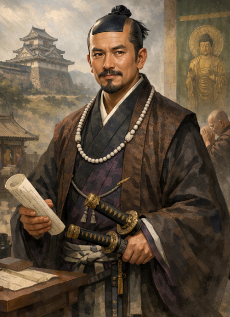

大河で活躍中の豊臣秀長ですが、彼は秀吉の弟で、彼の家臣がそこまで有名になることはありません。
彼の家臣で有名だったのは藤堂高虎くらいかもしれません。
そんな彼の家臣の中でも超有名な横浜良慶（よこはまりょうけい）について説明します。

## 概要

横浜良慶は、豊臣秀長の重臣で、**横浜一庵（よこはま いちあん）** という名でも知られる人物です。

### 基本情報

- 生没年：1549年～1596年頃（諸説あり）
- 主君：豊臣秀長（豊臣大納言家）
- 別名：横浜一庵、俗名「良慶」、誤伝で「光慶」と表記されることもある[Wikipedia（横浜一庵）](https://ja.wikipedia.org/wiki/%E6%A8%AA%E6%B5%9C%E4%B8%80%E5%BA%B5)。

### 秀長家臣としての役割

- 秀長が大和国（現在の奈良県）を支配するようになってから史料に登場し、**大和国の内政を担当**した重臣とされています[豊臣秀長の家臣たち](https://taigadramas.com/toyotomihidenaga/toyotomihidenaga_kashin/)。
- 秀長家中では**三家老の一人**（横浜一庵・羽田正親・小川下野守）とされ、領国経営の中心的存在でした[豊臣秀長の家臣たち](https://taigadramas.com/toyotomihidenaga/toyotomihidenaga_kashin/)。
- 家臣団の中では**最高額の5万石**を領したとされ、その実務能力と信頼の厚さがうかがえます[豊臣秀長の家臣たち](https://taigadramas.com/toyotomihidenaga/toyotomihidenaga_kashin/)。

### 秀長没後の動向

- 秀長の死後は、その養子・**豊臣秀保（ひでやす）の後見人**を務めたとされます[豊臣秀長の家臣たち](https://taigadramas.com/toyotomihidenaga/toyotomihidenaga_kashin/)。
- 秀保が早世した後は、豊臣政権内での横浜家の影響力は徐々に低下していったとされています。

### 後世の評価・エピソード

- 大和郡山城では、横浜良慶の名にちなんで **「法印曲輪」「一庵丸」** と呼ばれる曲輪が残っており、郡山の統治に深く関わった人物として地元で記憶されています[奈良新聞](https://www.nara-np.co.jp/news/20260108205938.html)。
- 近年、秀長の大和支配を示す**横浜良慶（一庵）の書状**が公開されるなど、史料研究の面でも注目されています[天理大学ニュース](https://www.tenri-u.ac.jp/news/62893/)。

## 生い立ち

はっきりと言って未知です。
横浜良慶は、秀長の大和支配が始まってから史料に登場する人物であり、それ以前の出自や若年期の経歴は、現状ではほとんど不明です。
史料に名が見え始めるのは、 豊臣秀長が大和国に入ってからで、その家臣（家老）として内政を担当するようになって以降です。

## 実際に行ったこと

横浜良慶が具体的に関わった史跡として、現在も名前が残っているのは**大和郡山城（奈良県大和郡山市）** です。

### 1. 郡山城の「法印曲輪（一庵丸）」

- 郡山城には、**法印曲輪（一庵丸）** と呼ばれる曲輪（くるわ）があります。
- この名称は、**横浜一庵法印良慶**の屋敷があったことに由来するとされています[郡山城百話【城郭】下](http://www4.kcn.ne.jp/~suizan21/page013.html)。
- 「法印」は一庵が持っていた僧位で、その通称が曲輪名に定着したと説明されています[郡山城百話【城郭】下](http://www4.kcn.ne.jp/~suizan21/page013.html)。
- 古記録（『本多忠平公御一代記』など）には「一庵丸（横浜一庵法印良慶）」といった呼称も見られ、彼の名が城の縄張りに刻まれていることが分かります[郡山城百話【城郭】下](http://www4.kcn.ne.jp/~suizan21/page013.html)。

### 2. 現在の痕跡

- 現在の郡山城跡（城山公園）では、当時の面影は薄れているものの、**「一庵丸跡」の碑**が残っており、横浜一庵（良慶）の名を留める物証となっています[郡山城百話【城郭】下](http://www4.kcn.ne.jp/~suizan21/page013.html)。
- この碑は、彼が秀長の家老として郡山城の内政・城郭整備に関わったことを示す、具体的な史跡と言えます。

## 秀長とのやり取り

横浜良慶と秀長のやり取りを示す史料としては、**秀長の命を受けて横浜良慶が出した書状**や、**秀長あての報告書状**が確認されています。

### 1. 秀長の命を受けた横浜良慶の書状（興福寺衆徒あて）

- 天理大学が奈良市の旧家「菊岡家」の文書調査で発見した書状は、**秀長の家臣・横浜良慶が、秀長の命を受けて興福寺の衆徒（僧侶兼武士）に送ったもの**です[Yahoo!ニュース](https://news.yahoo.co.jp/articles/23db408acb5d31cd0cfa441b7865fc4f0410d481)。
- 内容は、**伝統的な祭礼を執行するよう命じる**もので、秀長が大和国を拝領して郡山城に入った1585年頃の統治実態を示すものとされています[Yahoo!ニュース](https://news.yahoo.co.jp/articles/23db408acb5d31cd0cfa441b7865fc4f0410d481)。
- この書状は、**秀長が宗教勢力を掌握しながら大和を統治していたこと**を具体的に示す史料として注目されています。

### 2. 秀長あての報告書状（横浜良慶が仲介したもの）

- 同じく天理大学の「菊岡家文書」の中間報告会では、**横浜良慶書状**として、興福寺の衆徒が慣例行事である「蜂起始（ほうきはじめ）」の完了を**秀長に報告している書状**が紹介されています[天理大学歴史文化学科（Instagram）](https://www.instagram.com/p/DU9axT_DH5D/)。
- これは、衆徒側が秀長に直接（あるいは横浜良慶を介して）報告している形で、**秀長が大和支配の中心（棟梁）として位置づけられている**ことを示す内容とされています[天理大学歴史文化学科（Instagram）](https://www.instagram.com/p/DU9axT_DH5D/)。

### 3. まとめ

- 現時点で確認できる「横浜良慶と秀長のやり取り」を示す史料は、主に**秀長の命を受けた横浜良慶の書状**と、**秀長あての報告書状**です。
- これらは、秀長が大和国を統治する際に、**横浜良慶を実務担当者として宗教勢力（興福寺）との調整を任せていた**ことを具体的に示す資料と言えます。

したがって、「秀長と横浜良慶のやり取り」そのものを直接記した書状は限られていますが、**秀長の命を受けて横浜良慶が出した書状や、秀長あての報告書状を通じて、両者の役割分担と統治の実態が読み取れる**史料が残っています。

## 想像される横井とは

ここまで資料が少ないとは当初思いもしなかったですが、秀長が重用したのは確からしいです。

- 内政・行政能力の高さ

大和国という寺社勢力が強い地域で、検地や税収、寺社との調整を担うには、 高い実務能力と調整力が必要です。横浜良慶が5万石という高禄を領し、三家老の一人に数えられたことから、秀長がその能力を高く評価していたと推測できます。

- 宗教勢力との折衝能力

興福寺の衆徒に祭礼の執行を命じる書状が残っていることから、 寺社勢力との交渉や伝統行事の管理を任されていたことが分かります。
秀長の大和支配にとって、寺社勢力の掌握は重要課題であり、その実務を担える人物として重く用いられたと考えられます。

- 秀長からの信頼

秀保の後見人を務めたことからも、 秀長からの信頼が厚かったことがうかがえます。単なる実務家ではなく、一族の将来を見据えたポジションに置かれていたと言えます。

## 総括

秀長家臣団は創業期の長浜～中国攻めの時から、大和を治めるときでシフトすることになった。
この時に領国経営を行うことが出来る人物が必要となった。
といった辺りから大和をうまく治めるために、何かの理由で招聘された。
招聘された理由は噂や第三者評価と思われます。
そして、実際に噂や評価通りの仕事を行った。

というあたりが流れでしょうか。

安土・桃山時代に大和は寺社の扱いが非常に難しい土地だったようなので、調整や交渉には手腕があったことは間違いないと思います。

また、秀長が重用したということは、恐らくそれなりの人物だったことも間違いないでしょう。

