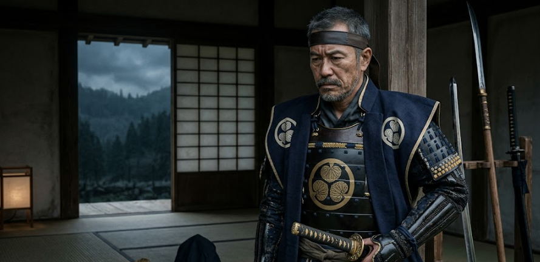

大河ドラマでテーマとなってきている織田 VS 浅井・朝倉の連合。
浅井の総司令官は浅井長政、朝倉は誰でしょう？
朝倉の当主・朝倉義景でしょうか。
違います。朝倉景健です。

正直、誰それ？だと思いますので、今日説明していきます。

## 出自・生い立ち

朝倉景健の出自と生い立ちについて、分かっている範囲を整理します。

### 出自

- **家系**  
  朝倉氏の一族で、**朝倉義景**の従兄弟にあたる人物とされています。  
  朝倉氏は越前（現在の福井県東部）を本拠とした戦国大名で、景健はその一門衆（いちもんしゅう）＝有力な一族として位置づけられていました。

- **血縁関係**  
  父は**朝倉景隆**とされ、朝倉宗家（義景家）とは近い血縁関係にありました。  
  一門衆として家格が高く、軍事・政治の両面で重要な役割を担う立場にありました。

### 生い立ち（わかっている範囲）

- **生年**  
  正確な生年ははっきりしない史料が多く、はっきりとは伝わっていません。  
  ただし、朝倉義景（1533年生）の従兄弟とされることから、**16世紀前半〜中頃の生まれ**と推定されます。

- **幼少期・青年期**  
  具体的な幼少期のエピソードはほとんど伝わっていませんが、  
  - 朝倉氏の一門として越前で育った  
  - 戦国大名の一門にふさわしい武芸・軍学の教育を受けた  
  とみなすのが一般的です。

- **史料上の登場**  
  景健が史料に明確に登場するのは、主に**織田信長との対立が激化した時期**（1560年代後半〜1570年代）です。  
  姉川の戦いや、浅井長政との連携による織田軍との戦いで、朝倉軍の前線指揮官として活躍したことが記録されています。

## 朝倉景健の活躍

朝倉景健の主な活躍を、時系列順に整理します。
かなりいきなりですが、姉川の戦いが実績として明らかになる初めのイベントでした。

### 1570年：家督相続と姉川の戦い
- 父・景隆と兄たちが相次いで死去したため、**家督を継承**[土岐日記](https://ibispedia.com/asakurakagetake)。  
- 同年の**姉川の戦い**では、朝倉軍の**総大将**として約8,000の兵を率いて出陣[土岐日記](https://ibispedia.com/asakurakagetake)。  
  - 浅井長政と連携して織田・徳川連合軍と戦うが、敗北。  
  - しかし、この戦いで景健は朝倉軍の指揮官として初めて大規模な戦闘を経験し、その後の戦いでも重要な役割を担うことになります。

### 1570年：志賀の陣（下坂本の合戦）
- 姉川の戦いの後、織田信長が浅井・朝倉方を攻める**志賀の陣**（下坂本の合戦）が続く。  
- この戦いで景健は、**織田方の有力武将・森可成（もり よしなり）と織田信治（おだ のぶはる）を討ち取る**という大きな戦果を挙げる[土岐日記](https://ibispedia.com/asakurakagetake)。  
  - 織田軍の有力武将を討ち取ったことで、朝倉軍の士気を保ち、織田軍の進撃を一時的に食い止める役割を果たしました。

### 1573年：刀根坂の戦い
- 織田信長が浅井氏を降した後、本格的に越前へ侵攻。  
- **刀根坂の戦い**で朝倉軍は大敗するが、景健は奮戦し、**主君・朝倉義景を一乗谷へ逃がすことに成功**[土岐日記](https://ibispedia.com/asakurakagetake)。  
  - 敗戦の中でも主君の命を守るために戦い抜き、朝倉家滅亡直前の最後の大規模合戦で重要な役割を果たしました。

### 1573年：朝倉家滅亡と織田への降伏
- 刀根坂の敗戦後、朝倉義景は一乗谷を追われ、**自害**。  
- 景健は織田信長に降伏し、**「安居景健（あご かげたけ）」と改名**して織田方に仕えることになる[土岐日記](https://ibispedia.com/asakurakagetake)。

### 1574年：越前一向一揆への降伏
- 越前で**一向一揆**が蜂起し、織田方の支配が揺らぐ。  
- 景健は**一向一揆側に降伏**し、織田方から離反[土岐日記](https://ibispedia.com/asakurakagetake)。  
  - 戦国時代の動乱の中で、生き残りを図るための苦渋の選択とされています。

### 1575年：織田軍再侵攻と最期
- 織田信長が越前へ再侵攻し、一向一揆勢力を攻撃。  
- 景健は、**一揆の指揮官・下間頼照（しもつま らいしょう）と頼俊（らいしゅん）の首を持参して助命を請う**が、信長に認められず、**自害を命じられる**[土岐日記](https://ibispedia.com/asakurakagetake)。  
  - これにより、朝倉一門の有力武将としての生涯を終えました。

### まとめ
- 景健は、**姉川の戦いで朝倉軍総大将**として登場し、**志賀の陣で織田方の有力武将を討ち取る**活躍を見せました。  
- その後、**刀根坂の戦いで主君・義景を逃がす**など、朝倉家滅亡直前まで奮戦。  
- 朝倉滅亡後は、**織田→一向一揆と所属を変えながらも、最終的には1575年に自害**という形で生涯を閉じています。

## 力量
実績を総括するいつものまとめだと面白くなかったので、整理の方法を変えてみます。
朝倉景健の実績から、あくまで推測として力量を整理すると、次のように評価できます。

### 1. 軍事指揮能力：中〜中上程度の将

- **大軍の指揮経験**  
  姉川の戦いで**約8,000の朝倉軍を総大将として率いた**ことから、  
  - 一門衆として家格が高く、大軍をまとめる立場にあった  
  - 大規模合戦の指揮経験がある  
  という点で、**軍団指揮官として一定の力量があった**と推測できます[土岐日記](https://ibispedia.com/asakurakagetake)。

- **戦果を挙げた実績**  
  志賀の陣（下坂本の合戦）で、**森可成・織田信治という織田方の有力武将を討ち取る**戦果を挙げています[土岐日記](https://ibispedia.com/asakurakagetake)。  
  - これは局地戦での勝利であり、**戦術的な采配・部隊運用が一定レベル以上だった**ことを示唆します。

- **敗戦の中での奮戦**  
  刀根坂の戦いでは朝倉軍は大敗しますが、景健は**主君・義景を一乗谷へ逃がすことに成功**しています[土岐日記](https://ibispedia.com/asakurakagetake)。  
  - 劣勢でも戦線を維持し、主君の退却を支える役割を果たしたことから、**危機対応能力や忠誠心に基づく戦闘継続力は高かった**と評価できます。

**総合すると**：  
- 大軍の指揮・局地戦での勝利・敗戦時の撤退指揮という実績から、**軍事的には中〜中上クラスの将**と見るのが妥当です。  
- ただし、織田信長のような戦略的・大局的な勝利を連発したわけではないので、**戦国トップクラスの名将というよりは「一門の有力指揮官」レベル**と考えるのが自然です。

### 2. 政治判断・生き残り戦略：やや苦しい選択を重ねた

- **織田への降伏と改名**  
  朝倉滅亡後、**織田信長に降伏し「安居景健」と改名**して仕えた[土岐日記](https://ibispedia.com/asakurakagetake)。  
  - これは、主家滅亡後の**生き残り策としては現実的**で、一定の柔軟性があったと評価できます。

- **一向一揆への鞍替え**  
  その後、越前一向一揆が起こると、**一揆側に降伏して織田方から離反**しています[土岐日記](https://ibispedia.com/asakurakagetake)。  
  - 時勢に合わせて所属を変える**政治的柔軟性**はある一方、  
  - 織田方→一揆方と**立場を二転三転させた**ことで、信長から見れば「信用しにくい人物」と映った可能性があります。

- **最期の交渉失敗**  
  1575年に織田軍が再侵攻した際、**一揆の指揮官・下間頼照・頼俊の首を持参して助命を請う**が、認められず自害を命じられています[土岐日記](https://ibispedia.com/asakurakagetake)。  
  - これは、**生き残りを図るための交渉術は発揮した**ものの、  
  - 信長の「朝倉一門を根絶やしにする」方針の前では**政治的影響力が限定的**だったことを示します。

**総合すると**：  
- 景健は、**生き残りを優先する現実的な判断**を繰り返した武将ですが、  
- 戦国後期の信長政権下では、**一門としての出自が重く、立場を変えても信頼を得にくい**という限界がありました。  
- 政治力・交渉力は**中程度〜やや苦しいレベル**と評価せざるを得ません。

### 3. 一門としての役割

- **義景を逃がした功績**  
  刀根坂の戦いで、敗戦の中でも**義景を一乗谷へ逃がす**ことに成功した点から、  
  - 一門として**主君への忠誠心は高かった**と推測できます[土岐日記](https://ibispedia.com/asakurakagetake)。

- **一門の重鎮としての役割**  
  姉川の戦いで総大将を務めたことから、**朝倉家の中核的な軍事指揮官**として期待されていたことが分かります。

**総合すると**：  
- 軍事面では**一門の重鎮として一定の信頼と力量があった**。  
- しかし、朝倉家全体の命運を左右するほどの**戦略的・政治的な影響力までは持っていなかった**と見るのが妥当です。

### 4. 力量の総合評価（推測）

- **軍事力**：中〜中上  
  - 大軍指揮・局地戦での勝利・敗戦時の撤退指揮という実績から、**戦国大名の一門としては十分な力量**。  
- **政治力・交渉力**：中〜やや低め  
  - 生き残りを図る柔軟性はあるが、**信長政権下では立場を変えても信頼を得られず、最期は自害**という結末。  
- **一門としての役割**：高め  
  - 義景を逃がすなど、**主家へのモラルは強かった**と評価できる。

**結論として**：  
朝倉景健は、**朝倉一門の有力指揮官として一定の軍事能力を持ち、主家滅亡後も生き残りを図る現実的な武将**でしたが、  
戦国時代のトップクラスの武将たちと比べると、**戦略的・政治的な影響力は限定的**だったと推測しました。
こういう人物を朝倉の司令官として立てる必要があったくらい朝倉家の人事制度は中世の色合いから脱却してなかったんだ、というのが個人的な思いです。

