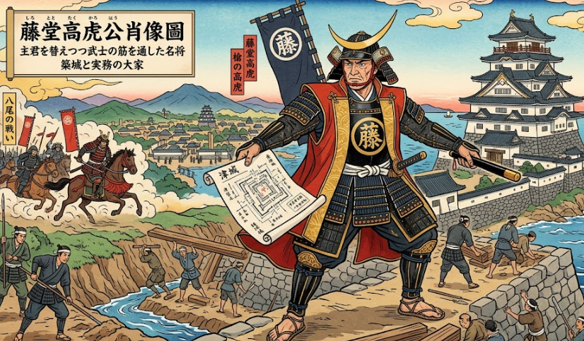

秀吉兄弟で登場した大男、藤堂高虎（とうどう たかとら）。
織田に仕える前は典型的な剛勇な部将だった藤堂高虎ですが、現在史実として伝わる藤堂高虎は築城や内政の名手です。
そんな彼について調べてみました。
結構面白いエピソードも見つかったので是非読んでください。

## 概要

藤堂高虎は、戦国時代から江戸時代初期にかけて活躍した武将・大名です。
「七度主君を変えても武士としての筋を通した」と言われるほど、主君を替えながらも能力と忠節で出世した、戦国きっての実務型・築城型の武将として知られています。
- 生没年：1556年〜1630年
- 出身：近江国（現在の滋賀県）
- 特徴
    藤堂高虎の主な特徴は、以下のように整理できます。

    1. **主君を替えても評価された「実務・能力重視」の武将**  
    - 浅井長政 → 織田信長 → 豊臣秀長・秀吉 → 徳川家康と、主君を変えながらも出世を続けました。  
    - その都度、築城・土木・軍略などの実務能力を買われ、重用された点が特徴です。

    2. **築城・土木の名手**  
    - 今治城、津城、伊賀上野城など、多くの城の縄張り（設計）や改修を手がけました。  
    - 地形を読み、防御性と実用性を重視した城づくりで知られています。

    3. **徳川政権下での「外様なのに譜代並み」の信頼**  
    - 関ヶ原で東軍に属し、その後も江戸城の普請や軍役を任されました。  
    - 外様大名でありながら、幕府の重要な土木・軍事プロジェクトを任されるほど信頼されていた点が特徴的です。

    4. **現実主義で生き延びた戦国武将**  
    - 情勢を冷静に見極め、自分の能力を活かせる主君・立場を選び続けた「現実主義者」としても知られます。  
    - 「七度主君を変えても武士としての筋を通した」と評されるように、裏切りではなく「能力と忠節で評価される」生き方を貫いた人物です。

## 実績

藤堂高虎が参加した主な合戦と実績を、時系列順にまとめます。

### 1. 姉川の戦い（1570年）
- **所属**：浅井長政軍（磯野員昌隊）  
- **実績**：初陣で父とともに参戦し、武功を挙げたとされる[藤堂高虎 - Wikipedia](https://ja.wikipedia.org/wiki/%E8%97%A4%E5%A0%82%E9%AB%98%E8%99%8E)。  
- **補足**：武将紹介サイトでは、この戦いで酒井忠高を討ち取ったとも伝えられています[藤堂高虎 - 戦国武将のハナシ](https://busho.fun/person/takatora-todo)。

### 2. 三木合戦（1578〜1580年頃）
- **所属**：織田信長軍（羽柴秀吉配下）  
- **実績**：鷹尾山城攻めで加古六郎右衛門を討ち取り、「槍の高虎」の異名を得たとされる[藤堂高虎 - 戦国武将のハナシ](https://busho.fun/person/takatora-todo)。  
- **補足**：播磨・三木城攻めの一環として、長期包囲戦の中で武功を立てています。

### 3. 賤ヶ岳の戦い（1583年）
- **所属**：羽柴秀吉軍（秀長配下）  
- **実績**：  
  - 佐久間盛政を銃撃して敗走させ、戦勝の端緒を開く抜群の戦功を挙げた[藤堂高虎 - Wikipedia](https://ja.wikipedia.org/wiki/%E8%97%A4%E5%A0%82%E9%AB%98%E8%99%8E)。  
  - 武将紹介サイトでは「500の手勢で味方を救出し、佐久間盛政を敗走させた」とされ、秀吉から絶賛されたと伝えられています[藤堂高虎 - 戦国武将のハナシ](https://busho.fun/person/takatora-todo)。  
- **結果**：この功により1,300石の加増を受けたとされます[藤堂高虎 - Wikipedia](https://ja.wikipedia.org/wiki/%E8%97%A4%E5%A0%82%E9%AB%98%E8%99%8E)。

### 4. 小牧・長久手の戦い（1584年）
- **所属**：羽柴秀吉軍  
- **実績**：  
  - 峯城・松ヶ島城攻めで武功を挙げたとされる[藤堂高虎 - Wikipedia](https://ja.wikipedia.org/wiki/%E8%97%A4%E5%A0%82%E9%AB%98%E8%99%8E)。  
- **補足**：徳川家康との対決では、主に伊勢方面の城攻めで活躍したとされています。

### 5. 紀州征伐（1585年）
- **所属**：羽柴秀吉軍  
- **実績**：  
  - 湯川直晴を降伏させ、山本主膳を斬ったとされる[藤堂高虎 - Wikipedia](https://ja.wikipedia.org/wiki/%E8%97%A4%E5%A0%82%E9%AB%98%E8%99%8E)。  
- **結果**：戦後、1万石を与えられ、大名（城持大名）となったとされています[藤堂高虎 - Wikipedia](https://ja.wikipedia.org/wiki/%E8%97%A4%E5%A0%82%E9%AB%98%E8%99%8E)。

### 6. 九州征伐（1587年）
- **所属**：羽柴秀吉軍  
- **実績**：  
  - 根白坂の戦いで、島津軍に攻められた宮部継潤を救援する活躍を見せた[藤堂高虎 - Wikipedia](https://ja.wikipedia.org/wiki/%E8%97%A4%E5%A0%82%E9%AB%98%E8%99%8E)。  
  - 武将紹介サイトでは「命令を無視して島津義弘に奇襲をかけ、味方の窮地を救った」とされ、その活躍で2万石に加増されたと伝えられています[藤堂高虎 - 戦国武将のハナシ](https://busho.fun/person/takatora-todo)。

### 7. 朝鮮出兵（文禄・慶長の役、1592〜1598年）
- **所属**：豊臣秀吉軍（水軍指揮官）  
- **実績**：  
  - 文禄の役では豊臣秀保の代理として出征[藤堂高虎 - Wikipedia](https://ja.wikipedia.org/wiki/%E8%97%A4%E5%A0%82%E9%AB%98%E8%99%8E)。  
  - 慶長の役では水軍を率い、**漆川梁海戦**で朝鮮水軍を殲滅したとされる[藤堂高虎 - Wikipedia](https://ja.wikipedia.org/wiki/%E8%97%A4%E5%A0%82%E9%AB%98%E8%99%8E)。  
  - 南原城の戦いや鳴梁海戦にも参加したとされています[藤堂高虎 - Wikipedia](https://ja.wikipedia.org/wiki/%E8%97%A4%E5%A0%82%E9%AB%98%E8%99%8E)。  
- **補足**：武将紹介サイトでは、漆川梁海戦で圧勝した一方、玉浦海戦や鳴梁海戦では李舜臣に苦戦し、負傷したとも伝えられています[藤堂高虎 - 戦国武将のハナシ](https://busho.fun/person/takatora-todo)。

### 8. 関ヶ原の戦い（1600年）
- **所属**：東軍（徳川家康方）  
- **実績**：  
  - 本戦では大谷吉継や石田三成と交戦した[藤堂高虎 - Wikipedia](https://ja.wikipedia.org/wiki/%E8%97%A4%E5%A0%82%E9%AB%98%E8%99%8E)。  
  - 脇坂安治ら西軍武将に対して東軍への内応工作を行い、勝利に貢献したとされる[藤堂高虎 - Wikipedia](https://ja.wikipedia.org/wiki/%E8%97%A4%E5%A0%82%E9%AB%98%E8%99%8E)。  
- **結果**：戦後、伊予今治藩20万石から伊勢津藩32万石へ加増・転封され、大大名へと出世しました。

### 9. 大坂の陣（1614〜1615年）
- **所属**：徳川方  
- **実績**：  
  - 冬の陣・夏の陣ともに参戦[藤堂高虎 - Wikipedia](https://ja.wikipedia.org/wiki/%E8%97%A4%E5%A0%82%E9%AB%98%E8%99%8E)。  
  - 夏の陣では河内方面の先鋒を志願し、**八尾の戦い**で長宗我部盛親隊と激戦を繰り広げたとされる[藤堂高虎 - Wikipedia](https://ja.wikipedia.org/wiki/%E8%97%A4%E5%A0%82%E9%AB%98%E8%99%8E)。  
- **補足**：武将紹介サイトでも、冬の陣・夏の陣で先陣を務め、長宗我部盛親らと交戦したと記されています[藤堂高虎 - 戦国武将のハナシ](https://busho.fun/person/takatora-todo)。

こう見ると戦争で活躍してたなぁと見えますが、彼の真骨頂は内政面にあります。

## 築城と内政
藤堂高虎が有名になったのは単なる指揮官ではなかった点にあります。
藤堂高虎の内政・築城に関する主な実績は、以下のように整理できます。

### 1. 築城に関する実績

__(1) 今治城（愛媛県今治市）__
- 関ヶ原の戦功により伊予半国20万石を領した高虎が、慶長7年（1602）に築城を開始し、慶長13年（1608）頃に完成させた海城です[今治城について](https://www.city.imabari.ehime.jp/museum/imabarijo/about/)。  
- 海水を引き込んだ堀や城内の船入りを備えた日本屈指の海城として知られ、昭和28年（1953）に主郭部跡と内堀が県指定史跡となっています[今治城について](https://www.city.imabari.ehime.jp/museum/imabarijo/about/)。

__(2) 津城（三重県津市）__
- 慶長13年（1608）に藤堂高虎が入城し、津藩32万石の居城として大改修を行いました[県指定史跡 津城跡](https://www.info.city.tsu.mie.jp/kosodate_kyouiku/kyouikuiinkai/1004357/1004663/1004603/1004615/1004617.html)。  
- 城下町整備とともに伊勢街道を城下に取り込むなど、防御と経済の両面を意識した設計で、現在も県指定史跡として残っています[県指定史跡 津城跡](https://www.info.city.tsu.mie.jp/kosodate_kyouiku/kyouikuiinkai/1004357/1004663/1004603/1004615/1004617.html)。

__(3) 江戸城築城の責任者__
- 外様大名でありながら、江戸城の築城・普請（土木工事）の総責任者を務めました[藤堂高虎 七君に仕えたオールラウンダー](https://niwareki.doorblog.jp/archives/7146724.html)。  
- これにより、徳川政権下で譜代大名並みの信頼を得たとされています。

__(4) その他の築城・改修__
- 宇和島城、赤木城（三重県熊野市）など、各地で城の縄張り・改修に関与したとされ、「築城の名手」として加藤清正・黒田官兵衛と並び称されることもあります[加藤清正 ～日本最強の武将と恐れられた武将【築城、内政能力も…】](https://kusanomido.com/study/history/japan/azuchi/39912/)。

### 2. 内政に関する実績

__(1) 城下町整備と街道の再編（津藩）__
- 津城に入城後、それまで城下の東側を通っていた伊勢街道を城下に取り込むなど、城下町の整備を行いました[県指定史跡 津城跡](https://www.info.city.tsu.mie.jp/kosodate_kyouiku/kyouikuiinkai/1004357/1004663/1004603/1004615/1004617.html)。  
- これにより、津は32万石の城下町として宿場町も兼ねる形で発展し、経済・交通の要衝となりました。

__(2) 行政・外交・人脈構築の才__
- 豊臣秀長の家老時代から、合戦だけでなく外交・周旋・行政・人脈構築など多岐にわたる能力を発揮したと評価されています[豊臣秀長が傑出した人物であったことを示す根拠](https://ameblo.jp/hidekifukunaga/entry-11966700578.html)。  
- 主君を替えながらも常に重用された背景には、軍事だけでなく内政・外交の実務能力が高く評価されていたことがあります。

__(3) 工期短縮とコスト削減の手腕__
- 築城において工期短縮とコスト削減を実現した「変革者」としても評価され、多くの主君から重宝されたとされています[最強戦国大名を城びとも大胆予想！？「国民・専門家・AIがガチで…」](https://shirobito.jp/article/1238)。  
- これは単なる技術力だけでなく、資材調達・人員配置・予算管理といった内政的な手腕も含まれます。

### 内政が上手だった理由

藤堂高虎が築城や内政に優れていた理由ですが、もともと優れていたという訳でなく経験的なものが大きいと思っています。
そして、経験を吸収できたのは仕事が大好きな人だった点にあろうと思っています。
彼が内政巧者となった理由を4つの面で考えてみました。

__1. 徹底した実務能力と現場主義__
- 高虎は、戦闘だけでなく土木・築城・行政といった実務を自ら指揮し、現場をよく見ていました。  
- 江戸城築城の総責任者を務めたことからも分かるように、大規模プロジェクトのマネジメント能力に長けていました[藤堂高虎 七君に仕えたオールラウンダー](https://niwareki.doorblog.jp/archives/7146724.html)。  
- 工期短縮とコスト削減を実現した「変革者」とも評され、効率性を重視する実務家としての側面が強かったと考えられます[最強戦国大名を城びとも大胆予想！？「国民・専門家・AIがガチで…」](https://shirobito.jp/article/1238)。

__2. 豊富な戦歴と築城経験の蓄積__
- 姉川の戦い、賤ヶ岳の戦い、九州征伐、朝鮮出兵、関ヶ原、大坂の陣など、多数の合戦に参加し、攻め・守り両面の経験を積んでいました[藤堂高虎 - Wikipedia](https://ja.wikipedia.org/wiki/%E8%97%A4%E5%A0%82%E9%AB%98%E8%99%8E)。  
- 戦場で「どう守るか」「どう攻められるか」を体感していたため、防御性と実用性を兼ね備えた城の設計ができたと考えられます。  
- 今治城のような海城や、津城の城下町整備など、地形や交通路を読み解く力も、こうした経験から培われたと推測されます。

__3. 戦略的・長期的な視点__
- 高虎は、単に戦に強いだけでなく、城下町の発展や街道の再編にも関心を持ちました。  
  - 津城では伊勢街道を城下に取り込むことで、経済・交通の要衝として発展させています[県指定史跡 津城跡](https://www.info.city.tsu.mie.jp/kosodate_kyouiku/kyouikuiinkai/1004357/1004663/1004603/1004615/1004617.html)。  
- これは「城を守る」だけでなく、「領国を富ませる」という長期的な視点があったことを示しています。

__4. 人脈・情報収集力と適応力__
- 主君を替えながらも重用され続けた背景には、外交・周旋・人脈構築の能力があったとされています[豊臣秀長が傑出した人物であったことを示す根拠](https://ameblo.jp/hidekifukunaga/entry-11966700578.html)。  
- 各地の武将や技術者との交流を通じて、最新の築城技術や行政手法を学び、自領に応用できた可能性があります。  
- 外様でありながら徳川政権で譜代並みの信頼を得たのは、こうした「情報と人脈を活かす力」が大きかったと考えられます。

## エピソード
藤堂高虎は活躍が派手だったこともあり、エピソードが沢山あります。

### 1. 無銭飲食の逸話
- 若い頃、主家を離れて牢人（浪人）になった高虎が、三河吉田宿で空腹に耐えかねて餅屋に入り、お金がないのに餅を食べてしまったという話があります。  
- 後年、大名になった高虎がその宿を再訪し、白髪になった主人に「あのとき情けをかけていただいた者です。これは餅のお代です」と大金を支払ったと伝えられています[藤堂高虎は何をした人？](https://busho.fun/person/takatora-todo)。  
- 出世後も昔の恩を忘れない「義理堅さ」を感じさせる逸話です。

藤堂高虎は信長の野望では義理低ランクの定番ですが、史実では一生懸命かつ、発言したことは守る律儀さもあります。
時勢のせいで変なイメージがついたのかと思ったりします。

### 2. 身長約190cmの大男だった
- 高虎は身長約190cmの大男だったとされ、当時としてはかなり異例の体格でした[藤堂高虎の生涯｜家康臨終の際、枕元に招かれるほど信頼された知…](https://serai.jp/hobby/1158432)。  
- 戦場ではその巨体と怪力で恐れられ、「槍の高虎」の異名で知られました[藤堂高虎 - 戦国武将のハナシ](https://busho.fun/person/takatora-todo)。

### 3. 影武者が何十人もいた
- 高虎は、戦場で自らを狙われないよう、自分に似せた影武者を何十人も用意していたと伝えられています[藤堂高虎の知っておきたい8つの逸話！](https://honcierge.jp/articles/shelf_story/1894)。  
- 敵に「どれが本物か分からない」状態を作り出し、身の安全と戦術の両方を狙った、かなり現実的な策士ぶりがうかがえます。

### 4. 豊臣秀長に「写経」をさせられた
- 高虎は若い頃、短気で粗暴な性格だったため、主君・豊臣秀長は彼に写経をさせて「短気を抑える」ことを学ばせたとされています[藤堂高虎は何をした人？](https://busho.fun/person/takatora-todo)。  
- さらに、前線に立ちたがる高虎をあえて後方の兵站（補給部隊）に回し、「支援する大切さ」を実感させたとも伝えられています。  
- いわば「戦国時代の上司による人材育成」のエピソードとしても面白いです。

### 5. 家康臨終の際に枕元に呼ばれた
- 外様大名でありながら、徳川家康が臨終の際に「もし天下を揺るがすような兵乱が起きた場合は、高虎を『将軍家の先陣』とせよ」と言い残したという逸話があります[ベスト秘書が戦国武将の中でもなぜ藤堂高虎に心を打たれたのか](https://newswitch.jp/p/4543)。  
- また、家康の重臣会議に外様大名で唯一参加したとも伝えられ、譜代並みの信頼を得ていたことが分かります。

### 6. 遺言は「早寝早起き」だった
- 高虎は「遺訓二百ヶ条」を残したとされ、その中には「早寝早起き」など、現代でも通用するような生活訓が含まれていたと伝えられています[藤堂高虎の知っておきたい8つの逸話！](https://honcierge.jp/articles/shelf_story/1894)。  
- 戦国武将らしからぬ、実務的で健康的な人生観がうかがえます。

### 7. 「七度主君を変えても武士としての筋を通した」
- 高虎は「七度主君を変えねば一人前とは言えぬ」という言葉を体現したかのように、浅井・織田・豊臣・徳川と主君を替えながら出世しました[主君を七度変えて三十二万石を築いた男の処世術](https://www.youtube.com/watch?v=SsOxK17j018)。  
- 裏切り者と見られがちですが、実際には「忠義の対象を時代に合わせて変えつつ、常に実務で評価された」という、戦国ならではの処世術のエピソードです。

## 力量

これまでの情報を総合すると、藤堂高虎の力量は「**戦国きってのオールラウンダーで、特に築城と実務能力が突出した武将**」と評価できます。分野ごとに整理すると、次のようになります。

### 1. 軍事力（戦闘・戦略）
- **野戦・攻城戦**：姉川の戦い、賤ヶ岳の戦い、紀州征伐、九州征伐、関ヶ原、大坂の陣など、主要な合戦にほぼすべて参加し、武功を挙げています[藤堂高虎 - Wikipedia](https://ja.wikipedia.org/wiki/%E8%97%A4%E5%A0%82%E9%AB%98%E8%99%8E)。  
- **水軍指揮**：朝鮮出兵では水軍を率い、漆川梁海戦で朝鮮水軍を殲滅するなど、海戦でも能力を発揮しました[藤堂高虎 - Wikipedia](https://ja.wikipedia.org/wiki/%E8%97%A4%E5%A0%82%E9%AB%98%E8%99%8E)。  
- **知略**：関ヶ原では脇坂安治らへの内応工作に成功し、戦局を有利に導いています[藤堂高虎 - Wikipedia](https://ja.wikipedia.org/wiki/%E8%97%A4%E5%A0%82%E9%AB%98%E8%99%8E)。  

**評価**：戦闘能力は一流。特に「寡兵で味方を救う」「奇襲で戦局をひっくり返す」など、臨機応変な戦術が得意です。

### 2. 築城・土木
- **築城の名手**：今治城、津城、宇和島城、赤木城など、多数の城の設計・改修に関わり、「築城の名人」として加藤清正・黒田官兵衛と並び称されます[加藤清正 ～日本最強の武将と恐れられた武将【築城、内政能力も…】](https://kusanomido.com/study/history/japan/azuchi/39912/)。  
- **江戸城築城の責任者**：外様でありながら江戸城の築城・普請の総責任者を務め、譜代並みの信頼を得ました[藤堂高虎 七君に仕えたオールラウンダー](https://niwareki.doorblog.jp/archives/7146724.html)。  
- **工期短縮・コスト削減**：築城において工期短縮とコスト削減を実現した「変革者」とも評価されています[最強戦国大名を城びとも大胆予想！？「国民・専門家・AIがガチで…」](https://shirobito.jp/article/1238)。  

**評価**：戦国武将の中でもトップクラスの築城能力。防御性・実用性・経済性を兼ね備えた設計が特徴です。

### 3. 内政・行政
- **城下町整備**：津城では伊勢街道を城下に取り込むなど、城下町整備を行い、宿場町としても発展させました[県指定史跡 津城跡](https://www.info.city.tsu.mie.jp/kosodate_kyouiku/kyouikuiinkai/1004357/1004663/1004603/1004615/1004617.html)。  
- **行政・外交・人脈構築**：豊臣秀長の家老時代から、合戦だけでなく外交・周旋・行政・人脈構築など多岐にわたる能力を発揮したと評価されています[豊臣秀長が傑出した人物であったことを示す根拠](https://ameblo.jp/hidekifukunaga/entry-11966700578.html)。  

**評価**：軍事だけでなく、領国経営や外交にも長けた「実務型」の大名。外様でありながら譜代並みの扱いを受けた背景には、こうした内政力があります。

### 4. 人間関係・処世術
- **主君を替えても重用される**：浅井・織田・豊臣・徳川と主君を替えながらも、常に能力を買われて出世しました。  
- **家康からの絶大な信頼**：臨終の際に「天下を揺るがす兵乱があれば高虎を先陣とせよ」と言い残したと伝えられ、重臣会議にも外様で唯一参加したとされます[ベスト秘書が戦国武将の中でもなぜ藤堂高虎に心を打たれたのか](https://newswitch.jp/p/4543)。  
- **恩を忘れない**：無銭飲食の餅屋に後年大金を返した逸話など、義理堅さも伝わっています[藤堂高虎は何をした人？](https://busho.fun/person/takatora-todo)。  

**評価**：「世渡り上手」と批判されることもありますが、実際には「能力と忠節で評価される」タイプ。人間関係と情報収集をうまく使い、時代の変化に適応したキャリア戦略が非常に高いです。

### 5. 性格・健康観
- **短気を矯正**：秀長に写経をさせられ、短気を抑える訓練を受けたと伝えられています[藤堂高虎は何をした人？](https://busho.fun/person/takatora-todo)。  
- **健康志向**：遺訓に「早寝早起き」など、現代でも通用する生活訓を残したとされ、実務的な人生観がうかがえます[藤堂高虎の知っておきたい8つの逸話！](https://honcierge.jp/articles/shelf_story/1894)。  

**評価**：自己管理能力も高く、感情をコントロールして冷静に判断できるタイプです。

### 総合診断
- **軍事**：★★★★☆（一流の戦闘能力と戦術眼）  
- **築城**：★★★★★（戦国トップクラスの築城・土木能力）  
- **内政**：★★★★☆（城下町整備・行政・外交に長ける）  
- **人間関係・処世術**：★★★★★（主君を替えても重用され、家康から絶大な信頼）  
- **自己管理・健康**：★★★★☆（短気を矯正し、健康志向の生活訓を残す）

**結論**：  
藤堂高虎は、**「戦闘・築城・内政・人間関係・キャリア戦略」のすべてが高水準で、特に築城と実務能力が突出した、戦国きってのオールラウンダー**と言えます。  
「七度主君を変えた」という点で批判されることもありますが、実際には「時代の変化に合わせて自分の能力を最大限に活かし、常に実務で評価された」という、非常に現実的で優秀な武将だったと診断できます。

    

        
    

    

        
図説 藤堂高虎

        
卓越した築城術、秀長・家康に愛された人間力。
「我れ亡き後、国家に万一のことあれば高虎を先鋒とせよ」と、 家康が絶大な信頼を寄せた戦国随一の〝猛将〟の実像とは。
天下人と共に歩んだ激動の生涯を最新研究で解き明かす！
全国から収集した美麗な写真・図版を用いて、謎に包まれた生涯を紐解く。特に、これまで明かされてこなかった高虎の前半生は必見。

        

            <a href="https://www.amazon.co.jp/%E5%9B%B3%E8%AA%AC-%E8%97%A4%E5%A0%82%E9%AB%98%E8%99%8E%E2%80%95%E2%80%95%E4%B9%B1%E4%B8%96%E3%82%92%E9%A7%86%E3%81%91%E6%8A%9C%E3%81%91%E3%81%9F%E7%A8%80%E4%BB%A3%E3%81%AE%E5%90%8D%E5%B0%86-%E8%AB%8F%E8%A8%AA%E5%8B%9D%E5%89%87/dp/4864035989?__mk_ja_JP=%E3%82%AB%E3%82%BF%E3%82%AB%E3%83%8A&crid=2UJBZJ7WR5TB&dib=eyJ2IjoiMSJ9.IvUfaL944YqkxsJlIJQETuf81bXcLY_mgkNkAlHUZZXWIfrCyDGIa3v3SBBPoOzgw3Jy8eHzBMxk1VeD3YV-pF_tdwpKYImGTH00806uue9bI-WnglETUjgEB46rzg8vyuVaGvjEABtPjfMIBd30JkYJ95w75FdbQ3kKHT2axp3G6VKuLaRX2_6t44fBnAioa5iVNNP8onxARCQ_2qt398jAB_QJ1HITmgcYCHbqc-2gIl1eZeTsfVb-RJYPht-vI_v6e_WQqwn_tTNkv4hwxN_lM-WzUg0qXrY3t-yED-0.bTryjoc9ywSOFt61LKK87FDnmIWTNHfhrKR4sMEW0YA&dib_tag=se&keywords=%E8%97%A4%E5%A0%82%E9%AB%98%E8%99%8E&qid=1777771175&sprefix=%E8%97%A4%E5%A0%82%E9%AB%98%E8%99%8E%2Caps%2C183&sr=8-8&linkCode=ll2&tag=yoshishinnze-22&linkId=391880506c3c6c42b713bb515eadf655&ref_=as_li_ss_tl" target="_blank" rel="noopener">Amazonで詳細を見る</a>
        

    

