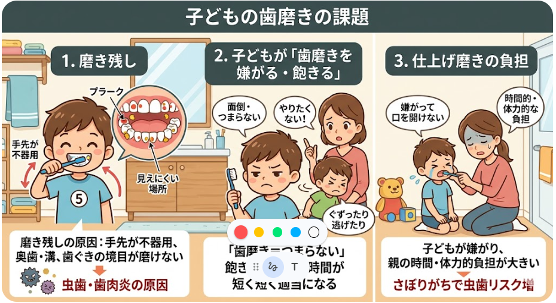

最近の子供の歯磨きでいくつか課題がありました。課題の考察と、課題の解決案について話をしていこうと思います。

## 歯磨きの課題
子供の歯磨きがかかる問題としては以下があります。

### 1. 磨き残し

**課題の内容：**  
子どもが自分で歯を磨いたとき、歯の表面や奥歯の溝、歯と歯の間などに汚れ（プラーク）が残ってしまうことが多い。

**具体的な問題点：**  
- 手先がまだ不器用で、細かい動きが難しいため、きちんと磨ききれない。  
- 特に奥歯の裏側や歯と歯ぐきの境目など、見えにくい場所が磨けていない。  
- 磨き残しが続くと、虫歯や歯肉炎の原因になりやすい。

### 2. 子どもが「歯磨きを嫌がる・飽きる」

**課題の内容：**  
歯磨きそのものを嫌がったり、途中で飽きてしまったりして、最後までしっかり磨かせることが難しい。

**具体的な問題点：**  
- 「歯磨き＝面倒・つまらない」と感じて、やりたがらない。  
- 磨き始めてもすぐに飽きてしまい、時間が短くなったり、適当に終わらせてしまう。  
- 親が声をかけても、ぐずったり逃げたりして、スムーズに歯磨きが進まない。

### 3. 仕上げ磨きの負担

**課題の内容：**  
子どもが自分で磨いたあと、親が仕上げ磨きをする必要があるが、その負担が大きい。

**具体的な問題点：**  
- 子どもが嫌がって口を開けてくれず、仕上げ磨きがうまくできない。  
- 毎日続けることで、親の時間的・体力的な負担が大きくなる。  
- 仕上げ磨きをさぼりがちになると、子どもの磨き残しが増え、虫歯リスクが高まる。

このように整理すると、  
- 「どこを・どのように磨くか」の問題（1）  
- 「子どもが歯磨きをやりたがらない」問題（2）  
- 「親の負担が大きく、継続が難しい」問題（3）  
という3つの観点に分かれます。

## 将来への影響

子どもの頃の歯磨き習慣は、単に「そのときの虫歯を防ぐ」だけでなく、**将来の歯の健康・全身の健康・生活の質（QOL）に長期的な影響を与える**ことが、公的資料や研究から示されています。

### 1. 乳幼児期の習慣が「永久歯の虫歯リスク」に与える影響

厚生労働省の「健康日本21（歯の健康）」では、次のように述べられています。

- **乳幼児期のむし歯と学童期のむし歯（永久歯の健康）には強い関連が認められる**  
- この時期に、歯みがき習慣や食習慣などの**基本的な歯科保健習慣を身につけることが重要**である  
- 学童期に適切な歯科保健指導を受けることは、**生涯にわたる基本的な保健習慣や行動の形成において大きな意義を持つ**  

[厚生労働省「健康日本21（歯の健康）」](https://www.mhlw.go.jp/www1/topics/kenko21_11/b6.html)

つまり、乳幼児期に「歯をきちんと磨く習慣」が身についているかどうかは、その後の**永久歯の虫歯リスクと強く関係している**、という位置づけです。

### 2. 子どもの歯磨き頻度と虫歯リスクの関係（研究の例）

子どもを対象とした系統的レビュー・メタ分析では、次のような結果が報告されています。

- **1日2回の歯磨き**は、1日1回の歯磨きと比べて、**虫歯の発生を有意に減らす**  
- 3歳以降に1日2回の歯磨きを習慣づけることは、**個人レベル・地域レベルでの虫歯予防に有効**である  

[Does Tooth Brushing Prevent Dental Caries among Children? A Systematic Review and Meta-analysis](https://www.researchgate.net/publication/374245021_Does_Tooth_Brushing_Prevent_Dental_Caries_among_Children_A_Systematic_Review_and_Meta-analysis)

このように、**「どれだけ頻繁に磨くか」という習慣そのものが、子どもの虫歯リスクを大きく左右する**ことが示されています。

### 3. 子どもの習慣が「大人になってからの歯の残存数」に与える影響

厚生労働省の資料では、成人期の歯科保健として「8020運動（80歳で20本以上の自分の歯を保つ）」が紹介されています。

- 成人期の歯の喪失を防ぎ、**高齢期まで自分の歯を多く残す**ことは、  
  - 咀嚼（そしゃく）機能の維持  
  - 生活習慣病の予防  
  - QOL（生活の質）の向上  
  に深く関わるとされています。  
- その基盤となるのは、**幼少期から身につけた歯みがき習慣や食習慣**であり、  
  - セルフケア（適切な歯みがき、フッ化物利用）  
  - 定期的なプロフェッショナルケア（歯科検診・指導）  
  を組み合わせた**生涯にわたる歯科保健習慣**であるとされています。

[厚生労働省「健康日本21（歯の健康）」](https://www.mhlw.go.jp/www1/topics/kenko21_11/b6.html)

つまり、**子どもの頃に身につけた歯磨き習慣は、高齢期まで自分の歯を何本残せるかという「歯の寿命」にまで影響する**、という見方が公的に示されています。

### 4. 歯の健康が「全身の健康・QOL」に与える影響

歯の健康は、単に口の中だけの問題ではありません。

- 歯周病や重度の虫歯を放置すると、**心疾患や糖尿病などの生活習慣病リスクが高まる**可能性が指摘されています。  
- 歯を失うと、**噛む力が低下し、栄養バランスが崩れやすくなる**ため、全身の健康状態にも影響します。  
- また、見た目や発音、食事の楽しみなど、**生活の質（QOL）にも直結**します。

こうした点から、**子どもの頃から歯を大切にする習慣を身につけることは、将来の全身の健康や生活の質にも間接的に影響する**と考えられます。

## 対応策

**歯磨き習慣を定着させるためのエッセンス**

1. **「続けること」を最優先にする**  
   - 毎日同じタイミングで行い、ルーティン化する。  
   - 完璧を目指さず、「1日サボっても翌日から戻す」くらいの気持ちでOK。

2. **子どもが「歯磨き＝楽しい」と感じる仕掛けを作る**  
   - 歌・動画・ストーリー仕立てで遊びの要素を入れる。  
   - シールカレンダーや小さなご褒美で「できた！」を可視化する。  
   - 歯ブラシや歯磨き粉を子どもに選ばせる。

3. **磨き残しを減らす工夫を入れる**  
   - 電動歯ブラシで効率的に磨く（子ども用の小さめヘッド）。  
   - 子どもが磨いたあと、親が仕上げ磨きを1日1回はしっかり行う。  
   - 歯科医院でブラッシング指導やフッ素塗布など、プロの力を借りる。

4. **親の負担を減らして続けやすくする**  
   - 電動ブラシで短時間で仕上げ磨き。  
   - 「夜だけ丁寧に」など、回数や時間を割り切る。  
   - 寝かせ磨きやおもちゃ・動画で子どもの姿勢を安定させる。

5. **長期的な視点で「歯を守る習慣」を育てる**  
   - 乳幼児期は「口に触られることに慣れる」、3〜6歳は「自分で磨く＋仕上げ」、小学生以上は「自分で責任を持って磨く」と、年齢に合わせてステップアップ。  
   - 歯科検診を「怖くない場所」にし、定期的に褒めてもらう経験を積む。

ということで継続的な歯磨き習慣の定着には通常ブラシよりは電動歯ブラシが優位と思われます。

## 電動ブラシの選定
著者の家で導入している電動歯ブラシは今が3代目です。
3代使って、利用する上で重視しべきポイントは以下と考えています。
1. タイマー機能(時間測れる機能があるものは非常に良いです。目安2分or3分の設定可能なものが良い)、
2. 振動モードは音波式。(当ててるだけで落ちていく感覚があり、回転式よりも表面をこすり傷をつける可能性が低い)
3. 交換用ブラシの種類が豊富か、入手しやすいか。(うちは子供3人で別々のヘッドを使っています。ブラシは消耗品で入手性も重要です)
4. 防水仕様で、コードレス・充電式のもの

ご指定の評価軸に沿って、Amazonで入手可能な代表的な電動歯ブラシを比較します。  
評価は以下の基準で行います。

- **〇**：条件を十分に満たす  
- **△**：一部条件を満たす、または条件に合うがやや弱い  
- **×**：条件を満たさない

---

### 1. ブラウン オーラルB すみずみクリーン マルチアクション（D1004132BK など）

- **タイマー機能**：2分タイマー付き（30秒ごとの区切りは機種による）  
  → 2分の目安は明確。**〇**  
- **交換用ブラシの種類・入手性**：  
  - すみずみクリーン、やわらかクリーン、ホワイトニングなど、複数種類のブラシヘッドが豊富。  
  - Amazonで安定して入手可能。  
  → 種類・入手性ともに良好。**〇**  
- **防水・コードレス・充電式**：IPX7防水、充電式、コードレス  
  → 条件を満たす。**〇**  
- **価格のリーズナブルさ**：本体価格は3,000〜4,000円前後と、大手メーカーの中では比較的リーズナブル。**△〜〇**

**総合評価**：  
タイマー・ブラシの種類・入手性・防水・充電式の条件を満たし、価格も手頃なため、**総合的に〇**。

### 2. フィリップス ソニッケアー 3100シリーズ（HX3673/33 など）

- **タイマー機能**：2分タイマー＋30秒ごとの区切り（クアドパーサー）  
  → 時間管理が優秀。**〇**  
- **交換用ブラシの種類・入手性**：  
  - プレミアムクリーン、ホワイトプラス、歯ぐきケアなど、複数種類のブラシヘッドが販売されている。  
  - Amazonで比較的安定して入手可能。  
  → 種類は中程度、入手性は良好。**△〜〇**  
- **防水・コードレス・充電式**：IPX7防水、USB充電式、コードレス  
  → 条件を満たす。**〇**  
- **価格のリーズナブルさ**：本体価格は5,000〜7,000円前後と、やや高め。**△**

**総合評価**：  
タイマー・防水・充電式の条件は満たすが、価格がやや高めで、ブラシの種類も中程度のため、**総合的に△〜〇**。

### 3. 汎用音波電動歯ブラシ（例：T1 / T2 モデル、替えブラシ8本付き）

- **タイマー機能**：2分オートタイマー機能  
  → 2分の目安はあるが、30秒ごとの区切りがないモデルも多い。**△〜〇**  
- **交換用ブラシの種類・入手性**：  
  - モデルによっては複数種類のブラシヘッドが付属するが、メーカー純正に比べると種類は少なめ。  
  - Amazonで入手は可能だが、モデル変更や生産終了のリスクがある。  
  → 種類・入手性は**△**。  
- **防水・コードレス・充電式**：IPX7防水、USB充電式、コードレス  
  → 条件を満たす。**〇**  
- **価格のリーズナブルさ**：本体価格は3,000〜5,000円前後と、比較的安価。**〇**

**総合評価**：  
価格と防水・充電式の条件は満たすが、タイマー機能がシンプルで、ブラシの種類・入手性がやや不安定なため、**総合的に△**。

### 4. Epeios（エペイオス）OKare! ET003 音波電動歯ブラシ

- **タイマー機能**：スマートタイマー（2分）  
  → 2分の目安はあるが、30秒ごとの区切りは機種による。**△〜〇**  
- **交換用ブラシの種類・入手性**：  
  - ブラシヘッドは専用設計で、種類は限定的。  
  - Amazonで入手は可能だが、大手メーカーほど豊富ではない。  
  → 種類・入手性は**△**。  
- **防水・コードレス・充電式**：IPX7防水、Type-C充電式、コードレス  
  → 条件を満たす。**〇**  
- **価格のリーズナブルさ**：本体価格は4,000〜5,000円前後と、コスパが良い。**〇**

**総合評価**：  
価格と防水・充電式の条件は満たすが、ブラシの種類・入手性がやや弱いため、**総合的に△**。

### 評価軸ごとのまとめ

| モデル | タイマー機能 | 交換用ブラシの種類・入手性 | 防水・コードレス・充電式 | 価格のリーズナブルさ |
|--------|--------------|----------------------------|--------------------------|------------------------|
| ブラウン オーラルB すみずみクリーン | 〇 | 〇 | 〇 | △〜〇 |
| フィリップス ソニッケアー 3100 | 〇 | △〜〇 | 〇 | △ |
| 汎用音波モデル（T1/T2など） | △〜〇 | △ | 〇 | 〇 |
| Epeios OKare! ET003 | △〜〇 | △ | 〇 | 〇 |

### おすすめの選定

- **ブラシの種類・入手性と価格のバランスを重視する場合**  
  → **ブラウン オーラルB すみずみクリーン マルチアクション**が最も条件に合います。  
  - タイマー機能：〇  
  - ブラシの種類・入手性：〇  
  - 防水・充電式：〇  
  - 価格：△〜〇（大手メーカーの中ではリーズナブル）

    

        
    

    

        
ブラウン 電動歯ブラシ Oral-B オーラルB

        
- 選べるブラッシングモードクリーンモード: 通常のブラッシングに適した標準的なモードです。やわらかクリーンモード: 歯ぐきへの優しさを重視したモードで、初めて電動歯ブラシを使う方や歯ぐきの状態が気になる方に適しています。
        -  利便性とデザイン8日間連続使用可能: 1日2回、各2分間の使用で、1回のフル充電から約8日間使用できます。握りやすいラバーハンドル: 濡れた手でも滑りにくい人間工学に基づいたラバー仕様です。防水加工: 本体は防水仕様のため、洗面所でも安心して使用でき、水洗いも可能です。

        

            <a href="https://www.amazon.co.jp/%E9%9B%BB%E5%8B%95%E6%AD%AF%E3%83%96%E3%83%A9%E3%82%B7-Oral-B-BRAUN-%E3%82%AA%E3%83%BC%E3%83%A9%E3%83%ABB-%E3%81%99%E3%81%BF%E3%81%9A%E3%81%BF%E3%82%AF%E3%83%AA%E3%83%BC%E3%83%B3/dp/B0CD3R6VS3?__mk_ja_JP=%E3%82%AB%E3%82%BF%E3%82%AB%E3%83%8A&dib=eyJ2IjoiMSJ9.M5nGK0mo6AM9ZRMG3N3QDa8AXk7Ay3uxwD4BdhjpJiYoe3vvH9cUygZgdYJExMWRt382FZ-J_IQ4G9r4PeSsYy7nog4XWb0IgjCx1usE883XYhXkLCUKAPVfIXXlC0ADTcoKoUWcxBQxU8m1DWML7w8cE959yVVHkTj7jW8YYhA1ljRnHdWuXlNVvIBVelDhBgDYR1ftXSZL9BXkx-6CEUbjYe4o4t041ildLZDiQrT05xgCuRiPq1gc1tSucfbDmp-E5niyVNEtMj_xPWAU8Qo86sq2lTJfMChgTYqBuCM.TljIryjPb1DWuZmtyCqaYF507jKic3xgpevIF2gBHqo&dib_tag=se&keywords=%E3%83%96%E3%83%A9%E3%82%A6%E3%83%B3+%E3%82%AA%E3%83%BC%E3%83%A9%E3%83%ABB&qid=1778041167&s=hpc&sr=1-6&linkCode=ll2&tag=yoshishinnze-22&linkId=a134a029525e88d390469c0b91a94154&ref_=as_li_ss_tl" target="_blank" rel="noopener">Amazonで詳細を見る</a>
        

    

もしくは振動モードが音波をご希望される場合は汎用音波モデルも選択肢となるかと思います。

    

        
    

    

        
電動歯ブラシ 音波式 電動ハブラシ 横振り

        
- 高周波音波洗浄: 毎分約40,000回の高速振動で、手磨きでは届きにくい歯の隙間の汚れや歯垢を効率よく除去します。
        - 替えブラシ8本付属: デュポン製ブラシ毛を採用した「W字型」ブラシが8本同梱されており、約2年間分（3ヶ月に1回の交換目安）のストックが最初から揃っています。
        - 長時間航続: 1回のフル充電（約5時間）で20日間〜30日間程度の連続使用が可能です。充電は汎用性の高いType-C方式に対応しています。

        

            <a href="https://www.amazon.co.jp/%E9%9B%BB%E5%8B%95%E3%83%8F%E3%83%96%E3%83%A9%E3%82%B7%E6%A8%AA%E6%8C%AF%E3%82%8A-6%E3%83%A2%E3%83%BC%E3%83%89%E9%9F%B3%E6%B3%A2%E6%AD%AF%E3%83%96%E3%83%A9%E3%82%B7-%E6%9B%BF%E3%81%88%E3%83%96%E3%83%A9%E3%82%B78%E6%9C%AC%E4%BB%98-2%E5%88%86%E9%96%93%E3%82%AA%E3%83%BC%E3%83%88%E3%82%BF%E3%82%A4%E3%83%9E%E3%83%BC%E6%A9%9F%E8%83%BD-T2/dp/B0FC2V9CPQ?__mk_ja_JP=%E3%82%AB%E3%82%BF%E3%82%AB%E3%83%8A&crid=3F2DI6SQUDO4Y&dib=eyJ2IjoiMSJ9.ZcDNXJIUy9ykX2pcRvR9Jemewpz99Z0BLLsd_jP7KsGDmQLRWLhI8irwRbc4frV8-5LTD8oqpHhBGQkCay6PJgbtlSkgv7cZxuGEl_LPDjNRzlVkuwSrkAxbb1ewC8L6UxXcB4RZOtHBC4cOcMvnVkNPTak10E-5tYXNUKXXZuilvYC2DJxzaIppBLqXLiC-Bt-snDcU6Acz0TyehJMAalgb9q4w-V5xBQoeMwy4832b6DP2WsZYr9x6whnyf1KaZ8M6YLcIVgJZSnIKoWkHZ-4ft0ibgtIh9sypLGPC4Q8.IhXvWEOGPkJCsU0Rbx8pDE_ft2c5xnbGZqoaZn7Wsz0&dib_tag=se&keywords=%E6%B1%8E%E7%94%A8%E9%9F%B3%E6%B3%A2%E3%83%A2%E3%83%87%E3%83%AB%2B%E9%9B%BB%E5%8B%95%E6%AD%AF%E3%83%96%E3%83%A9%E3%82%B7&qid=1778041593&sprefix=%E6%B1%8E%E7%94%A8%E9%9F%B3%E6%B3%A2%E3%83%A2%E3%83%87%E3%83%AB%2B%E9%9B%BB%E5%8B%95%E6%AD%AF%E3%83%96%E3%83%A9%E3%82%B7%2Caps%2C178&sr=8-2&th=1&linkCode=ll2&tag=yoshishinnze-22&linkId=6994348581beeb3d0a700a193dadd44d&ref_=as_li_ss_tl" target="_blank" rel="noopener">Amazonで詳細を見る</a>
        

    

ということで本日は電動ブラシでした。
