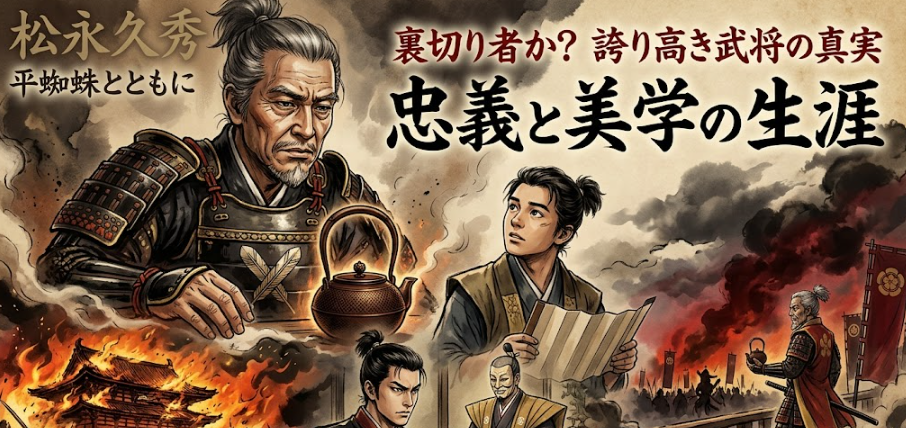

以前本ブログで説明した[久秀](https://yoshishinnze.hatenablog.com/entry/2026/03/29/111311)ですが、大河では信長に謀反し、結果織田信忠軍の攻撃を受けて自害。
所蔵していた有名な茶器もろとも自爆するという最期を遂げました。
ですが、この謀反から自害までの流れが、これまでの久秀を知っていると、かなり違和感を感じます。
久秀の前後と、これまでの行動から何が原因だったか個人的に考察してみました。

## 久秀の謀反
久秀が謀反をしたのは1577年のみではありません。
久秀が織田信長を裏切ったのは、一般に「第一次（1573年頃）」と「第二次（1577年）」の二度とされています。以下、それぞれの時期ごとに「久秀にあったこと」と「織田家の状況」を対比して整理します。

### 1. 第一次裏切り（1573年・信長包囲網期）

__久秀側の状況__

- **時期と背景**  
  1571年5月に河内高屋城（畠山昭高）を攻撃し、織田家への反旗を鮮明にします[raisoku.com](https://raisoku.com/2066)。  
  1572年5月には三好義継と共に畠山昭高の交野城を攻め、信長が援軍を送ったため信貴山城に籠城しました[Wikipedia「信長包囲網」](https://ja.wikipedia.org/wiki/%E4%BF%A1%E9%95%B7%E5%8C%85%E5%9B%B2%E7%B6%B2)。  
  1573年2月、足利義昭が信長と決裂し、それまで敵対していた松永・三好と和睦して「信長包囲網」を確立[Wikipedia「信長包囲網」](https://ja.wikipedia.org/wiki/%E4%BF%A1%E9%95%B7%E5%8C%85%E5%9B%B2%E7%B6%B2)。  
  久秀はこの包囲網に加担し、信長に公然と背きます。

- **久秀の立場・事情**  
  - 三好義継と連携し、河内・大和方面で織田方（筒井順慶ら）と激戦を繰り広げていた。  
  - 1571年8月の辰市城の戦いで筒井順慶に大敗し、甥や有力家臣を多数失うなど、軍事的には苦境にあった[raisoku.com](https://raisoku.com/2066)。  
  - 足利義昭・武田信玄・本願寺など反信長勢力と連携することで、織田家に対抗しようとした。

__織田家側の状況__

- **信長包囲網の成立と危機**  
  - 1570年代前半、浅井・朝倉、石山本願寺、伊勢長島一向一揆、武田信玄などが連携し、織田家は四面楚歌の状態[raisoku.com](https://raisoku.com/2066)。  
  - 1571年5月の第一次長島一向一揆攻めでは柴田勝家が負傷、氏家ト全が討死する大敗を喫するなど、軍事的にも苦戦[raisoku.com](https://raisoku.com/2066)。  
  - 1572年9月には武田信玄が西上作戦を開始し、1573年4月に病死するまで織田家は最大の脅威に直面[raisoku.com](https://raisoku.com/2066)。

- **形勢逆転と久秀の降伏**  
  - 1573年4月に武田信玄が病死し、包囲網の中心が失われる[Wikipedia「信長包囲網」](https://ja.wikipedia.org/wiki/%E4%BF%A1%E9%95%B7%E5%8C%85%E5%9B%B2%E7%B6%B2)。  
  - 同年7月、信長は足利義昭を槇島城の戦いで破り京都から追放。  
  - 8月に朝倉義景、9月に浅井長政を自害に追い込み、11月には三好義継も滅ぼす[Wikipedia「信長包囲網」](https://ja.wikipedia.org/wiki/%E4%BF%A1%E9%95%B7%E5%8C%85%E5%9B%B2%E7%B6%B2)。  
  - 孤立した久秀は、1573年12月末に信長に降伏し、信長はこれを赦免したとされます[レキシル](https://rekishiru.site/archives/20187)。

**まとめ（第一次）**  
久秀は信長包囲網に加担して反旗を翻したが、武田信玄の死と義昭追放で包囲網が崩壊し、周辺勢力が次々と滅ぼされる中で孤立。1573年末に降伏し、信長から一度は許されました。

### 2. 第二次裏切り（1577年・信貴山城籠城）

__久秀側の状況__

- **時期と直接の契機**  
  - 天正5年（1577年）8月、久秀は石山本願寺攻め（石山合戦）の陣から離脱し、嫡男・久通ら約8千人を率いて信貴山城に籠城[Wikipedia「久秀」](https://ja.wikipedia.org/wiki/%E6%9D%BE%E6%B0%B8%E4%B9%85%E7%A7%80)。  
  - 足利義昭、毛利輝元、上杉謙信、石山本願寺など反信長勢力と呼応して再挙兵したとされます[Wikipedia「久秀」](https://ja.wikipedia.org/wiki/%E6%9D%BE%E6%B0%B8%E4%B9%85%E7%A7%80)。

- **久秀の心理・事情**  
  - 自力で攻略した大和国において、最大のライバルである筒井順慶に信長や足利義昭が加担する動きを見せたことで、「面目と信用を失った」と感じていたとする説があります[レキシル](https://rekishiru.site/archives/20187)。  
  - つまり、大和支配をめぐる筒井氏との対立で、信長が順慶を優遇したことが久秀の反発を強めたとされます。  
  - 信長が派遣した松井友閑の説得を拒否し、徹底抗戦の姿勢をとります[Wikipedia「久秀」](https://ja.wikipedia.org/wiki/%E6%9D%BE%E6%B0%B8%E4%B9%85%E7%A7%80)。

- **最期**  
  - 信長は「名器・平蜘蛛を差し出せば助命する」と条件を提示したが、久秀はこれを拒絶し、平蜘蛛を打ち割って自害（切腹ののち焼死）したと伝えられます[レキシル](https://rekishiru.site/archives/20187)[Wikipedia「久秀」](https://ja.wikipedia.org/wiki/%E6%9D%BE%E6%B0%B8%E4%B9%85%E7%A7%80)。  
  - 1577年10月10日（旧暦）、東大寺大仏殿を焼いたとされるのと同じ日付で、城に火を放って果てたとされます[Wikipedia「久秀」](https://ja.wikipedia.org/wiki/%E6%9D%BE%E6%B0%B8%E4%B9%85%E7%A7%80)。

__織田家側の状況__

- **反信長勢力との対立**  
  - 1577年当時、織田家は上杉謙信（北陸方面）、毛利輝元（中国方面）、石山本願寺（畿内）などと対立し、依然として多正面作戦を強いられていました[Wikipedia「久秀」](https://ja.wikipedia.org/wiki/%E6%9D%BE%E6%B0%B8%E4%B9%85%E7%A7%80)。  
  - 久秀の離反は、こうした「反信長勢力」の一角としての動きと位置づけられます。

- **信長の対応**  
  - 久秀が説得を拒否したため、信長は人質として預かっていた久秀の孫二人を京都で処刑[Wikipedia「久秀」](https://ja.wikipedia.org/wiki/%E6%9D%BE%E6%B0%B8%E4%B9%85%E7%A7%80)。  
  - その後、嫡男・織田信忠を総大将、羽柴秀吉・丹羽長秀らを副将とする数万〜10万規模の大軍を信貴山城へ派遣し、城を完全包囲[レキシル](https://rekishiru.site/archives/20187)[Wikipedia「久秀」](https://ja.wikipedia.org/wiki/%E6%9D%BE%E6%B0%B8%E4%B9%85%E7%A7%80)。  
  - 二度目の裏切りであり、かつ説得も拒否されたため、信長は徹底的な武力鎮圧と報復（孫の処刑）に踏み切りました。

**まとめ（第二次）**  
久秀は大和支配をめぐる対立と「面目」の問題から、上杉・毛利・本願寺ら反信長勢力と呼応して再び反旗を翻し、信貴山城に籠城。信長は大軍を派遣して包囲し、助命条件を提示したが久秀は拒否し、平蜘蛛と共に自害して松永氏は滅亡しました。

### 両回の裏切りの比較

| 項目 | 第一次裏切り（1573年頃） | 第二次裏切り（1577年） |
|------|--------------------------|------------------------|
| **久秀の立場** | 信長包囲網の一員として反信長勢力と連携 | 反信長勢力（上杉・毛利・本願寺）と呼応して再挙兵 |
| **織田家の状況** | 武田信玄の西上などで最大の危機 | 多正面作戦だが、体制は比較的安定しつつも各地で戦闘継続 |
| **信長の対応** | 包囲網崩壊後に久秀を降伏させ、一度は赦免 | 大軍で包囲し、助命条件を提示するも久秀が拒否、孫を処刑 |
| **結果** | 久秀は降伏し、信長に再び仕える | 久秀は自害し、松永氏は滅亡 |

## 三好時代の久秀
久秀と言えば梟雄で、三好の要人を殺害・排除した。そんな札付きだから信長に謀反をしたのもいつものことだ。
もし本当ならありそうな話だと思いました。
しかし、久秀が三好家にいた時期に「三好家の主君や要人を殺害・排除した」とされる話は、江戸時代以降の軍記物や俗説に多く、**同時代史料では裏づけが弱い**のが現在の研究の傾向です。

### 1. 俗説で挙げられる「三好家要人殺害」の例

江戸期の軍記物や講談などでは、久秀が三好長慶の一族を次々と葬った「梟雄」として描かれ、主に次の人物が挙げられます。

1. **十河一存（そごう かずまさ）**  
   - 三好長慶の弟。永禄4年（1561年）に急死。  
   - 俗説では「久秀が暗殺した」とされるが、同時代史料にはその記述はなく、病死とみるのが一般的です[久秀の再評価記事（例）](https://monsterspace.hateblo.jp/entry/matsunagahisahide)。

2. **三好義興（みよし よしおき）**  
   - 長慶の嫡男。永禄7年（1564年）に病死。  
   - 久秀が毒殺したとする説もあるが、同時代史料では病死と記されており、暗殺説は後世の創作とみられます[久秀 – Wikipedia](https://ja.wikipedia.org/wiki/%E6%9D%BE%E6%B0%B8%E4%B9%85%E7%A7%80)。

3. **安宅冬康（あたぎ ふゆやす）**  
   - 長慶の弟。永禄7年（1564年）に長慶の命で誅殺（自害を命じられる）。  
   - 「久秀の讒言で長慶が冬康を殺した」という説が有名ですが、これも同時代史料では**長慶自身の判断**として記されており、久秀の関与を明記するものはありません[「織田信長を2度も裏切った男」は極悪人だったのか…最新研究](https://news.livedoor.com/article/detail/26852333)。

4. **三好長慶本人**  
   - 永禄7年（1564年）に病死。  
   - 久秀が長慶を毒殺したとする説もありますが、これも後世の創作とされ、長慶の死因は病死とされています[久秀 – Wikipedia](https://ja.wikipedia.org/wiki/%E6%9D%BE%E6%B0%B8%E4%B9%85%E7%A7%80)。

### 2. 現代の研究で見える「傾向」

__（1）同時代史料では「主家乗っ取り」の証拠は乏しい__

- 長慶の書状や公家・僧侶の日記など、一級史料を見ると、久秀が長慶の命令を無視したり、主家を乗っ取ろうとした形跡は見つかっていません[松永弾正 戦国を上り詰めた男（PDF）](https://satoyamashikoku.web.fc2.com/matsunaga2106.pdf)。  
- むしろ、足利将軍家や諸大名との交渉役として、長慶の意向に沿って忠実に動いていた記録が多いとされます[久秀は本当に『戦国の三梟雄』だったのか？](https://kusanomido.com/study/history/japan/azuchi/75943)。

__（2）「悪役」イメージは江戸時代以降の創作__

- 久秀を「梟雄」として描く逸話の多くは、江戸初期に太田牛一らが書いた軍記物が元になっており、信長や秀吉を英雄として際立たせるための「悪役」として久秀が利用された面があります[松永弾正 戦国を上り詰めた男（PDF）](https://satoyamashikoku.web.fc2.com/matsunaga2106.pdf)。  
- 江戸中期以降、家臣が主家に忠義を尽くすことを重んじる価値観が強まると、久秀は「主家に背く下剋上の半面教師」として語られるようになり、暗殺・謀略の逸話がどんどん膨らんでいきました。

__（3）近年の再評価__

- 近年の研究では、久秀は「実務能力に優れた行政家・文化人」として再評価されつつあり、三好政権下で大和国を実質的に支配するまでに重用されたのは、**長慶からの信頼の証**とみる見方が強まっています[日本史上最悪の男？～久秀 – Guidoor Media](https://www.guidoor.jp/media/matsunagahisahide)。  
- 三好一族の死についても、久秀の関与を直接示す史料はなく、病死・内部対立・長慶自身の判断として説明できるため、「久秀が次々と殺した」という説は**史実性が低い**とされています[久秀は本当に『戦国の三梟雄』だったのか？](https://kusanomido.com/study/history/japan/azuchi/75943)。

### 3. まとめ：傾向として言えること

- **俗説上の傾向**  
  - 三好長慶・義興・一存・冬康ら、三好家の主君・要人を次々と暗殺・排除した「梟雄」として描かれることが多い。  
  - これは江戸時代以降の軍記物や講談で創作・誇張されたイメージです。

- **史実に基づく傾向**  
  - 同時代史料では、久秀が三好家の主君や一族を直接殺害した証拠は乏しい。  
  - むしろ、長慶の信任を得て外交・行政を担い、三好政権の実務を支えた側面が強い。  
  - 近年の研究では「主家に忠実に仕えた実務家」として再評価が進んでいます。

したがって、「久秀が三好家の主人や要人を殺害・攻撃した」という話は、**後世の創作や誇張が多く、史実としての傾向は確認しづらい**、というのが現在の歴史学の見解に近いと言えます。
つまり正式に仕官した主家に対して積極的にネガティブアクションしていた訳ではない、ということになります。

## なぜ謀反をした？

松永久秀の謀反の動機は、1573年（第一次）と1577年（第二次）でかなり性格が違います。  
それぞれについて、**有力と考えられている動機**を整理します。

### 1. 第一次謀反（1573年頃）の動機

__（1）信長包囲網への加担と「生き残り」の選択__

- 1570年代前半、織田家は浅井・朝倉・本願寺・武田信玄らに包囲され、四面楚歌の状態でした[raisoku.com 年表](https://raisoku.com/2066)。  
- 久秀は、1571年5月に河内高屋城を攻撃し、三好三人衆らと連携して織田方と対立する姿勢を鮮明にします[raisoku.com 年表](https://raisoku.com/2066)。  
- 1573年2月には、足利義昭が信長と決裂し、それまで敵対していた松永・三好と和睦して「信長包囲網」を確立[Wikipedia「信長包囲網」](https://ja.wikipedia.org/wiki/%E4%BF%A1%E9%95%B7%E5%8C%85%E5%9B%B2%E7%B6%B2)。

**動機として有力な解釈**  
- 織田家が窮地に陥っている状況で、**反信長勢力（義昭・武田・本願寺など）と連携した方が生き残れる**と判断した可能性が高いとされます[レキシル「松永久秀の死因は爆死ではない？」](https://rekishiru.site/archives/20187)。  
- 久秀は三好政権時代から「状況に応じて主家を変える」柔軟な行動をとっており、信長が不利と見れば、反信長側に鞍替えするのは合理的な選択だった、という見方です。

__（2）大和支配をめぐる対立__

- 久秀は自力で大和国を支配し、多聞山城を築くなど、大和を自らの基盤としていました[松永久秀 – Wikipedia](https://ja.wikipedia.org/wiki/%E6%9D%BE%E6%B0%B8%E4%B9%85%E7%A7%80)。  
- 一方で、織田家は大和のもう一方の有力者・筒井順慶を優遇する姿勢を見せており、久秀にとっては**大和支配の主導権が脅かされる**状況でした。

**動機として有力な解釈**  
- 信長が筒井順慶を重視する一方で、久秀の大和支配を「織田家の都合で制限しようとしている」と感じ、**自らの領国支配を守るため**に反信長側に加担した、という説があります[レキシル「松永久秀の死因は爆死ではない？」](https://rekishiru.site/archives/20187)。

### 2. 第二次謀反（1577年・信貴山城籠城）の動機

__（1）「面目」と「信用」の問題__

- 久秀は自力で大和国を平定し、多聞山城・信貴山城を拠点に支配を確立していました[松永久秀 – Wikipedia](https://ja.wikipedia.org/wiki/%E6%9D%BE%E6%B0%B8%E4%B9%85%E7%A7%80)。  
- ところが、信長や足利義昭が最大のライバルである筒井順慶を優遇し、久秀の大和支配を「織田家の意向で修正しようとする」動きを見せたとされます[レキシル「松永久秀の死因は爆死ではない？」](https://rekishiru.site/archives/20187)。

**動機として有力な解釈**  
- 久秀は「自力で切り取った大和国」を自負しており、信長が筒井順慶を重用する姿勢に**「面目を潰された」「信用を失った」**と感じ、再挙兵に踏み切ったとされます[レキシル「松永久秀の死因は爆死ではない？」](https://rekishiru.site/archives/20187)。  
- つまり、単なる領土問題ではなく、**武将としての誇り・権威**が損なわれたことへの反発が大きかった、という見方です。

__（2）反信長勢力との連動__

- 1577年当時、織田家は上杉謙信（北陸）、毛利輝元（中国）、石山本願寺（畿内）などと多正面で対立していました[松永久秀 – Wikipedia](https://ja.wikipedia.org/wiki/%E6%9D%BE%E6%B0%B8%E4%B9%85%E7%A7%80)。  
- 久秀は1577年8月、石山本願寺攻めの陣から離脱し、足利義昭・毛利・上杉・本願寺ら反信長勢力と呼応して信貴山城に籠城します[松永久秀 – Wikipedia](https://ja.wikipedia.org/wiki/%E6%9D%BE%E6%B0%B8%E4%B9%85%E7%A7%80)。

**動機として有力な解釈**  
- 反信長勢力が連携して信長を追い詰めている状況で、**「今なら信長を倒せるかもしれない」**と判断し、再挙兵した可能性が指摘されています[松永久秀 – Wikipedia](https://ja.wikipedia.org/wiki/%E6%9D%BE%E6%B0%B8%E4%B9%85%E7%A7%80)。  
- 久秀は三好政権時代から「時勢を見極めて行動する」合理主義者と評価されており、1577年も「勝てるタイミング」と見た、という解釈です。

__（3）茶人としての矜持と「平蜘蛛」をめぐる対立__

- 信長は久秀に対し、「名器・平蜘蛛を差し出せば助命する」と条件を提示しましたが、久秀はこれを拒否し、平蜘蛛を打ち割って自害したと伝えられます[レキシル「松永久秀の死因は爆死ではない？」](https://rekishiru.site/archives/20187)。  
- 久秀は武野紹鷗に茶道を学んだ文化人であり、茶器への執着も強かったとされます[松永久秀 – Wikipedia](https://ja.wikipedia.org/wiki/%E6%9D%BE%E6%B0%B8%E4%B9%85%E7%A7%80)。

**動機として有力な解釈**  
- 信長が「茶器と引き換えに命を助ける」という条件を出したことは、久秀にとって**文化人としての誇りを踏みにじる行為**と映った可能性があります。  
- そのため、「面目を潰されたうえに、文化人としての矜持まで否定された」と感じ、徹底抗戦・自害の道を選んだ、という見方があります[レキシル「松永久秀の死因は爆死ではない？」](https://rekishiru.site/archives/20187)。

### 3. まとめ：久秀の謀反の動機として有力なもの

- **第一次（1573年）**  
  1. 信長包囲網の成立に乗じ、**反信長側に加担した方が生き残れる**と判断した。  
  2. 大和支配をめぐり、信長が筒井順慶を優遇する姿勢に危機感を抱き、**自らの領国支配を守るため**に反旗を翻した。

- **第二次（1577年）**  
  1. 信長が筒井順慶を重用し、久秀の大和支配を「織田家の都合で修正しようとした」ことで、**「面目を潰された」「信用を失った」** と感じた。  
  2. 上杉・毛利・本願寺ら反信長勢力が連携する中で、**「今なら信長を倒せるかもしれない」** と時勢を読んだ。  
  3. 信長が「平蜘蛛と引き換えに助命」という条件を出したことで、**文化人としての矜持を踏みにじられた**と感じ、徹底抗戦・自害の道を選んだ。

総じて、久秀の謀反は「単なる裏切り」というより、**領国支配・権威・時勢の読み**といった、戦国大名としての合理的判断と、武将・文化人としての誇りが複雑に絡み合った結果と解釈されています。

## 謀反をするなら勝算があったのか？
本当に勝てる気で謀反をしたならば、織田に対して後方かく乱や、織田の領土を積極的に蚕食するなどの行動が見られると思います。
実際のところどうだったのでしょうか。

結論から言うと、**松永久秀は「勝てる」と踏んで積極的に後方かく乱・領土攻撃をした側面は強い**ですが、**第一次（1573年）と第二次（1577年）で性格が少し違います**。

### 1. 第一次裏切り（1573年頃）の行動と「勝算」

__（1）久秀が行った具体的な行動__

- **1571年5月**  
  河内高屋城（畠山昭高）を攻撃し、織田家への反旗を鮮明にする[raisoku.com 年表](https://raisoku.com/2066)。  
- **1571年6月**  
  三好三人衆と合流して高屋城を攻める（ただし撤兵）[raisoku.com 年表](https://raisoku.com/2066)。  
- **1571年8月**  
  大和辰市城の戦いで筒井順慶に大敗し、甥や有力家臣を多数失う[raisoku.com 年表](https://raisoku.com/2066)。  
- **1572年5月**  
  三好義継と共に畠山昭高の交野城を攻め、信長が援軍を送ったため信貴山城に籠城[Wikipedia「信長包囲網」](https://ja.wikipedia.org/wiki/%E4%BF%A1%E9%95%B7%E5%8C%85%E5%9B%B2%E7%B6%B2)。  
- **1573年2月**  
  足利義昭が信長と決裂し、松永・三好と和睦して「信長包囲網」を確立[Wikipedia「信長包囲網」](https://ja.wikipedia.org/wiki/%E4%BF%A1%E9%95%B7%E5%8C%85%E5%9B%B2%E7%B6%B2)。

__（2）「勝てると踏んでいたか」の評価__

- 久秀は**河内・大和方面で織田方（筒井氏・畠山氏）を攻撃**し、三好三人衆・義継らと連携して**信長の後方（畿内）をかく乱**しようとしています。  
- これは、信長が浅井・朝倉・本願寺・武田信玄らと多正面で戦っている状況で、**「織田家の背後を突けば有利に戦える」**と判断したと見るのが自然です。  
- ただし、1571年8月の辰市城の戦いで大敗し、軍事的には苦戦していたため、**「絶対に勝てる」という確信ではなく、「包囲網に加担すれば生き残れる」というリスクヘッジの側面も強かった**と考えられます。

**→ 第一次裏切りでは、「勝算を見込んで積極的に後方かく乱・領土攻撃をした」と言える。**

### 2. 第二次裏切り（1577年・信貴山城籠城）の行動と「勝算」

__（1）久秀が行った具体的な行動__

- **1577年8月**  
  石山本願寺攻め（石山合戦）の陣から離脱し、嫡男・久通ら約8千人を率いて信貴山城に籠城[松永久秀 – Wikipedia](https://ja.wikipedia.org/wiki/%E6%9D%BE%E6%B0%B8%E4%B9%85%E7%A7%80)。  
- 足利義昭、毛利輝元、上杉謙信、石山本願寺など反信長勢力と呼応して再挙兵[松永久秀 – Wikipedia](https://ja.wikipedia.org/wiki/%E6%9D%BE%E6%B0%B8%E4%B9%85%E7%A7%80)。  
- 信長が派遣した松井友閑の説得を拒否し、徹底抗戦の姿勢をとる[松永久秀 – Wikipedia](https://ja.wikipedia.org/wiki/%E6%9D%BE%E6%B0%B8%E4%B9%85%E7%A7%80)。

__（2）「勝てると踏んでいたか」の評価__

- 久秀は**反信長勢力（上杉・毛利・本願寺・義昭）と呼応して挙兵**しており、これは **「信長が多正面で苦戦している今なら、勝機がある」** と読んだ可能性が高いです。  
- 信貴山城に籠城したのは、単なる防衛ではなく、**織田家の背後（大和）に楔を打ち込み、信長の本願寺攻めや北陸・中国方面への戦略をかく乱する狙い**があったと見られます。  
- ただし、実際には信長は嫡男・信忠を総大将とする大軍を派遣し、城を完全包囲。久秀は **「勝てる」というより、「ここで降伏すれば面目も信用も失う」と覚悟を決めた** 側面が強いとされます[レキシル「松永久秀の死因は爆死ではない？」](https://rekishiru.site/archives/20187)。

**→ 第二次裏切りでは、「勝算を見込んで後方かく乱を狙った」が、同時に「面目と矜持」の問題も大きく、必ずしも純粋な軍事的勝算だけではなかった。**

## 結論

これまでの傾向を踏まえると大和の支配権絡みであった可能性が非常に高いと考えられます。
そして、久秀が行動するときに勝算ない行動をとることはあまりありませんでした。

第一次信長包囲網の段階では、織田は確かに衰退する可能性が非常に高かったと思います。
この時は織田を見限る十分な動機があります。

第二次信長包囲網の際には、勝算が薄かったが、万が一敗北しても、織田にはついていけない理由があったと思われます。
即ち、買ったらラッキー、このまま苦渋をしのんで織田の中で腐るくらいならば負けても致し方なし。

という心境だったかもしれません。

<h2 id="総括">総括</h2>

松永久秀は信長の野望ではいかにも悪人の顔をしています。 実際はなんと以下のような役人の肖像画が残されています。

前半生は不明な点が多い(代替みんなそうですが)ですが、力を持つようになった点、大仏を焼いたり、主筋を何度も裏切ったことは間違いありません。 正真正銘の梟雄です。

後年関ヶ原の時も島勝猛に近年の部将は久秀ほどのものはいないと言わしめるくらい凄腕、やりてだったことは確かだったようです。 大河をご覧になるときは、そんな彼の一生を描きつつ、梟雄が描かれているか見てください。

じんかん

第163回直木賞候補、第11回山田風太郎賞受賞作。今村翔吾の「じんかん」は、従来の悪人像を逆転させ、理想の世を求めて苦悩する一人の人間としての久秀を描いており、現代の読者から非常に高い支持を得ています。

<a href="https://www.amazon.co.jp/%E3%81%98%E3%82%93%E3%81%8B%E3%82%93-%E8%AC%9B%E8%AB%87%E7%A4%BE%E6%96%87%E5%BA%AB-148-3-%E4%BB%8A%E6%9D%91-%E7%BF%94%E5%90%BE/dp/4065350158?__mk_ja_JP=%E3%82%AB%E3%82%BF%E3%82%AB%E3%83%8A&amp;crid=EK80P89HHBK6&amp;dib=eyJ2IjoiMSJ9.HdQn6A54IRlVxjFGQ4ZYfF0_R74HrXUDlmzJZaglV040f9ffsix2I4zZzqs-RkuRrpdcWpVqYumVF5DOx_UFUoR2JoQHxyWCsWXwxX02B4nV2qExNhkZl1F9FzTCHxlL6h6rxhq2-zFMt6_o8sv2lwiznZfFCTDqe9ufI_tsPIRbv1QnvFIo1UbmLFvC7nkFVGsRrzVPByQyhqgFMjUpnjTLZuonou3OMMryMFPZVTTMfdlwIMGYbVS6TwWiHjoXxFf1q9djQXEe5MmkBN5LXxljyVznUo6Cf54eBc3u1_M.1W7sDqpURGSxTqx_nrT9OVy5eRxSrJyTe7WZRW2uFGU&amp;dib_tag=se&amp;keywords=%E3%80%8E%E3%81%98%E3%82%93%E3%81%8B%E3%82%93%E3%80%8F%E4%BB%8A%E6%9D%91+%E7%BF%94%E5%90%BE&amp;qid=1774750153&amp;sprefix=%E3%81%98%E3%82%93%E3%81%8B%E3%82%93+%E4%BB%8A%E6%9D%91+%E7%BF%94%E5%90%BE%2Caps%2C192&amp;sr=8-1&amp;linkCode=ll2&amp;tag=yoshishinnze-22&amp;linkId=34f295507be29f2c3e4b84d1048af864&amp;ref_=as_li_ss_tl" target="_blank" rel="noopener">Amazonで詳細を見る</a>

[blog:g:6653812171403971647:banner]

[blog:g:11696248318754550904:banner]

