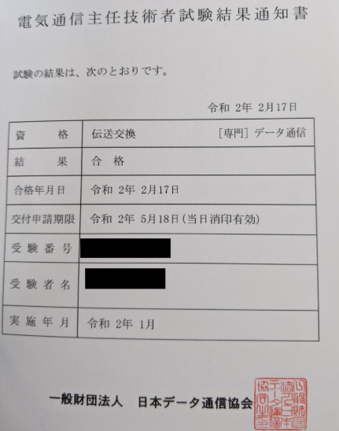
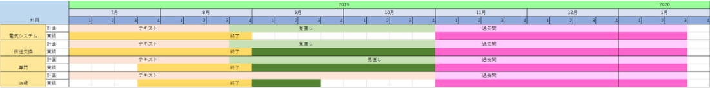

令和2年に電気通信主任技術者に合格しました。同資格の取得に向けた学習の方法について今回はお話させて頂きます。

2020年1月に受験した電気通信主任技術者ですが、なんとか合格しました。

電気通信主任技術者の勉強法の体験記を書いていきたいと思います。

## 1. 受けてみた感想

受験範囲は広いため、勉強時間は結構かかりました。

私の場合は2019年の7月くらいからぼちぼちと初めて、11月くらいからペースアップして、直前で何とか合格できるラインまでもっていった感じです。

また、わたくし、電気通信のことは何も分かりませんという状態からのスタートだったので、初めの2か月は結構苦心しながらの勉強だったと思います。

苦戦した理由がインターネットでお勧めされているテキストにあります。

試験と関係ないことをかなり説明している。
そもそもテキストがほとんどない。

黄色い色の高額なテキストがおすすめになっていますが、全然別のテキストで勉強することをお勧めします。

## 2. 勉強法

あくまで個人的なおすすめという感じで、人によってマッチする方法はあるでしょう。

著者個人は、勉強開始時点では伝送を重点的に進めることをお勧めします。

勉強のポイントをまとめると以下の点に集約されてきます。

__a. 伝送はしっかりと勉強する__

4つ科目がありますが、専門は他の科目に比べると伝送の知識をより深く問う問題が多いです。このため専門の勉強前に伝送をやっておく方が基礎が出来て、結果、相対的な勉強量を少なくすることが出来る。

__b. 過去問の勉強をしっかりする__

電気通信システムは過去問と同じ問題が出ます。過去5年の1回目、2回目を確実に解けるようになれば、絶対合格できます。問題自体も高校物理の電気程度の問題が出てくるくらいの難易度なので、それほど、勉強に時間をかけなくても大丈夫。→試験2か月前くらいからぼちぼち勉強しても多分受かります。

__c. 法規は後回し__

法規は暗記科目です。一つの問題集を3回くらい勉強すれば確実に合格できます。→試験1か月前から勉強しても間に合うと思います。

## 3. スケジュール
過去問を十分解くための時間を作る必要があります。
この資格の特徴は試験範囲が広いことです。
試験範囲が広いので、自分で勉強のペースを作る必要がありました。

→スケジュールを立てて、どの程度のペースで勉強すれば過去問に時間を作れるかは逆算して取り組んでました。

私の場合は、こんな感じでスケジュール表作ってやってました。

1月の試験めがけて7月から勉強開始しました。

スケジュールの流れですが、教科書で勉強→見直し→過去問の流れに分けてます。

スケジュールとは大分変ってしまったんですけど、立てたおかげで、継続的にコツコツできたと思います。

因みに、2の勉強法で言っている電気システム、法規は直前から勉強で間に合うといっていることとは、全然異なり、全科目を7月ではじめてます。

今振り返ると、もう少し効率よく勉強することも出来ました。
(著者の場合、法規の勉強時間が空いてしまって、相当数忘れてました。直前でも覚えることが出来るなら、直前で良い。そっちの方が効率よいと思いました)

## 4. 用語集を作ることのススメ

用語集は(暗記が苦手な)著者に合ってたので勧めさせて頂きます。

試験問題自体は選択肢、かつ、あんまり深く考えないといけない問題はそこまで多くありません。

ただ、試験範囲が広いということがこの資格の特徴です。

言葉の意味や、関係する言葉を沢山知っていることが重要です。

なので、わからない言葉が出てくるたびに用語集に書き留めておいて、暇なときにパラパラ確認していました。

用語集をつくるメリットは以下の通りです。

1. 「自分の弱点」だけが詰まった究極の効率本になる

市販の単語帳には、すでに知っている単語も多く含まれています。自作の場合、「自分が間違えた単語」や「覚えにくい単語」だけを抽出できるため、開くたびに100%必要な学習ができます。

英語: 模試や長文読解で出会った「文脈の中で分からなかった単語」をストックできる。

古文: 助動詞の活用や、意味が複数あって混乱しやすい単語（例：「おどろく」など）に特化できる。

2. 「エピソード記憶」で忘れにくくなる

人間は、単なる記号よりも「体験」と結びついたものの方が記憶に定着しやすい性質を持っています。

「あの長文の第3パラグラフに出てきた単語だ」

「先生が授業でギャグを交えて説明してた古文単語だ」 といった背景（コンテキスト）と一緒に記録することで、思い出す手がかりが格段に増えます。

## 5. 最後に
電気主任技術者という資格に対する社会的なニーズは、今後も継続すると考えています。

電気通信事業法第45条で定められた　「事業用の電気通信設備の工事と設備の維持・運用をするための監督者」 は通信のインフラ設備を意味します。

同資格の取得に向けて勉強を始められる方の参考にして頂ければ幸いです。

>電気主任技術者が管轄する対象となる事業用電気通信設備とは、電気通信事業者が提供する通信サービス（インターネット、携帯電話、固定電話など）を実現するために、事業者が自ら設置・運用する設備一全般を指します。
例えば以下が該当します。  
>1. 伝送交換設備（ネットワークの「核」となる部分）  
>主に情報の交換（ルーティング）や信号の処理、中継を行う設備です。 
>- 交換機・ルーター: 通信の宛先を判別し、接続先を切り替える装置。
>- 伝送装置: データを長距離送るために信号を増幅・変換する装置。
>- サーバー・蓄積設備: メールの送受信やデータの保存を行う設備。
>- 電源設備: これらの装置を24時間稼働させるための自家発電機や蓄電池。 
>2. 線路設備（ネットワークの「道」となる部分）  
>情報を物理的に伝達するための通路となる設備です。 
>- 通信回線: 光ファイバーケーブル、同軸ケーブル、電話線など。
>- 支持物: 電柱、鉄塔、マンホール、ハンドホール。
>- 海底ケーブル: 大陸間を繋ぐ大規模な回線。
>- 無線設備: 携帯電話の基地局やアンテナ。 

