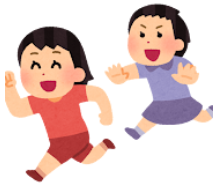

子供が**歯磨きを嫌がって**嫌がって、歯磨きするというと追いかけっこになってしまうようになってました。

最近導入してこの問題を解決するようになったきっかけをブログにしようと思います。

## 問題
昨年あたりから、うちの双子の子供が歯磨きを嫌がってしまいました。

親に拘束されたり、歯を触られるのが嫌なのかということが原因と思っています。

"歯磨きしようよ！"とミッキーマウス調で呼びかけると、わらわらと逃げてしまい、著者が追いかけっこの末、捕まえて抱きしめながら歯磨きをするという体裁になりました。
そんな状態になったとして、彼らが暴れて安定的な歯磨きが出来ないというような塩梅でした。

親、子供両方の問題として以下が問題になりました。
- 時間がかかる
- 歯磨き時に暴れて機嫌を損ねる
- 歯の形成期に清潔な口内環境を維持できない。

上記問題を解決するため**歯磨きを安定化させる**必要が出てきました。

## 原因と考えたこと

### 意思決定権がないのが嫌？
いやいや期の一環かしらと考え、
- 本人に歯磨きいつしよっか？
- 歯磨き粉を選択できるようにする
- パパとママどちらと歯磨きさせうようか選択してもらう

歯磨きをさせたいという軸での選択肢の幅をもたせてみました。

結果は惨敗。
**意思決定権がないことが嫌**が原因ではないみたいでした。

### 歯磨きがつまらない

つまらない、というより自由を拘束されるが原因かもしれません。

自由を拘束しない程度に歯磨きをしてもらおうということで、
- 軽く抱っこ
- テレビは見てよい

と条件を緩和して歯磨きをしてみました。
ところが歯磨きを始めるとみるみる顔色が曇っていき、彼らが好きなYouTubeでも嫌がるようになってしましました。

この時の感触は抱っこまではおとなしかったので、あとは歯磨きだけか、というようなところまで来ました。

**歯磨きで磨かれる時間を、彼らにとって好感を持ってもらえば解決**するのではと仮説を持ちました。

## 打ち手
### 打ち手案検討
歯磨きの時間を好意的にとってもらうにはどうすべきかで対応を考えました。
検討の末、以下の2案を考え出しました。

__1. 「成功報酬」と「進捗の可視化」__

達成感を数値化・視覚化して、ドーパミンを出させます。

- シールチャート（フィジカルなダッシュボード）: 歯磨きが終わったら、彼ら自身に「好きなシール」をカレンダーに貼らせます。シールのコレクションが増える喜びが、継続の動機になります。
- 限定コスチューム: 「歯磨きのときだけ被れるかっこいい帽子（またはマント）」を用意します。そのアイテムを身に着けることで「歯磨きヒーロー」に変身する演出です。

__2. フレーバーの「テイスティング」__

味覚は2歳児にとって非常に強い報酬系です。

歯磨き粉ビュッフェ: 2〜3種類の異なる味（ぶどう、メロン、いちごなど）を用意し、「今日はどの味で冒険する？」と毎晩選ばせます。これは「選択の自由（オートノミー）」を満たす強力な手法です。

シールや限定コスチュームは生活で有意な期間が限られます。
また、歯磨きヒーロという面で、彼らは最近アンパンマンから関心をなくし、心のヒーロをなくしています。

案1は継続性に問題を感じました。

案2 **歯磨きのフレーバーを彼らの喜ぶものにする** が現実解になりそうです。

### 歯磨き粉の選定
彼らはフルーツが大好きです。

フレーバーに甘未、特にフルーツ系の味覚があり、歯垢除去に効果があるものを調べてみました。
特徴的だったものは以下の５種類です。

__1. クリニカKid's (キッズ) 薬用ハミガキ (ライオン)__

- フッ素と酵素 (デキストラナーゼ) の働きで、歯質を強化し、歯垢を分解・除去することで虫歯を予防します。
- イチゴ味とグレープ味があり、子供に人気の香味です。

__2. ライオンこどもハミガキ (ライオン)__

- こちらもフッ素配合で虫歯予防を助けます。
- メロン味やイチゴ味などの香味があり、アンパンマンのパッケージデザインでお子さまの歯磨きタイムを楽しくサポートします。

__3. ガム デンタルペースト こども (サンスター)__

- 歯周プラーク（歯垢）を除去し、虫歯を予防します。
- フルーツミント味などの香味があります。

__4.ソダテコこどもハミガキ (サンスター)__

- フッ素950ppm配合で、こどもの将来のお口のリスクを防ぐことを目的としています。
- いちご味、ぶどう味、ソフトミント味があります。

__5. クリニカKid's (キッズ) 薬用ハミガキ__

- 香味： 「イチゴ」と「グレープ」の2種類があり、子供が嫌がらない味に調整されています。
- 形状： ペーストタイプですが、再石灰化を促進し、フッ素が歯に残りやすい組成になっています。

  
## こども用ハミガキ粉 比較表

この5種類の中から以下の要件を評価しました
- 幼児の歯の歯垢除去に有効で、歯を傷つけない
- 幼児の口内を刺激や、口内に圧迫感を与えない(子供が嫌がらない環境を作るため)
- 口をゆすぐ際に、歯磨き粉がすぐに洗い落とされる(ジェル状歯磨き粉が有利)

| 製品名 | フッ素濃度 | 研磨剤 | 発泡性 | 形状・味 | 実売価格例 |
| --- | --- | --- | --- | --- | --- |
| **クリニカKid's 薬用ハミガキ** (ライオン) | 不明 (低濃度) | あり | あり | ペースト状 (イチゴ、グレープ) | 200円台〜 |
| **ライオンこどもハミガキ** (ライオン) | 不明 (低濃度) | あり | あり | ペースト状 (メロン、イチゴなど) | 200円台〜 |
| **ガム デンタルペースト こども** (サンスター) | 不明 (低濃度) | あり | あり | ペースト状 (フルーツミント) | 200円台〜 |
| **ソダテコ こどもハミガキ** (サンスター) | 950ppm※ | 低研磨 | 低発泡 | ペースト状 (いちご、ぶどう、ミント) | 200円台〜 |
| **ピジョン ジェル状歯みがき ぷちキッズ** | 無配合※ | なし | 低/無発泡 | ジェル状 (ブドウ味など) | 300円台〜 |

> ※ **ソダテコ**：1450ppmの高濃度製品もラインナップにあります。
> ※ **ピジョン**：製品ラインナップによってはフッ素配合のものもあります。

値段が若干かかりますが、**子供の清潔な歯を維持する**、**歯磨きの時間の不快感を抑える**という面では多くの優位性があった**ピジョン ジェル状歯みがき ぷちキッズ**が効果が高いと考えられました。

## 導入の効果

**ピジョン ジェル状歯みがき ぷちキッズ**を導入直後は歯磨きへの嫌々はありましたが、徐々に逃げ回ることがなくなりました。
また、歯磨き時に嫌がることもなくなり、テレビがなくても歯磨きをしてくるようになりました。

今回導入した**ピジョン ジェル状歯みがき ぷちキッズ**は味だけでなく、口をゆすぐ際も非常に有効で、軽く口をゆすいだだけでほとんど歯磨き粉が落ちています。

導入してから3カ月経過しましたが子供の歯磨き嫌々は、ほぼ完全に解消されました。

この辺りから以下が成果となりそうです。
- 歯磨きの時間が短くなった
- 歯磨き粉のねばねば感がなくなり、**味が改善**されたため、子供の好みにあった歯磨きができるようになった

当初想定していた問題も改善されました。

## 対策の恒久化

効果は非常に高かったですが、コストが若干割高でした。
大容量になると同じ重量で1.2倍程度廉価になります。
ということで、以下の歯磨きを本採用しました。

読者の皆様もお子さんが歯磨き嫌がるようになった場合、是非お試しくださいませ。

    

        
    

    

        
PIGEON ピジョン【大容量】ジェル状歯みがきぷちキッズ いちご味 110g

        
「歯磨き剤」の「ジェル状歯みがき ぷちキッズ」は、1 才6ヵ月頃からのお子さまの乳歯の性質を考えてつくられた、虫歯の発生と進行を予防する薬用歯みがきです。 ＜ジェル状歯みがき ぷちキッズ　いちご味の特長＞ ●「歯磨き剤」の「ジェル状歯みがき ぷちキッズ」は、歯の再石灰化を促進し歯質を強化する、有効成分フッ素（フッ化ナトリウム）配合しており、虫歯の発生と進行を予防します。

        

            <a href="https://www.amazon.co.jp/%E3%83%94%E3%82%B8%E3%83%A7%E3%83%B3-%E3%83%94%E3%82%B8%E3%83%A7%E3%83%B3%E3%80%90%E5%A4%A7%E5%AE%B9%E9%87%8F%E3%80%91%E3%82%B8%E3%82%A7%E3%83%AB%E7%8A%B6%E6%AD%AF%E3%81%BF%E3%81%8C%E3%81%8D%E3%81%B7%E3%81%A1%E3%82%AD%E3%83%83%E3%82%BA-%E3%81%84%E3%81%A1%E3%81%94%E5%91%B3-110g-%E3%80%90Amazon-co-jp%E9%99%90%E5%AE%9A%E3%80%91/dp/B0DLGSMFDW?__mk_ja_JP=%E3%82%AB%E3%82%BF%E3%82%AB%E3%83%8A&crid=2RMYGCTJU6BIW&dib=eyJ2IjoiMSJ9.EEN9E-_qvdt6-ZQocvBZzhPumChyCT6juqvx3iIl-zLa7XKhTpHvHlLKuixBiAy4LuOT7uw2pYxWrydE6N9UiJuCBMaMtIs6-bbXtZXVYQ9D7vpRFZ6l6XZh9FzrbUOh2XT-Jqb9oMVTtF2iBVCz8wCzOnt_0tlL34RmYlju7wVy3MEbNg9Z4brp3b2C_Y52aTmhmSij-MqWrKqU5KvCuvxWXSi68yeQ8FtjMCLxzjNcOjazs8Hm2ROQ-v2ELia43VlO4umMcsjL2ApsnOCXKtAro7Xizp3UkeIUy-Ikvpo.4ubco1J0ALnqkEdK3hRHLRUVi-heTZJ8tn8mufHwg8Q&dib_tag=se&keywords=%E3%83%94%E3%82%B8%E3%83%A7%E3%83%B3%2B%E3%82%B8%E3%82%A7%E3%83%AB%E7%8A%B6%E6%AD%AF%E3%81%BF%E3%81%8C%E3%81%8D%2B%E3%81%B7%E3%81%A1%E3%82%AD%E3%83%83%E3%82%BA&qid=1770783376&sprefix=%E3%83%94%E3%82%B8%E3%83%A7%E3%83%B3%2B%E3%82%B8%E3%82%A7%E3%83%AB%E7%8A%B6%E6%AD%AF%E3%81%BF%E3%81%8C%E3%81%8D%2B%E3%81%B7%E3%81%A1%E3%82%AD%E3%83%83%E3%82%BA%2Caps%2C190&sr=8-1-spons&sp_csd=d2lkZ2V0TmFtZT1zcF9hdGY&th=1&linkCode=ll2&tag=yoshishinnze-22&linkId=6e98d54f5128a8bc72161d5e0240cee5&ref_=as_li_ss_tl" target="_blank" rel="noopener">Amazonで詳細を見る</a>
        

    

