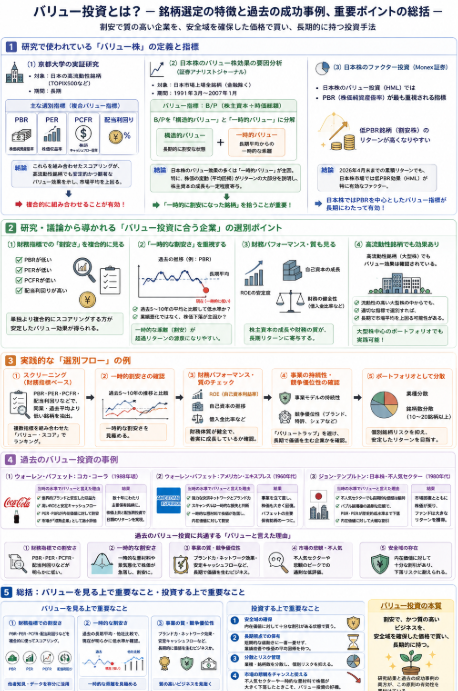
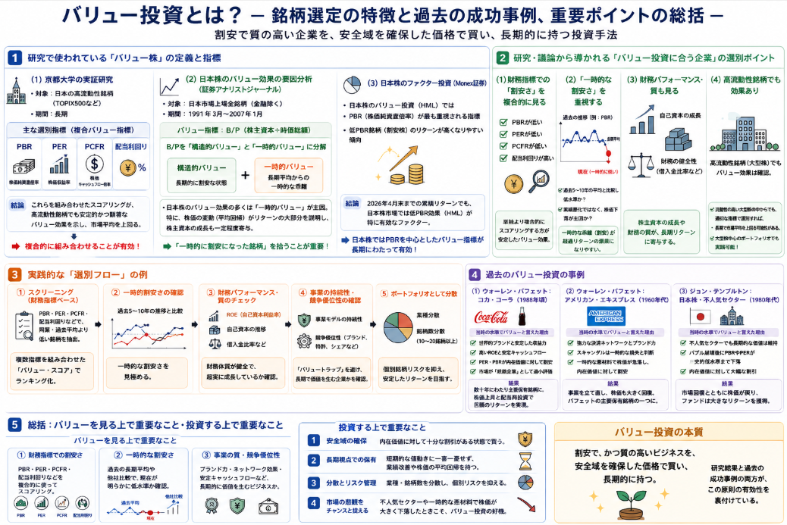

投資戦略で有名な方法で**バリュー投資**という投資法があります。
投資の神様で有名なバフェットが長年続けてきた投資法として有名です。
同手法の何が特徴で、勝因となりやすいか、についてまとめていきます。

## 概要

バリュー投資（Value Investing）は、

> 「企業の“本質的な価値（内在価値）”よりも、市場でついている株価が割安なときに買い、その価値が正当に評価されるまで長期的に保有する」

という考え方に基づく投資スタイルです。

### 1. バリュー投資の基本的な考え方

__(1) 内在価値と市場価格のギャップを利用する__

- 企業には、事業や資産、収益力などから見た「本来の価値（内在価値）」があります。  
- 一方、市場でついている株価は、投資家の心理やニュースなどで日々変動します。  
- バリュー投資では、**株価が内在価値より大きく下回っている（割安な）状態**を見つけて買います。

__(2) 安全域（マージン・オブ・セーフティ）を重視する__

- ベンジャミン・グレアムが提唱した概念で、「内在価値に対して十分な割引がある状態で買う」ことを意味します。  
- これにより、  
  - 企業価値の見積もりが多少間違っていても損失を抑えられる  
  - 市場がさらに下落しても耐えられる  
  といった**安全クッション**を持たせます。

__(3) 長期視点で保有する__

- 市場が企業の本当の価値を認識するには時間がかかることが多いため、**数年単位の長期保有**を前提とします。  
- 短期的な株価の上下に振り回されず、「企業の業績や価値がじわじわと株価に反映される」のを待ちます。

### 2. バリュー投資でよく使われる指標

バリュー投資家は、企業が「割安かどうか」を判断するために、以下のような財務指標を重視します。

- **PER（株価収益率）**  
  - 株価 ÷ 1株あたり利益。  
  - 同業他社や過去の水準と比べて低いほど「割安」と見なされます。

- **PBR（株価純資産倍率）**  
  - 株価 ÷ 1株あたり純資産。  
  - 1倍を大きく下回ると「簿価（会計上の資産価値）より株価が安い」と判断されます。

- **配当利回り**  
  - 年間配当 ÷ 株価。  
  - 高配当の企業は、キャッシュフローが安定していることが多く、バリュー投資の対象になりやすいです。

- **PEGレシオ**  
  - PER ÷ 予想利益成長率。  
  - 成長性を加味した割安度の指標として使われることもあります。

- **EV/EBITDA**  
  - 企業価値 ÷ EBITDA（利払い・税・減価償却前利益）。  
  - 事業全体の収益力に対する評価として、M&Aの場面などでもよく使われます。

これらはあくまで **「割安さの目安」** であり、実際には財務内容や事業の質も合わせて総合的に判断します。

### 3. バリュー投資の長所と短所
この長所に挙げている第2項に注目してください。
株で負ける多くの方が目先の利益を追求して、十分高いタイミングで株を購入して、その後の落下のタイミングで驚いて手放すことにあります。
ではなく、一気の株価上昇ではなく実力に見合った株価であり、毎年ビジネスを成長させることが出来る企業を選択し、目先の利益を忘れる。これが投資の一番の要点です。

__長所__

- **リスク管理がしやすい**  
  - 割安な価格で買うため、市場が大きく下落しても、元本割れのリスクをある程度抑えられます。
- **心理的に安定しやすい**  
  - 短期的な値動きに一喜一憂せず、「企業の価値」に注目するため、感情的になりにくいです。
- **長期で見れば高いリターンが期待できる**  
  - 多くの研究で、バリュー株は長期的に市場平均を上回るリターンを生みやすいことが示されています。

__短所__

- **時間がかかる**  
  - 株価が内在価値に追いつくまで数年かかることもあり、すぐに儲かる投資ではありません。
- **バリュートラップのリスク**  
  - 一見割安に見えても、業績が悪化し続ける「バリュートラップ」に陥る可能性があります。
- **市場のトレンドに逆らうことも多い**  
  - 人気のない銘柄・業種に投資することが多いため、市場がグロース株一色のときは相対的にパフォーマンスが悪くなりがちです。

### 4. グロース投資との違い

- **グロース投資**  
  - 将来の高い成長が期待できる企業（グロース株）に投資します。  
  - たとえPERが高くても、「成長ストーリー」や「将来の収益力」を重視します。  
  - 例：テクノロジー、バイオ、新興産業など。

- **バリュー投資**  
  - 現在の価値に対して割安な企業（バリュー株）に投資します。  
  - 安定した事業・資産・収益力があり、それに対して株価が安すぎる状態を探します。  
  - 例：成熟産業、伝統的な製造業、高配当株など。

実際には、  
- 「割安でかつ成長余地もある企業」を選ぶ「グロース・アット・ア・リーズナブル・プライス（GARP）」  
- バリューとグロースを組み合わせたアプローチ  
など、両者を融合させた戦略も多くあります。

### 5. 代表的なバリュー投資家

- **ベンジャミン・グレアム**  
  - バリュー投資の父。『賢明なる投資家』『証券分析』の著者。

- **ウォーレン・バフェット**  
  - グレアムの弟子であり、バリュー投資の考え方を発展させた人物。  
  - 「おいしい価格で素晴らしいビジネスを買う」というスタイルで知られています。

- **ジョン・テンプルトン、セトス・クラーマン** など  
  - 国際的なバリュー投資家として有名です。

## 銘柄選定の特徴

バリュー投資に「見合う企業」の選別方法は、日本の実証研究やファクター投資の議論から、かなり具体的に整理されています。  
以下では、**研究で使われている指標・条件**と、**それらから導かれる実践的な選別ポイント**をまとめます。

### 1. 研究で使われている「バリュー株」の定義と指標

__(1) 日本の高流動性銘柄を対象とした実証研究（京都大学リポジトリ）__

- 対象：日本の高流動性銘柄（TOPIX500採用銘柄など）  
- 期間：長期（詳細は論文内）  
- 主な選別指標：  
  - **PBR（株価純資産倍率）**  
  - **PER（株価収益率）**  
  - **PCFR（株価キャッシュフロー倍率）**  
  - **配当利回り**  

- 結論のポイント：  
  - 単一の指標（例：PBRだけ）よりも、**これらを組み合わせた「複合バリュー指標」** でスコアリングした方が、  
    - 高流動性銘柄群でもバリュー効果が**安定的かつ顕著**に確認される  
    - 市場平均（TOPIX）を上回るパフォーマンスを示す  
    ことが実証されています<source-chip title=\"京都大学リポジトリ\" url=\"https://repository.kulib.kyoto-u.ac.jp/bitstreams/b00b52e5-541f-4799-8eff-46d871bf49f9/download\" />。

→ **研究レベルでは、「PBR・PER・PCFR・配当利回りを複合的に使う」ことが有効とされています。**

__(2) 日本株式市場におけるバリュー株効果の要因分析（証券アナリストジャーナル）__

- 対象：日本市場上場全銘柄（金融セクター除く）  
- 期間：1991年3月〜2007年1月  
- バリュー株の定義：  
  - **PBRの逆数であるB/P（株主資本÷時価総額）** をバリュー指標として使用  
  - B/Pを  
    - 「構造的バリュー（B/Pの長期平均値）」  
    - 「一時的バリュー（長期平均からの一時的な乖離）」  
    に分解して分析。

- 結論のポイント：  
  - 日本市場のバリュー株効果（超過リターン）の多くは、**「一時的バリュー」** によるものである。  
  - つまり、  
    - 企業が「構造的に割安」な状態にあるよりも、  
    - **長期平均から一時的に割安な水準に乖離した状態**が、超過リターンの主因。  
  - さらに、この一時的バリューを分解すると、  
    - 株価の変動（平均回帰＝リターンリバーサル）がリターンの大部分を説明  
    - 株主資本の成長（財務パフォーマンス）も一定程度寄与  
    とされています<source-chip title=\"証券アナリストジャーナル\" url=\"https://www.saa.or.jp/journal/prize/pdf/2007nishioka.pdf\" />。

→ **「一時的に割安になった銘柄」を拾うことが、バリュー投資の超過リターンの源泉になっている**、というのが研究の示唆です。

__(3) 日本株におけるファクター投資（Monex証券の記事）__

- 日本株のバリュー投資（ファクター投資のHML）では、  
  - **PBR（株価純資産倍率）** が最も重視される指標  
  - 「低PBR銘柄（割安株）」のリターンが高くなりやすい傾向（バリュー効果）が確認されている  
- 2026年4月末までの累積リターンでも、日本株市場では**低PBR効果（HML）が特に有効なファクター**であると報告されています<source-chip title=\"Monex証券\" url=\"https://media.monex.co.jp/articles/-/29331\" />。

→ **日本株では、PBRを中心としたバリュー指標が長期にわたって有効**であることが、実務・研究の両面で支持されています。

### 2. 研究・議論から導かれる「バリュー投資に合う企業」の選別ポイント

上記の研究結果を踏まえると、バリュー投資に「見合う企業」を選ぶ際のポイントは、次のように整理できます。

__(1) 財務指標での「割安さ」を複合的に見る__

- **PBRが低い**  
  - 特に日本株では、PBRベースの割安さが長期的に有効とされています<source-chip title=\"Monex証券\" url=\"https://media.monex.co.jp/articles/-/29331\" />。  
  - 同業他社や過去の水準と比較して、明らかに低いかどうかを確認します。

- **PERが低い**  
  - 利益水準に対して株価が割安かどうか。  
  - ただし、業績悪化で一時的にPERが下がっている「バリュートラップ」には注意が必要です。

- **PCFR（株価キャッシュフロー倍率）が低い**  
  - 利益は会計上の数字ですが、キャッシュフローはより実質的な企業の体力を示します。  
  - PCFRが低い企業は、キャッシュフローに対して株価が割安と判断できます。

- **配当利回りが高い**  
  - 安定したキャッシュフローと株主還元姿勢の表れです。  
  - 高配当は、バリュー投資の重要な補助指標として機能します。

→ 研究では、**これらを単独で使うよりも、複合的にスコアリングする方が安定したバリュー効果が得られる**とされています<source-chip title=\"京都大学リポジトリ\" url=\"https://repository.kulib.kyoto-u.ac.jp/bitstreams/b00b52e5-541f-4799-8eff-46d871bf49f9/download\" />。

__(2) 「一時的な割安さ」を重視する__

- 西岡論文の結果から、  
  - 企業が「構造的に割安」な状態よりも、  
  - **長期平均から一時的に割安な水準に乖離した状態**が、超過リターンの主因であることが示されています<source-chip title=\"証券アナリストジャーナル\" url=\"https://www.saa.or.jp/journal/prize/pdf/2007nishioka.pdf\" />。

→ 実践的な選別では、  
- 過去5〜10年のPBR・PER・配当利回りの平均と比較して、**現在が明らかに低水準かどうか**  
- 業績は悪化していないのに、株価だけが大きく下落していないか  
といった「一時的な割安さ」をチェックすることが重要です。

__(3) 財務パフォーマンス（株主資本の成長）も見る__

- 同じく西岡論文では、  
  - 一時的バリューの要因を分解すると、**株主資本の成長（財務パフォーマンス）** もリターンに一定程度寄与しているとされています<source-chip title=\"証券アナリストジャーナル\" url=\"https://www.saa.or.jp/journal/prize/pdf/2007nishioka.pdf\" />。

→ 実践では、  
- ROE（自己資本利益率）が安定して高いか  
- 自己資本（株主資本）が着実に増えているか  
- 借入金が過剰でないか（財務レバレッジが健全か）  
といった**財務の質**も合わせて確認することが望ましいです。

__(4) 高流動性銘柄でもバリュー効果は確認されている__

- 京都大学の研究では、**高流動性銘柄（TOPIX500など）を対象にしても、バリュー効果が確認**されています<source-chip title=\"京都大学リポジトリ\" url=\"https://repository.kulib.kyoto-u.ac.jp/bitstreams/b00b52e5-541f-4799-8eff-46d871bf49f9/download\" />。

→ 個人投資家にとっては、  
- 流動性の高い大型株でも、適切なバリュー指標で選別すれば、長期で市場平均を上回る可能性がある  
- 小型・マイナー株にこだわらなくても、大型株の中からバリュー投資に合う企業を選べる  
という示唆になります。

### 3. 実践的な「選別フロー」の例（研究結果を踏まえた整理）

研究結果を踏まえると、バリュー投資に合う企業を選ぶ際のフローは、次のようにまとめられます。

1. **スクリーニング（財務指標ベース）**  
   - PBR・PER・PCFR・配当利回りなどで、  
     - 同業他社より低い  
     - 過去の自社平均より低い  
     銘柄を抽出。  
   - 可能なら複数指標を組み合わせた「バリュー・スコア」でランキング。

2. **一時的割安さの確認**  
   - 過去5〜10年のPBR・PER・配当利回りの推移を見て、  
     - 現在が明らかに低水準か  
     - 業績悪化ではなく、株価下落が主因か  
     を確認。

3. **財務パフォーマンス・質のチェック**  
   - ROE、自己資本の推移、借入金比率などから、  
     - 財務体質が健全か  
     - 株主資本が着実に成長しているか  
     を確認。

4. **事業の持続性・競争優位性の確認**  
   - 研究では直接扱っていませんが、実務上は  
     - 事業モデルの持続性  
     - 競争優位性（ブランド、特許、シェアなど）  
     も合わせて見ることで、「バリュートラップ」を避けやすくなります。

5. **ポートフォリオとして分散**  
   - 個別銘柄リスクを抑えるため、  
     - 業種分散  
     - 銘柄数分散（10〜20銘柄以上）  
     を意識する。

## 過去のバリュー事例

過去のバリュー投資の事例を、当時の水準でバリューと言えた理由と結果を合わせて引用していきます。

### 1. 有名バリュー投資家の事例（海外）

__(1) ウォーレン・バフェット：コカ・コーラ（1988年頃の大規模投資）__

- バフェットは1988年頃、コカ・コーラ株に約10億ドル規模の投資を行いました。  
- 当時のコカ・コーラは、  
  - 世界的なブランド力と安定した収益力を持つ一方、  
  - 株価は**内在価値に対して割安な水準**にあったとされています<source-chip title=\"note（バフェットの投資事例解説）\" url=\"https://note.com/seimiya_electric/n/n55e8df2154d5\" />。

**「当時の水準でバリューと言えた理由」の整理**

- 事業面：  
  - 世界的なブランドと高い参入障壁  
  - 安定したキャッシュフローと高いROE  
- 株価面：  
  - PERやPBRが、将来の成長余地を考慮しても**割安な水準**  
  - 市場が「成熟企業」として過小評価していた  
- バフェットの判断：  
  - 「優れたビジネスを、妥当な価格で買う」というバリュー投資の考え方に基づき、  
  - 内在価値に対して十分な安全域（マージン・オブ・セーフティ）があると判断して大規模投資を行った。

→ 結果として、コカ・コーラはその後数十年にわたりバフェットの主要保有銘柄となり、株価上昇と配当再投資を通じて巨額のリターンを生み出しました<source-chip title=\"note（バフェットの投資事例解説）\" url=\"https://note.com/seimiya_electric/n/n55e8df2154d5\" />。

__(2) ウォーレン・バフェット：アメリカン・エキスプレス（1960年代の危機時の投資）__

- 1960年代、アメリカン・エキスプレスは「サラダ油スキャンダル」で大きな損失を被り、株価が急落しました。  
- バフェットは、  
  - 同社の**ブランド力とビジネスモデルの強さ**は損なわれていないと判断し、  
  - 株価が**一時的に大きく割安になった**タイミングで投資を行いました<source-chip title=\"ウィザードブックシリーズ第249弾（バフェットの重要投資案件20）\" url=\"https://www.panrolling.com/books/wb/wb249.html\" />。

**「当時の水準でバリューと言えた理由」の整理**

- 事業面：  
  - クレジットカード・トラベラーズチェックなど、強力な決済ネットワーク  
  - スキャンダルは一時的な損失であり、事業の本質的価値は変わらないと判断  
- 株価面：  
  - 一時的な悪材料で株価が大きく下落し、**内在価値に対して割安な水準**にあった  
- バフェットの判断：  
  - 「市場の過剰反応による一時的な割安さ」を利用した典型的なバリュー投資。

→ その後、アメリカン・エキスプレスは事業を立て直し、株価も大きく回復。バフェットの主要保有銘柄の一つとなりました<source-chip title=\"ウィザードブックシリーズ第249弾（バフェットの重要投資案件20）\" url=\"https://www.panrolling.com/books/wb/wb249.html\" />。

__(3) ジョン・テンプルトン：日本株・不人気セクターへの逆張り（1980年代）__

- テンプルトンは、**「不人気な業種に張り、株価の下落時に買い向かう」**逆張り投資で知られています<source-chip title=\"日本経済新聞（逆張りテンプルトンの流儀）\" url=\"https://www.nikkei.com/article/DGXZQOGD106BO0Q3A810C2000000\" />。

- 1980年代の日本株市場では、  
  - バブル期の高騰後に不人気となったセクター（例：不動産株など）で、  
  - PBRやPERが**歴史的な低水準**にまで下落した銘柄に投資したとされています<source-chip title=\"日本経済新聞（逆張りテンプルトンの流儀）\" url=\"https://www.nikkei.com/article/DGXZQOGD106BO0Q3A810C2000000\" />。

**「当時の水準でバリューと言えた理由」の整理**

- 事業面：  
  - 不人気セクターだが、長期的な収益力や資産価値は維持されていると判断  
- 株価面：  
  - バブル崩壊後の過剰な悲観で、PBR・PERが**極端に低い水準**まで下落  
  - 内在価値に対して**大幅な割引**がついている状態  
- テンプルトンの判断：  
  - 「悲観の頂点が最高の買い時」という哲学に基づき、  
  - 市場が過小評価しているセクターに逆張りで投資。

→ その後、日本株市場が回復する過程で、これらの不人気セクターも株価が戻り、テンプルトンのファンドは大きなリターンを上げました<source-chip title=\"日本経済新聞（逆張りテンプルトンの流儀）\" url=\"https://www.nikkei.com/article/DGXZQOGD106BO0Q3A810C2000000\" />。

### 2. まとめ：過去のバリュー投資事例から見える「バリューと言えた理由」

上記の事例を総合すると、過去のバリュー投資で「当時の水準でバリューと言えた理由」は、次のように整理できます。

1. **財務指標での割安さ**  
   - PBR・PER・PCFR・配当利回りなどが、同業・過去平均と比べて**明らかに低い**状態<source-chip title=\"京都大学リポジトリ\" url=\"https://repository.kulib.kyoto-u.ac.jp/bitstreams/b00b52e5-541f-4799-8eff-46d871bf49f9/download\" /><source-chip title=\"Monex証券\" url=\"https://media.monex.co.jp/articles/-/29331\" />。

2. **一時的な割安さ（市場の過剰反応）**  
   - スキャンダルや景気後退などで株価が急落し、**内在価値に対して一時的に大きく割安**になった状態<source-chip title=\"証券アナリストジャーナル\" url=\"https://www.saa.or.jp/journal/prize/pdf/2007nishioka.pdf\" /><source-chip title=\"ウィザードブックシリーズ第249弾（バフェットの重要投資案件20）\" url=\"https://www.panrolling.com/books/wb/wb249.html\" />。

3. **事業の質・競争優位性**  
   - ブランド力、ネットワーク効果、安定したキャッシュフローなど、**長期的に価値を生み出すビジネス**であること<source-chip title=\"note（バフェットの投資事例解説）\" url=\"https://note.com/seimiya_electric/n/n55e8df2154d5\" />。

4. **市場の悲観・不人気**  
   - 不人気セクターや一時的な悪材料で、市場が過剰に悲観的になっている状態<source-chip title=\"日本経済新聞（逆張りテンプルトンの流儀）\" url=\"https://www.nikkei.com/article/DGXZQOGD106BO0Q3A810C2000000\" />。

5. **安全域（マージン・オブ・セーフティ）の存在**  
   - 内在価値に対して十分な割引があり、**多少の見積もりミスや市場下落にも耐えられる**状態。

これらの条件が揃ったとき、過去のバリュー投資家たちは「バリューと言える」と判断し、長期保有を通じて大きなリターンを得てきました。  
逆に言えば、**単に「PBRが低い」だけでは不十分で、事業の質や一時的な割安さ、市場の過剰反応まで含めて総合的に判断する**ことが、バリュー投資の本質と言えます。

もし、「特定の銘柄（例：日本のある企業）が過去にバリュー投資の対象としてどう評価されていたか」など、さらに具体的な事例を知りたい場合は、銘柄名を指定していただければ、可能な範囲で調べて整理いたします。

## 総括

ここまで説明した内容から**バリューを見る上で重要なこと**と著者が感じていることをまとめていきます。

1. **財務指標での割安さ**  
   - PBR・PER・PCFR・配当利回りなどを**複合的に**使ってスコアリングする。ここは他者知見を存分に使ってください。

2. **一時的な割安さ**  
   - 過去の長期平均と比べて、現在が明らかに低水準かどうかを確認する。過去、他社との比較を行うことで確認していきます。

3. **事業の質・競争優位性**  
   - ブランド力、ネットワーク効果、安定したキャッシュフローなど、長期的に価値を生み出すビジネスかどうか。

**投資する上で重要なこと**

1. **安全域の確保**  
   - 内在価値に対して十分な割引がある状態で買う。

2. **長期視点での保有**  
   - 短期的な値動きに一喜一憂せず、業績改善や株価の平均回帰を待つ。

3. **分散とリスク管理**  
   - 業種・銘柄数を分散し、個別リスクを抑える。

4. **市場の悲観をチャンスと捉える**  
   - 不人気セクターや一時的な悪材料で株価が大きく下落したときこそ、バリュー投資の好機。

これらを踏まえると、バリュー投資は  
> 「割安で、かつ質の高いビジネスを、安全域を確保した価格で買い、長期的に持つ」  
というシンプルな原則に集約されます。  
研究結果と過去の成功事例の両方が、この原則の有効性を裏付けていると言えます。

このバリュー投資、日本で有名な教科書があります。
作者は自身も非常に高名な投資家でバリューを基本戦略とした清原達郎氏です。
当時個別の恐怖感に震えていた時に握りしめることになった思い出の本です。

投資のあるべきを理解したいという方、是非ご覧ください。

    

        
    

    

        
わが投資術 市場は誰に微笑むか

        
■話題沸騰 連続重版たちまち24万部突破!
個人資産800億円超。長者番付1位となった伝説のサラリーマン投資家・清原達郎。
咽頭がんで声帯を失い、引退を決めたいま、全人生で得た株式投資のノウハウを明かす
■新NISA完全対応! すべての投資家のバイブル誕生
私には後継者がいない。ならばすべてのノウハウを全部世の中に「ぶちまけてしまえ」という気持ちになった。今や株式市場は「個人が自由に儲けることができる市場」です。2024年からは新NISAも始まりました。「やらなきゃ絶対損」という個人にとっては夢のような制度です。(本書より)
■株式投資に才能など存在しない。「自分の失敗からどれだけ学んだか」だけだ。

        

            <a href="https://www.amazon.co.jp/%E3%82%8F%E3%81%8C%E6%8A%95%E8%B3%87%E8%A1%93-%E5%B8%82%E5%A0%B4%E3%81%AF%E8%AA%B0%E3%81%AB%E5%BE%AE%E7%AC%91%E3%82%80%E3%81%8B-%E6%B8%85%E5%8E%9F-%E9%81%94%E9%83%8E/dp/4065350352?crid=5VW46T3SWZ1O&dib=eyJ2IjoiMSJ9.MRfrqUPXwOGnn2s_RgxHG6M-pkh3iMv8qiexQrtMRFPm_NcmqpZplIHIP9ZOuKN-KFANlcMKu7a15JLeiCtWB0ez-p6wSoEY8-DWnydV_v8ZKK5jbWfkREgwyTl9ahvAFq2O_tT2aHMTE3mydPK_rUNdFRaOfDvxUX0VPT1jqxLvAZ1ecO4mpiIarlCFDcbY.dsRHc1M_VdQq1xzKbuiEmtSfDgjuwmYasMNFC8ETRVc&dib_tag=se&keywords=%E6%B8%85%E5%8E%9F+%E6%8A%95%E8%B3%87&qid=1784460867&sprefix=%E6%B8%85%E5%8E%9F+%E6%88%91%E3%81%8C%E6%8A%95%E8%B3%87%2Caps%2C217&sr=8-1&linkCode=ll2&tag=yoshishinnze-22&linkId=7339b111b6e440f5dfab47a0e9a0c020&ref_=as_li_ss_tl" target="_blank" rel="noopener">Amazonで詳細を見る</a>
        

    

