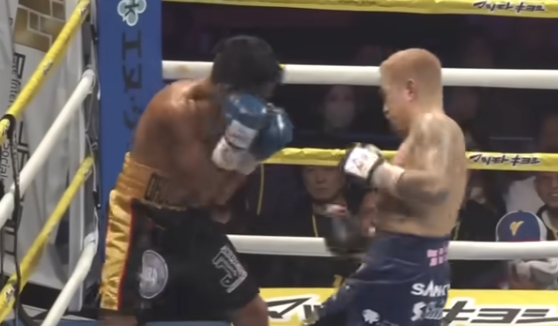
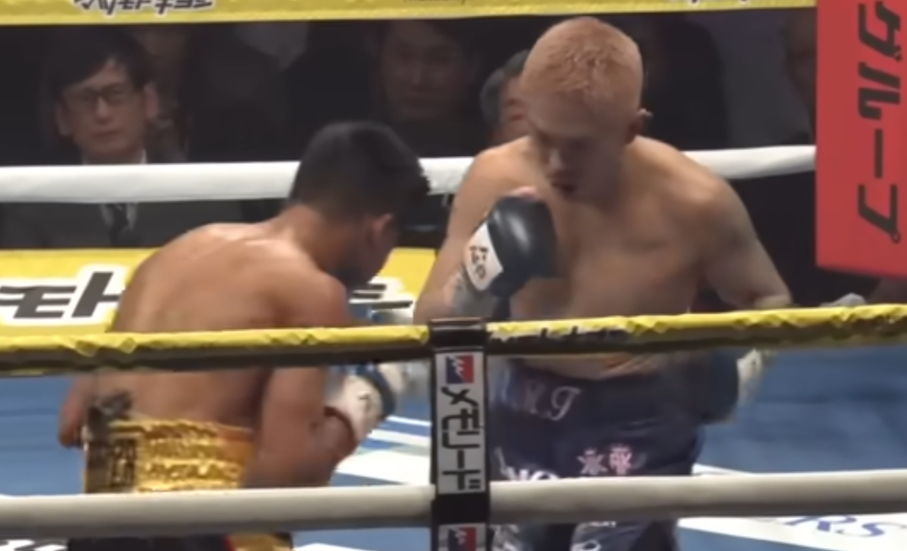

2025年末の井岡一翔のバンタム級の試合、いつも通りの井岡の名人芸で危なげない勝利でした。

## 試合の流れ

__1R__

立ち上がり。

動きは軽いように見えます。

パーリングは非常に有効で攻撃をことごとく外していきます。

1Rの中盤いきなり左ボディでダウンをとりました。

無理をせず、1R終了

__2R__

オルドスゴイティが自分から出てきます。

ブロー、フックともに井岡はきれいに外していきます。

上手さが光ったのはロープ際、攻撃を全てブロック、ダッキングで外して、カウンターを取り出します。

ストレートで被弾はなかったように思います。

__4R__

井岡がプレッシャーを掛けます。

ディフェンスが冴えわたりオルドスゴイティの攻撃の出鼻をことごとくつぶしていきました。

対する井岡は上下にパンチを散らしながらボディ、アッパーに有効打を決めていきました。

本当に練度の高いコンビネーションです。

最後は得意の左レバーブロー。

オルドスゴイティが倒れる寸前の1コマ、、決まったところではないのですが。。。

息が止まったでしょうね。。。

### 総括

井岡の名人芸が冴えわたった試合でした。ディフェンス、パンチは上の階級の強い相手でも十分に通用してるように見えます。

ただし、軽量級の1階級のパワーは結構大きいはず。

今回の相手では問題が見えませんでしたが、さらなる強敵と当たったときに、パワーが通用するかは流石に確信は持てません。

思えば初めて見た東京農大のインカレ以来18年くらいでしたか。

当時から足をしっかり付けた、叔父さん井岡とは全然違うファイトスタイルで印象的でした。

著者の地元大阪出身だったこともあり、プロデビューから気になってた選手でした。

デビュー当初から巧さが光っていましたが、こんな長くボクシングを続ける選手、なかなかいません。

そして、この階級(バンタム級)で世界戦が多分キャリアのクライマックスになるような気がします。
