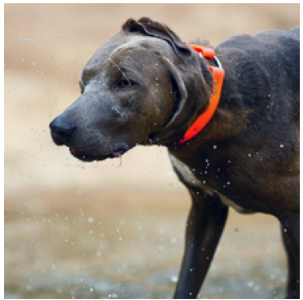

## 目的

物販用のブログの書き方について理解する

## ブログで物販を成功させる方法
https://and-yuki.com/blog-merchandise/

まず大切なのが、収益化しやすいジャンル選びです。
初心者は需要が安定していて、検索ボリュームが大きいジャンルを選ぶことが成功への近道となります。

例えば健康・美容、家電、ガジェット、日用品などは幅広いユーザーから注目されています。

競合が多い場合もありますが、ニッチなターゲットに特化した情報発信を行うことで差別化ができます。

自分が興味を持ち続けられる、知識を深めていけるジャンルを選ぶことも継続のために大切です。

重要な点：読者が共感しやすく、読み進めたくなる構成

商品の特徴やメリットを具体的に紹介します。

比較表や画像を使いながら、他商品や旧モデルとの違いも明確にしましょう。

|ポイント |	具体例 |
| --------------- | --------------------------- |
|実際に使用した感想を詳しく書く	|「3ヶ月使って感じた効果や困った点も率直に記載」|
|メリット・デメリットを公正に紹介 |	「良い部分だけでなく不満点や注意点も追記」|
|写真や動画で使用イメージを伝える |	「開封時の写真や、実際に使っている様子を掲載」|

## SEO対策

アクセスアップにはSEO対策が不可欠です。

記事タイトルや見出しにキーワードを適切に配置し、本文にも自然な形で関連ワードを織り交ぜましょう。

- 内部リンクや関連する過去記事への誘導も効果的です。
- また、商品名＋口コミ・評判・使い方など複合キーワードを狙うと上位表示しやすくなります。
- 検索意図を意識した記事設計を日頃から心がけてください。

## 商品ごとの比較やランキング
複数の商品を比較したり、ランキング形式で紹介する記事は、多くの読者に喜ばれます。

自分で調べる手間が省けるため、選ぶ際の参考にしやすいのが理由です。

商品ごとの特徴や違いがわかるように整理すると、読者の購買意欲を高めることにつながります。

価格や機能の一覧で違いをチェックできる
- 初心者向け・上級者向けなどレベル別のおすすめを紹介
- 実際の使用感やメリット・デメリットを比較
- 人気順や評価順でランキング化

このような工夫が収益アップにつながる可能性を広げてくれます。

