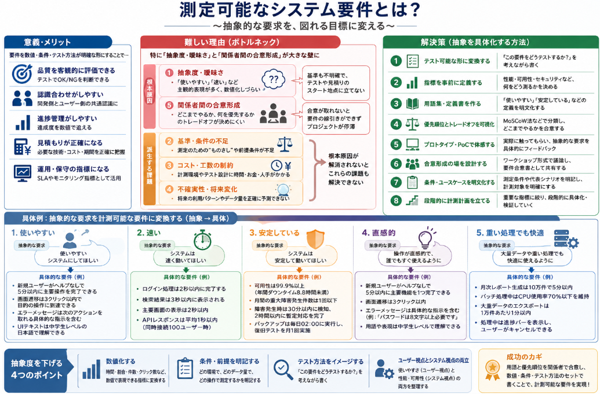

`システム要件を策定せよ`というミッションを持った時、"あぁ、苦手だ・・・"と感じてしまいます。
ですがなぜ苦手と感じるかについて自分に具体的に問うたことがあまりありませんでした。
兎に角、数値化された目標を立てるように言われて、崩れ落ちるイメージがあります。

今日はそんな苦手意識を持つシステム要件について語っていきたいと思います。

## 測定可能なシステム要件の意義
「システム要件を図れる目標とする」とは、**要件を“測定可能な形”で定義すること**を意味します。  
これには、品質の確保、進捗管理、関係者間の認識合わせなど、多くの重要なメリットがあります。

### 1. なぜ「図れる（測定可能な）目標」が重要なのか

システム要件が「なんとなく」の表現だと、次のような問題が起こりやすくなります。

- 「速い」「使いやすい」「安定している」などの主観的な表現は、人によって解釈が異なる
- テストで「OK/NG」を判断できない
- 開発側とユーザー側で認識がずれ、後から「想定と違う」というトラブルになる

**図れる目標にしておくことで、客観的に評価でき、合意形成と検証がしやすくなります。**

### 2. 主な重要性・メリット
計測可能な目標としない場合、達成度がぶれてしまいます。
発注側は80点を要求したつもりが、受託者は65点を目指して照らし合したときに全然あってないということになる可能性が出てきます。

__(1) 品質の客観的な評価ができる__
- 例：
  - 「システムは高速である」  
    → 測定可能にすると「ログイン処理は2秒以内に完了する」
  - 「システムは安定している」  
    → 「年間のダウンタイムは99.9%以下（年間約8.8時間未満）」
- こうしておくと、**テストで明確に「合格/不合格」を判定できる**ようになります。

__(2) 開発側とユーザー側の認識合わせがしやすい__
- 数値や条件が明確だと、**「何をどこまでやればよいか」が共通認識**になります。
- 例：
  - 「検索結果は“関連性の高い順”に表示する」  
    → 「検索結果は、スコアが高い順に上位10件を表示する。スコアはタイトル一致＋本文一致＋更新日時の重み付けで計算する」

__(3) 進捗管理・プロジェクト管理がしやすい__
- 要件が測定可能だと、**達成度を数値で追える**ようになります。
- 例：
  - 「レスポンス時間2秒以内」という要件に対し、現在の平均レスポンスが3.5秒 → まだ改善が必要、と判断できる

__(4) コスト・スケジュールの見積もりが正確になる__
- 「どれくらいの性能を目指すか」が明確だと、**必要な技術・リソース・期間の見積もりがしやすく**なります。
- 例：
  - 「1秒以内に10万件のデータを検索する」  
    → インメモリDBや分散検索エンジンが必要、と判断できる

__(5) 運用・保守の指標としても使える__
- システムリリース後も、**SLA（サービスレベル合意）やモニタリング指標**として利用できます。
- 例：
  - 「月間のエラー率0.1%以下」  
    → 運用中にこの値を超えたらアラートを出す、など

## 計測可能なシステム要件の難しい面

といったところで、実際に計測可能なシステム要件を作ることは結構難しいと思います。
難しいと感じる部分について整理してみます。

### 1. ユーザーの要求がそもそも曖昧・抽象的

- 「使いやすい」「速い」「安定している」など、**主観的な表現**が多く、数値化しづらい。
- ユーザー自身も「どこまでを“速い”と感じるか」を明確に言語化できていないことが多い。
- 例：
  - 「もっと使いやすくしてほしい」  
    → 何が使いにくいのか、どこをどう改善すればよいのかが不明確。

### 2. 要件を数値化するための「基準」が不明確

- 性能要件を数値化するには、**基準となる環境・条件**が必要ですが、それが決まっていないことが多い。
- 例：
  - 「レスポンス2秒以内」と言っても、
    - どのネットワーク環境か
    - どの時間帯か
    - どの端末・ブラウザか
    - どの程度のデータ量か
  が決まっていないと、測定できません。

### 3. 計測コスト・工数の問題

- 厳密に計測可能な要件にすると、**テスト設計・テスト環境構築・計測実施**に工数がかかる。
- 特に性能・負荷テストは、環境構築やシナリオ設計が大変で、**「そこまでやる余裕がない」** という現場も多い。
- その結果、「ざっくりとした要件」で済ませてしまうことがあります。

### 4. 将来の変化・未知の要因を織り込めない

- 要件定義時点では、**将来の利用パターンやデータ量が正確に予測できない**ことが多い。
- 例：
  - 「3年後にはユーザー数が10倍になるかもしれないが、今は分からない」
  - 「将来、外部APIのレスポンスが悪化するかもしれない」
- こうした不確実性があると、「どこまでを要件として明文化するか」が難しくなります。

### 5. 関係者間の認識差・妥協の難しさ

- ユーザー側は「理想的な性能」を求めがちですが、開発側は「コスト・期間・技術的制約」を考慮します。
- その結果、
  - 「どこまで性能を上げるか」
  - 「どの指標を優先するか（速度 vs 可用性 vs セキュリティ）」
  の**トレードオフ**を明確にすることが難しくなります。

## システム要件決定のボトルネック

ここまで上げたシステム要件を決定する中で、**特にボトルネックになりやすいのは「抽象度・曖昧さ」と「関係者間の合意形成」**　だと考えます。  
その理由を、各共通項との関係も含めて説明します。

### 1. ボトルネック候補の整理

まず、共通項を再掲します。

1. **抽象度・曖昧さの問題**  
   - 要求が抽象的で、数値化・条件化しづらい。

2. **基準・条件の不足**  
   - 測定のための“ものさし”や前提条件が不足している。

3. **コスト・工数・実現性の制約**  
   - 計測のためのリソース（時間・お金・人手）が限られている。

4. **不確実性・将来変化への対応**  
   - 将来の変化や不確実性を前提にした要件設計が難しい。

5. **関係者間の合意形成・トレードオフ**  
   - 利害関係者間の認識差・優先順位の違いにより、要件の線引きが難しい。

この中で、**他の問題を引き起こしやすい“根本原因”**になりやすいのが、**①抽象度・曖昧さ**と **⑤関係者間の合意形成** です。

### 2. なぜ「抽象度・曖昧さ」がボトルネックになりやすいか

__根拠1：他の問題の“入口”になりやすい__
- 要求が「使いやすい」「速い」などの**抽象的な表現**のままだと、
  - 基準・条件を決めようにも「何を基準にするか」が不明確
  - コスト・工数を試算するにも「どこまでやるか」が分からない
  - 将来の変化を織り込むにも「何を守るべき要件なのか」がはっきりしない
- つまり、**抽象度・曖昧さが解消されない限り、他の問題（基準・コスト・不確実性）にも手が付けられない**状態になります。

__根拠2：テスト・検証の前提が崩れる__
- 計測可能な要件を作る目的の一つは「テストで検証できること」ですが、  
  抽象的な要件は**テストケースに落とし込めない**ため、そもそも計測のスタート地点に立てません。
- 例：「使いやすい」→ 何をどう測れば「使いやすい」と判断できるかが不明。

__根拠3：後から認識齟齬が表面化しやすい__
- 抽象的な要件のまま進むと、後から「想定と違う」というトラブルが発生しやすく、**手戻りコストが大きくなる**。
- これはプロジェクト全体のボトルネック（遅延・品質低下）につながります。

### 3. なぜ「関係者間の合意形成」もボトルネックになりやすいか

__根拠1：要件の“線引き”ができないと進まない__
- たとえ抽象度が下がって具体化できても、  
  「どこまで性能を上げるか」「どのリスクをどこまで許容するか」など、**トレードオフの判断**が必要です。
- この判断は、ユーザー・開発者・運用者など**複数の利害関係者の合意**がなければ決まりません。
- 合意が取れないと、要件が宙ぶらりんになり、**プロジェクトが停滞**します。

__根拠2：コスト・スケジュールとのバランスが取れない__
- ユーザー側は理想的な性能を求めがちですが、開発側はコスト・期間・技術的制約を考慮します。
- この**認識差を埋める合意形成**ができないと、
  - 無理な要件を飲んでコスト超過・遅延
  - 逆に要件を切りすぎてユーザー不満
  というどちらかのボトルネックが発生します。

__根拠3：変更管理の難しさにつながる__
- 将来の不確実性や仕様変更に対応するには、「どこまでなら変えていいか」「どこは変えてはいけないか」の**合意**が必要です。
- 合意が曖昧だと、変更のたびに**再交渉・再設計**が発生し、プロジェクトの進行が阻害されます。

### 4. 他の共通項との関係

- **基準・条件の不足**  
  → 抽象度が下がり、関係者間で「何を基準にするか」が合意されれば、解決しやすくなります。

- **コスト・工数の制約**  
  → 「どこまでやるか」の合意が取れれば、現実的な範囲で要件を具体化できます。

- **不確実性・将来変化**  
  → 「どこまでを要件として固定し、どこを柔軟にするか」の合意があれば、対応しやすくなります。

つまり、**抽象度・曖昧さと関係者間の合意形成が解消されると、他の問題も整理しやすくなる**構造になっています。

## 抽象を具体化する方法

これまで挙げたボトルネック（特に「抽象度・曖昧さ」と「関係者間の合意形成」）に対する解決策を、実務で使える形で整理します。

### 1. 抽象度・曖昧さへの解決策

__(1) 要求を「テスト可能な形」に変換する__
- 抽象的な表現が出てきたら、**「この要件をどうテストするか？」** を必ず考える。
- 例：
  - 「使いやすい」  
    → 「新規ユーザーが、ヘルプなしで3分以内に初回ログインから目的の操作まで完了できる」
  - 「速い」  
    → 「主要画面の表示は2秒以内、検索結果は3秒以内に表示される」

**効果**：テスト設計とセットで要件を書くことで、自然と具体化・数値化が進む。

__(2) 非機能要件の「指標」を事前に定義する__
- 性能・セキュリティ・可用性など、**何をどう測るか**をプロジェクト初期に決める。
- 例：
  - 性能：レスポンス時間、スループット、同時接続数
  - 可用性：年間ダウンタイム、MTTR（平均復旧時間）
  - セキュリティ：脆弱性発見数、パッチ適用期間

**効果**：後から「何を測ればよいか」で迷わなくなる。

__(3) 用語集・定義書を作る__
- 「使いやすい」「安定している」などの用語を、**プロジェクト内でどう定義するか**を明文化する。
- 例：
  - 「安定している」＝「月間のエラー率0.1%以下、かつ重大障害は年1回以下」

**効果**：関係者間で用語の解釈がブレなくなる。

### 2. 関係者間の合意形成への解決策

__(1) 優先順位とトレードオフを可視化する__
- 要件を「Must / Should / Could / Won’t」や「MoSCoW法」で分類する。
- 例：
  - Must：ログインは2秒以内
  - Should：検索結果は3秒以内
  - Could：レポート出力は5秒以内
- さらに、「速度 vs コスト」「セキュリティ vs 利便性」などの**トレードオフ**を表にまとめ、関係者で議論する。

**効果**：「どこまでやるか」の合意が取りやすくなる。

__(2) プロトタイプ・PoCで“体感”してもらう__
- 抽象的な要求は、**プロトタイプやPoC（概念実証）** で実際に動かしてみる。
- 例：
  - 「使いやすい」と言われても具体化できない → 画面のラフ案を作り、ユーザーに操作してもらう
  - 「速い」の基準が分からない → 現状のレスポンスと改善案を比較して体感してもらう

**効果**：言葉だけの議論から脱却し、具体的なフィードバックを得られる。

__(3) 合意形成の場を設計する__
- 要件定義の場を「説明会」ではなく**ワークショップ形式**にする。
- 例：
  - ユーザー・開発者・運用者が同席し、要件をホワイトボードに書き出して優先順位を付ける
  - 合意した内容は「要件合意書」として署名・共有する

**効果**：一方的な要求ではなく、**共同で決めた**という意識が生まれ、後からの認識齟齬が減る。

### 3. 基準・条件の不足への解決策

__(1) 測定条件を明文化する__
- 性能要件には必ず**環境・条件・前提**をセットで書く。
- 例：
  - 「ログイン処理は2秒以内（社内LAN環境、Chrome最新版、データ件数1万件以下の条件で測定）」

**効果**：テスト環境と本番環境の違いによる「想定外」を減らせる。

__(2) 代表的なユースケースを定義する__
- 「どの操作をどの頻度で使うか」を**代表シナリオ**として定義する。
- 例：
  - 代表シナリオ：月次レポート出力、バッチ処理、オンライン検索
  - それぞれについて性能・可用性の目標を設定する

**効果**：計測対象を絞り込み、現実的なテスト設計ができる。

### 4. コスト・工数・実現性の制約への解決策

__(1) 重要な指標に絞る__
- すべての要件を厳密に計測するのではなく、**プロジェクトの成否に直結する指標**に絞る。
- 例：
  - 必須：ログイン性能、主要画面のレスポンス
  - 優先度低：管理画面の細かい操作性能

**効果**：計測コストを抑えつつ、重要な品質を確保できる。

__(2) 段階的な計測計画を立てる__
- 要件定義フェーズでは**概算の目標値**を決め、設計・実装フェーズで**詳細なテスト計画**を立てる。
- 例：
  - 要件定義：ログインは2秒以内（目安）
  - 基本設計：テスト環境・測定方法を設計
  - 実装後：実際に計測し、必要に応じて目標値や実装を調整

**効果**：一度にすべてを決めようとせず、段階的に具体化できる。

### 5. 不確実性・将来変化への解決策

__(1) 「変えない要件」と「変えてもよい要件」を分ける__
- コアとなる要件（例：セキュリティポリシー、基本機能）は**固定**し、  
  拡張性や将来の変更は**設計の柔軟性**で対応する。
- 例：
  - 固定：顧客情報は暗号化して保存する
  - 柔軟：将来、新しい認証方式を追加できる設計にする

**効果**：将来の変化に振り回されず、コア要件は守れる。

__(2) シナリオベースの要件定義__
- 「3年後にはユーザー数が10倍になる」などの**将来シナリオ**を想定し、そのときの要件を考える。
- 例：
  - 「ユーザー数10倍時でも、レスポンス5秒以内を維持できる設計とする」

**効果**：将来の変化を織り込んだ設計がしやすくなる。

## 具体例

お客様の要件を、具体的なシステム要件に落としこむ具体例を示します。

「抽象度を下げる」とは、**曖昧な表現を、数値・条件・テスト方法が明確な形に置き換えること**です。  
以下に、よくある抽象的な要求を、計測可能な要件に変換する具体例を挙げます。

### 例1：機能要件「検索機能が使いやすい」

__抽象的な要求__
- 「検索機能が使いやすいようにしてほしい」

__抽象度を下げた例（計測可能な要件）__
- 「検索キーワード入力後、**3秒以内**に検索結果が表示される」
- 「検索結果は、**関連度スコアが高い順に上位10件**を表示する（スコアはタイトル一致＋本文一致＋更新日時の重み付けで計算）」
- 「検索結果画面には、**ヒット件数と検索条件**を表示する」
- 「検索履歴は**直近10件まで保存**し、ユーザーがクリックで再検索できる」

**ポイント**：  
「使いやすい」という主観的な表現を、**レスポンス時間・表示順序・表示内容・操作のしやすさ**といった、テスト可能な条件に分解しています。

### 例2：非機能要件「システムが安定している」

__抽象的な要求__
- 「システムは安定して動いてほしい」

__抽象度を下げた例（計測可能な要件）__
- 「システムの可用性は**99.9%以上**（年間ダウンタイム8.8時間未満）とする」
- 「月間の重大障害発生件数は**1回以下**とする」
- 「障害発生時は、**30分以内にアラートを検知**し、**2時間以内に暫定対応**を完了する」
- 「バックアップは**毎日02:00に自動実行**され、**復旧テストを月1回実施**する」

**ポイント**：  
「安定している」を、**可用性（%）・障害件数・復旧時間・バックアップ頻度**など、モニタリング可能な指標に変換しています。

### 例3：ユーザビリティ「操作が直感的」

__抽象的な要求__
- 「操作が直感的で、誰でもすぐ使えるようにしてほしい」

__抽象度を下げた例（計測可能な要件）__
- 「新規ユーザーが、**ヘルプなしで5分以内に初回ログインから主要機能の1つを完了**できる」
- 「画面遷移は**3クリック以内**で目的の操作に到達できる設計とする」
- 「エラーメッセージは、**ユーザーが次のアクションを取れる具体的な指示**を含む（例：『パスワードは8文字以上必要です』）」
- 「UIテキストは、**中学生レベルの日本語で理解できる**表現とする」

**ポイント**：  
「直感的」を、**所要時間・クリック数・メッセージの具体性・文章の難易度**など、テストやレビューで確認できる条件に落とし込んでいます。

### 例4：性能要件「重い処理でも快適に動く」

__抽象的な要求__
- 「重い処理でも快適に動くようにしてほしい」

__抽象度を下げた例（計測可能な要件）__
- 「月次レポート生成処理は、**データ件数10万件以下で5分以内に完了**する」
- 「バッチ処理中は、**オンライン操作への影響を最小限に抑えるため、CPU使用率70%以下を維持**する」
- 「大量データのエクスポートは、**1万件あたり1分以内**で完了する」
- 「処理中は、**進捗バーを表示**し、ユーザーがキャンセルできる」

**ポイント**：  
「重い」「快適」を、**処理時間・リソース使用率・データ件数あたりの時間・UIのフィードバック**といった、計測・観測可能な条件に変換しています。

### 抽象度を下げる際の共通ポイント

1. **数値化する**  
   - 時間（秒・分）、割合（%）、件数、クリック数など、**数値で表現できる指標**に置き換える。

2. **条件・前提を明記する**  
   - 「どの環境で」「どのデータ量で」「どの操作で」など、**測定条件をセットで書く**。

3. **テスト方法をイメージする**  
   - 「この要件をどうテストするか？」を考えながら書くことで、自然と具体化される。

4. **ユーザー視点とシステム視点の両方で書く**  
   - ユーザーが感じる「使いやすさ」と、システムが満たすべき「性能・可用性」の両方を、**別々の要件として整理**する。

## 総括
ということで本日の話をまとめていきます。

### 測定可能なシステム要件の意義
- 「図れる目標」＝**数値・条件・テスト方法が明確な要件**にすること。
- メリット：
  - 品質を客観的に評価できる（テストでOK/NGが判断できる）
  - 開発側とユーザー側の認識合わせがしやすい
  - 進捗管理・プロジェクト管理がしやすい
  - コスト・スケジュール見積もりが正確になる
  - 運用・保守の指標（SLA）としても使える

### 難しい理由（ボトルネック）
- **抽象度・曖昧さ**  
  - 「使いやすい」「速い」など主観的表現が多く、数値化しづらい。
- **関係者間の合意形成**  
  - 「どこまで性能を上げるか」「何を優先するか」のトレードオフが決めにくい。
- その他：
  - 測定の基準・条件が不明確
  - 計測コスト・工数がかかる
  - 将来の不確実性を織り込めない

### 解決策（抽象を具体化する方法）
- 要求を**テスト可能な形**に変換する（「どうテストするか？」を考える）
- 非機能要件の**指標を事前に定義**する（性能・可用性・セキュリティなど）
- **用語集・定義書**を作り、プロジェクト内で用語を統一する
- 優先順位とトレードオフを**MoSCoW法などで可視化**する
- **プロトタイプ・PoC**で体感してもらい、具体化する
- 要件定義を**ワークショップ形式**にし、合意形成の場を設計する
- 測定条件・代表ユースケースを明文化する
- 重要な指標に絞り、**段階的な計測計画**を立てる
- 「変えない要件」と「変えてもよい要件」を分け、**将来シナリオ**も考慮する

### 具体例（抽象 → 具体）
- 「使いやすい」  
  → 新規ユーザーがヘルプなしで5分以内に主要操作を完了できる
- 「速い」  
  → ログイン処理は2秒以内、検索結果は3秒以内に表示される
- 「安定している」  
  → 可用性99.9%以上、重大障害は月1回以下、復旧2時間以内
- 「直感的」  
  → 画面遷移は3クリック以内、エラーメッセージは具体的な指示を含む
- 「重い処理でも快適」  
  → 10万件のレポート生成は5分以内、CPU使用率70%以下を維持

### ポイント
- **数値化・条件化・テスト方法のセット**で書く
- **ユーザー視点（使いやすさ）とシステム視点（性能・可用性）の両方**で整理する
- プロジェクト内で**用語と優先順位を合意**しておくことで、計測可能な要件を作るハードルを下げられる

