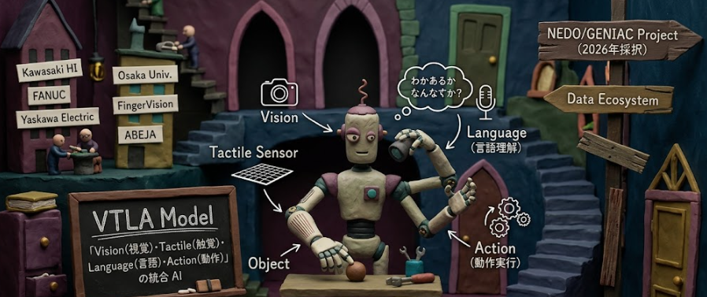
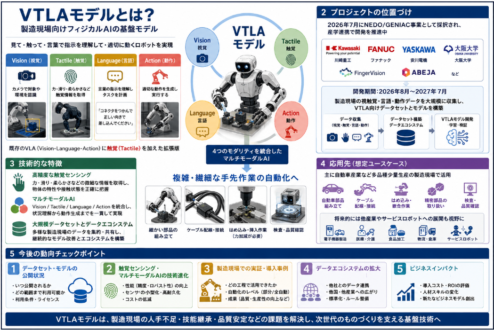

フィジカルAI関連で人を色んな意味で助ける物理AIの開発が、若干の期待先行で話題に上がっている今日この頃です。
そんな現時点でフィジカルAIの概念定義された**VTLA（Vision-Tactile-Language-Action）モデル**について調べてみました。

## 概念

### 1. VTLAモデルの概念が定義された時期

公開情報から読み取れる範囲では、**VTLA（Vision-Tactile-Language-Action）モデルの概念が公式に定義されたのは、2026年7月に公表されたNEDO/GENIACプロジェクトの採択発表時**と考えられます。
ですので、本当につい最近概念定義されました。

- プロジェクト名は  **「製造現場視触覚データ収集によるVTLA基盤モデルに向けたデータセットの構築」** であり、2026年7月2日頃に複数社・大学のリリースとして公表されています[PR TIMES](https://prtimes.jp/main/html/rd/p/000000031.000095912.html)。

- このリリースの中で、  
  「視覚（Vision）、触覚（Tactile）、言語（Language）、動作（Action）のデータを統合的に扱う『VTLAモデル』を開発する」  
  と明記されており、**VTLAという名称と概念が公式に定義された**と見なせます[PR TIMES](https://prtimes.jp/main/html/rd/p/000000031.000095912.html)。

- 実施期間は**2026年8月〜2027年7月（予定）**とされており、概念定義とプロジェクト開始がほぼ同時期であることが分かります[PR TIMES](https://prtimes.jp/main/html/rd/p/000000031.000095912.html)。

### 2. 概念定義を主導した組織

VTLAモデルの概念は、**単独の組織ではなく、複数の企業・大学が連携して主導した**ものです。

主な参加・主導組織は以下の通りです。

- **ロボットメーカー3社**  
  - 川崎重工業株式会社  
  - ファナック株式会社  
  - 株式会社安川電機  

- **大学・研究機関**  
  - 国立大学法人大阪大学（原田研介教授ら）  
  - 国立研究開発法人産業技術総合研究所（産総研）  
  - 国立大学法人東海国立大学機構 名古屋大学  

- **センシング・IT企業**  
  - 株式会社FingerVision（視触覚センサ技術）  
  - 株式会社ABEJA（データセット設計・データエコシステム設計）  

これらが連携し、経済産業省・NEDOの補助事業  
**「ポスト5G情報通信システム基盤強化研究開発事業／GENIAC」**に  
「製造現場視触覚データ収集によるVTLA基盤モデルに向けたデータセットの構築」を提案し、採択されました[PR TIMES](https://prtimes.jp/main/html/rd/p/000000031.000095912.html)。

このプロジェクトの中で、  
- ロボットメーカー3社が**製造現場・ロボットハードウェア**の知見を提供し、  
- 大学・研究機関が**視触覚センシング・AIモデル設計**の研究を担い、  
- ABEJAなどが**データセット設計・データエコシステム構築**を担当する、  
という形で、**VTLAモデルの概念と基盤技術を共同で定義・主導**しています。

## 定義

VTLAモデルは、**「Vision（視覚）・Tactile（触覚）・Language（言語）・Action（動作）の4種類の情報を統合的に扱う、製造現場向けフィジカルAIの基盤モデル」** として定義されています[PR TIMES](https://prtimes.jp/main/html/rd/p/000000031.000095912.html)。

以下、定義の内容と「どこに存在し、何を行うか」を整理します。

### 1. VTLAモデルの具体的な定義内容

__(1) モデルの構成要素（入力）__

VTLAモデルは、次の4つのモダリティ（情報の種類）を**統合的に扱う**ことを前提に設計されています。

- **Vision（視覚）**  
  製造現場のカメラ映像やロボット搭載カメラから得られる画像情報。  
  例：部品の位置・形状・向き、作業台の状態、周囲の環境。

- **Tactile（触覚）**  
  ロボットハンドに搭載された触覚センサ（例：FingerVisionなど）からの情報。  
  例：つかんでいる力の大きさ、滑り具合、柔らかさ・硬さ、表面のざらつき。

- **Language（言語）**  
  作業指示書・マニュアル・音声コマンドなどのテキスト・言語情報。  
  例：「A部品をB部品にはめ込む」「締め付けトルクはX Nm」「この順番で組み立てる」。

- **Action（動作）**  
  ロボットアーム・ハンドの実際の動き（関節角度・速度・力制御など）のデータ。  
  例：過去の熟練作業者の動作軌跡、ロボットの試行錯誤データ。

これらを**一つのAIモデル内で統合的に扱う**ことで、  
「見て・触って・言葉で指示を理解して・適切に動く」という  
人間の熟練作業者に近い振る舞いをAI・ロボットに実現しようとしています[PR TIMES](https://prtimes.jp/main/html/rd/p/000000031.000095912.html)。

__(2) モデルの役割（出力・目的）__

VTLAモデルの主な役割は、**複雑かつ繊細な手先作業の自動化・デジタル化**です。

- **入力**：Vision/Tactile/Language/Actionのデータ  
- **出力**：ロボットの動作計画・制御信号（Action）  
- **目的**：  
  - 細かい部品の組み立て  
  - 柔らかいケーブル・配線の取り回し  
  - 微妙な力加減が必要なはめ込み・締め付け  
  - 多品種少量生産に対応する柔軟な作業切替  

といった、従来のロボットでは自動化が難しかった領域を対象にしています[PR TIMES](https://prtimes.jp/main/html/rd/p/000000031.000095912.html)。

### 2. モデルはどこに存在し、何を行うか

__(1) モデルの「存在場所」__

現時点のプロジェクトでは、VTLAモデルは **「研究開発中の基盤モデル」** として存在しています。

- **物理的な場所**  
  - ロボットメーカー（川崎重工・ファナック・安川電機）の研究開発拠点  
  - 大阪大学・産総研・名古屋大学などの研究室  
  - ABEJAなどのクラウド・AI基盤上  

といった環境で、**AIモデルとして実装・学習・評価**されています。

- **データの流れ**  
  1. 製造現場のロボット・センサから  
     Vision/Tactile/Language/Actionデータを収集  
  2. それをVTLAモデル向けにラベル付け・整形  
  3. VTLAモデルを学習・推論  
  4. 推論結果（Action）をロボットに送り、実際の作業を実行  

という形で、**現場のロボットとクラウド上のAI基盤の間を行き来する**存在です。

__(2) モデルが「何を行うか」__

VTLAモデルは、**製造現場のロボットが「高度な手先作業」を自律的に行うための「頭脳」** として機能します。

具体的には、次のようなことを行います。

- **状況認識**  
  VisionとTactileから、「今どんな部品を、どのような状態でつかんでいるか」を認識します。

- **指示理解**  
  Languageから、「次に何をすべきか」「どのような品質で行うべきか」を理解します。

- **動作生成**  
  上記の情報を統合し、  
  「どのような軌道・速度・力で動けば、安全かつ正確に作業できるか」を計算し、  
  ロボットのAction（動作）を生成します。

- **学習・改善**  
  実際の作業結果（成功・失敗）のデータを再びVTLAモデルにフィードバックし、  
  継続的に性能を向上させます。

## コア技術

VTLAモデルを実現するには、**AIモデル技術・ロボット制御技術・データ基盤技術**の3つの側面で、それぞれコアとなる技術が必要になります。

### 1. AIモデル側のコア技術

__(1) マルチモーダルAI（Vision/Tactile/Language/Actionの統合）__

- **マルチモーダル融合**  
  Vision（画像）、Tactile（触覚センサ）、Language（テキスト）、Action（動作軌跡）という  
  異なる種類の情報を**一つのモデル内で統合的に扱う**技術が必要です。

- **共通表現空間の学習**  
  画像・触覚・言語・動作を、同じ「意味空間」に埋め込むことで、  
  「見たもの」「触った感覚」「指示された言葉」「行うべき動作」を  
  一貫して理解・生成できるようにする技術です。

- **基盤モデル（Foundation Model）アーキテクチャ**  
  大規模な事前学習を行い、多様なタスクに汎用的に対応できる  
  Transformer系のマルチモーダル基盤モデル技術が基盤になります[JST CRDS 俯瞰報告書](https://www.jst.go.jp/crds/pdf/CRDS-FR-S/CRDS-FR-S102-202602.pdf)。

__(2) ロボット向けVLA/VTLAモデルの学習・推論__

- **模倣学習（Imitation Learning）**  
  熟練作業者の動作データ（Vision/Tactile/Action）を模倣して、  
  ロボットに同じ動作を学習させる技術。

- **強化学習（Reinforcement Learning）**  
  実際の作業結果（成功・失敗）から報酬を設計し、  
  試行錯誤を通じて動作を改善する技術。  
  VLAモデル向けの強化学習手法（例：RECAP）も重要です[JST CRDS 俯瞰報告書](https://www.jst.go.jp/crds/pdf/CRDS-FR-S/CRDS-FR-S102-202602.pdf)。

- **ポストトレーニング（事後学習）**  
  事前学習した基盤モデルを、特定の製造現場タスクに適応させるための  
  追加学習・微調整技術。

### 2. ロボット・センサ側のコア技術

__(1) 触覚センシング（Tactile）__

- **高分解能な触覚センサ**  
  ロボットハンドに搭載し、  
  「どれくらいの力でつかんでいるか」「滑っていないか」「柔らかさ・硬さ」などを  
  高精度に計測する技術。

- **視触覚センサ（Vision-based Tactile）**  
  画像処理で触覚情報を推定するタイプのセンサ（例：FingerVision）など、  
  視覚と触覚を組み合わせたセンシング技術も重要です[PR TIMES](https://prtimes.jp/main/html/rd/p/000000031.000095912.html)。

__(2) ロボット制御・動作生成__

- **高精度な動作計画・軌道生成**  
  マルチモーダルAIが出力した「意図」を、  
  実際のロボット関節角度・速度・トルクに変換する制御技術。

- **力制御・インピーダンス制御**  
  柔らかい部品やケーブルなど、力加減が重要な作業では、  
  位置だけでなく「力」を制御する技術が必須です。

- **Sim2Real（シミュレーション→実機転用）**  
  シミュレータ上で学習したモデルを、実機ロボットに転用する際の  
  ドメイン適応・キャリブレーション技術。

### 3. データ基盤・エコシステム側のコア技術

__(1) マルチモーダルデータセット構築__

- **大規模・高品質なデータ収集**  
  製造現場で、Vision/Tactile/Language/Actionを**同期して**長時間収集する技術。  
  川崎重工・ファナック・安川電機らは、まず**5000時間規模**のデータ収集を計画しています[日本経済新聞](https://www.nikkei.com/article/DGXZQOUC022Q40S6A700C2000000)。

- **アノテーション・ラベリング**  
  収集したデータに、「どの作業をしているか」「成功か失敗か」などの  
  ラベルを付与し、AIが学習できる形に整える技術。

__(2) データエコシステム・基盤__

- **データ仕様の共通化**  
  複数のロボットメーカー・センサメーカーが収集したデータを、  
  共通フォーマットで扱えるようにする標準化技術。

- **データ基盤・MLOps**  
  大規模データの保存・管理・バージョン管理、  
  モデル学習・評価・デプロイを一貫して行うMLOps基盤。

- **継続学習（Continual Learning）**  
  現場で得られた新しいデータを継続的にモデルに反映し、  
  性能を向上させ続ける仕組み。

## 従来技術との違い

VTLAモデルは、**既存のVLAモデル（Vision-Language-Action）に「Tactile（触覚）」を加えた拡張版**と捉えることができます。  
そのため、**必要な技術の違いは、主に「触覚情報の扱い」と「それに伴うマルチモーダル融合・ロボット制御の高度化」** に現れます。

以下、VLAモデルとVTLAモデルで必要な技術の違いを整理します。

### 1. モダリティの違い（何を扱うか）

__VLAモデル（Vision-Language-Action）__

- **Vision（視覚）**：カメラ画像  
- **Language（言語）**：テキスト指示・音声  
- **Action（動作）**：ロボットの関節角度・速度・トルクなど  

→ 基本的には「**見て・言葉を理解して・動く**」という3モダリティのモデルです。

__VTLAモデル（Vision-Tactile-Language-Action）__

- **Vision（視覚）**：カメラ画像  
- **Tactile（触覚）**：触覚センサ（力・滑り・柔らかさなど）  
- **Language（言語）**：テキスト指示・音声  
- **Action（動作）**：ロボットの動作＋力制御  

→ VLAに**Tactile（触覚）**が加わり、  
「**見て・触って・言葉を理解して・適切な力で動く**」という4モダリティのモデルになります[PR TIMES](https://prtimes.jp/main/html/rd/p/000000031.000095912.html)。

### 2. 必要となる技術の違い

__(1) センサ・ハードウェア技術__

**VLAモデルで主に必要なもの**

- カメラ（RGB / RGB-D）  
- マイク・音声認識デバイス（音声指示の場合）  
- ロボットの関節エンコーダ・モータ制御系  

**VTLAモデルで追加で必要なもの**

- **高分解能な触覚センサ**  
  - 指先の圧力分布・滑り・表面性状を計測するセンサ  
  - 例：FingerVisionのような視触覚センサ[PR TIMES](https://prtimes.jp/main/html/rd/p/000000031.000095912.html)  
- **力覚センサ・トルクセンサ**  
  - ロボットアームやハンドに加わる力・トルクを計測  
- **センサ同期・キャリブレーション**  
  - VisionとTactileの時間・空間的な同期を取る技術  

→ VTLAでは、**「触れる」という感覚を数値化するセンサ技術**が必須になります。

__(2) マルチモーダルAI・モデル技術__

**VLAモデルで必要な技術**

- Vision-Languageのマルチモーダル融合  
  - 画像とテキストを共通表現空間に埋め込む  
- Action予測（ポリシー学習）  
  - 画像と言語から、ロボットの動作を生成するモデル  
- 模倣学習・強化学習（VLA向けRL）  
  - 例：π0、Gemini Roboticsなど[JST CRDS 俯瞰報告書](https://www.jst.go.jp/crds/pdf/CRDS-FR-S/CRDS-FR-S102-202602.pdf)  

**VTLAモデルで追加・高度化が必要な技術**

- **Vision-Tactile-Language-Actionの4モダリティ統合**  
  - VisionとTactileの情報を統合して「触っている状態」を理解  
  - Languageと組み合わせて、「どのように触るべきか」を指示  
- **触覚情報の表現学習**  
  - 触覚データは画像やテキストに比べて高次元・ノイジーになりがち  
  - 圧力分布・滑り・振動などを効率的に表現する特徴抽出技術  
- **接触を伴う操作（contact-rich manipulation）のモデリング**  
  - 部品同士が接触する際の物理的挙動をAIが理解する必要がある  
  - 物理シミュレーションと実機データの統合（Sim2Real）がより重要  

→ VTLAでは、**「触覚」という新しいモダリティをどう扱うか**が技術的な焦点になります。

__(3) ロボット制御・動作生成技術__

**VLAモデルで主に必要なもの**

- 画像と言語から、**位置ベースの動作計画**を生成  
- 把持位置・移動経路の決定  

**VTLAモデルで追加・高度化が必要なもの**

- **力制御・インピーダンス制御**  
  - 柔らかい部品やケーブルなど、力加減が重要な作業では、  
    位置だけでなく「どのくらいの力で押す・引く・はめ込むか」を制御  
- **滑り検知・補正**  
  - Tactile情報から「滑っている」ことを検知し、  
    把持力や姿勢をリアルタイムで調整  
- **接触リッチな操作（contact-rich manipulation）**  
  - 両手を使った複雑な操作や、接触を伴う組み立て作業に対応する  
    高度な動作計画・制御技術  

→ VTLAでは、**「触っている感覚」を活かした、より繊細な力制御**が求められます。

__(4) データセット・学習基盤__

**VLAモデル**

- 画像＋テキスト指示＋ロボット動作のデータセット  
- 例：OXEデータセット、各社の独自データセット[JST CRDS 俯瞰報告書](https://www.jst.go.jp/crds/pdf/CRDS-FR-S/CRDS-FR-S102-202602.pdf)  

**VTLAモデル**

- **Vision/Tactile/Language/Actionを同期して収集した大規模データセット**  
  - 製造現場で5000時間規模のデータ収集を計画[日本経済新聞](https://www.nikkei.com/article/DGXZQOUC022Q40S6A700C2000000)  
- **触覚データのアノテーション・ラベリング**  
  - 「どのような触り方をしたか」「成功か失敗か」をラベル付け  
- **複数ロボット・複数センサからのデータ統合**  
  - 川崎重工・ファナック・安川電機など、異なるロボットからのデータを  
    共通フォーマットで扱うデータエコシステム構築[PR TIMES](https://prtimes.jp/main/html/rd/p/000000031.000095912.html)  

→ VTLAでは、**触覚を含む4モダリティのデータを大規模に収集・整備する技術**が大きな課題になります。

## 期待される適用先

VTLAモデルの応用先は、**「製造現場における複雑かつ繊細な手先作業の自動化」** を中心に、自動車産業など多品種少量生産の現場での活用が想定されています。

以下、引用元を明示しながら整理します。

### 1. 主な応用先：製造現場の高度な手先作業の自動化

NEDOのGENIAC事業資料では、VTLA向けデータセットとモデルが、**自動車産業など多品種少量生産の製造現場**で活用されることが示されています。

> 「多品種少量生産 自動車産業 … データホルダー：安川電機製ロボット、川崎重工業製ロボット、ファナック製ロボット … VTLA向けマルチモーダルデータセット（ロボット操作に関する視覚・触覚・行動データセット） … 製造現場向けVTLAモデル …」  
> ― NEDO事業資料「製造現場視触覚データ収集によるVTLA基盤モデルに向けたデータセットの構築」[NEDO](https://www.nedo.go.jp/content/800057700.pdf)

また、プロジェクトの公式リリースでは、次のように記載されています。

> 「VTLAモデルに適したデータセットの設計・収集・蓄積を行い、データエコシステムの構築することで、**これまで困難であった複雑かつ繊細な手先作業の自動化**などを実現します。」  
> ― PR TIMES「製造現場視触覚データ収集によるVTLA基盤モデルに向けたデータセットの構築」[PR TIMES](https://prtimes.jp/main/html/rd/p/000000031.000095912.html)

ここから読み取れる応用先・想定作業は、例えば以下のようなものです。

- **自動車・機械部品の組み立て**  
  - エンジン周り・ギアボックス・サスペンションなどの複雑な組み立て作業  
  - ねじ締め・はめ込み・配線接続など、力加減や接触が重要な作業

- **電子部品・基板の組み立て**  
  - 微細なコネクタ・ケーブルの取り付け  
  - 柔らかいケーブル・配線の取り回し

- **多品種少量生産ライン**  
  - ロットサイズが小さく、頻繁に品種が変わる現場での柔軟な自動化  
  - 熟練作業者に依存していた「調整作業」「微調整」の自動化

### 2. 想定される具体的な作業内容

NEDO資料や関連ニュースから、VTLAモデルが想定している具体的な作業の特徴は次のように整理できます。

- **複雑かつ繊細な手先作業**  
  - 細かい部品の組み立て  
  - 柔らかいケーブル・配線の取り回し  
  - 微妙な力加減が必要なはめ込み・締め付け作業  

> 「これまで困難であった**複雑かつ繊細な手先作業の自動化**などを実現します。」  
> ― PR TIMES[PR TIMES](https://prtimes.jp/main/html/rd/p/000000031.000095912.html)

- **触覚・力覚を要する作業**  
  - 触覚や力覚などの非視覚情報を含む高度作業のデジタル化・自動化  

> 「触覚や力覚などの非視覚情報を含めた作業へのAI活用による自動化の実現が期待されています。」  
> ― PR TIMES[PR TIMES](https://prtimes.jp/main/html/rd/p/000000031.000095912.html)

- **多品種少量生産への対応**  
  - 自動車産業など、多品種少量生産が一般的な業種でのロボット活用  

> 「多品種少量生産 自動車産業 … 製造現場向けVTLAモデル …」  
> ― NEDO事業資料[NEDO](https://www.nedo.go.jp/content/800057700.pdf)

### 3. 中長期的な応用の広がり

プロジェクトの目的として、**ロボット業界全体を巻き込んだデータエコシステムの構築**も掲げられています。

> 「本事業後も、構築したデータセットによるVTLAモデルを今後本格化し、**ロボット業界全体を巻き込んだデータエコシステムの構築**も目指す」  
> ― NEDO事業資料[NEDO](https://www.nedo.go.jp/content/800057700.pdf)

これにより、将来的には以下のような応用展開も想定されます。

- **他産業への展開**  
  - 家電・電子機器の組み立て  
  - 食品・医薬品の包装・検査作業  
  - 物流・倉庫内でのピッキング・仕分け

- **ヒト型ロボット・サービスロボットへの応用**  
  - 家庭内での家事支援（食器の片付け、洗濯物のたたみなど）  
  - 介護・医療現場での補助作業

ただし、現時点で公式に明示されている応用先は、**主に製造現場（特に自動車産業など多品種少量生産の現場）での高度な手先作業の自動化**です。

## 総括

### 1. VTLAモデルとは
- **Vision（視覚）・Tactile（触覚）・Language（言語）・Action（動作）** の4つを統合した、**製造現場向けフィジカルAIの基盤モデル**です[PR TIMES](https://prtimes.jp/main/html/rd/p/000000031.000095912.html)。
- 既存のVLA（Vision-Language-Action）モデルに**触覚**を加えた拡張版で、  
  「見て・触って・言葉で指示を理解して・適切に動く」ロボットを目指します。

### 2. プロジェクトの位置づけ
- 2026年7月にNEDO/GENIAC事業として採択され、  
  川崎重工・ファナック・安川電機・大阪大学・FingerVision・ABEJAなどが連携して**開発中**です[PR TIMES](https://prtimes.jp/main/html/rd/p/000000031.000095912.html)。
- 2026年8月〜2027年7月の期間で、**製造現場の視触覚・言語・動作データを大規模に収集し、VTLA向けデータセットとモデルを構築**する計画です[NEDO](https://www.nedo.go.jp/content/800057700.pdf)。

### 3. 技術的な特徴
- **触覚センサ（力・滑り・柔らかさなど）**を前提としたマルチモーダルAI。  
- Vision/Tactile/Language/Actionを統合し、**複雑・繊細な手先作業**の自動化を狙います[PR TIMES](https://prtimes.jp/main/html/rd/p/000000031.000095912.html)。
- 大規模なデータセットと**データエコシステム**が基盤になります。

### 4. 応用先
- 主に**自動車産業など多品種少量生産の製造現場**で、  
  細かい部品組み立て・ケーブル配線・力加減が必要なはめ込み作業などの自動化を想定[NEDO](https://www.nedo.go.jp/content/800057700.pdf)。
- 将来的には他産業やサービスロボットへの展開も視野に入れています。

### 5. 今度気になること
プロジェクトが順調に進むかは、しっかりと確認しておくべきです。
その上で現時点の要素技術の完成度も要チェックといったところでしょうか。
データが集まるかは、AIのインフラ基盤と同様に重要です。
最期にお金に出来るか。

1. **データセット・モデルの公開状況**（いつ・どの範囲で使えるか）  
2. **触覚センシング・マルチモーダルAIの技術進化**（性能・コスト）  
3. **製造現場での実証・導入事例**（どの工程でどの程度自動化できたか）  
4. **データエコシステムの拡大**（他社・他国・他産業への広がり）  
5. **ビジネスインパクト**（導入コスト・ROI・人材スキルの変化）

