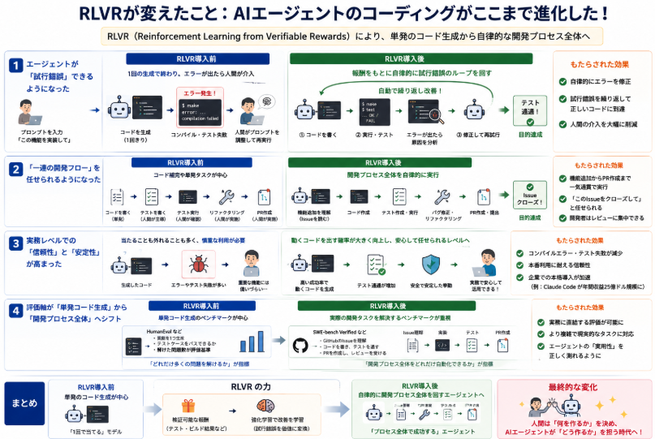

ここ1年程度でコーディングをAIエージェントでゼロから作成し、完成させるコーディング生成エージェントの完成度が向上しました。
本日はそんなコーディング生成エージェントについて話していこうと思います。

## コーディング生成エージェントとは

「コーディング生成エージェント」とは、**LLM（大規模言語モデル）を中核としたAIが、単にコードを書くだけでなく、コンパイル・テスト・デバッグ・リファクタリングなど、開発作業の一連の流れを自律的に進める仕組み**を指します。

### コーディング生成エージェントとは

通常の「コード生成モデル」は、ユーザーがプロンプトで「〇〇の関数を書いて」と指示すると、その関数のコードを返すだけです。  
一方、**コーディング生成エージェント**は、次のような特徴があります。

1. **環境との連携**  
   - ローカルやクラウド上の開発環境（エディタ、ターミナル、CI環境など）と接続し、  
   - 実際にコードを書き、ビルドし、テストを実行して結果を確認します。

2. **一連の作業を自律的に進める**  
   - 「この機能を追加して」といった高レベルの指示に対し、  
     - 必要なファイルを開く  
     - コードを追加・修正する  
     - テストを書いて実行する  
     - エラーが出たらデバッグする  
     といった一連のステップを、エージェントが自動で進めます。

3. **フィードバックループを持つ**  
   - コンパイルエラーやテスト失敗を検知すると、  
   - 自動的にコードを修正して再試行する、といった「試行錯誤」を行います。

つまり、**「コードを書くAI」から「開発作業を代行するAI」へ進化したもの**が、コーディング生成エージェントです。

### なぜ注目されたのか

この分野が大きく注目された理由は、おおむね次の3点です。

__1. 実務レベルでの「使える」コード生成が可能になった__

2025年後半〜2026年初頭にかけて、OpenAI と Anthropic が **Reinforcement Learning from Verifiable Rewards（RLVR）** を用いてコード生成を強化し、  
- コンパイルが通る  
- テストが通る  
- 仕様を満たす  
コードを出す確率が大きく向上しました[Simon Willison](https://simonwillison.net/2026/may/19/5-minute-llms)。

その結果、**「実験的なおもちゃ」から「日常的に使える実務ツール」に変わった**と評価され、多くの開発者が実際のプロジェクトで使い始めました[Simon Willison](https://simonwillison.net/2026/may/19/5-minute-llms)。

__2. 開発生産性へのインパクトが大きい__

- 単なる「補完」ではなく、**機能追加やリファクタリングを丸ごと任せられる**ようになったことで、  
- 開発スピードや保守性の向上が期待され、企業導入も加速しました。

実際、Anthropic の Claude Code は年間収益25億ドル規模に達したと報じられており、企業での本格導入が進んでいることがうかがえます[Augusto Digital](https://augusto.digital/insights/blogs/monthly-llm-news-june-2026)。

__3. 「AIエージェント」全体の象徴的な応用例__

コーディングは、  
- 目標が明確（テストで成功/失敗が判定できる）  
- 環境とのインタラクションが自動化しやすい  
- 成果が経済的価値に直結する  

という特徴から、**AIエージェント技術の「象徴的な成功事例」** になりました。  
そのため、コーディング生成エージェントの進歩が、他の分野（事務作業、サポート、研究支援など）のエージェント化にも影響を与えています。

### いつ頃から研究・実用化が盛んになったか

__研究の芽生え（〜2023年頃）__

- 2020年頃から、GitHub Copilot のような「コード補完」ツールはすでに存在していましたが、  
- 当時は「エージェント」というより「高度な補完」に近い位置づけでした。

__本格的なエージェント化の始まり（2024〜2025年頃）__

- OpenAI の **Code Interpreter**（後の Advanced Data Analysis）や、  
- Anthropic の **Claude Code** などが登場し、  
- 「コードを実行して結果を見る」というステップが組み込まれ始めました。

この時期には、  
- 研究コミュニティでも「LLM＋ツール呼び出し」によるエージェント構築が活発になり、  
- SWE‑bench などの「実際のGitHub Issueを解決する」ベンチマークが注目されました。

__実用レベルへの到達（2025年11月〜2026年5月頃）__

Simon Willison のまとめによると、**2025年11月頃を「転換点」として、コーディングエージェントが本当に使えるようになった**とされています[Simon Willison](https://simonwillison.net/2026/may/19/5-minute-llms)。

- OpenAI と Anthropic が RLVR を導入し、  
- コード生成の正確性とエージェントとしての安定性が大きく向上したことで、  
- 多くの開発者が「日常的にプロジェクトで使える」と感じ始めた、と報じられています[Simon Willison](https://simonwillison.net/2026/may/19/5-minute-llms)。

この時期以降、  
- 「コーディングエージェントが実務レベルに到達した」  
- 「ローカルLLMが予想以上に強くなった」  
という2つのテーマが、LLM分野の大きなニュースとして繰り返し取り上げられるようになりました[Simon Willison](https://simonwillison.net/2026/may/19/5-minute-llms)。

## RLVR

コーディング生成エージェントの完成度が高まるきっかけとなった **RLVR(Reinforcement Learning from Verifiable Rewards)** について概要を説明していきます。

### ニュースの概要

2025年11月〜2026年5月頃にかけて、**OpenAI と Anthropic がRLVRという手法を用いて、コード生成エージェントの性能を大きく向上させた**という動向が、AIコミュニティで大きな話題になりました[Simon Willison](https://simonwillison.net/2026/may/19/5-minute-llms)。

- OpenAI は GPT‑5.1 系モデル（特に GPT‑5.1 Codex Max など）と、そのコード実行環境（Codex エージェント）に対して RLVR を適用し、  
- Anthropic は Claude Sonnet 4.5 / Opus 4.5 と Claude Code エージェントに対して同様の手法を適用しました。

その結果、**コード生成エージェントが「実験的なおもちゃ」から「日常的に使える実務ツール」に変わった**と評価されています[Simon Willison](https://simonwillison.net/2026/may/19/5-minute-llms)。

### RLVR とは何か

**RLVR** は、ざっくり言うと、

> 「**生成したコードを実際にコンパイル・テストして、その結果（成功/失敗）を報酬として強化学習に使う**」

というアプローチです。

- 従来の RLHF（人間のフィードバックによる強化学習）では、  
  「このコードは良い／悪い」を人間が評価する必要があり、スケールが難しい面がありました。
- RLVR では、**自動テストやビルド結果など、機械的に検証可能な報酬**を使うため、大量の試行を高速に回せます。

これにより、モデルは「**コンパイルが通る・テストが通る・仕様を満たす**」コードを生成する方向に、より効率的に学習できるようになりました[Simon Willison](https://simonwillison.net/2026/may/19/5-minute-llms)。

### 何が「大きく向上」したのか

Simon Willison のまとめによると、この RLVR の導入によって、特に次の点が大きく改善されたとされています[Simon Willison](https://simonwillison.net/2026/may/19/5-minute-llms)。

1. **コードの正確性・信頼性の向上**  
   - コンパイルエラーやランタイムエラーが減り、  
   - 仕様どおりに動くコードを出す確率が高くなった。

2. **エージェントとしての実用性の向上**  
   - コードを書くだけでなく、  
     - テストを書く  
     - バグを修正する  
     - リファクタリングする  
     といった一連の作業を、エージェントが自律的にこなせるようになった。

3. **「コーディングエージェントが本当に使えるようになった」という認識の転換**  
   - 2025年11月頃を境に、Claude Code や OpenAI のコードエージェントが、  
     「日常的にプロジェクトで使えるレベル」に到達したと多くの開発者が感じ始めた、と報じられています[Simon Willison](https://simonwillison.net/2026/may/19/5-minute-llms)。

### インパクトとその後

この改善は、単に「ベンチマークスコアが上がった」という話ではなく、

- **エンジニアの日常業務にAIが組み込まれる速度が一気に上がった**  
- Anthropic の Claude Code が年間収益25億ドル規模に達した、という企業導入の加速にもつながっています[Augusto Digital](https://augusto.digital/insights/blogs/monthly-llm-news-june-2026)。

また、この時期には「**コーディングエージェントが本当に使えるようになった**」ことと「**ローカルで動くオープンウェイトモデルが予想以上に強くなった**」ことが、LLM分野の2大テーマとして繰り返し言及されています[Simon Willison](https://simonwillison.net/2026/may/19/5-minute-llms)。

### 補足：このニュースの位置づけ

- このニュースは、**2026年5月時点での「直近6ヶ月のLLM動向」をまとめた記事**の中で、特に強調されているトピックの一つです[Simon Willison](https://simonwillison.net/2026/may/19/5-minute-llms)。
- 具体的な技術論文や実装詳細よりも、「**RLVR によってコード生成エージェントが実務レベルに到達した**」というマクロな変化として語られています。

## RLVRが変えたこと

AIエージェントのコーディングにおいて、RLVR（Reinforcement Learning from Verifiable Rewards）がもたらした最大の変化は、**「単発のコード生成」から「自律的な開発プロセス全体を回すエージェント」への進化**です。

具体的には、次のような面で違いが出ています。

### エージェントが「試行錯誤」できるようになった

**RLVR導入前**
- エージェントは「1回のプロンプトでコードを出す」ことが多く、
- コンパイルエラーやテスト失敗が出ると、人間がプロンプトを調整して再実行する必要がありました。

**RLVR導入後**
- RLVR では、**コンパイル・テスト・ビルド結果などを報酬として強化学習**に使うため、
- エージェントは
  - コードを書く
  - 実行する
  - エラーが出たら自動で修正する
  という**試行錯誤のループを自律的に回せる**ようになりました[Simon Willison](https://simonwillison.net/2026/may/19/5-minute-llms)。

これにより、
- 「このIssueを解決して」と指示するだけで、  
  エージェントがPRを作るまでを自動でやってくれる、
- バグ修正やリファクタリングを「丸投げ」できる、
といった**エージェントとしての実用性**が大きく向上しました。

### 「一連の開発フロー」を任せられるようになった

**RLVR導入前**
- 多くのツールは「コード補完」や「単発の関数生成」が中心で、
- テストを書く・リファクタリングする・PRを作るといった「一連の作業」は、人間が主導していました。

**RLVR導入後**
- RLVR によって、**「テストが通る」「仕様を満たす」といった検証可能な報酬**を大量に使って学習できるようになり、
- エージェントは
  - 機能追加
  - テスト作成・実行
  - バグ修正
  - リファクタリング
  といった**開発プロセス全体を自律的に進められる**ようになりました[Simon Willison](https://simonwillison.net/2026/may/19/5-minute-llms)。

その結果、
- 「このIssueをクローズするまでやっておいて」と任せられるようになり、
- 開発者は「何をやるか」を指示し、「結果をレビューする」立場にシフトしつつあります。

### 実務レベルでの「信頼性」と「安定性」が高まった

**RLVR導入前**
- コード生成は「当たることもあれば外れることもある」という印象が強く、
- 重要な機能や本番コードには慎重に使う傾向がありました。

**RLVR導入後**
- RLVR によって、**「動くコードを出す確率」が大きく向上**し、
- コンパイルエラーやテスト失敗が減ったことで、
- 開発者が「安心して任せられる」と感じるレベルに近づいた、と評価されています[Simon Willison](https://simonwillison.net/2026/may/19/5-minute-llms)。

この信頼性の向上が、企業での本格導入（例：Anthropic の Claude Code が年間収益25億ドル規模に達したという報告[Augusto Digital](https://augusto.digital/insights/blogs/monthly-llm-news-june-2026)）につながっています。

### 評価軸が「単発コード生成」から「開発プロセス全体」へシフト

**RLVR導入前**
- HumanEval などの「単発コード生成」ベンチマークが中心で、
- 「どれだけ多くの問題を解けるか」が主な評価軸でした。

**RLVR導入後**
- SWE‑bench Verified など、**実際のGitHub Issueを解決する**ベンチマークが重視されるようになり、
- 「Issueを理解 → コードを書く → テストを通す → PRを作る」という**一連の開発フローをどれだけ自動化できるか**が、重要な指標になりました[Simon Willison](https://simonwillison.net/2026/may/19/5-minute-llms)。

RLVR は、まさにこの「一連のフローを成功させる」ための学習を可能にしたため、  
**「単発のコード生成能力」から「開発プロセス全体を回す能力」へ**と、評価軸がシフトするきっかけになりました。

## 総括

AIが「自律的に試行錯誤する」能力を持つようになったことで、AIは **「一度の指示で完璧な答えを出す存在」から「失敗しても自分で修正しながらゴールに近づく存在」** へと進化しました。

この能力がAIに与えた影響を、総括的にまとめると次のようになります。

### 問題解決能力の「深さ」と「広がり」が増した

**従来のAI（単発生成）**
- 1回のプロンプトに対して1つの回答を出す。
- 間違えたら人間がプロンプトを調整して再実行する必要がある。

**自律的に試行錯誤するAI**
- 自分で仮説を立て、実行し、結果を評価し、仮説を修正するループを回せる。
- これにより、
  - 複雑な問題（例：バグ修正、仕様変更、長いプロジェクト）を**段階的に解決**できる。
  - 人間が細かく指示しなくても、**ゴールに向かって自律的に進む**ことができる。

この結果、AIは「**深い推論が必要なタスク**」や「**長いプロセスを伴うタスク**」でも、人間の補助なしに取り組めるようになりました。

### 実世界とのインタラクション能力が高まった

**従来のAI**
- 主にテキストの世界で完結し、実世界の環境（コード実行環境、ツール、APIなど）と直接やり取りすることは限定的でした。

**自律的に試行錯誤するAI**
- 実際にコードを実行し、エラーを読み取り、修正を試みる。
- ツールやAPIを呼び出し、結果を見て次の行動を決める。
- これにより、
  - **実世界のフィードバック（コンパイルエラー、テスト失敗、APIレスポンスなど）** を学習に活かせる。
  - 「机上の理論」ではなく、「実際に動くかどうか」を基準に行動できる。

この変化によって、AIは**テキスト生成ツールから「実世界と対話するエージェント」** へと進化しました。

### 学習効率と汎用性の向上

**従来のAI**
- 主に事前学習（プリトレーニング）と人間のフィードバック（RLHF）に依存。
- 新しいタスクや環境に適応するには、人間が大量の例やフィードバックを用意する必要があった。

**自律的に試行錯誤するAI**
- 自分で試行錯誤しながら、**検証可能な報酬（テストが通る、ビルドが成功するなど）** を使って学習できる。
- これにより、
  - 人間が細かく教えなくても、**環境から直接学べる**。
  - 新しいツールやフレームワークにも、試行錯誤を通じて適応しやすくなる。

RLVR（Reinforcement Learning from Verifiable Rewards）は、まさにこの「検証可能な報酬」を使った学習を可能にし、コーディングエージェントの性能を大きく向上させました[Simon Willison](https://simonwillison.net/2026/may/19/5-minute-llms)。

### 人間との役割分担の変化

**従来のAI**
- 人間が「何をやるか」「どうやるか」を細かく指示し、AIはその一部を補助する立場。

**自律的に試行錯誤するAI**
- 人間が「ゴール」や「制約」を設定し、AIが**そこに至るまでのプロセスを自律的に設計・実行**する。
- これにより、
  - 人間は「戦略的な指示」や「最終的なレビュー」に集中できる。
  - AIは「戦術的な試行錯誤」や「細かい調整」を担当する。

この役割分担の変化が、コーディングエージェントの実用化（例：Claude Code が年間収益25億ドル規模に達したという報告[Augusto Digital](https://augusto.digital/insights/blogs/monthly-llm-news-june-2026)）につながっています。

### 評価軸のシフト：単発精度から「プロセス全体の成功率」へ

**従来のAI**
- HumanEval などの「単発コード生成」ベンチマークが中心。
- 「どれだけ多くの問題を1回で解けるか」が主な評価軸。

**自律的に試行錯誤するAI**
- SWE‑bench Verified など、**実際のGitHub Issueを解決する**ベンチマークが重視されるようになり、
- 「Issueを理解 → コードを書く → テストを通す → PRを作る」という**一連の開発フローをどれだけ自動化できるか**が、重要な指標になりました[Simon Willison](https://simonwillison.net/2026/may/19/5-minute-llms)。

この変化は、AIが **「単発の正解率」ではなく「プロセス全体を回す能力」** で評価されるようになったことを意味します。

### AIに与えられた「新しい能力」とは

AIが自律的に試行錯誤する能力を獲得したことで、AIは次のような「新しい能力」を持つようになりました。

1. **自己修正能力**  
   → エラーや失敗を検知し、自分で仮説を修正して再挑戦できる。

2. **段階的解決能力**  
   → 複雑な問題を小さなステップに分解し、順番に解決しながらゴールに近づける。

3. **環境適応能力**  
   → 実世界のフィードバック（コンパイル結果、テスト結果、APIレスポンスなど）から学び、新しい環境やツールに適応できる。

4. **プロセス設計能力**  
   → 「何をどの順番でやるか」を自分で決め、一連の作業フローを自律的に回せる。

5. **人間との協調能力**  
   → 人間が高レベルの指示を出すだけで、細かい実行プロセスを任せられる「パートナー」として振る舞える。

これらが組み合わさり、**2025年11月〜2026年5月頃に「コーディングエージェントが実用レベルに到達した」**と評価される大きな転換点となったといえると思います[Simon Willison](https://simonwillison.net/2026/may/19/5-minute-llms)。

