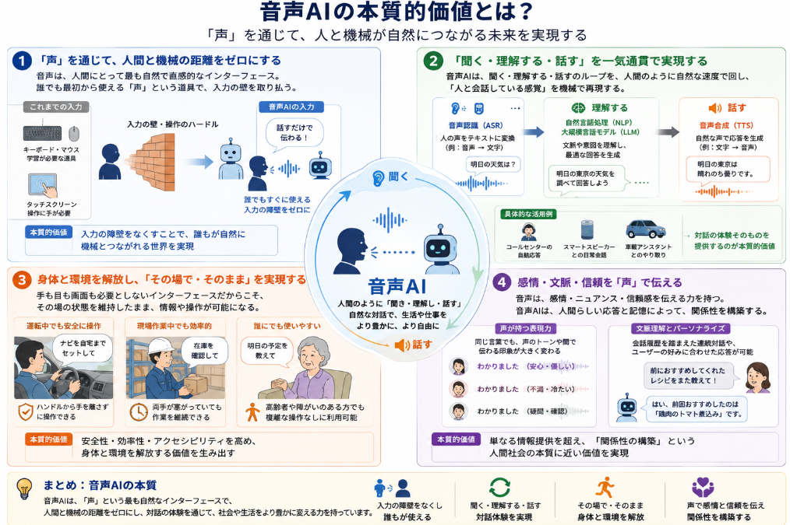

LLMの進展でどのモデルもマルチモーダルで画像の次に音声を機能として付与するようになりました。

ただし、あくまで付与されたというもので、ベースになる音声AIの技術はLLMとは別次元で進歩(お互いに影響を受けていた部分もあるかもしれませんが)してきました。

本日はそんな音声AIについて説明していきます。

## 音声AIとは

「音声AI」とは、**人間の音声をコンピューターが理解し、それに応じて自然な音声で応答したり、テキストから人間らしい音声を生成したりする技術の総称**です。

主に次のような技術で構成されています。

### 1. 音声認識（Speech Recognition / ASR）
- 人間が話した音声を、**テキスト（文字）に変換**する技術です。
- マイクから入った音声をデジタル信号に変換し、周波数や音素（あ・い・う…）を解析します。
- 近年は**ディープラーニング（深層学習）** を使ったモデルにより、雑音環境でも高い精度で認識できるようになっています[AIsmiley](https://aismiley.co.jp/ai_news/what-is-the-mechanism-of-voice-recognition-using-ai)。

### 2. 音声合成（Text-to-Speech: TTS）
- テキストを**自然な人間の声に変換**する技術です。
- 自然言語処理（NLP）で文の意味や構造を解析し、イントネーション・リズム・感情を調整しながら音声を生成します。
- Transformer や WaveNet などの深層学習モデルにより、**まるで人が話しているかのような音声**が作れるようになっています[ICD](https://www.icd.co.jp/solutions/voice-ai)。

### 3. 音声対話AI（Voice Conversation AI）
- 音声認識と音声合成を組み合わせ、**会話の流れを理解して応答する**技術です。
- 自然言語処理で文脈や意図をくみ取り、適切な返答を生成し、音声で返します。
- スマートスピーカーやコールセンターの自動応答システムなどで使われています[株式会社エーアイ](https://www.ai-j.jp/blog/ai/conversation-with-ai)。

### 4. ボイスクローニング（声の複製）
- 特定の人の声を学習し、**その人の声で別の文章を話させる**技術です。
- 声優やナレーターの声をAIで再現し、動画や広告のナレーションに使うケースが増えています[Crystal Method](https://crystal-method.com/blog/ai-voice)。

### 主な使われ方の例
- **スマートスピーカー・スマホアシスタント**（Siri, Google Assistant など）
- **コールセンターの自動応答**（ボイスボット）
- **動画・広告のナレーション自動生成**
- **会議の自動文字起こし・要約**
- **多言語通訳・翻訳**（音声を聞き取り、別言語で音声出力）

## 音声AIの経緯

音声AIが「日の目を見る」ようになった背景には、**LLM（大規模言語モデル）の爆発的な発展と、それに伴う自然言語処理・音声処理の研究シフト**が大きく関係しています。

以下では、音声AIの時系列と論文数推移を軸に、この分野がどうシフトしてきたかを整理します。

### 1. 音声AIの歴史的な流れ（時系列）

__① 2010年以前：統計モデル中心の音声認識__
- 音声認識は1970年代から研究されてきましたが、当時は**GMM-HMM（ガウス混合モデル＋隠れマルコフモデル）** などの統計的手法が主流でした[NTT技術ジャーナル](https://journal.ntt.co.jp/article/25744)。
- 認識精度は限定的で、特定の単語や短いフレーズに限定されることが多かった。

__② 2010年代前半：ディープラーニングの台頭__
- 2010年以降、**ディープラーニング（深層学習）** が画像認識・音声認識で急激に性能を向上させました。
- NEDOの分析によると、AI全体の論文数は2000年以降増加傾向にあり、**2006〜2009年に一度目のピーク、2011年以降に再び増加**という特徴的な推移をとっています[NEDO技術戦略研究センター](https://www.nedo.go.jp/content/100925160.pdf)。
- この「2011年以降の再増加」の背景には、ディープラーニングの本格的な活用があります。

__③ 2010年代後半：スマートスピーカー・Siriの普及__
- AppleのSiri（2011年）、Amazon Echo（2014年）など、**音声アシスタントが一般消費者向けに広がりました**[NTT技術ジャーナル](https://journal.ntt.co.jp/article/25744)。
- 音声認識は「研究室の技術」から「日常生活のツール」へとシフトし、研究・投資が加速しました。

__④ 2020年代前半：LLMブームと音声AIの統合__
- 2018年のBERT、2020年のGPT-3、2022年のChatGPTなど、**TransformerベースのLLMが爆発的に普及**しました。
- arXiv上のLLM関連論文は、2018〜2023年の間に**約1.7万件**に達し、計算機科学・統計学分野の全投稿の最大12%を占めるほど急増しています[AIDB](https://ai-data-base.com/archives/58006)。
- LLMは「言語モデル」として音声AIの**中核（言語理解・対話生成）** を担うようになり、音声認識・音声合成と組み合わせた「音声対話AI」が一気に実用化されました。

### 2. 論文数推移から見る「シフト」

__AI全体の論文数推移（NEDOレポートより）__
- AI関連論文は**2000年以降一貫して増加**し、2006〜2009年に一度目のピーク、2011年以降に再増加という特徴的な動きをしています[NEDO技術戦略研究センター](https://www.nedo.go.jp/content/100925160.pdf)。
- 技術分野別では、日本は**音声認識とロボティクス**の比率が高く、2014〜2019年の音声認識論文シェアでは**米国（40.4%）に次いで日本が2位（11.9%）**と、音声認識に強みを持つことが示されています[NEDO技術戦略研究センター](https://www.nedo.go.jp/content/100925160.pdf)。

__LLM論文数の急増（arXivベース）__
- arXiv上のLLM関連論文は2018年以降急増し、2023年には**16,979件**に達しています[AIDB](https://ai-data-base.com/archives/58006)。
- 2023年第2四半期には、計算機科学・統計学分野の全投稿の**最大12%がLLM関連**という、非常に高い比率になっています[AIDB](https://ai-data-base.com/archives/58006)。

__音声AIへの波及__
- LLMの急増は、**自然言語処理（NLP）・対話生成・文脈理解**の技術を飛躍的に進化させました。
- これにより、音声AIは
  - 「音声をテキストに変換するだけ」の段階から、
  - **「文脈を理解し、自然な対話を生成して音声で返す」** 段階へとシフトしました。
- つまり、**音声AIの「音声処理」部分は既に成熟しつつあったが、LLMが「言語理解・対話」の部分を一気に押し上げた**という構図です。

### 3. LLMの発展が音声AIを「日の目」にした理由

__① 言語理解の質が劇的に向上__
- LLMは大量のテキストデータから**文脈・意図・感情**を学習するため、音声AIの「返答生成」部分が格段に自然になりました。
- これにより、音声アシスタントが「単なる読み上げ」から「会話相手」に近づきました。

__② 対話の連続性・マルチターン対話が可能に__
- 従来の音声認識は「1回の発話→1回の応答」が中心でしたが、LLMにより**会話の履歴を踏まえた継続的な対話**が可能になりました。
- コールセンターのボイスボットやスマートスピーカーでの自然なやり取りが現実的になりました。

__③ マルチモーダル化（音声＋テキスト＋画像）__
- LLMをベースにした**基盤モデル（Foundation Model）** の登場で、音声だけでなく、テキスト・画像・動画を統合的に扱うAIが増えています[JST CRDS](https://www.jst.go.jp/crds/pdf/2024/RR/CRDS-FY2024-RR-04.pdf)。
- 音声AIも「音声だけのAI」から「マルチモーダル対話AIの一部」として位置づけられるようになりました。

__④ 研究コミュニティの集中投資__
- LLM関連論文の急増は、**研究者・企業のリソースが自然言語処理・生成AIに集中している**ことを示します。
- その結果、音声AIの「言語側」の性能が短期間で大幅に向上し、音声AI全体の実用性が一気に高まりました。

## コア技術

音声AIを支えている技術は、大きく分けて次の4つの層に整理できます。

### 1. 音声処理技術（音声を扱う基盤）

__音声認識（ASR：Automatic Speech Recognition）__
- 人間の音声を**テキストに変換**する技術です。
- マイクから入った音声をデジタル信号に変換し、周波数・音素（あ・い・う…）を解析します。
- 従来はGMM-HMMなどの統計モデルが主流でしたが、現在は**ディープラーニング**を用いたDNN-HMM型やEnd-to-End型が主流です[NTT技術ジャーナル](https://journal.ntt.co.jp/article/25744)。

__音声合成（TTS：Text-to-Speech）__
- テキストを**自然な人間の声に変換**する技術です。
- 自然言語処理で文の構造・意味を解析し、イントネーション・リズム・感情を調整しながら音声を生成します。
- TransformerやWaveNetなどの深層学習モデルにより、**人間と区別がつかないほど自然な音声**が生成できるようになりました[ICD](https://www.icd.co.jp/solutions/voice-ai)。

__音声信号処理・音響分析__
- 音声の**周波数・音量・ノイズ除去**などを行う技術です。
- マイク入力の前処理や、環境雑音の除去、声の特徴抽出などに使われます。

### 2. 言語処理・対話技術（意味と文脈を扱う層）

__自然言語処理（NLP）__
- テキストの**意味・文脈・意図**を解析する技術です。
- 構文解析・意味解析・文脈解析などを組み合わせ、ユーザーの発話内容を理解します。
- 音声AIでは、音声認識で得たテキストをNLPで解析し、適切な応答を生成します[株式会社エーアイ](https://www.ai-j.jp/blog/ai/conversation-with-ai)。

__大規模言語モデル（LLM）__
- Transformerアーキテクチャを基にした**大規模な言語モデル**（GPT系、BERT系など）です。
- 大量のテキストデータから学習し、文脈を踏まえた自然な応答生成が可能になります。
- arXiv上のLLM関連論文は2018〜2023年に**約1.7万件**に達し、計算機科学・統計学分野の最大12%を占めるほど急増しています[AIDB](https://ai-data-base.com/archives/58006)。
- 音声AIでは、**対話の文脈管理・応答生成・マルチターン対話**を支える中核技術になっています。

__対話管理・文脈理解__
- 会話の履歴を保持し、**連続した対話**を成立させる技術です。
- 「さっきの話の続き」を理解したり、ユーザーの意図を推定して適切な応答を選びます。

### 3. 学習基盤・モデル技術（AIの頭脳部分）

__ディープラーニング（深層学習）__
- ニューラルネットワークを多層化し、大量データから**自動的に特徴を学習**する技術です。
- 音声認識・音声合成・自然言語処理のいずれも、ディープラーニングの導入で精度が飛躍的に向上しました。
- NEDOの分析では、AI全体の論文数が2011年以降再増加しており、その背景にディープラーニングの台頭があります[NEDO技術戦略研究センター](https://www.nedo.go.jp/content/100925160.pdf)。

__Transformerアーキテクチャ__
- 2017年に登場した**自己注意機構（Self-Attention）** を基盤とするモデル構造です。
- BERTやGPTなど、現在のLLMのほぼすべてがTransformer系です。
- 音声AIでも、**言語モデル・音声合成モデル**の両方でTransformerが広く採用されています。

__強化学習（RLHFなど）__
- 人間のフィードバックから学習する**強化学習**（Reinforcement Learning from Human Feedback）です。
- ChatGPTなどでは、人間の評価をもとにモデルを微調整し、より自然で安全な応答を実現しています。
- 音声AIでも、対話の質を高めるためにRLHFが活用されるケースが増えています。

### 4. 応用・統合技術（実際のサービスを支える層）

__マルチモーダル処理__
- 音声だけでなく、**テキスト・画像・動画**を統合的に扱う技術です。
- LLMを基盤とした基盤モデル（Foundation Model）により、音声＋画像＋テキストを一体として理解・生成するAIが登場しています[JST CRDS](https://www.jst.go.jp/crds/pdf/2024/RR/CRDS-FY2024-RR-04.pdf)。

__ボイスクローニング・声の複製__
- 特定の話者の声を学習し、**その人の声で別の文章を話させる**技術です。
- ナレーターや声優の声をAIで再現し、動画・広告・ゲームなどに活用されています[Crystal Method](https://crystal-method.com/blog/ai-voice)。

__音声対話AI（ボイスボット）__
- 音声認識＋NLP＋音声合成を組み合わせ、**会話の流れを理解して応答する**システムです。
- コールセンターの自動応答、スマートスピーカー、音声アシスタントなどで使われています[株式会社エーアイ](https://www.ai-j.jp/blog/ai/conversation-with-ai)。

## 音声AIのトレンド

現在の音声AIで特に注目されているのは、次のようなトレンドです。

### 1. AIエージェント化：音声AIが「会話相手」から「自律実行エージェント」へ

- 単に質問に答えるだけでなく、**自らタスクを完結させるAIエージェント**としての活用が進んでいます。
- 例：
  - コールセンターで、**音声AIが問い合わせを受け、社内システムや外部APIと連動して手続きを完結**させる[ギグワークス×IT](https://gigxit.co.jp/blog/blog-20862)。
  - 保険金請求、ECの注文変更、行政手続きなどが、**音声対話だけで完結**するような自己完結型オペレーションが確立しつつあります[ギグワークス×IT](https://gigxit.co.jp/blog/blog-20862)。
- これにより、音声AIは「ツール」から「**人と並走するパートナー**」へと進化しつつあります。

### 2. マルチモーダルAIとの統合：音声＋画像＋動画を同時に扱う

- 音声だけでなく、**テキスト・画像・動画・データ表**などを同時に扱うマルチモーダルAIが標準化しています[note（kind_koala57）](https://note.com/kind_koala57/n/nea3632053a60)。
- 音声AIも「音声だけのAI」から「**マルチモーダル対話AIの一部**」として位置づけられています。
- 例：
  - 工場の機械動画＋稼働音声＋メンテナンスマニュアルを同時分析して故障原因を特定
  - 医師の問診音声を自動でカルテに変換（Suki、Nuance DAXなど）[note（kind_koala57）](https://note.com/kind_koala57/n/nea3632053a60)

### 3. エッジAIと低遅延：クラウド中心から「デバイス上での知覚処理」へ

- 従来のクラウド中心の音声AIは、騒がしい車内や工場現場など「実世界の雑音環境」で性能が落ちる課題がありました。
- 2026年トレンドとして、**高精度な知覚処理と迅速な意思決定はデバイス上のプロセッサで実行し、クラウドは長期的な推論に限定する**ハイブリッドアーキテクチャが注目されています[Kardome](https://www.kardome.com/ja/resources/blog/voice-ai-engineering-the-interface-of-2026)。
- これにより、**低遅延・高信頼な音声インターフェース**（車載アシスタント、スマートホーム、工場現場など）が実現しつつあります。

### 4. 音声ボットへの投資シフト：テキストチャットから「ボイスボット」へ

- 音声AI関連市場は2024年で150〜200億ドル、2025年は180〜240億ドル規模と見込まれ、**CAGR 20%超で成長**する見通しです[CRTM](https://www.crtm.co.jp/media/insidesales/post-1500)。
- 特に**コンタクトセンターのIVRボイスボット化・通話自動要約・顧客感情分析**などへの投資が加速しています[CRTM](https://www.crtm.co.jp/media/insidesales/post-1500)。
- 企業は「テキストチャットボット」から「**音声で完結する顧客対応**」へとシフトし、応答時間・一次解決率の改善を図っています。

### 5. パーソナライゼーションとAIガバナンスの両立

- 音声データと顧客プロファイルを組み合わせた**パーソナライズされたレコメンド**により、2026年には平均コンバージョン率が20〜30％向上するとの予測もあります[ギグワークス×IT](https://gigxit.co.jp/blog/blog-20862)。
- 一方で、**プライバシー保護とデータ透明性**のバランスが課題となり、AIガバナンス体制（利用者同意・説明責任・データ匿名化など）の整備が重視されています[ギグワークス×IT](https://gigxit.co.jp/blog/blog-20862)。

### 6. スマートホーム・車載アシスタントの「生成AI世代」への移行

- Amazonの「Alexa+」やGoogleのGeminiベースのスマートホーム機器など、**生成AI世代の音声アシスタント**が登場し、より自然な対話が可能になっています[Impress Watch](https://www.watch.impress.co.jp/docs/series/nishida/2075331.html)。
- これまで「音声リモコン」的な印象が強かったスマートスピーカーが、**チャットAIと同様の自然な言語対話**を実現し、家庭・自動車・オフィスでの「主要インターフェース」としての地位を高めています。

### 7. 2026年問題（データ枯渇）と小規模言語モデル（SLM）の台頭

- AIの学習に使う高品質テキストデータが**2026年頃に枯渇する可能性**が指摘されており、これを「2026年問題」と呼びます[NTTドコモビジネス](https://www.ntt.com/bizon/glossary/j-n/2026-problem-ai.html)。
- その対策として、**小規模言語モデル（SLM）** や特定ドメインに特化したモデルへのシフトが進んでおり、音声AIでも「軽量・高速・ローカル実行」が重視されています[NTTドコモビジネス](https://www.ntt.com/bizon/glossary/j-n/2026-problem-ai.html)。

## 総括
最後に音声AIが持つ価値の本質について考えてみました。
音声AIとは・・・につながる形で次のようなものが本質だと考えています。

### 1. 「声」を通じて、人間と機械の距離をゼロにする

音声は、人間にとって最も自然で直感的なインターフェースです。  
私たちは生まれたときから「声で意思を伝え、声で応答を受け取る」ことに慣れています。

- キーボードやタッチスクリーンは「学習が必要な道具」ですが、**声は誰でも最初から使える道具**です。
- 音声AIは、この「声による対話」を**機械側にも実装した**ことで、人間と機械の間にあった入力の壁をほぼ取り払いました。

この「**入力の障壁をなくす**」ことが、音声AIの第一の本質的価値です。

### 2. 「聞く・理解する・話す」を一気通貫で実現する

音声AIは、単に「音声をテキストに変換する」だけでも、「テキストを音声に変換する」だけでもありません。  
それらを**一連の流れとして統合**している点に価値があります。

- **聞く**：音声認識（ASR）で発話をテキスト化
- **理解する**：自然言語処理（NLP）やLLMで文脈・意図を解析
- **話す**：音声合成（TTS）で自然な声で応答

この「**聞く→理解する→話す**」のループを、人間と同様の速度・自然さで回せるようになったことで、  
- コールセンターの自動応答  
- スマートスピーカーとの日常会話  
- 車載アシスタントとのやり取り  
など、**「人と会話している感覚」を機械で再現できる**ようになりました。

これは、単なる「音声合成」や「音声認識」ではなく、**「対話の体験」そのもの**を提供している点が本質です。

### 3. 身体と環境を解放し、「その場で・そのまま」を実現する

音声AIは、**手も目も画面も必要としない**インターフェースです。

- 運転中でも、**ハンドルから手を離さずに操作**できる
- 工場の現場で、**両手が塞がっていても指示を出せる**
- 高齢者や障がいのある方でも、**複雑な操作なしに機器を制御できる**

これは、GUI（グラフィカルUI）やCUI（テキストUI）では実現しにくい価値です。  
音声AIは、**「その場で・そのまま」の状態を維持したまま、情報や操作を可能にする**ことで、  
- 安全性（運転中の操作回避）  
- 効率性（両手がふさがっていても作業継続）  
- アクセシビリティ（操作が難しい人でも利用可能）  
といった、**身体と環境を解放する価値**を生み出しています。

### 4. 感情・文脈・信頼を「声」で伝える

音声は、テキストにはない**感情・ニュアンス・信頼感**を伝える力を持っています。

- 同じ「わかりました」でも、**声のトーンや間**によって、安心感・不満・疑問などが伝わります。
- 音声AIは、イントネーションや感情表現を調整することで、**「機械らしさ」を減らし、人間らしい応答**を実現しています。

さらに、LLMの進化により、  
- 会話の履歴を踏まえた連続対話  
- ユーザーの好みや過去のやり取りを踏まえたパーソナライズ  
が可能になり、**「このAIは私のことを覚えていてくれる」という信頼感**を生み出しています。

これは、単なる「情報提供」ではなく、**「関係性の構築」** という、人間社会の本質に近い価値です。

ということで音声AIについて語ってみました。

