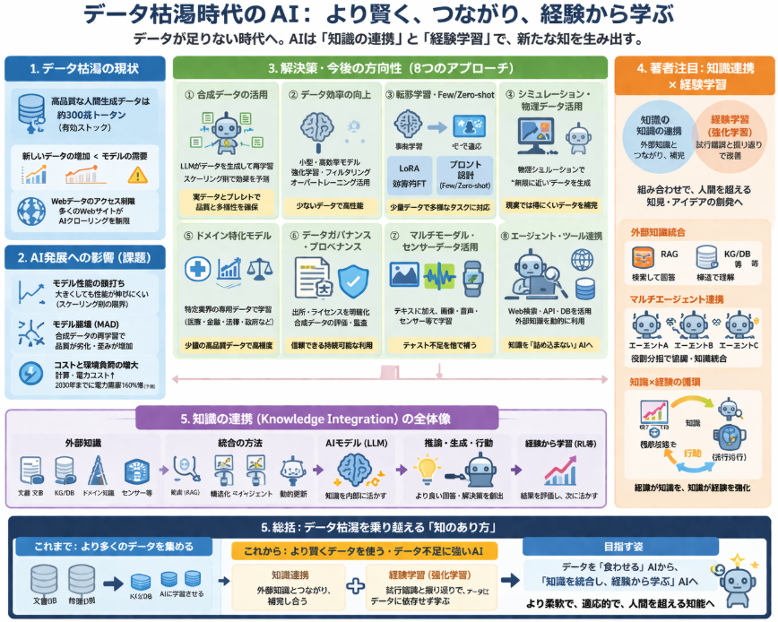

学習データセット枯渇は、2024〜2025年頃から特に注目されている**AI開発の大きな課題**の一つです。
本日はそんな学習データセット枯渇についての調査、考察について説明します。

## 1. データ枯渇の現状

### 1-1. 高品質な人間生成データの限界

- Epoch AI の2024年報告によると、**高品質な人間生成テキストデータの有効ストック**は約300兆トークン程度と推定されています。[Epoch AI](https://epoch.ai/blog/will-we-run-out-of-data-limits-of-llm-scaling-based-on-human-generated-data)
- 現在のLLMは、このデータを**何度も再利用（マルチエポック学習）**しており、**新しい高品質データの増加速度がモデルの需要に追いついていない**状況です。
- Elon Musk も「人間の知識の累積はAIトレーニングでほぼ使い果たされた」と発言しており、データ制約が顕在化していることが示唆されています。[The Guardian](https://www.theguardian.com/technology/2025/jan/09/elon-musk-data-ai-training-artificial-intelligence)

### 1-2. Webデータのアクセス制限

- 多くの重要なWebサイト（ニュース、学術、SNSなど）が、**AIトレーニング用のクローリングを制限**しています。[The Innovator](https://theinnovator.news/data-limitations-are-constraining-ai-development/)
- これにより、これまで主要なデータ源だった「オープンなWebテキスト」の利用が難しくなっています。

## 2. AI発展への影響（課題）

### 2-1. モデル性能の頭打ち

- 新しい高品質データが不足すると、**モデルサイズを大きくしても性能が伸びにくくなる**（スケーリング則の限界）ことが懸念されています。[Epoch AI](https://epoch.ai/blog/will-we-run-out-of-data-limits-of-llm-scaling-based-on-human-generated-data)
- 特に汎用LLM（GPT-4クラス）の性能向上が鈍化する可能性があります。

### 2-2. モデル崩壊（Model Autophagy Disorder, MAD）

- 新しい実データが不足し、**AIが生成したデータ（合成データ）で再学習**を繰り返すと、出力にアーティファクト（歪み）が増え、品質が低下する「モデル崩壊」が指摘されています。[Medium](https://medium.com/data-science-collective/digital-drought-will-llms-run-out-of-data-before-they-reach-agi-2a7a4d1d9648)

### 2-3. コストと環境負荷

- データ不足を補うために**より大きなモデルや長い学習**が必要になると、計算コストと電力消費が増大します。
- データセンターの電力需要は2030年までに160%増加するとの予測もあり、**環境負荷**も大きな課題です。[Medium](https://medium.com/data-science-collective/digital-drought-will-llms-run-out-of-data-before-they-reach-agi-2a7a4d1d9648)

## 3. 解決策・今後の方向性

学習データ不足（データ枯渇・低リソース環境）を受けて、2024〜2025年頃から特に注目されている**技術テーマ・トレンド**は、大きく以下のようなものです。

### 1. 合成データ（Synthetic Data）の本格活用

- **LLM自身が生成したデータで再学習**する手法が一般化しています。
  - 例：低リソース機械翻訳（MT）で、LLMが生成した合成データでモデルを強化する研究。[EMNLP 2025](https://aclanthology.org/2025.emnlp-main.1408.pdf)
- **スケーリング則に従う合成データ生成**（SynthLLMなど）により、  
  「どれだけ合成データを増やすと性能がどれだけ上がるか」を予測できるようになってきています。[arXiv](https://arxiv.org/html/2503.19551v3)
- 画像分野でも、**合成データが実データより効率的なケース**（ImageNet-Sketch / ImageNet-Rタスク）が報告されています。[Tim Lrx Blog](https://www.timlrx.com/blog/synthetic-data-in-2024-progress-opportunities-challenges/)

**課題**：合成データのみに依存すると「モデル崩壊（MAD）」のリスクがあるため、**実データとのブレンド**や品質評価が重要になっています。

### 2. データ効率の向上（より少ないデータで賢く学習）

- **小型・高効率モデル**へのシフト
  - Llama 3/4、Gemma、Qwen など、数十億パラメータ規模でも高性能なモデルが増加。
  - 同じ計算量・データ量で、より高い性能を目指す方向です。[Sebastian Raschka](https://magazine.sebastianraschka.com/p/state-of-llms-2025)
- **強化学習（RL）や高度なフィルタリング**
  - 報酬設計や検証可能なタスク（数学・コードなど）でRLを行い、**少ないデータで推論能力を強化**する研究が進んでいます。
- **オーバートレーニングの活用**
  - 計算量を固定したままデータ量を増やし、**パラメータ数を抑えつつ推論効率を高める**手法も検討されています。[Epoch AI](https://epoch.ai/blog/will-we-run-out-of-data-limits-of-llm-scaling-based-on-human-generated-data)

### 3. 転移学習・Few-shot / Zero-shot 学習の深化

- **事前学習済みモデルを少量データでファインチューニング**する手法が標準化。
  - LoRA（Low-Rank Adaptation）などのパラメータ効率の良いファインチューニングが普及。
- **Few-shot / Zero-shot プロンプティング**
  - 新しいタスクに対し、学習データをほとんど与えず、プロンプト設計だけで対応する技術が重要になっています。
- **マルチタスク学習・マルチドメインモデル**
  - 1つのモデルで複数タスク・複数ドメインを扱うことで、**データを共有し効率化**する動きもあります。[ScienceDirect](https://www.sciencedirect.com/org/science/article/pii/S1546221825005375)

### 4. シミュレーション・物理ベースデータの活用

- **物理シミュレーションで生成される定量データ**を活用する動きがあります。
  - 例：SandboxAQ の LQM（Language Quantum Models）は、物理シミュレーションから無限に近いトレーニングデータを生成するアプローチ。[The Innovator](https://theinnovator.news/data-limitations-are-constraining-ai-development/)
- ロボティクスや気象・金融など、**モデルベースのシミュレーションとデータ駆動AIの融合**が進んでいます。

### 5. ドメイン特化モデルと専用データの重視

- 汎用Webデータに依存せず、**特定業界の専用データ**で学習した**ドメイン特化LLM**が増えています。
  - 医療、金融、法律、政府向けなど。[TechSur Solutions](https://techsur.solutions/key-llm-trends-for-2025/)
- 少量の高品質データで高い精度を実現できるため、**データ不足の影響を緩和**できます。

### 6. データガバナンス・プロベナンスの整備

- **データの出所（プロベナンス）やライセンス**を明確にし、持続可能なデータ利用を目指す動きが強まっています。
  - Data Provenance Initiative などが、Webデータの利用実態と制約を調査。[The Innovator](https://theinnovator.news/data-limitations-are-constraining-ai-development/)
- 合成データについても、**バイアスや品質の評価・監査**が重要視されています。[AAAI/AIES](https://ojs.aaai.org/index.php/AIES/article/download/36538/38676/40613)

### 7. マルチモーダル・センサーデータの活用

- テキストだけに依存せず、**画像・音声・センサー時系列**などを組み合わせたマルチモーダル学習が増えています。
  - 例：Time-MMD、Time-IMM などのマルチモーダル時系列データセット。[arXiv](https://arxiv.org/html/2406.08627v1)[NeurIPS 2025](https://neurips.cc/virtual/2025/poster/121380)
- これにより、**テキストデータ不足を他モダリティで補う**ことが可能になります。

### 8. エージェント・ツール連携による「外部知識」の活用

- LLMがWeb検索やAPI、データベースにアクセスし、**外部リソースを動的に利用**するエージェント型アプリケーションが増えています。
- これにより、**モデル内部にすべての知識を詰め込む必要が減り**、データ依存度を下げられます。

## 4. 著者が注目すること

世の中の動向とは別に著者が個人的に気になっていることです。
知識の連携（Knowledge Integration）と強化学習をはじめとする経験学習です。
強化学習はAIに経験と、振り返りを行うことで、じわじわとよりよい結果を探索する学習法です。
知識の連携については体系立てると以下のようになっていきます。

### 1. 外部知識統合（External Knowledge Integration）

__1-1. RAG（Retrieval-Augmented Generation）の高度化__

- **RAGの基本**：LLMが外部データベース（Wikipedia、社内ドキュメント、KGなど）から情報を検索し、それをプロンプトに含めて回答する方式。
- 近年は「**RAGを超える**」ことを目指した研究が増えています。
  - 例：**ThinkNote** は、外部知識をLLMの内部パラメータ記憶に「同化」し、  
    推論チェーンを洗練させる2段階の認知プロセスを提案。[arXiv](https://arxiv.org/html/2402.13547v3)
    - RAGと比較して、QA性能が10%以上向上したと報告されています。

__1-2. 構造化知識ベース（KG・DB）との統合__

- **知識グラフ（Knowledge Graph）**や構造化DBをLLMに統合する研究が進んでいます。
  - 例：**SR-KI** は、大規模な構造化知識ベースを**スケーラブルかつリアルタイム**にLLMへ統合する手法を提案。[ResearchGate](https://www.researchgate.net/publication/402626530_SR-KI_Scalable_and_Real-Time_Knowledge_Integration_into_LLMs_via_Supervised_Attention)
- Semantic Web Journal のサーベイでは、  
  「**LLMと外部知識統合の方法・課題・将来方向**」が体系的に整理されています。[Semantic Web Journal](https://www.semantic-web-journal.net/content/external-knowledge-integration-large-language-models-survey-methods-challenges-and-future)

### 2. マルチエージェント・マルチモデル間の知識連携

__2-1. マルチエージェントフレームワーク__

- 複数のLLMエージェントが**役割分担して協調**し、知識を統合する研究が増えています。
  - 例：**MMA（Mixture of Multi-domain Agents）**  
    - 汎用モデルとドメイン特化モデルの出力を、**モンテカルロ木探索（MCTS）**で最適に組み合わせる手法。[ACL Anthology](https://aclanthology.org/2025.findings-emnlp.707.pdf)
  - 例：**動的知識統合マルチエージェントフレームワーク**（ICLR 2025）  
    - 各エージェントが専門DBを参照し、会話中に知識を動的に更新する仕組み。[OpenReview](https://openreview.net/pdf/0117a955dc152512e5c7f9915b8b7aa82ad54128.pdf)

__2-2. クロスドメイン知識統合__

- 異なるドメイン（法律、医療、科学など）のモデルや知識を**動的に組み合わせる**研究も進んでいます。
  - MMAのように、汎用モデルと専門モデルをテスト時に統合することで、  
    複雑なドメインタスクの性能を向上させるアプローチです。[ACL Anthology](https://aclanthology.org/2025.findings-emnlp.707.pdf)

### 3. ドメイン知識・物理法則との統合（Neuro-Symbolic AI）

__3-1. 物理インフォームド・シンボリック回帰__

- **LLMと物理法則を統合**し、シンボリック回帰（数式発見）のロバスト性を高める研究があります。
  - 例：**Knowledge integration for physics-informed symbolic regression**  
    - 自由落下・単振動・減衰波などの物理シナリオで、  
      LLM統合によりノイズや複雑さに対する耐性が向上したと報告。[Nature Scientific Reports](https://www.nature.com/articles/s41598-026-35327-6)

__3-2. 地質学・鉱物予測へのLLMガイド知識統合__

- 地質学の教科書からLLMが**記述的知識を抽出・構造化**し、  
  ニューロシンボリックAIモデルに統合する研究もあります。
  - これにより、**少ないサンプルでも高精度な鉱床タイプ予測**が可能になったと報告されています。[ScienceDirect](https://www.sciencedirect.com/science/article/pii/S2590197425000928)

### 4. 動的知識・コンテキストの統合

__4-1. 動的知識とLLMの融合（ロボティクス）__

- 人間とロボットの協調組立（HRCA）において、  
  **動的知識とLLMを統合**し、状況に応じた組立プログラムを生成する研究があります。
  - 需要・戦略・リソースの3層に知識を分類し、  
    ロボットが取得した視覚情報を**文脈豊かなプロンプト**に変換してLLMに渡すことで、  
    適応的な協調動作を実現。[ScienceDirect](https://www.sciencedirect.com/science/article/abs/pii/S1474034625005063)

__4-2. 検索連携推論（Search-Augmented Reasoning）__

- LLMが推論の途中で**検索を挟み、不足知識を動的に取得・統合**する手法も研究されています。
  - 例：**Knowledge Integration Decay in Search-Augmented Reasoning**  
    - 検索と推論を交互に行う際の「知識統合の減衰」問題を分析し、  
      より安定した外部知識の活用方法を検討。[arXiv](https://arxiv.org/html/2602.09517v1)

### 5. 知識統合と制御生成の同時最適化

- **GenKI** というフレームワークでは、  
  「**知識統合**」と「**制御可能な生成（特定フォーマットの回答生成）**」を同時に扱う研究が行われています。
  - OpenQA（オープンドメイン質問応答）において、  
    知識統合と出力フォーマットの保証を両立させることを目指しています。[SciOpen](https://www.sciopen.com/article/10.26599/BDMA.2025.9020052)

### 6. 課題と今後の方向性

知識連携には現状実用にあたり以下のような課題が存在します。

- **知識の鮮度・信頼性**：外部知識が古い・誤っている場合のリスク。
- **統合の安定性**：検索連携推論での「知識統合の減衰」や、マルチエージェント間の整合性維持。
- **スケーラビリティ**：大規模KGやリアルタイムデータを扱う際の計算コスト。
- **解釈性・公平性**：統合された知識がどのように意思決定に寄与しているかの説明。

データセット枯渇が認識されてきている中、人間がここまで発展した理由を考えてみると、試行錯誤と知識の連携があったと思っています。
試行錯誤は現在仮想環境下でAIを動作し、現実世界に適用するような例が多々報告されるようになりました。
知識の連携は、何か課題があるときに、お互いの知見を補間して新規のアイデアを発現する可能性を秘めています。

先述の課題を乗り越えて試行錯誤の学習と合わさることで、人間が考えてきた世界を大きく凌駕する知見やアイデアが発現することにならないか、と著者は期待しています。

## 5. 総括：データ枯渇を乗り越える「知のあり方」

データセット枯渇が認識される中、AI開発の方向性は、

- 「**より多くのデータを集める**」から
- 「**より賢くデータを使う**」「**データ不足に強いAI**」

へとシフトしつつあります。

その鍵となるのが、

1. **知識連携**  
   - 外部知識（KG、DB、物理法則、ドメイン知識）とLLMを統合し、  
     互いの知見を補完し合うことで、**新たなアイデアや解**を生み出す。
2. **経験学習（強化学習）**  
   - 試行錯誤と振り返りを通じて、**データに依存しない学習**を実現する。

という2つのアプローチです。

著者は、これらが組み合わさることで、

- 人間がこれまで蓄積してきた知見を超える
- データ枯渇という制約を逆手に取り、**より柔軟で適応的な知能**

が生まれる可能性を秘めていると考えています。

今後は、単に「データを食わせる」AIから、  
**「知識を統合し、経験から学ぶ」AI**へと進化していくことが、  
データ枯渇時代のAI発展のカギになると考えてます。

