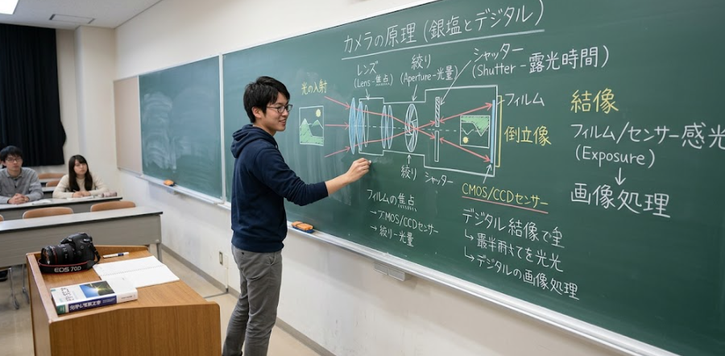
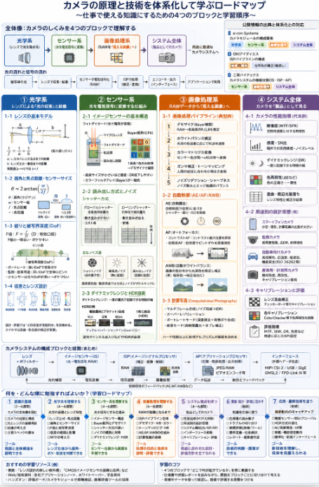

仕事でカメラ関係の知識が必要になることが多く理解しないといけないと考えてました。
今回はそんなカメラの知識を体系化して仕事でつかえるように学習するまで **何を勉強したらよいか、どんな順に勉強したらよいか** について公開された技術情報を基に整理しました。

## 体系化すると
「カメラで撮影する原理」や「技術的に結像するロジック」を仕事で使えるレベルまで理解するには、**カメラを「光学系」「センサー系」「画像処理系」「システム全体」** という4つのブロックに分けて体系化すると分かりやすいようです。

### 1. 光学系：レンズによる「光の収束」と結像

カメラの出発点は「光を集めて像を作る」ことです。

__1-1. レンズの基本モデル__
- **薄レンズ近似**
  - 焦点距離 $${ f }$$
  - レンズ公式：  
    $${ \frac{1}{f} = \frac{1}{a} + \frac{1}{b} }$$
    - $${ a }$$：被写体〜レンズ主点までの距離（物距）
    - $${ b }$$：レンズ主点〜像面までの距離（像距）
  - 無限遠（$${ a \to \infty }$$）では $${ b \approx f }$$
- **結像の意味**
  - レンズ前方の1点から出た光が、レンズを通過した後、像面上の1点に集まること
  - この「1点→1点」対応が、被写体の形を像面に写す

__1-2. 画角と焦点距離・センサーサイズの関係__
- 画角 $${ \theta }$$（ラジアン）と焦点距離 $${ f }$$、センサーサイズ $${ w }$$ の関係（簡略化）：
  $${ \theta \approx 2 \arctan\left(\frac{w}{2f}\right) }$$
- 同じ焦点距離でもセンサーサイズが小さいほど画角は狭くなる（望遠寄り）
- 仕事で使うポイント：
  - 「35mm換算」の意味（基準センサーに対する相対的な画角表現）
  - カメラモジュール設計時に、画角要求から必要な $${ f }$$ とセンサーサイズを決める

__1-3. 絞りと被写界深度__
- **絞り（F値）**
  - $${ F = \frac{f}{D} }$$（$${ D }$$：有効口径）
  - F値が小さいほど明るく、ボケやすい
- **被写界深度（DoF）**
  - 許容錯乱円（CoC）を前提に、ピントが合っているとみなせる前後の範囲
  - 仕事で使うポイント：
    - ポートレートでは浅いDoFで背景ボケを強調
    - 監視カメラや産業用では深いDoFで全体にピント
    - スマホのようにセンサーが小さいと、元々DoFが深い → ボケづらい

__1-4. 収差とレンズ設計__
- **主な収差**
  - 球面収差、コマ収差、非点収差、像面湾曲、歪曲収差、色収差
- 仕事で使うポイント：
  - レンズ設計や評価時に「どの収差が支配的か」を見極める
  - スマホカメラでは歪曲収差・色収差の補正が画像処理で重要

### 2. センサー系：光を電気信号に変換する仕組み

像面にできた光の強弱を、デジタル信号に変換する部分です。

__2-1. イメージセンサーの基本構造__
- **フォトダイオード**
  - 光が当たると電子–正孔対が生成され、電荷が蓄積
  - 蓄積電荷量が光量に比例
- **画素（ピクセル）**
  - 1画素＝1つのフォトダイオード＋読み出し回路
  - 画素サイズが小さいほど感度・ダイナミックレンジが低下しやすい
- **カラーフィルタアレイ（CFA）**
  - Bayer配列（R, G, Bの並び）が一般的
  - 1画素あたり1色しか取れない → 周囲画素から補間してフルカラー化（デモザイク）

__2-2. 読み出し方式とノイズ__
- **グローバルシャッター vs ローリングシャッター**
  - グローバル：全画素同時露光 → 動き歪みが少ないがコスト高
  - ローリング：行単位で順次露光 → 動く被写体で歪みが出るが安価
- **主なノイズ源**
  - ショットノイズ（光の量子性に起因）
  - 暗電流ノイズ、読み出しノイズ（熱・回路由来）
- 仕事で使うポイント：
  - 高感度性能や動画用途で、どの方式・どのノイズがボトルネックかを見極める

__2-3. ダイナミックレンジとHDR技術__
- **ダイナミックレンジ**
  - 一度の露光で記録できる明暗の幅
- **HDR技術**
  - 複数露光（ブラケット）合成
  - 画素ごとに異なる露光時間（Dual-Conversion Gainなど）
- 仕事で使うポイント：
  - 監視カメラや自動車向けでは、逆光・トンネル出入りなどでHDRが必須

### 3. 画像処理系：RAWデータから「見える画像」へ

センサーから出たRAWデータは、そのままでは人間が見て自然な画像にはなりません。

__3-1. 画像処理パイプラインの典型例__
1. **デモザイク（Bayer補間）**
   - Bayer配列のRAWから、各画素のR, G, Bを推定
2. **ホワイトバランス補正**
   - 光源の色温度に応じてR, G, Bのゲイン調整
3. **カラーマトリクス変換**
   - センサー色空間 → 標準色空間（sRGB等）への変換
4. **ガンマ補正・トーンマッピング**
   - 人間の知覚に合わせた明るさ表現
5. **ノイズリダクション・シャープネス**
   - ノイズ除去とエッジ強調のバランス

__3-2. 自動制御（AE/AF/AWB）__
- **AE（自動露出）**
  - 目標輝度（Y値など）を基準に、シャッター速度・絞り・ISOを制御
- **AF（オートフォーカス）**
  - コントラストAF：像のコントラストが最大になる位置を探索
  - 位相差AF：位相差検出素子でピントずれ量を直接測定
- **AWB（自動ホワイトバランス）**
  - 画像全体の色分布から光源色を推定し補正

__3-3. 計算写真（Computational Photography）__
- マルチフレーム合成（ノイズ低減、HDR、スーパーレゾリューション）
- ポートレートモード（深度推定＋背景ボケ合成）
- 夜景モード（長時間露光＋手ブレ補正）

仕事で使うポイント：
- スマホカメラや監視カメラでは、**ハードウェア性能以上に画像処理が画質を決める**ことが多い
- アルゴリズム開発や評価では、「どの処理がどの画質指標に効くか」を分解して考える必要がある

### 4. システム全体：カメラを「製品」として見る

最後に、個々の技術要素を組み合わせて「カメラシステム」として理解します。

__4-1. カメラの性能指標__
- **解像度**：MTF（Modulation Transfer Function）、SFR（Spatial Frequency Response）
- **感度・SN比**：暗所での実用感度、ノイズレベル
- **ダイナミックレンジ**：一度に記録できる明暗の幅
- **色再現性**：ΔEなどの色差指標
- **歪曲・周辺光量落ち**：レンズ特性と画像処理補正の組み合わせ

__4-2. 用途別の設計思想__
- **スマートフォンカメラ**
  - 小型・薄型、計算写真の比重が大きい
- **監視カメラ**
  - 低照度性能、広ダイナミックレンジ、耐環境性
- **自動車向けカメラ**
  - 高信頼性、広温度範囲、低遅延、機能安全（ISO 26262など）
- **産業用・計測用カメラ**
  - 幾何精度、再現性、キャリブレーションの重要性

__4-3. キャリブレーションと評価__
- **レンズ歪曲補正**：チェッカーボード等を用いたキャリブレーション
- **色キャリブレーション**：ColorChecker等を使った色再現性の調整
- **評価指標**：MTF、SNR、DR、色差など、用途に応じたKPI設定

## 仕事で使うための「体系化」のまとめ

1. **光学系**
   - レンズ公式・画角・F値・被写界深度・収差
2. **センサー系**
   - フォトダイオード、Bayer配列、シャッター方式、ノイズ、HDR
3. **画像処理系**
   - 画像処理パイプライン（デモザイク〜トーンマッピング）
   - AE/AF/AWB、計算写真
4. **システム系**
   - 性能指標（解像度・感度・DR・色再現）
   - 用途別設計思想、キャリブレーションと評価

この4層を「どこで何が起きているか」を意識しながら学ぶと、
- 仕様書や評価レポートを読むとき
- 画質トラブルの原因を切り分けるとき
- 新しいカメラ機能の要件を考えるとき

に、技術的な判断がしやすくなると感じました。
ということで今後、不定期にカメラの原理について扱っていきます。

## 引用元

以下、引用元の要約と、それに対応する体系化のポイントをまとめます。

### 1. e-con Systems：カメラモジュールの構成要素

**要約**  
カメラモジュールは、主に以下の5要素で構成される[e-con Systems](https://www.e-consystems.com/blog/camera/ja/uncategorized-ja/what-is-camera-module-and-what-are-its-components)。

1. **イメージセンサー**：光を電気信号に変換（CMOS/CCD）
2. **レンズ＋IRフィルター**：光をセンサーに集束し、画角・焦点距離・色再現を決める
3. **画像信号プロセッサ（ISP）**：RAWデータをノイズ低減・色補正などを経て利用可能な形式に変換
4. **プリント回路基板（PCB）**：部品実装と相互接続、信号整合性の確保
5. **インターフェース**：MIPI CSI-2、USB、GigE、GMSL2、FPD-Link IIIなどで外部へデータ伝送

また、動作プロセスとして「光の捕捉 → 電気変換 → 信号調整 → 画像処理 → データ伝送 → 統合とフィードバック」という流れが説明されている。

**体系化との対応**
- レンズ＋IRフィルター → **光学系**
- イメージセンサー → **センサー系**
- ISP → **画像処理系**
- インターフェース・用途特性 → **システム全体**

### 2. OKIアイディエス：ISPパイプラインの構成

**要約**  
ISP（Image Signal Processing）は、CMOSセンサーからのRAWデータを、人間が自然に見える画像や、認識・監視・検出に適した画質に変換する処理であり、**パイプライン**として複数の処理ブロックで構成される[OKIアイディエス](https://www.oki-oids.jp/solution/products/fpga/hdr_isp_ip.html)。

代表的な処理ステップ：
- **レンズ補正**：歪み・色収差の修正
- **デモザイク処理**：Bayer配列のRAWからRGBを補完してカラー化
- **ノイズリダクション**：空間的ノイズ・色ノイズ・ランダムノイズの低減
- **ガンマ補正**：視覚特性に合わせた明暗調整
- **カラー補正**：色域の調整
- **ホワイトバランス調整**：光源の色温度に応じた補正

**体系化との対応**
- デモザイク・WB・カラー補正・ガンマ・NRなど → **画像処理系（RAW→表示/認識用画像への変換）**
- レンズ補正 → 光学系由来の特性を画像処理で補正する橋渡し

### 3. 三栄ハイテックス：カメラシステムの機能分割（IS・ISP・AP）

**要約**  
「デジタルなカメラ」の基本構造は、以下の3ブロックに機能分担されている[三栄ハイテックス](https://www.sanei-hy.co.jp/blog/2023/03/00244)。

1. **イメージセンサー（IS）**：レンズを通した光を電子画像に変換
2. **イメージシグナルプロセッサ（ISP）**：  
   - イメージセンサー固有の補正（歪曲収差、シェーディング）  
   - 露光／ゲイン制御、ノイズ除去、デモザイクなど
3. **アプリケーションプロセッサ（AP）**：  
   - JPEG/RAW変換、ビデオコーデック  
   - 用途に沿った処理、外部インターフェースへの出力

また、用途に応じて
- 「IS＋ISP＋AP」の分散構成
- 「IS＋ISP」を統合したSoC＋AP
- 「IS＋ISP」のみ（Webカメラなど）

といった構成を選ぶ設計思想が示されている。

**体系化との対応**
- IS → **センサー系**
- ISP → **画像処理系**
- AP → **システム全体（用途最適化・インターフェース）**

