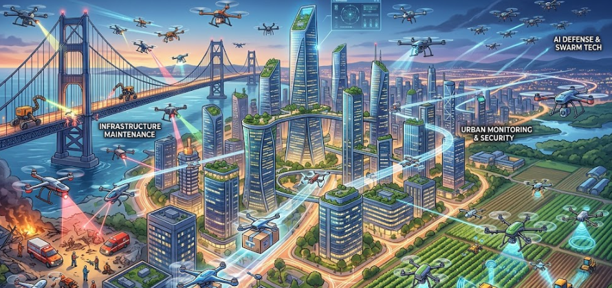

UAV（無人航空機）が世に出てから用途がどのように広がったか気になったので調べてみました。
特に初めて発明されていた時代感に関しては少し驚いた次第です。

## UAVの開発・利用の経緯

UAVが世に出てきた経緯は、大きく分けて次の3段階で整理できます。

### 1. 軍事利用としての起源（20世紀前半〜）

- **最初の無人航空機**  
  一般的には、1930年代にイギリスで開発された標的機「Queen Bee（クイーン・ビー）」が、実用無人機の起源とされています[Wikipedia](https://ja.wikipedia.org/wiki/%E7%84%A1%E4%BA%BA%E8%88%AA%E7%A9%BA%E6%A9%9F)。  
  これは、有人機を撃墜訓練の標的にする代わりに、無線操縦で飛ばす「標的機」として使われました。

- **「ドローン」という呼び名**  
  「drone（雄バチ）」という言葉は、この標的機のブーンという音に由来する、という説がよく知られています[Wikipedia](https://ja.wikipedia.org/wiki/%E7%84%A1%E4%BA%BA%E8%88%AA%E7%A9%BA%E6%A9%9F)。

- **偵察・攻撃への拡大**  
  第二次世界大戦後、特に冷戦期以降、  
  - 偵察用無人機（例：RQ-2 パイオニア、RQ-4 グローバルホーク）  
  - 攻撃用無人機（MQ-1 プレデターなど）  
  が開発され、危険な空域での偵察や、遠隔からの攻撃が可能になりました[無人航空機 - Wikipedia](https://ja.wikipedia.org/wiki/%E7%84%A1%E4%BA%BA%E8%88%AA%E7%A9%BA%E6%A9%9F)。

- **近年の戦争での重要性**  
  2020年代のウクライナ戦争などでは、偵察・攻撃・補給などでUAVが極めて重要な役割を果たし、「現代戦に欠かせない装備」と位置づけられるようになりました[ドローン製造戦争](https://instituteofgeoeconomics.org/research/2026040601/)。

### 2. 民生・産業利用への広がり（1980年代〜2000年代）

- **農業分野での実用化（日本が先行）**  
  日本では、ヤマハ発動機が1980年代から農薬散布用の無人ヘリコプター（RMAXなど）を開発し、1990年代には実用化されました[ドローン革命、今どこまで来ている？](https://sogakkan.jp/%E3%83%89%E3%83%AD%E3%83%BC%E3%83%B3%E9%9D%A9%E5%91%BD%E3%80%81%E4%BB%8A%E3%81%A9%E3%81%93%E3%81%BE%E3%81%A7%E6%9D%A5%E3%81%A6%E3%81%84%E3%82%8B%EF%BC%9F/)。  
  これは、UAVが「軍事」だけでなく「産業」に本格的に使われ始めた象徴的な例です。

- **測量・点検・物流などへの応用**  
  2000年代以降、  
  - インフラ点検（橋梁・送電線・タンクなど）  
  - 測量・建設現場の3Dマッピング  
  - 災害時の状況把握  
  などでUAVが活用されるようになりました[ドローン革命、今どこまで来ている？](https://sogakkan.jp/%E3%83%89%E3%83%AD%E3%83%BC%E3%83%B3%E9%9D%A9%E5%91%BD%E3%80%E3%81%84%E3%81%BE%E3%81%A9%E3%81%93%E3%81%BE%E3%81%A7%E6%9D%A5%E3%81%A6%E3%81%84%E3%82%8B%EF%BC%9F/)。

### 3. 一般への普及と日本の法整備（2010年代〜）

- **民生用マルチコプターの登場**  
  2010年にフランスのParrot社が「AR Drone」を発売し、スマホで操縦できる小型マルチコプターが一般消費者にも広まりました[ドローンの歴史と今後の展望](https://royal-droneschool.com/hiroshima/drone_history_future/)。  
  これが「ドローン」という言葉が一般に広く知られるきっかけの一つです。

- **日本の法整備の流れ**  
  日本では、2015年に首相官邸へのドローン落下事件が起き、これを契機に航空法が改正され、無人航空機の飛行ルールが明確化されました[ドローン規制の歴史](https://kaden-okakun.com/drone-kisei)。  
  その後、  
  - 2016年：小型無人機等飛行禁止法  
  - 2022年：航空法改正（レベル4飛行など）  
  と、都市部での目視外飛行なども段階的に解禁される方向で制度が整えられています[ドローン規制の歴史](https://kaden-okakun.com/drone-kisei)。

- **市場の拡大**  
  2024年度の国内ドローン市場は約4,371億円と推定され、2030年には1兆円超が見込まれるなど、産業利用が急速に拡大しています[ドローン革命、今どこまで来ている？](https://sogakkan.jp/%E3%83%89%E3%83%AD%E3%83%BC%E3%83%B3%E9%9D%A9%E5%91%BD%E3%80%E3%81%84%E3%81%BE%E3%81%A9%E3%81%93%E3%81%BE%E3%81%A7%E6%9D%A5%E3%81%A6%E3%81%84%E3%82%8B%EF%BC%9F/)。

## 特徴

ドローン（UAV：無人航空機）と、有人航空機・ヘリコプター・気球などの「他の飛行物」との違い・特徴は、大きく次の4つの観点で整理できます。

### 1. 定義と構造の違い

- **ドローン（UAV）**  
  - 人が**搭乗しない**航空機全般を指します[無人航空機 - Wikipedia](https://ja.wikipedia.org/wiki/%E7%84%A1%E4%BA%BA%E8%88%AA%E7%A9%BA%E6%A9%9F)。  
  - 多くは**小型・軽量**で、マルチコプター（4〜8ローター）や固定翼など、多様な形態があります。  
  - 電動モーター＋バッテリーが主流で、静音・低振動のものが多いです。

- **有人航空機（飛行機・ヘリコプター）**  
  - パイロットや乗客が**搭乗**します。  
  - 機体は大きく、エンジン（レシプロ・ジェット）で動き、航続距離・速度・積載量が大きいです。  
  - ヘリコプターはローター1基で垂直離着陸が可能ですが、構造が複雑で騒音も大きいです。

- **気球・グライダーなど**  
  - 気球は浮力で浮き、グライダーは上昇気流を利用して滑空します。  
  - 動力を持たないものが多く、操縦性や速度に制約があります。

**特徴**：ドローンは「無人」かつ「小型・電動」が基本で、構造がシンプルで安価に製造できる点が大きな違いです。

### 2. 操縦・運用の違い

- **ドローン**  
  - 多くは**遠隔操縦**（リモコン・スマホ・タブレット）で、自律飛行（GPS・センサーによる自動航行）も可能です。  
  - 1人で複数機を運用することもできます。

- **有人航空機**  
  - 原則として**パイロットが機内で操縦**します。  
  - 飛行計画・管制との連携が必須で、1機あたりの運用コストが高いです。

- **気球・グライダー**  
  - 気球は風に大きく左右され、グライダーは上昇気流を探す必要があり、操縦の自由度は低めです。

**特徴**：ドローンは「遠隔・自律」による柔軟な運用が可能で、狭い空間や危険な場所でも飛行しやすい点が大きな強みです。

### 3. 用途とコストの違い

- **ドローン**  
  - 農業（農薬散布）、測量、インフラ点検、空撮、物流、災害対応など、**多様な産業用途**に使われています[ドローン革命、今どこまで来ている？](https://sogakkan.jp/%E3%83%89%E3%83%AD%E3%83%BC%E3%83%B3%E9%9D%A9%E5%91%BD%E3%80%81%E4%BB%8A%E3%81%A9%E3%81%93%E3%81%BE%E3%81%A7%E6%9D%A5%E3%81%A6%E3%81%84%E3%82%8B%EF%BC%9F/)。  
  - 機体価格・運用コストが比較的安く、**小規模事業者でも導入しやすい**のが特徴です。

- **有人航空機**  
  - 旅客輸送、貨物輸送、救急搬送、大規模な防災・消防など、**大規模・高負荷**の用途が中心です。  
  - 機体価格・燃料・整備・人件費が高く、運用コストが桁違いに大きいです。

- **気球・グライダー**  
  - 観光・スポーツ・広告など、用途は限定的です。

**特徴**：ドローンは「低コストで多用途」という点が、他の飛行物と比べて際立っています。

### 4. 規制・安全性の違い

- **ドローン**  
  - 航空法や小型無人機等飛行禁止法など、**無人機特有の規制**が設けられています[ドローン規制の歴史](https://kaden-okakun.com/drone-kisei)。  
  - 都市部での目視外飛行（レベル4）などは、厳しい認証・許可が必要です。  
  - 墜落しても**人命リスクが小さい**一方、プライバシー・落下物・電波干渉などのリスクがあります。

- **有人航空機**  
  - 航空法・国際条約に基づく厳格な安全基準があり、**乗員・乗客の安全確保**が最優先です。  
  - 事故は大規模になりやすく、社会的影響も大きいです。

- **気球・グライダー**  
  - 航空法の対象ですが、飛行空域や速度が限られるため、リスクは比較的コントロールしやすいです。

**特徴**：ドローンは「人命リスクが低い代わりに、社会インフラやプライバシーへの影響が大きい」という、他の飛行物とは異なるリスク構造を持っています。

## UAVが応用される分野

UAV（無人航空機）は現在、さまざまな分野で実用化されており、それぞれの分野で「従来の方法では難しかったこと」や「コスト・安全性の面でのメリット」が利用理由になっています。

### 1. 農業分野

**主な応用**
- 農薬・肥料の散布
- 作物の生育状況モニタリング（マルチスペクトルカメラなど）
- 圃場のマッピング・土壌分析

**利用されている理由**
- **作業効率の向上**：広い圃場を短時間でカバーでき、人手不足の解消につながる[農林水産省 UAV活用の手引き](https://www.maff.go.jp/kanto/nouson/sekkei/kokuei/tonecho/challenge/R5uavtebiki_R06.5.pdf)。
- **安全性の確保**：農薬散布で人が直接触れずに済むため、健康リスクを低減できる。
- **精密農業の実現**：センサーで作物の状態を細かく把握し、必要な場所に必要な量だけ散布できる。

### 2. インフラ点検・測量・建設分野

**主な応用**
- 橋梁・ダム・送電線・太陽光パネルなどの点検
- 建設現場の測量・3Dマッピング
- トンネル・高所構造物の検査

**利用されている理由**
- **危険作業の代替**：高所・狭所・放射線環境など、人が行うと危険な場所をUAVで代替できる[業務用UAVの日本市場](https://www.atpress.ne.jp/news/1720457)。
- **業務停止時間の最小化**：足場を組まずに点検できるため、インフラの停止時間を短縮できる。
- **データの高精度化**：写真測量・レーザー測量により、従来より高精度な3Dモデルや点群データを取得できる[ドローンサービスの最新活用法](https://drosatsu.jp/blogs/information/drone-service)。

### 3. 物流・運搬分野

**主な応用**
- 過疎地・離島への医薬品・生活物資の配送
- 工場・倉庫間の部品・資材運搬
- 都市部でのラストワンマイル配送（実証実験段階）

**利用されている理由**
- **時間短縮・コスト削減**：道路渋滞の影響を受けず、短時間で配送できる可能性がある[ドローンUAVの産業利用の状況](https://www.jenoba.jp/technical/uav-drone/)。
- **人手不足への対応**：ドライバー不足や過疎地の配送コスト課題に対応できる。
- **緊急時の活用**：災害時など、道路が寸断された地域への物資輸送手段として期待されている[国土交通省 ドローン活用事例](https://www.mlit.go.jp/sogoseisaku/gijyutu/content/001510876.pdf)。

### 4. 災害対応・防災分野

**主な応用**
- 被災地の状況把握（浸水・土砂崩れ・建物被害の確認）
- 捜索救助支援（赤外線カメラによる夜間・瓦礫下の探査）
- 河川・砂防施設の点検・監視

**利用されている理由**
- **人的リスクの低減**：危険な被災地に人が入らずに状況を把握できる[業務用UAVの日本市場](https://www.atpress.ne.jp/news/1720457)。
- **迅速な初動対応**：道路が寸断されていても上空から早期に情報収集が可能。
- **広範囲のモニタリング**：広域災害で全体像を素早く把握し、救助・復旧計画に役立てられる。

### 5. 映像制作・メディア分野

**主な応用**
- 映画・ドラマ・CMの空撮
- スポーツ中継・イベント映像
- 観光PR・不動産物件の空撮

**利用されている理由**
- **低コストで高品質な空撮**：ヘリコプターより安価で、低空・複雑なアングルも撮影できる。
- **柔軟な撮影**：狭い場所や人が入れない場所でもカメラを運べる。

### 6. 警備・監視・環境モニタリング

**主な応用**
- 工場・広大な敷地の警備監視
- 野生動物の生態調査・密猟監視
- 海洋・森林の環境モニタリング

**利用されている理由**
- **24時間・広範囲の監視**：人が巡回するより効率的に広いエリアをカバーできる。
- **危険地域の監視**：密猟・不法侵入の多い地域でも、安全に監視が可能。

### 7. スマートシティ・エネルギー分野

**主な応用**
- 都市インフラの点検（道路・橋梁・トンネル）
- 再生可能エネルギー設備（風力発電・太陽光）の点検
- 都市計画・交通モニタリング

**利用されている理由**
- **インフラの効率的維持管理**：老朽化が進むインフラを低コストで定期的に点検できる[業務用UAVの日本市場](https://www.atpress.ne.jp/news/1720457)。
- **スマートシティ構想との親和性**：IoTセンサーと組み合わせ、都市データを3次元的に収集・分析できる。

### まとめ：UAVが使われる理由の共通点

- **安全性**：人が入れない危険な場所・作業を代替できる。
- **効率性**：広範囲を短時間でカバーし、人手不足を補える。
- **コスト削減**：足場・有人機・人件費など、従来コストを削減できる。
- **データの質向上**：高解像度画像・3Dモデル・センサーデータなど、新しい価値を生み出せる。

こうした理由から、UAVは「単なる空飛ぶカメラ」ではなく、農業・インフラ・物流・防災など、社会の基盤を支える重要な技術として広く応用されています。

## 現在研究されていること

現在UAVで研究されていることは、大きく分けて「**AI・自律飛行**」「**群制御・協調飛行**」「**エネルギー・推進**」「**通信・ネットワーク**」「**セキュリティ・防御**」「**社会実装・法制度**」などに分類できます。

### 1. AI・自律飛行の高度化

- **完全自律飛行**  
  人が遠隔操作しなくても、GPSや各種センサー（カメラ、LiDAR、IMUなど）を使って、自ら障害物を避けながら目的地まで飛行する技術の研究が進んでいます[AI搭載ドローン市場調査](https://www.globalresearch.co.jp/artificial-intelligence-ai-in-drones-market/)。  
  特に「目視外飛行（BVLOS）」での自律航行が重要テーマです。

- **AIによる意思決定**  
  撮影した画像をリアルタイムで解析し、  
  - 作物の病気を検知  
  - インフラの損傷を自動判定  
  - 災害現場で要救助者を識別  
  といった「現場で判断するドローン」の研究が進んでいます[AI搭載ドローン市場調査](https://www.globalresearch.co.jp/artificial-intelligence-ai-in-drones-market/)。

- **機械学習による飛行制御の最適化**  
  風や乱気流など、複雑な環境でも安定飛行できるよう、強化学習などで制御アルゴリズムを学習させる研究も行われています。

### 2. 群制御・協調飛行（スウォーム）

- **多数機の協調飛行**  
  数十〜数百機のドローンが互いに通信し、衝突を避けながら協調して任務を遂行する「群制御（スウォーム）」の研究が進んでいます[群ロボット市場レポート](https://www.researchnester.com/ja/reports/swarm-robotics-market/3099)。  
  軍事では偵察・攻撃の広域カバレッジ、民生ではライトショーや広域点検などへの応用が期待されています。

- **タスク分配・自己組織化**  
  群全体で「どの機体がどこを担当するか」を自律的に決めるアルゴリズムや、一部が故障しても群全体が機能し続ける「冗長性」の研究も行われています。

### 3. エネルギー・推進技術

- **バッテリー・電源の高性能化**  
  現在のリチウムポリマー電池では飛行時間が20〜40分程度が一般的ですが、  
  - 高エネルギー密度バッテリー  
  - 水素燃料電池  
  - ハイブリッド推進（エンジン＋モーター）  
  など、長時間飛行を可能にする電源技術が研究されています[民間ドローン市場レポート](https://www.marketreportsworld.com/jp/market-reports/civilian-drone-market-14725044)。

- **ワイヤレス充電・空中給電**  
  基地に戻らずにワイヤレスで充電したり、他のUAVから給電を受けたりする技術も研究対象です。

### 4. 通信・ネットワーク技術

- **高信頼な無線リンク**  
  都市部や山間部など、電波環境が悪い場所でも安定して操縦・データ伝送できる通信方式（5G/6G、衛星通信との連携など）の研究が進んでいます[Wireless Copilot論文レビュー](https://www.themoonlight.io/ja/review/wireless-copilot-an-ai-powered-partner-for-navigating-next-generation-wireless-complexity)。

- **マルチドローン間通信**  
  多数のUAVが互いに位置・速度・任務情報を共有し、ネットワーク全体として最適に動くためのプロトコル設計も重要な研究テーマです。

### 5. セキュリティ・防御技術

- **サイバー攻撃対策**  
  通信の傍受・なりすまし・ハッキングからUAVを守る暗号化・認証技術の研究が進んでいます。

- **対ドローン（C-UAV）技術**  
  悪意あるドローンを検知・追跡・無力化する技術（電波妨害、ネットガン、レーザーなど）も、軍事・重要施設防護の観点から研究されています[軍事ドローン市場レポート](https://www.databridgemarketresearch.com/jp/reports/global-military-drones-market)。

### 6. 社会実装・法制度・安全性

- **都市部での目視外飛行（レベル4）の実現**  
  都市上空で人や建物の多い環境でも安全に自律飛行できるよう、  
  - 衝突回避アルゴリズム  
  - 安全性評価手法  
  - 認証・保険制度  
  などが研究されています[民間ドローン市場レポート](https://www.marketreportsworld.com/jp/market-reports/civilian-drone-market-14725044)。

- **プライバシー・倫理・法制度**  
  空撮による個人情報保護、軍事利用の倫理、国際的なルール作りなど、技術以外の側面も研究対象になっています。

### 7. 軍事・防衛分野の研究

- **AI搭載の攻撃・偵察UAV**  
  敵の動きを学習して自律的に追跡・攻撃する「ローミング弾（徘徊型ドローン）」や、AIによる目標識別・戦術判断の研究が進んでいます[軍事ドローン市場レポート](https://www.databridgemarketresearch.com/jp/reports/global-military-drones-market)。

- **消耗品型ドローン（Attritable systems）**  
  高価な機体を長く使うのではなく、安価な機体を大量に投入・消耗させる運用コンセプトも研究されています[軍事ドローンの未来と日本の戦略](https://note.com/syfan/n/n97c9a5ed6d18)。

## 妄想
UAVの未来的な応用について妄想をめぐらしてみました。

- **都市の自律物流ネットワーク**  
  夜間や早朝に、AI搭載の小型UAVがビルの間を自律飛行し、宅配・医薬品・緊急物資を自動で配達。交通渋滞や人手不足を補い、24時間の「空の配送網」が都市を支える。

- **インフラの自己点検・自己修復**  
  橋梁・送電線・トンネルなどに常駐するUAV群が、AIで異常を検知し、必要に応じて修理ロボットを呼び出す。老朽化インフラを「見える化」し、事故前に自動でメンテナンス。

- **災害対応の自律チーム**  
  地震や洪水の直後、多数のUAVが自律的に被災地を偵察し、赤外線カメラで要救助者を特定。AIが救助ルートを計算し、救助隊や物資UAVを誘導する「空の救助ネットワーク」。

- **スマート農業の完全自動化**  
  センサー搭載UAVが圃場を常時モニタリングし、AIが作物の状態・土壌・気象を分析。自動で水・肥料・農薬を最適散布し、収穫時期も予測。農家はリモートで全体を管理。

- **都市空間の安全・環境モニタリング**  
  UAV群が都市上空を巡回し、交通流・大気汚染・騒音・異常行動をリアルタイムで監視。AIが危険を予測し、警察・消防・環境当局に自動で警告・誘導する「空のセキュリティ網」。

- **軍事・防衛のAI連携**  
  安価な消耗品型UAV群が前線を自律偵察し、AIが敵の動きを学習して戦術を提案。人間は戦略判断に集中し、UAV群が危険な任務を代行する「人間＋AIの協調戦場」。

- **エンタメ・教育の没入体験**  
  ライトショーやスポーツ中継で、数百機のUAVが観客の動きに合わせて編隊飛行。教育では、歴史遺跡や自然環境をUAVが空撮し、VR/ARと連携して「空からの没入学習」を提供。

**共通する未来像**  
UAVは「単なる空飛ぶカメラ」から、  
AIで自律判断し、群で協調し、インフラ・物流・防災・農業・都市管理を支える「空のプラットフォーム」へと進化し、人間の作業・危険・コストを肩代わりする存在になっていく、というイメージです。

