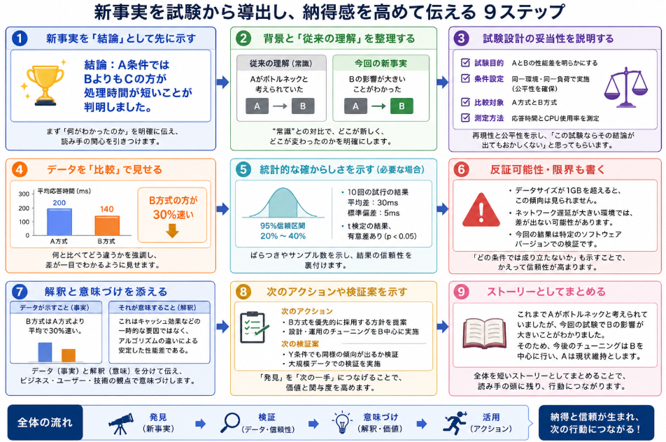

試験を行い知りえただろう事実を伝えたい場合、どう伝えるか？ということに結構迷います。
本日は、そんな試験から事実を伝える方法とはどうすべきかについて考えていきます。

## 納得感を得る方法

「新事実を試験から導出した」ことを伝える際の納得感は、**“発見”としてのストーリー**と**検証の厳密さ**の両方が揃っているときに高まります。  
以下の流れで構成すると、読み手が「確かにそうだ」と感じやすくなります。

### 1. 新事実を「結論」として先に示す
まずは、**何がわかったのか**を一文で明確にします。

- 例：
  - 「今回の試験により、A条件ではBよりもCの方が処理時間が短いことが判明しました」
  - 「想定していたXの影響は小さく、むしろYが主要因であることがわかりました」

読み手は「この資料で何を知るのか」を最初に把握できると、その後の説明を受け入れやすくなります。

### 2. 背景と「従来の理解」を短く整理する
新事実の価値を伝えるには、「これまで何が常識とされていたか」を簡潔に示します。

- 例：
  - 「従来はAがボトルネックと考えられていましたが、今回の試験でBの影響が大きいことがわかりました」
  - 「これまでの報告では、温度が高いほど性能が低下するとされていましたが、今回の試験では一定範囲内では逆の傾向が見られました」

**“常識”との対比**があると、「どこが新しく、どこが変わったのか」が明確になります。

### 3. 試験設計の妥当性を説明する
「なぜその試験でその事実が導けるのか」を説明しないと、新事実の信頼性が下がります。

- 記載すべきポイント：
  - 試験目的：「何を明らかにするための試験か」
  - 条件設定：「なぜその条件を選んだのか」
  - 比較対象：「何と比べているのか」
  - 測定方法：「何をどう測ったのか」

例：
> 「AとBを比較するため、同一環境・同一負荷で試験を行い、応答時間とCPU使用率を測定しました。この条件であれば、AとBの差を公平に評価できます。」

**再現性**と**公平性**を示すことで、「この試験ならその結論が出てもおかしくない」と感じてもらえます。

### 4. データを「比較」で見せる
単なる数字の羅列ではなく、「何と比べてどう違うか」を強調します。

- 例：
  - 「A方式：平均200ms、B方式：平均140ms → Bの方が30%速い」
  - 「条件X：エラー率5%、条件Y：エラー率0.5% → Yの方が10倍安定」

グラフや表を使う場合は、**差が一目でわかるように**設計します（色分け、矢印、注釈など）。

### 5. 統計的な確からしさを示す（必要な場合）
ばらつきが大きい場合や、サンプル数が少ない場合は、**統計的な裏付け**があると納得感が増します。

- 例：
  - 「10回の試行で平均差は30ms、標準偏差は5msであり、t検定の結果、有意差あり（p<0.05）でした」
  - 「95%信頼区間で、性能向上は20〜40%の範囲にあります」

専門家向けであれば数値で、一般向けであれば「再現性が高い」「ばらつきが小さい」などの表現で補足します。

### 6. 反証可能性を意識する
「どの条件では成り立たないか」「限界はどこか」もあわせて示すと、かえって信頼性が上がります。

- 例：
  - 「ただし、データサイズが1GBを超えるとこの傾向は見られません」
  - 「今回の結果は、ネットワーク遅延が小さい環境でのみ確認されています」

**“いつでも正しい”ではなく、“どの範囲で正しいか”**を明示すると、読み手は「検証はきちんとしている」と感じます。

### 7. 解釈と意味づけを添える
「データが示していること」と「それが何を意味するか」を分けて書きます。

- 例：
  - 「データ上はAが速いですが、これはキャッシュ効果による一時的なものです。実際の運用ではBの方が安定します」
  - 「この差は統計的に有意ですが、ユーザー体感には影響しないレベルです」

**ビジネス・ユーザー・技術**のどの観点で意味があるのかを明確にすると、読み手は「だから何？」という疑問を持ちにくくなります。

### 8. 次のアクションや検証案を示す
新事実を「終点」ではなく「次の一手のきっかけ」として位置づけると、読み手の納得感と関与度が上がります。

- 例：
  - 「この結果を踏まえ、次はY条件でも同様の傾向が出るか検証します」
  - 「この知見を活かし、設計方針をZに変更する提案をします」

**“発見 → 活用”**の流れを示すことで、「この事実は役に立つ」と感じてもらいやすくなります。

### 9. ストーリーとしてまとめる
最後に、全体を短いストーリーとしてまとめると、読み手の頭に残りやすくなります。

例：
> 「これまでAがボトルネックと考えられていましたが、今回の試験でBの影響が大きいことがわかりました。  
> そのため、今後のチューニングはBを中心に行い、Aは現状維持とします。」

### まとめ
新事実を試験から導出したとき、納得感を高める伝え方は、

1. 新事実を結論として先に示す  
2. 背景と従来の理解を整理する  
3. 試験設計の妥当性を説明する  
4. データを比較で見せる  
5. 統計的な確からしさを示す（必要に応じて）  
6. 反証可能性・限界も書く  
7. 解釈と意味づけを添える  
8. 次のアクションを示す  
9. 全体をストーリーとしてまとめる  

## 例題: 性能試験で新事実が見つかった場合

### 問題

__背景__

あなたはWebサービスの開発チームに所属しています。  
これまで、ページ表示の遅さは「DBクエリの遅さ」が原因だと考えられていました。

__試験の実施__

あなたは、次のような性能試験を行いました。

- 環境：本番同等のサーバ構成
- 対象：トップページの表示時間
- 条件：
  - A：DBクエリを最適化したバージョン
  - B：フロントエンドのJavaScriptを最適化したバージョン
- 測定：100回アクセスし、平均応答時間と95パーセンタイルを記録

__試験結果__

- A（DB最適化）：平均 280ms、95パーセンタイル 450ms  
- B（フロント最適化）：平均 190ms、95パーセンタイル 300ms

**新事実**：  
これまで原因とされていたDBクエリよりも、フロントエンドの処理がボトルネックになっていることが分かりました。

__問い__

この新事実を、開発チームとプロダクトオーナーに納得してもらえるように伝えるための説明文・資料構成を考えてください。

### 解答A

こちらは納得感を感じにくい解答としてみてください。

ご依頼のとおり、「試験データは使っているが、納得感がない説明」の例を、提示いただいた例題に沿って作成いたします。

__「納得感がない」説明の例（悪い例）__

以下は、**試験データは使っているが、納得感がない説明**の例です。

__悪い例：説明文（開発チーム・プロダクトオーナー向け）__

> 性能試験を実施しました。  
> Aは280msで、Bは190msでした。  
> 95パーセンタイルはAが450ms、Bが300msです。  
> この結果から、フロントエンドの方がボトルネックだと思います。  
> 今後はフロントエンドを最適化します。

__なぜ納得感がないのか（ポイント解説）__

1. **結論が曖昧で、根拠と結びついていない**  
   - 「Aは280msで、Bは190msでした」と数字だけ並べているが、  
     「何と比べてどうなのか」「どれくらい差があるのか」が明確でない。  
   - 「フロントエンドの方がボトルネックだと思います」と、  
     主観的な表現（〜だと思います）で締めているため、事実としての強さがない。

2. **比較軸が明示されていない**  
   - 「AはDB最適化、Bはフロント最適化」という前提が説明文に書かれていない。  
   - 読み手は「AとBって何？」と混乱し、結果の意味を理解しにくい。

3. **試験設計の妥当性が説明されていない**  
   - 「なぜその試験でボトルネックが分かるのか」が書かれていない。  
   - 同じ環境・同じ負荷で比較したのか、測定方法は妥当か、などが不明。

4. **数値の解釈が不足している**  
   - 「280ms vs 190ms」という差が、  
     ユーザー体感やビジネス上どの程度意味があるのかが示されていない。  
   - 「30%以上速い」「95パーセンタイルでも安定して速い」といった解釈がない。

5. **背景・従来の理解との対比がない**  
   - 「これまでDBが原因だと考えられていた」という前提が説明にないため、  
     新事実としてのインパクトが伝わらない。  
   - 「常識が覆った」というストーリーが欠けている。

6. **次のアクションが抽象的**  
   - 「今後はフロントエンドを最適化します」とだけ書かれているが、  
     具体的に何をどうするのか、優先度はどうかが不明。  
   - 読み手は「だから何をしてほしいの？」と感じる。

7. **読み手の立場を考慮していない**  
   - 開発チーム向けには、もう少し技術的な詳細（どの処理が遅いか等）が欲しい。  
   - プロダクトオーナー向けには、ビジネスインパクト（ユーザー体感、コンバージョンなど）が欲しい。  
   - 両者に同じ一文で済ませているため、どちらにも刺さらない。

__悪い例：資料構成（スライド例）__

1枚目：  
> タイトル：性能試験結果  
> 内容：  
> - A：280ms（平均）、450ms（95%）  
> - B：190ms（平均）、300ms（95%）  
> - フロントエンドがボトルネックだと思います。

2枚目：  
> タイトル：今後の方針  
> 内容：  
> - フロントエンドを最適化します。

__この説明がもたらす読み手の印象__

- 「数字は出ているけど、何が言いたいのかよくわからない」  
- 「DBが原因じゃないって本当？ その根拠は？」  
- 「フロントを最適化するのはわかったけど、優先度は？ どこから手をつけるの？」  
- 「この結果、プロダクトとしては何が変わるの？」

### 解答B

ご依頼のとおり、例題に対して「納得感を感じやすい説明」の例を作成いたします。  
開発チームとプロダクトオーナーの両方に伝わるよう、**技術的な裏付け**と**ビジネス上の意味**の両方を含めて構成します。

__1. 結論を先に示す（新事実の一言まとめ）__

> 今回の性能試験により、  
> **「トップページの表示遅延の主な原因はDBクエリではなく、フロントエンドのJavaScript処理である」**  
> ということが明らかになりました。

- 開発チーム向け補足：  
  DB最適化版（A）よりも、フロント最適化版（B）の方が平均・95パーセンタイルともに速い結果でした。
- プロダクトオーナー向け補足：  
  ユーザーが体感する表示速度を改善するには、DBよりもフロントエンドの最適化が効果的です。

__2. 背景と従来の理解を整理する__

> これまで、チーム内では  
> 「トップページの表示が遅いのは、DBクエリの処理が重いからだ」  
> という認識が一般的でした。  
> そのため、これまでのチューニング方針はDBクエリの最適化が中心でした。

- 読み手に「常識はこうだった」と共有し、新事実のインパクトを高めます。

__3. 試験設計の妥当性を説明する（なぜその試験で分かるのか）__

> 今回の試験では、**「DBが原因か、フロントが原因か」を切り分ける**ために、  
> 次の条件で性能試験を行いました。
>
> - 環境：本番同等のサーバ構成（CPU・メモリ・ネットワーク帯域を同等に再現）
> - 対象：トップページの表示時間（ユーザーが最初に体感する指標）
> - 条件：
>   - A：DBクエリを最適化したバージョン（DB負荷を軽減）
>   - B：フロントエンドのJavaScriptを最適化したバージョン（フロント処理を軽量化）
> - 測定：100回アクセスし、平均応答時間と95パーセンタイルを記録（ばらつきも考慮）
>
> この設計により、**同じ環境・同じ負荷で「DB最適化」と「フロント最適化」の効果を公平に比較**できます。

- 開発チーム向け：  
  「なぜこの試験でボトルネックが分かるのか」を明確にし、結果の信頼性を高めます。
- プロダクトオーナー向け：  
  「検証はきちんとやっている」という安心感を与えます。

__4. 試験結果を「比較」で見せる__

> 試験結果は以下のとおりです。
>
> | 条件 | 平均応答時間 | 95パーセンタイル |
> |------|--------------|-------------------|
> | A（DB最適化） | 280ms | 450ms |
> | B（フロント最適化） | **190ms** | **300ms** |
>
> この結果から、
> - 平均応答時間：Bの方が **約30%速い**（280ms → 190ms）
> - 95パーセンタイル：Bの方が **約150ms速い**（450ms → 300ms）
>
> ということがわかります。

- グラフがあれば、棒グラフでAとBを並べて「差」を視覚的に強調します。
- 「約30%速い」「150ms速い」など、**差を数値で表現**すると理解しやすくなります。

__5. 新事実の解釈と意味づけ__

> 以上の結果から、
> - DBクエリを最適化しても、表示速度の改善幅は限定的でした。
> - 一方、フロントエンドの最適化により、**平均・95パーセンタイルともに大きく改善**しました。
>
> これは、**トップページの表示遅延において、フロントエンドの処理がDBクエリよりも大きなボトルネックになっている**ことを示しています。

- 開発チーム向け：  
  「DBをいくらチューニングしても限界があるが、フロントを改善すると大きく変わる」というメッセージ。
- プロダクトオーナー向け：  
  「ユーザー体感の改善には、フロント側の投資がより効果的」というメッセージ。

__6. 限界・前提条件も明記する（反証可能性）__

> なお、今回の試験結果は次の前提に基づいています。
>
> - 対象はトップページのみ（他ページでは結果が異なる可能性があります）
> - 試験環境は本番同等ですが、実際のトラフィックパターンとは完全には一致しません
> - 100回の試行では、極端な外れ値の影響は小さいと考えられますが、より多くの試行で確認することも可能です
>
> そのため、**「すべてのページでフロントが主因」とは言い切れません**が、  
> 少なくともトップページに関しては、フロント最適化が有効であることは確認できました。

- 「いつでも正しい」ではなく、「どの範囲で正しいか」を明示することで、かえって信頼性が上がります。

__7. 次のアクションを明確にする__

> この結果を踏まえ、今後の方針として以下を提案します。
>
> 1. **短期的な対応**
>    - トップページのフロントエンド（JavaScriptバンドルサイズ、レンダリングブロック、不要なリクエストなど）を重点的に最適化する。
>    - 具体的な改善対象は、パフォーマンス計測ツール（Lighthouseなど）の結果を基にチケット化する。
>
> 2. **中長期的な対応**
>    - 他ページでも同様の傾向があるか確認するため、主要ページの性能試験を拡大する。
>    - フロントエンドのパフォーマンス監視を継続的に行い、ボトルネックの早期発見に努める。
>
> 3. **DB側の扱い**
>    - DBクエリの最適化は引き続き重要ですが、**表示速度改善の優先度としてはフロントエンドを最優先**とします。

- 開発チーム向け：  
  具体的なタスク（チケット化、計測ツールの活用）を示す。
- プロダクトオーナー向け：  
  「どこにリソースを投じるべきか」が明確になる。

__8. 資料構成の例（スライド案）__

__スライド1：タイトル・結論__
- タイトル：トップページ表示速度のボトルネック調査結果
- メッセージ：  
  「DBではなくフロントエンドが主なボトルネックであることが判明」

__スライド2：背景・従来の理解__
- これまでの認識：DBクエリが原因
- 課題：表示速度がユーザー体感で遅い

__スライド3：試験設計__
- 環境：本番同等
- 対象：トップページ
- 条件：A（DB最適化） vs B（フロント最適化）
- 測定：100回試行、平均・95パーセンタイル

__スライド4：試験結果（表＋グラフ）__
- 表：A vs B の平均・95パーセンタイル
- 棒グラフ：AとBを並べて「差」を視覚化

__スライド5：解釈・新事実__
- DB最適化の効果は限定的
- フロント最適化で大幅改善
- 結論：フロントエンドが主なボトルネック

__スライド6：限界・前提条件__
- 対象ページ・環境の前提
- 今後の検証の余地

__スライド7：今後のアクション__
- 短期的：トップページのフロント最適化
- 中長期的：他ページの検証・監視体制の強化
- DBは重要だが優先度はフロントが上

## まとめ
新規の事実を実験から得られた、関係者に伝えるべき場面という場合はよくあると思います。

- 結論を先に示す
- 背景と従来の理解を整理する
- 試験設計の妥当性を説明する
- 結果を比較で見せる
- 新事実の解釈と意味づけを添える
- 限界・前提も明記する
- 次のアクションを明確にする

という流れで説明すると、開発チームには技術的な裏付けが伝わり、プロダクトオーナーにはビジネス上の意味が伝わりやすくなります。  

そして、伝える場合のフォーマットに結構悩むことがあります。

