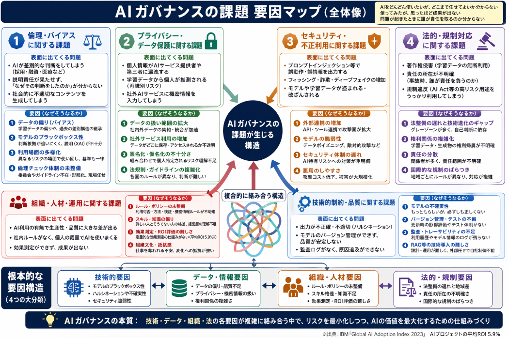

先週に続き、the AI utilizeについて考察していきます。
今回はAIのトレンドについてではなく、AIに仕事を任せていくことについての考察です。

## AIに仕事を任せる変化
まずは問題提起です。ここ3年くらいでぐっとAI活用が浸透してきました。
そんな中で組織における仕事の委譲はどう変化したかについて調べていきます。

「AIにどこまで仕事を任せられるか」という観点で、過去と比べて大きく変わっているのは、**「単純な作業の自動化」から「判断を含む業務の自動化・AIエージェントによるタスク完遂」へ**と、任せる範囲が広がっている点です。

以下、定量的な根拠とともに、どのように「任せる範囲」が変化しているかを整理します。

### 1. 自動化できる業務の割合が増えている（HR領域の例）

**マッキンゼーの「HR Monitor 2025」** によると、人事（HR）業務では次のような変化が起きています。

- **HR業務全体の約3分の1がAIで自動化可能**と評価されています[スクーティー（マッキンゼー HR Monitor 2025の紹介）](https://blog.scuti.jp/ai-transforms-hr-mckinsey-2025-survey-shocking-reality/)。
- 現在、先行して自動化されているのは  
  - タイムトラッキング・休暇管理（23%）  
  - 従業員データ管理（21%）  
  などですが、今後は採用・評価・育成など、より判断を伴う領域にも広がると見られています。
- AIとSSC（シェアードサービスセンター）の活用により、**管理職1人あたりの担当者数が70名から200名へ約3倍**に増加した事例も報告されています[スクーティー（マッキンゼー HR Monitor 2025の紹介）](https://blog.scuti.jp/ai-transforms-hr-mckinsey-2025-survey-shocking-reality/)。

これは、**「事務的な記録・集計」だけでなく、「誰を採用するか」「誰にどのようなフィードバックを与えるか」といった、より高度な判断を含む業務までAIが関与し始めている**ことを示しています。

### 2. 生成AIの導入率と「任せる業務の幅」の拡大

**PwCの「生成AIに関する実態調査 2025春 5カ国比較」** では、日本企業の生成AI活用状況が次のように報告されています。

- 生成AIを「既に活用している」「具体的な案件を推進中」「検討中」を合わせた割合は**55%**[PwC Japan](https://www.pwc.com/jp/ja/knowledge/thoughtleadership/generative-ai-survey2025.html)。
- 期待効果として最も多いのは  
  - 労働時間の削減  
  - 生産性向上による売上増加  
  などですが、**「商品・サービスの差別化」「新規ビジネスの創出」といった、より戦略的な領域での活用**も増えています[PwC Japan](https://www.pwc.com/jp/ja/knowledge/thoughtleadership/generative-ai-survey2025.html)。

**総務省「令和7年版情報通信白書」** の調査では、  
- 2025年初頭時点で、**日本企業の55.2%が何らかの業務で生成AIを活用**していると回答しています[インソース（総務省情報通信白書の引用）](https://www.insource.co.jp/ihl/251125_happiness-planet-fira.html)。

数年前までは「メールの文章校正」「簡単な翻訳」など、**ごく限られた補助的な作業**にAIを使うケースが多かったのに対し、現在は「企画書作成」「データ分析」「顧客対応の自動化」など、**より広い業務範囲でAIに任せる**方向にシフトしています。

### 3. 「対話型AI」から「AIエージェント」へ：任せるタスクの質の変化

**インソースの記事**では、従来の対話型AIとAIエージェントの違いが次のように整理されています[インソース](https://www.insource.co.jp/ihl/251125_happiness-planet-fira.html)。

- **対話型AI（ChatGPT、Copilotなど）**  
  - ユーザーが質問・指示を出すたびに、**受動的に応答**する  
  - できること：文章作成、情報収集、アイデア出し、翻訳・要約など
- **AIエージェント**  
  - 目的を達成するために、**自律的・能動的に行動**する  
  - 例：「外国人労働者の受け入れ状況を国別に比較して表にまとめたレポートを作成して」と指示すると、  
    → 検索 → 表作成 → PDF出力 まで**複数ステップを自動で実行**[インソース](https://www.insource.co.jp/ihl/251125_happiness-planet-fira.html)

つまり、**「指示を細かく出して、AIに作業をしてもらう」段階から、「最終成果物を任せる」段階**へと、任せるタスクの質が変わっています。

### 4. 専門領域での「任せる範囲」の拡大（製造・調査など）

**製造業のAI活用事例**では、次のような変化が報告されています。

- 年間**186,000時間の削減**や、検査の**見逃し率ゼロ化**など、生産現場での大幅な自動化・省人化が進んでいます[エクサウィザーズ](https://exawizards.com/column/article/ai/ai-cases-of-manufacturing/)。
- 以前は「異常検知アラート」など、**人間が判断する前提の補助**が中心でしたが、現在は「異常の自動判定」「最適な保全タイミングの提案」など、**判断を含む業務もAIに任せる**方向に進んでいます。

**マクロミルの市場調査業界のレポート**では、  
- 「2024年は生成AIが調査業界の中心に置かれた年だった」とされ、  
  アンケート設計、レポート作成、データ解釈など、**従来は専門家が担っていた業務の一部をAIに任せる**動きが進んでいると指摘されています[マクロミル note](https://note.com/macromill/n/n343ad01d464d)。

 
### 5. 定量的にみる「任せる範囲」の変化（まとめ）

| 観点 | 過去（〜数年前） | 現在（2024–2025年） | 定量的な変化 |
|------|------------------|---------------------|----------------|
| **自動化可能な業務の割合** | 一部の定型作業のみ | HR業務の**約1/3が自動化可能**と評価[スクーティー](https://blog.scuti.jp/ai-transforms-hr-mckinsey-2025-survey-shocking-reality/) | 自動化対象が大幅に拡大 |
| **導入率（日本企業）** | 一部の先進企業のみ | **55.2%** が生成AIを何らかの業務で活用[インソース](https://www.insource.co.jp/ihl/251125_happiness-planet-fira.html) | 導入企業が急増 |
| **任せるタスクの質** | 翻訳・要約・簡単な文章作成など | 企画書作成、データ分析、顧客対応、採用業務、設計支援など | **判断・企画を含む業務**へ拡大 |
| **AIの役割** | 補助的な対話ツール | AIエージェントによる**タスク完遂・複数ステップの自動実行**[インソース](https://www.insource.co.jp/ihl/251125_happiness-planet-fira.html) | 「指示を出す相手」から「タスクを任せる相手」へ |
| **管理可能な人数（HR例）** | 管理職1人あたり70名程度 | AI活用により**200名まで3倍化**[スクーティー](https://blog.scuti.jp/ai-transforms-hr-mckinsey-2025-survey-shocking-reality/) | 1人がカバーできる範囲が拡大 |

### 結論

過去と比べて、AIに任せられる仕事の範囲は、

- **量的に**：自動化可能な業務の割合が増え（例：HR業務の約1/3）、導入企業も半数を超える水準に達している。
- **質的に**：単純な補助作業から、企画・判断・顧客対応・設計支援など、**より高度で複雑な業務**に広がっている。
- **役割的に**：対話型の「アシスタント」から、自律的にタスクを完遂する「AIエージェント」へと移行しつつある。

という変化が起きています。

一方で、IBMの調査ではAIプロジェクトのROIがまだ低いことや、多くの企業がAI投資から十分な価値を生み出せていないことも指摘されており[IBM](https://www.ibm.com/jp-ja/think/insights/ai-roi)、「どこまで任せるか」だけでなく、「どう管理・評価するか」というガバナンス面の課題も同時に大きくなっている、というのが現状です。

## ガバナンスの課題の要因

AIをどう管理、評価するかのガバナンスの本質課題が分かるように要因分析していきます。
AIガバナンスの課題を要因分析すると、大きく次のような構造になっています。

### 1. 倫理・バイアスに関する課題

**表面に出てくる問題**
- AIが差別的な判断をしてしまう（採用・融資・医療など）
- 説明責任が果たせず、「なぜその判断をしたのか」が分からない
- 社会的に不適切なコンテンツを生成してしまう

**要因分析（なぜそうなるか）**

1. **データの偏り（バイアス）**
   - 学習データに特定の属性（性別・人種・地域など）が過少・過多に含まれている
   - 過去の人間の判断を学習することで、既存の差別構造をそのまま引き継いでしまう

2. **モデルのブラックボックス性**
   - 深層学習モデルは内部の判断根拠が人間には追いにくい
   - 「なぜその結論に至ったか」を説明する仕組み（Explainable AI）が十分でない

3. **利用場面の多様化**
   - 同じモデルを「医療」「人事」「金融」など、異なるリスクレベルの場面で使い回す
   - 各領域で求められる倫理基準・リスク許容度が異なるのに、一律に運用してしまう

4. **組織内の倫理チェック体制の未整備**
   - 倫理審査委員会やAI倫理ガイドラインが存在しない、または形骸化している
   - 現場の判断で「とりあえず使ってみる」運用になりがち

### 2. プライバシー・データ保護に関する課題

**表面に出てくる問題**
- 個人情報がAIサービス提供者や第三者に漏洩する
- 学習データに含まれる個人情報が推論結果から推測される（再識別リスク）
- 社外AIサービスに機密情報を入力してしまう

**要因分析**

1. **データの扱い範囲の拡大**
   - AIは大量のデータを必要とするため、社内外のデータを集約・統合する動きが加速
   - これまで別々に管理されていたデータが、AIプラットフォーム上で一元管理される

2. **社外クラウド・AIサービスの利用増加**
   - ChatGPTやCopilotなど、外部サービスにデータを送るケースが増加
   - データがどこに保存され、誰がアクセスできるかの管理が難しくなる

3. **匿名化・仮名化の不十分さ**
   - 単純な匿名化では、他のデータと組み合わせることで個人が特定されるリスクがある
   - 生成AIの学習データから個人情報が推測される可能性への理解が浅い

4. **法規制・ガイドラインの複雑化**
   - GDPR、個人情報保護法、AI法（EU AI Act）など、各国・地域でルールが異なる
   - グローバル企業は「どのルールをどこまで適用するか」の判断が難しくなる

### 3. セキュリティ・不正利用に関する課題

**表面に出てくる問題**
- AIモデルが悪意あるプロンプトで誤動作・誤情報を出力する（プロンプトインジェクション）
- AIを悪用したフィッシングメール・詐欺・ディープフェイクの増加
- モデルや学習データが盗まれる・改ざんされる

**要因分析**

1. **外部API・ツール連携の増加**
   - AIエージェントがWeb検索やメール送信、DB操作など外部システムと連携する
   - 連携経路が増えるほど、攻撃面（Attack Surface）が広がる

2. **モデルそのものの脆弱性**
   - 学習データに悪意あるデータを混入させる攻撃（Data Poisoning）
   - 推論時に特定の入力で誤った出力を誘発する攻撃（Adversarial Attack）

3. **組織のセキュリティ体制の遅れ**
   - AI特有のリスク（プロンプトインジェクション、モデル窃取など）への対策が未整備
   - AIシステムを既存のセキュリティポリシーにうまく統合できていない

4. **悪用のしやすさ**
   - 生成AIを使えば、誰でもそれなりの品質の偽情報・偽画像を作れる
   - 攻撃コストが下がり、被害規模が大きくなりやすい

### 4. 法的・規制対応に関する課題

**表面に出てくる問題**
- 著作権侵害（学習データに無断利用されたコンテンツが含まれる）
- 責任の所在が不明確（AIが事故を起こした場合、誰が責任を負うのか）
- 規制違反（EU AI Actなどで禁止・高リスクとされる用途をうっかり使ってしまう）

**要因分析**

1. **法整備のスピードと技術進化のギャップ**
   - AI技術の進化が速く、法律・規制が追いついていない
   - 「グレーゾーン」の利用が多く、現場では自己判断に頼らざるを得ない

2. **権利関係の複雑化**
   - 学習データの権利（著作権・肖像権・データベース権など）が複雑
   - 生成物の権利帰属（誰が著作権を持つのか）が明確でないケースが多い

3. **責任の分散**
   - AIモデル提供者、システム開発者、利用企業、利用者個人など、関係者が多い
   - 事故が起きたとき、どの主体がどの範囲で責任を負うかが不明確

4. **国際的な規制のばらつき**
   - EUはAI Actで厳格な規制を導入、他地域はまだ緩やか、など差がある
   - グローバル企業は「最も厳しい地域のルール」に合わせる必要があり、コスト・運用負担が大きい

### 5. 組織・人材・運用に関する課題

**表面に出てくる問題**
- AIを使っている部署と使っていない部署で生産性・品質に大きな差が出る
- 社内ルールがなく、個人の裁量でAIを使いまくる
- 効果測定ができず、「使っているけど成果が出ていない」状態が続く

**要因分析**

1. **ルール・ポリシーの未整備**
   - 「どの業務でAIを使っていいか／ダメか」が明確でない
   - プロンプトの書き方、出力の検証方法、機密情報の扱いなど、運用ルールが不足

2. **スキル・知識の偏り**
   - AIに詳しい人とそうでない人の間に大きな知識格差がある
   - 経営層がAIのリスク・可能性を十分理解しておらず、適切な投資判断ができない

3. **効果測定・ROI評価の難しさ**
   - 生産性向上やコスト削減の効果を定量的に測る仕組みがない
   - IBMの調査では、AIプロジェクトのROIが平均5.9%と低く、投資に見合う成果が出ていないケースが多い[IBM](https://www.ibm.com/jp-ja/think/insights/ai-roi)

4. **組織文化・抵抗感**
   - 「AIに仕事を奪われる」という不安から、現場がAI導入に消極的
   - 既存の業務プロセスを変えることへの抵抗感が強い

### 6. 技術的制約・品質に関する課題

**表面に出てくる問題**
- AIの出力が不正確・不適切（ハルシネーション）
- モデルのバージョン管理ができておらず、品質が安定しない
- 監査ログが取れず、問題発生時の原因追及ができない

**要因分析**

1. **モデルの不確実性**
   - LLMは「もっともらしい」回答を出すが、必ずしも正しいとは限らない
   - 専門性の高い領域では、誤情報を出しても気づきにくい

2. **バージョン管理・テストの不備**
   - モデル更新時に性能が変わっても、その影響を評価するテスト体制がない
   - 本番環境でいきなり新しいモデルを使い、品質トラブルが発生する

3. **監査・トレーサビリティの不足**
   - 「誰が、いつ、どのプロンプトで、どのモデルを使ったか」のログが残っていない
   - 問題発生時に原因特定ができず、再発防止策も立てられない

4. **RAGなどの技術導入の難しさ**
   - Retrieval-Augmented Generation（RAG）など、精度向上の技術があるが、設計・運用が難しい
   - 社内の専門家が少なく、外部ベンダー任せになり、自社で制御できない

### 7. ガバナンス課題の「要因マップ」としての整理

上記をまとめると、AIガバナンスの課題は次のような要因構造になっています。

- **技術的要因**  
  - モデルのブラックボックス性  
  - ハルシネーションや不確実性  
  - セキュリティ脆弱性  
- **データ・情報要因**  
  - データの偏り・品質不足  
  - プライバシー・機密情報の扱い  
  - 権利関係の複雑さ  
- **組織・人材要因**  
  - ルール・ポリシーの未整備  
  - スキル格差・知識不足  
  - 効果測定・ROI評価の難しさ  
- **法的・規制要因**  
  - 法整備の遅れと地域差  
  - 責任の所在の不明確さ  
  - 国際的な規制のばらつき  

これらが複合的に絡み合うことで、  
「AIをどんどん使いたいが、どこまで任せてよいか分からない」「使ってみたが、思ったほど成果が出ない」「問題が起きたときに誰が責任を取るのか分からない」  
といったガバナンス上の課題が顕在化している、という構造になっています。

### 実務的な示唆

- **ルール整備**：  
  「どの業務でAIを使うか／使わないか」「機密情報の扱い」「出力の検証方法」などを明文化する必要があります。
- **教育・トレーニング**：  
  現場の従業員だけでなく、経営層も含めてAIのリスクと可能性を理解させる教育が重要です。
- **監査・ログの仕組み**：  
  「誰がどのモデルをどう使ったか」を追跡できる仕組みがないと、問題発生時の原因究明ができません。
- **段階的な導入**：  
  いきなり全社一斉導入ではなく、リスクの低い領域から始めて、ルールとノウハウを蓄積していくアプローチが現実的です。

このように、AIガバナンスの課題は「技術」「データ」「組織」「法規制」の複数の要因が絡み合っており、単一の対策では解決できない、というのが現状です。

## AI変化に合わせた付き合い方

ここまでで、AIに仕事を任せることの課題について深堀しました。
では、そんな課題と向き合いながらAIを使って自分や組織の効率を上げていくにはどうしたらよいでしょうか。

### 1. 個人としてどう向き合うか

__（1）AIを「使うスキル」ではなく「任せるスキル」として身につける__

- **単なるツール操作ではなく、「どこまで任せられるか」を見極める**  
  - 例：  
    - 翻訳・要約・下書き作成 → ほぼ任せてよい  
    - 顧客への最終回答・契約条件の決定 → 人間が必ずチェック  
  - 「このタスクはAIに任せてもリスクが低いか？」を常に自問する。

- **プロンプト設計の精度を上げる**  
  - 「○○について教えて」ではなく、  
    - 目的  
    - 対象読者  
    - 形式（箇条書き、A4 1枚、表形式など）  
    - 制約（社内ルール、機密情報の扱い）  
    を明示する。
  - これにより、AIの出力品質と安全性が上がり、後工程の修正コストが減ります。

__（2）「AI依存」ではなく「AI協働」のマインドセットを持つ__

- **AIの出力をそのまま使わない**  
  - 事実確認、論理の整合性チェック、社内ルールとの整合性確認を必ず行う。
  - 特に数字・日付・固有名詞は、AIのハルシネーションが起きやすいので要注意。

- **自分の専門性とAIの強みを組み合わせる**  
  - AI：大量情報の整理、下書き作成、定型作業の自動化  
  - 人間：判断、価値観、倫理、創造性、対人コミュニケーション  
  - 「AIに任せられる部分を外注し、自分はより付加価値の高い仕事に集中する」という発想を持つ。

__（3）プライバシー・機密情報の扱いを徹底する__

- **社外AIサービスに機密情報を入力しない**  
  - 社内ポリシーで禁止されている場合はもちろん、禁止されていなくても、  
    - 顧客情報  
    - 経営戦略情報  
    - 未公開の技術情報  
    などは原則入力しない。
- **必要なら社内AI環境やローカルLLMを検討する**  
  - データを外部に出さずに済む仕組みがあれば、リスクを下げながら効率化できる。

### 2. 組織としてどう向き合うか

__（1）AIガバナンスの「土台」を整える__

- **AI利用ポリシーの明確化**  
  - どの業務でAIを使っていいか／ダメか  
  - 機密情報の扱い（社外サービスへの入力可否）  
  - 出力の検証責任（誰が最終チェックするか）  
  - 著作権・倫理的な制約（差別的表現の禁止など）  
  を文書化し、全社に周知する。

- **AI委員会・CoE（Center of Excellence）の設置**  
  - IT部門だけでなく、法務・人事・事業部門も参加させる。  
  - 新しいAIツール・ユースケースが出てきたときに、  
    - リスク評価  
    - ルールの更新  
    を行う窓口を明確にする。

__（2）教育・トレーニングを体系的に行う__

- **全社員向けのAIリテラシー研修**  
  - AIの仕組み（ブラックボックス性、ハルシネーションなど）  
  - リスク（プライバシー、バイアス、セキュリティ）  
  - 基本的なプロンプト設計  
  を理解させる。

- **管理職向けの「AI活用とマネジメント」研修**  
  - チーム内でのAI活用ルールの設定  
  - 成果評価（KPI設定）  
  - 部下のAIスキル育成  
  を担えるようにする。

__（3）効果測定・ROI評価の仕組みを作る__

- **「使っているだけ」から「成果を測る」へ**  
  - 例：  
    - レポート作成時間の短縮（時間）  
    - 顧客対応の自動化による問い合わせ対応件数の増加  
    - エラー率の低下  
  - IBMの調査では、AIプロジェクトのROIが平均5.9%と低く、多くの企業が十分な価値を生み出せていないと指摘されています[IBM](https://www.ibm.com/jp-ja/think/insights/ai-roi)。  
    効果を測らないと、「導入したが成果が出ない」状態が続きます。

- **小規模なPoC（概念実証）から始める**  
  - いきなり全社展開せず、特定部署・特定業務で試し、  
    - 効果  
    - 課題  
    - 必要なルール  
  を明確にしてから拡大する。

__（4）AIエージェント時代を見据えた業務設計__

- **「AI前提の業務プロセス」に再設計する**  
  - 従来の「人間がすべてやる」前提のフローを、  
    - AIが担当するステップ  
    - 人間が担当するステップ  
    に分ける。
  - 例：  
    - AI：顧客問い合わせの一次対応、資料の下書き作成  
    - 人間：最終回答の確認、顧客との関係構築

- **AIエージェントの活用を段階的に進める**  
  - まずは単一タスク（例：議事録自動生成）から始め、  
  - 徐々に複数ステップを自動化するエージェント（例：リサーチ→資料作成→共有まで）に拡大する。

### 3. 今後のAI発展を踏まえた中長期的な視点

__（1）AIエージェント・マルチモーダルへの対応__

- **「指示を出す相手」から「タスクを任せる相手」へ**  
  - 今後は、AIが自律的に情報収集・判断・実行を行うエージェントが普及します[インソース](https://www.insource.co.jp/ihl/251125_happiness-planet-fira.html)。  
  - 個人としては、「何を任せ、何を自分でやるか」の線引きを明確にし、  
  - 組織としては、「エージェントの行動範囲」「監視・介入のルール」を設計する必要があります。

- **マルチモーダルAI（テキスト＋画像＋音声）の活用**  
  - 会議の音声から議事録生成、画像から図表を読み取り解析、などが可能になります。  
  - ただし、プライバシー・機密情報の扱いがより複雑になるため、  
    - 録音・録画の許可  
    - データ保存期間  
    - アクセス権限  
    を厳格に管理する必要があります。

__（2）RAG（Retrieval-Augmented Generation）など技術の活用__

- **社内ナレッジとAIを連携させる**  
  - RAGを使うと、社内文書・マニュアルをAIに参照させ、より正確な回答を得られます。  
  - ただし、  
    - 参照元の権利・機密性  
    - 情報の更新頻度  
    - アクセス制御  
    をきちんと設計しないと、古い情報や機密情報が漏れるリスクがあります。

__（3）「AIと人間の役割分担」を継続的に見直す__

- AIの性能は今後も上がり続けるため、  
  - 今は人間がやっている仕事の一部がAIに移る  
  - 逆に、AIの限界が明らかになり、人間の役割が再定義される  
  という変化が続きます。

- 個人・組織ともに、  
  - 定期的に「AIに任せられる範囲」と「人間がやるべきこと」を見直し、  
  - スキルアップ・役割変更を継続的に行う  
  ことが重要です。

## まとめ：個人と組織が取るべき具体的な行動

**個人レベルで**
- AIを「任せる相手」として使いこなし、プロンプト設計と出力検証のスキルを磨く  
- プライバシー・機密情報の扱いを徹底し、社外サービスへの入力は慎重に行う  
- AI依存ではなくAI協働の姿勢を持ち、自分の専門性を高める方向に時間を使う

**組織レベルで**
- AI利用ポリシーとガバナンス体制（委員会・CoE）を整備する  
- 全社員・管理職向けのAIリテラシー教育を実施する  
- 効果測定・ROI評価の仕組みを作り、PoCから段階的に拡大する  
- AIエージェント時代を見据え、「AI前提の業務プロセス」に再設計する

AIの発展は止まらないため、「どこまで任せるか」「どう管理するか」を常にアップデートし続けることが、個人の仕事の効率向上と、組織全体の持続的な成長につながります。
前回と、なんか、、、似たまとめになってきました。

もともと似たような問題だったからでしょうか。
次回はもう少し系統を変えて考察していきます。

ここまで御覧頂きありがとうございました。

