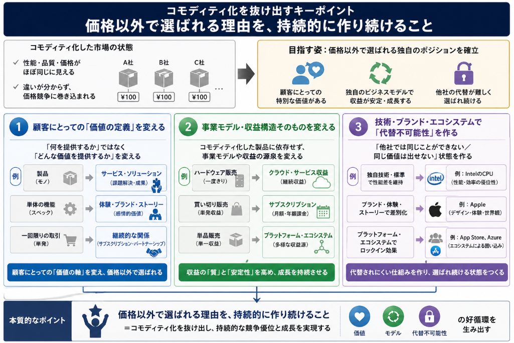

過去反映した企業が廃れていく要因の中で、内的・外的要因両方が関係するものとして**コモディディ化**があります。
今回はコモディティ化について説明を行っていきます。

## コモディティ化とは

コモディティ化（commoditization）とは、もともと差別化されていた製品やサービスが、時間の経過とともに「どれも似たようなもの」と見なされ、価格以外で差をつけにくくなる現象を指します。

典型的には、次のような特徴があります。

- **差別化要因の喪失**  
  初期には性能・デザイン・ブランドなどで差別化されていたものが、技術の普及や模倣によって、他社製品とほとんど差がなくなる。

- **価格競争が中心になる**  
  消費者から見て「A社もB社もほぼ同じ」と感じられると、購入判断の基準が価格に集中し、企業は値下げ競争に巻き込まれやすくなる。

- **利益率の低下**  
  価格競争が激しくなると、1つあたりの利益（マージン）が圧迫され、企業の収益性が下がりやすい。

- **消費者にとっては選択が単純化**  
  ブランドや機能差をあまり気にせず、「安い方を選ぶ」という行動が増える。

身近な例としては、以下のようなものがあります。

- **家電製品**  
  かつてはブランドや性能で差別化されていたテレビ・冷蔵庫などが、技術の成熟で多くのメーカーが似た性能を提供するようになり、価格が重要な選択基準になる。

- **PC・スマートフォン**  
  特に中〜低価格帯では、多くのメーカーの製品が似たスペック・デザインになり、価格やキャンペーンで選ばれることが増える。

- **原材料・エネルギー**  
  石油・小麦・鉄鋼などは、品質が標準化されており、基本的には「どこから買ってもほぼ同じ」と見なされる典型的なコモディティです。

企業側から見ると、コモディティ化は「差別化が難しくなり、価格競争に巻き込まれる」というリスクですが、一方で消費者にとっては「安くて十分な品質の製品が手に入りやすくなる」というメリットにもなります。

要するに、**「特別なもの」が「どこにでもある普通のもの」になる**プロセスがコモディティ化、と理解すると分かりやすいです。

## コモディディ化が進むメカニズム
次にコモディティ化が進んでいくメカニズムについて説明を行います。
コモディティ化が進むメカニズムは、大きく分けて次のような流れで説明できます。

### 1. 初期段階：差別化された製品・サービスの登場

- ある企業が、新しい技術・デザイン・ブランド戦略などで、他社と明確に異なる製品・サービスを市場に投入します。
- 消費者は「他にはない価値」を感じ、価格が高くても購入する傾向があります。
- この段階では、企業は高い利益率を維持できます。

### 2. 模倣と普及：他社が参入し、差が縮まる

- 成功した製品・サービスを見て、他社も似たようなものを開発・販売し始めます。
- 技術が成熟し、部品や製造方法が標準化されると、多くの企業が同じような性能・品質の製品を安く作れるようになります。
- 結果として、市場には「似たような製品」が大量に出回り、**性能や品質の差が目立たなくなる**。

### 3. 顧客の学習と価値観の変化

- 消費者は経験を重ねるうちに、「どのメーカーの製品でも、必要な性能はだいたい満たされている」と学習します。
- 性能差をあまり重視しなくなり、「そこそこの品質で安ければ十分」という価値観が広がります。
- ブランドへのこだわりも薄れ、「どこの製品でも大差ない」と感じる人が増えます。

### 4. 選択基準の変化：価格が最重要になる

- 性能・品質・ブランドに大きな差がないと感じられると、消費者は**価格**を最も重要な選択基準にします。
- 企業は「性能で勝負」から「価格で勝負」にシフトせざるを得なくなり、値下げ競争が始まります。

### 5. 利益率の低下とコスト削減競争

- 価格競争が激しくなると、1つあたりの利益（マージン）がどんどん下がります。
- 企業は生き残るために、**コスト削減（人件費・材料費・製造効率など）** に力を入れ始めます。
- その結果、製品はさらに「どこでも作れる普通のもの」になり、差別化がますます難しくなります。

### 6. 標準化・規格化による互換性の向上

- 業界全体で共通の規格や標準が広がると、部品やシステムの互換性が高まります。
- 消費者は「A社の製品でもB社の部品でも同じように使える」と感じ、特定のブランドにこだわる理由が減ります。
- これもコモディティ化を加速させます。

### 7. 企業側の対応の遅れ：過去の成功モデルへの執着

- かつては「高性能・高価格」で成功していた企業が、そのモデルを変えられず、市場の変化に気づかないまま高価格を維持し続けることがあります。
- その結果、消費者は「同じような性能なら、もっと安い他社製品を選ぶ」ようになり、その企業の製品は「高いだけの普通の製品」と見なされていきます。

### メカニズムのまとめ

コモディティ化が進む流れを簡潔にまとめると、次のようになります。

1. **差別化された製品が登場**  
2. **他社が模倣し、技術が成熟・標準化**  
3. **性能差が縮まり、多くの企業が似た製品を提供**  
4. **消費者が「どれも同じ」と学習し、価格を重視**  
5. **企業は価格競争とコスト削減に追い込まれる**  
6. **製品はさらに「普通のもの」になり、差別化が困難になる**

このように、**技術の成熟・模倣の増加・消費者の学習・価格重視へのシフト・コスト競争**が連鎖的に進むことで、コモディティ化が進行していきます。

## 生存を続けた企業と廃れた企業

コモディティ化から**脱皮して繁栄を続けた企業**と、**コモディティ化や技術変化に適応できず衰退した企業**の代表例を挙げます。
但し、脱皮を何度も繰り返したというような事例はなかなか見つかりませんでした。
1度でも大きな脱皮が出来た企業とみてください。

### コモディティ化から脱皮を繰り返し、繁栄を続けた企業

__IBM（アイ・ビー・エム）__

- **初期のコモディティ化**  
  大型コンピュータ（メインフレーム）で成功しましたが、その後PC市場が拡大し、ハードウェアは徐々にコモディティ化していきました。
- **脱皮のプロセス**  
  1990年代以降、ハードウェア中心から**コンサルティング・ITサービス・ソフトウェア**へと事業を転換。さらに近年は**クラウド・AI・ブロックチェーン**など次世代技術に注力し、ハードウェア依存から脱却しています[Digital Innovation and Transformation](https://d3.harvard.edu/platform-digit/submission/transformation-of-big-blue/)。
- **ポイント**  
  ハードウェアがコモディティ化しても、**サービス・ソリューション・プラットフォーム**で差別化を続け、生き残りを図っています。

__Microsoft（マイクロソフト）__

- **初期のコモディティ化**  
  Windows＋Officeは事実上の標準となりましたが、PC市場の成熟とともに「OSやオフィスソフトはどれも似たようなもの」という見方が強まりました。
- **脱皮のプロセス**  
  2000年代以降、**クラウド（Azure）** 、**サブスクリプション（Office 365→Microsoft 365）** 、**企業向けサービス**、**AI・開発者ツール**などへ事業を拡大。PC依存から脱し、クラウドとエコシステムで収益を立てる構造に変えています[Strategy&](https://www.strategy-business.com/article/The-New-Game-of-Global-Tech)。
- **ポイント**  
  一度コモディティ化しかけた「ソフトウェア製品」を、**クラウドサービスとサブスクリプション**という形で再差別化しました。

__Intel（インテル）__

- **初期のコモディティ化**  
  もともとはメモリ（DRAM）で成功していましたが、メモリはコモディティ化が進み、価格競争が激化しました。
- **脱皮のプロセス**  
  1980年代にメモリから撤退し、**マイクロプロセッサ（CPU）** へ事業を集中。PC時代の「Intel Inside」でブランドを確立し、その後もサーバー向けやデータセンター向けチップへと事業を広げています[Quora](https://www.quora.com/What-companies-have-successfully-reinvented-themselves-multiple-times)。
- **ポイント**  
  コモディティ化したメモリから、**高付加価値の半導体（CPU）** へと事業を転換することで、価格競争から脱出しました。

__Apple（アップル）__

- **初期のコモディティ化**  
  1990年代にはPC市場全体がコモディティ化し、Macも「高価なPCの一つ」という位置づけに追い込まれていました。
- **脱皮のプロセス**  
  2000年代以降、**iPod→iPhone→iPad**とハードウェアを刷新し、さらに**iOS・App Store・サービス（Apple Music、iCloudなど）** でエコシステムを構築。ハード単体ではなく、**ハード＋ソフト＋サービス＋ブランド体験**で差別化しています[TIME](https://business.time.com/2012/03/16/how-apple-made-vertical-integration-hot-again-too-hot-maybe/print/)。
- **ポイント**  
  PCがコモディティ化しても、**新しいカテゴリのデバイスとサービス**で何度も事業を再定義し、価格競争を避けています。

### コモディティ化や技術変化に適応できず、衰退した企業

__Nokia（ノキア）__

- **コモディティ化の状況**  
  フィーチャーフォン時代には世界トップシェアを誇りましたが、多くのメーカーが似たような携帯電話を出し、機能差が縮小。価格競争が激化しました。
- **失敗の理由**  
  スマートフォンへの移行が遅れ、OS戦略（SymbianからWindows Phoneへの転換など）も失敗。**コモディティ化したフィーチャーフォンに依存し続け、新しいスマートフォン市場のルールに適応できなかった**ことが大きな要因とされています[FasterCapital](https://fastercapital.com/ja/content/%E3%83%96%E3%83%A9%E3%83%B3%E3%83%89-%E3%81%AE%E8%A1%B0%E9%80%80--%E6%A0%84%E5%85%89%E3%81%8B%E3%82%89%E9%99%B0%E9%AC%B1%E3%81%B8--%E3%83%96%E3%83%A9%E3%83%B3%E3%83%89%E8%A1%B0%E9%80%80%E3%81%AE-%E3%82%B1%E3%83%BC%E3%82%B9%E3%82%B9%E3%82%BF%E3%83%87%E3%82%A3.html)。

__Kodak（コダック）__

- **コモディティ化の状況**  
  フィルムカメラ時代には絶対的な王者でしたが、フィルムは典型的なコモディティであり、価格競争が起こりやすい領域でした。
- **失敗の理由**  
  デジタルカメラ技術を自社で開発しながらも、**フィルム事業の収益を守ることを優先し、デジタルへの本格的な転換が遅れた**と指摘されています[FasterCapital](https://fastercapital.com/ja/content/%E3%83%96%E3%83%A9%E3%83%B3%E3%83%89-%E3%81%AE%E8%A1%B0%E9%80%80--%E6%A0%84%E5%85%89%E3%81%8B%E3%82%89%E9%99%B0%E9%AC%B1%E3%81%B8--%E3%83%96%E3%83%A9%E3%83%B3%E3%83%89%E8%A1%B0%E9%80%80%E3%81%AE-%E3%82%B1%E3%83%BC%E3%82%B9%E3%82%B9%E3%82%BF%E3%83%87%E3%82%A3.html)。  
  コモディティ化したフィルムに依存し続け、デジタル時代の新しい価値（ソフトウェア・サービス・プラットフォーム）へ移行できませんでした。

__Blockbuster（ブロックバスター）__

- **コモディティ化の状況**  
  ビデオ・DVDレンタル店は、店舗数が増えるにつれて「どこの店でも同じような商品・サービス」というコモディティ状態になりました。
- **失敗の理由**  
  オンライン配信（Netflixなど）やサブスクリプションモデルへの移行が遅れ、**物理店舗とレンタル料金モデルに固執**した結果、市場を失いました[FasterCapital](https://fastercapital.com/ja/content/%E3%83%96%E3%83%A9%E3%83%B3%E3%83%89-%E3%81%AE%E8%A1%B0%E9%80%80--%E6%A0%84%E5%85%89%E3%81%8B%E3%82%89%E9%99%B0%E9%AC%B1%E3%81%B8--%E3%83%96%E3%83%A9%E3%83%B3%E3%83%89%E8%A1%B0%E9%80%80%E3%81%AE-%E3%82%B1%E3%83%BC%E3%82%B9%E3%82%B9%E3%82%BF%E3%83%87%E3%82%A3.html)。  
  コモディティ化した「店舗型レンタル」から、「オンライン配信・サブスクリプション」という新しい価値へ脱皮できなかった典型例です。

### 傾向

- **繁栄を続けた企業（IBM・Microsoft・Intel・Appleなど）**  
  コモディティ化した製品や市場から、**サービス・プラットフォーム・新しいカテゴリ・高付加価値部品**などへと事業を転換し、何度も「脱皮」を繰り返しています。

- **衰退した企業（Nokia・Kodak・Blockbusterなど）**  
  コモディティ化した既存事業に依存し続け、**技術革新・顧客価値観の変化・新しいビジネスモデル**への対応が遅れた結果、市場での優位性を失いました。

コモディティ化は「終わり」ではなく、**新しい差別化のきっかけ**と捉え、事業モデルや価値提供の仕組みを変え続けられるかどうかが、企業の明暗を分けるポイントと言えます。

## 脱皮した企業が行ったこと

コモディティ化を乗り越えた企業は、単に「製品を少し変える」だけではなく、**事業モデルや価値提供の仕組みそのものを変える**ことを行っています。代表的な共通パターンを挙げると、次のようになります。

### 1. 製品から「サービス・ソリューション」への転換

- **具体例：IBM、Microsoft**  
  - IBMは、メインフレームやPCなどのハードウェアがコモディティ化していく中で、**コンサルティング・ITサービス・クラウド・AIソリューション**へ事業をシフトしました[Digital Innovation and Transformation](https://d3.harvard.edu/platform-digit/submission/transformation-of-big-blue/)。  
  - Microsoftは、WindowsやOfficeが「どれも似たようなソフト」になりかけたところで、**Azure（クラウド）やMicrosoft 365（サブスクリプション）** といったサービス事業を強化し、製品単体ではなく「サービスとしての価値」で差別化しています[Strategy&](https://www.strategy-business.com/article/The-New-Game-of-Global-Tech)。

- **ポイント**  
  ハードウェアやソフトウェアがコモディティ化しても、**顧客の課題解決全体を請け負うサービス**として価値を再定義することで、価格競争から抜け出しています。

### 2. プラットフォーム・エコシステムの構築

- **具体例：Apple、Microsoft**  
  - Appleは、PCがコモディティ化していく中で、**iPhone＋iOS＋App Store**というエコシステムを作り、ハード単体ではなく「アプリやサービスが豊富な環境」として差別化しました[TIME](https://business.time.com/2012/03/16/how-apple-made-vertical-integration-hot-again-too-hot-maybe/print/)。  
  - Microsoftも、Windowsを単なるOSではなく、**開発者ツール・クラウドサービス・エンタープライズ向けソリューション**と組み合わせたプラットフォームとして再構築しています。

- **ポイント**  
  自社製品を**中心としたエコシステム**にすることで、他社が簡単に真似できない「ネットワーク効果」や「ロックイン効果」を生み出し、コモディティ化を防いでいます。

### 3. 事業ポートフォリオの大胆な転換

- **具体例：Intel**  
  - Intelは、メモリ（DRAM）がコモディティ化し価格競争が激化したため、**マイクロプロセッサ（CPU）** へ事業を集中させました[Quora](https://www.quora.com/What-companies-have-successfully-reinvented-themselves-multiple-times)。  
  - その後も、PC向けだけでなくサーバー・データセンター向けチップなど、高付加価値の半導体分野へポートフォリオを拡大しています。

- **ポイント**  
  コモディティ化した事業から撤退・縮小し、**まだ差別化が可能な高付加価値分野**へ資源を集中させることで、価格競争から離脱しています。

### 4. ブランド・体験・ストーリーによる差別化

- **具体例：Apple、一部の日本企業（例：タニタ、今治タオルなど）**  
  - Appleは、単なる「高性能なPCメーカー」から、「デザイン・使いやすさ・ライフスタイル」を提供するブランドへと変わりました。  
  - 日本でも、今治タオルは「タオルはどれも同じ」というコモディティ状態から、**品質基準・ブランドストーリー・デザイン**で差別化し、高付加価値ブランドとして再構築しています[SKYBABIES JOURNAL](https://www.skybabies.jp/media/corporate-branding-success-story/)。

- **ポイント**  
  製品性能が似通ってきても、**ブランド体験・物語・デザイン**で「同じものではない」と感じさせることで、価格競争を避けています。

### 5. サブスクリプション・利用モデルへの移行

- **具体例：Microsoft、Adobe、Netflix（参考）**  
  - Microsoftは、パッケージソフトの販売から**Microsoft 365（サブスクリプション）** へ移行し、継続的な収益と顧客ロイヤルティを確保しました。  
  - Adobeも、Creative Suiteの買い切り販売から**Creative Cloud（サブスクリプション）** へ転換し、コモディティ化しつつあったデザインソフト市場で優位性を維持しています。

- **ポイント**  
  「一度売り切り」の製品モデルから、「継続的な利用価値」を提供するモデルに変えることで、**顧客との関係性そのもの**を差別化の軸にしています。

### 6. 技術・標準の主導権を握る

- **具体例：Intel、一部の半導体・部品メーカー**  
  - Intelは、CPUの性能・アーキテクチャ・製造プロセスで業界をリードし、「Intel製でなければこの性能は出せない」というポジションを築きました。  
  - 村田製作所なども、セラミックコンデンサやセンシング技術で「代替が難しい技術パートナー」としての地位を確立し、コモディティ化を避けています[SKYBABIES JOURNAL](https://www.skybabies.jp/media/corporate-branding-success-story/)。

- **ポイント**  
  コモディティ化しやすい汎用部品ではなく、**独自技術・標準・仕様**を握ることで、「他社では代替できない」状態を作り出しています。

### 7. 顧客との関係を「取引」から「パートナーシップ」へ変える

- **具体例：製造業からサービス業へ転換した企業（日立、東芝など）**  
  - 日立や東芝は、単に「モノを売る」のではなく、**IoT・AIを活用したソリューション提供**や**保守・運用サービス**を含めた形で顧客と長期契約を結ぶようになっています[NewsPicks](https://newspicks.com/news/4067845/body/)。  
  - これにより、「どこのメーカーの機械でも同じ」というコモディティ状態から、「この企業と組めば全体最適が図れる」という関係性に変えています。

- **ポイント**  
  製品単体の性能ではなく、**顧客の業務全体を支援するパートナー**としての役割を強化することで、価格比較の対象になりにくくしています。

## コモディティ化を乗り越えるために求められること

結局、コモディティ化を抜け出すキーポイントは、**「価格以外の差別化軸を、持続的に作り続けること」** です。
もう少し分解すると、次の3つに集約できます。

### 1. 顧客にとっての「価値の定義」を変える

- コモディティ化した市場では、「性能・品質・価格」がほぼ同じに見えるため、価格競争に巻き込まれます。
- そこで、**「何を提供するか」ではなく「どんな価値を提供するか」** を変える必要があります。
  - 例：  
    - 製品 → サービス・ソリューション  
    - 単体の機能 → 体験・ブランド・ストーリー  
    - 一回限りの取引 → 継続的な関係（サブスクリプション、パートナーシップ）

### 2. 事業モデル・収益構造そのものを変える

- コモディティ化した製品に依存したままでは、利益率が下がり続けます。
- 抜け出すには、**事業モデルや収益の源泉を変える**ことが不可欠です。
  - 例：  
    - ハードウェア販売 → クラウド・サービス収益  
    - 買い切り販売 → サブスクリプション  
    - 単品販売 → プラットフォーム・エコシステムによる収益

### 3. 技術・ブランド・エコシステムで「代替不可能性」を作る

- コモディティ化は「どれも同じ」と見なされる状態です。
- それを防ぐには、**「他社では同じことができない／同じ価値は出せない」** 状態を作ることです。
  - 例：  
    - 独自技術・標準で性能差を維持（IntelのCPUなど）  
    - ブランド・体験・ストーリーで「同じものではない」と感じさせる（Appleなど）  
    - プラットフォーム・エコシステムでロックイン効果を生む（App Store、Azureなど）

つまり **「価格以外で選ばれる理由を、持続的に作り続けること」** 、これがコモディティ化を抜け出すための本質的なポイントです。
