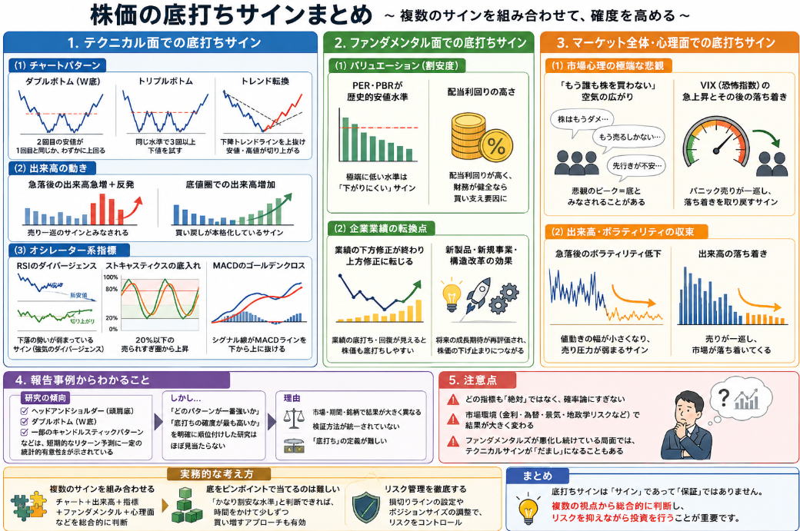

著者は投資はしてますが、日中仕事をしているおかげでアプリを開いて銘柄の金額を見る時間はほとんど取れません。
なので1日1日変動する銘柄の底値を狙いたい、安い時に買いたいというのが投資の姿勢です。
そんな著者なので株価が皆さんが売りまくって安くなり切った**底値**が大好きだったりします。

本日テーマ：
>底値を見分けるサインにはどのようなものがあるか

## 株価の底打ちサイン

株価の「下げ止まり」や「底打ち」を見分けるための、**確実な公式のようなものは存在しません**が、市場参加者がよく注目する「サインになりうるパターン」はいくつかあります。  
以下では、代表的なものを整理してご説明します。

### 1. テクニカル面で見られる「底打ちのサイン」になりうるパターン

__(1) チャートパターン__

- **ダブルボトム（W底）**  
  一度底を打ったあと、再び同じ水準まで下落し、そこから反発するパターン。  
  2回目の安値が1回目と同じか、わずかに上回る（ハイヤーロー）場合、「底打ち」のサインとみなされることが多いです。

- **トリプルボトム**  
  ダブルボトムをさらに一歩進めた形で、同じ水準で3回以上下値を試すパターン。  
  何度も同じ水準で買い支えられていると見なされ、底打ちの可能性が高いと判断されることがあります。

- **上昇トレンドラインへの転換**  
  長期的な下降トレンドラインを上抜けし、**安値が切り上がり、高値も切り上がる**状態になると、トレンド転換のサインとされます。

__(2) 出来高（売買高）の動き__

- **急落後の出来高急増＋反発**  
  急落の末に、**出来高が急増してから反発に転じる**パターンは、「売り一巡」のサインとみなされることがあります。  
  多くの投資家が売り切った後、買いが入りやすくなるという考え方です。

- **底値圏での出来高の増加**  
  長い間低迷した後、底値圏で出来高が徐々に増え始め、価格が上昇に転じるパターンも、**買い戻しが本格化している**サインと解釈されることがあります。

__(3) オシレーター系指標__

- **RSIのダイバージェンス**  
  株価は新安値を更新しているのに、RSI（相対力指数）の安値が切り上がっている場合、**下落の勢いが弱まっている**サインとみなされることがあります。  
  いわゆる「強気のダイバージェンス」と呼ばれるパターンです。

- **ストキャスティクスの底入れ**  
  ストキャスティクスが20％以下の「売られすぎ」圏で底入れし、そこから上昇に転じる場合、短期的な反発のサインとされることがあります。

- **MACDのゴールデンクロス**  
  長期的な下落局面で、MACDのシグナル線がMACDラインを下から上に抜ける（ゴールデンクロス）と、トレンド転換のサインとみなされることがあります。

### 2. ファンダメンタル面で見られる「底打ちのサイン」になりうるパターン

__(1) バリュエーション（割安度）__

- **PER・PBRが歴史的な安値水準**  
  過去のバブル期や高値圏と比べて、PER（株価収益率）やPBR（株価純資産倍率）が**極端に低い水準**まで下落している場合、  
  「これ以上は下がりにくい」と判断されることがあります。

- **配当利回りの高さ**  
  配当利回りが過去平均よりかなり高く、かつ企業の財務が健全であれば、  
  「配当目当ての長期投資家が買い支える」可能性が高まり、下げ止まりの材料とされることがあります。

__(2) 企業業績の転換点__

- **業績の下方修正が終わり、上方修正に転じる**  
  業績悪化が続いていた企業が、**予想以上に悪化しきった**と市場が判断し、  
  その後、業績の底打ち・回復が見えてくると、株価も底打ちしやすくなります。

- **新製品・新規事業・構造改革の効果が出始める**  
  長期的な構造改革や新事業への投資が実を結び始めると、  
  将来の成長期待が再評価され、株価が下げ止まるきっかけになることがあります。

### 3. マーケット全体・心理面で見られる「底打ちのサイン」になりうるパターン

__(1) 市場心理の極端な悲観__

- **「もう誰も株を買わない」という空気**  
  ニュースやSNSで「株はもうダメ」「もう売るしかない」といった極端な悲観論が広がり、  
  それでも株価がそれ以上下がらなくなってきた場合、**悲観のピーク＝底**とみなされることがあります。

- **VIX（恐怖指数）の急上昇とその後の落ち着き**  
  市場の恐怖指数であるVIXが急上昇した後、**高止まりから徐々に低下**し始めると、  
  パニック売りが一巡したサインとみなされることがあります。

__(2) 出来高・ボラティリティの収束__

- **急落後のボラティリティ低下**  
  急落局面では日々の値動きが大きくなりますが、  
  その後、**値動きの幅が小さくなり、出来高も落ち着いてくる**と、  
  売り圧力が弱まり、底打ちに向かっているサインとみなされることがあります。

### 4. 注意点：これらは「サイン」であって「保証」ではない

- どの指標も**過去のデータに基づく確率論**であり、  
  「このパターンが出たら必ず底」というものではありません。
- 市場環境（金利、為替、景気、地政学リスクなど）によって、  
  同じパターンでも結果が大きく変わることもあります。
- 特に、**ファンダメンタルズが悪化し続けている局面**では、  
  テクニカル的な底打ちサインが何度も「だまし」になることもあります。

### 5. 実務的な考え方の例

- **単一の指標に頼らず、複数の指標を組み合わせて判断する**  
  例：  
  - チャートがW底＋出来高急増＋RSIダイバージェンス  
  - PERが歴史的低水準＋業績の下方修正終了＋市場心理が極端に悲観的  
  など、複数のサインが重なると、底打ちの確度が高まると考えられます。

- **「底をピンポイントで当てる」より「底値圏で積み上げる」発想**  
  完全な底を特定することはほぼ不可能なので、  
  「かなり割安な水準」と判断できれば、時間をかけて少しずつ買い増す  
  というアプローチもよく取られます。

## 報告事例から紐解く

上記のようなサインはよくyahooファイナンスの下げすぎ銘柄でも話はよく出てきます。
では一体どれが最も確度が高いのでしょう？

結論から申し上げますと、**「底打ちサインの中で、どれが一番確度が高いか」を直接・網羅的に比較した統一的な研究は、ほとんど存在しないようです。**

ただし、「特定のパターンや指標が、どの程度の予測力を持つか」を個別に検証した研究は多数あります。  
以下、代表的なものを整理します。

### 1. テクニカルパターンの予測力を扱う研究

__(1) チャートパターン全般__

- **「Searching for Patterns in Daily Stock Data: First Steps Towards Data-Driven Technical Analysis」**  
  J.P. Morgan の技術ブログで、機械学習を用いて日次株価データからパターンを抽出し、その予測力を検証する試みが紹介されています[J.P. Morgan Technology Blog](https://www.jpmorgan.com/technology/technology-blog/searching-for-patterns)。  
  ただし、「どのパターンが一番強いか」というランキング形式の結論は示されていません。

- **「Technical patterns and news sentiment in stock markets」**  
  チャートパターンとニュースセンチメントを組み合わせた予測力を検証する研究で、  
  いくつかのパターン（例：ヘッドアンドショルダー、ダブルボトムなど）の異常リターン（CAR）を比較しています[ScienceDirect](https://www.sciencedirect.com/science/article/pii/S2405918824000308)。  
  ただし、こちらも「最も強いパターン」を明示するよりは、**パターン＋センチメントの組み合わせが有効かどうか**に焦点が置かれています。

__(2) ヘッドアンドショルダー（頭肩底）パターン__

- **「The Predictive Power of ‘Head-and-Shoulders’ Price Patterns in the US Stock Market」**  
  ヘッドアンドショルダー（頭肩底を含む）パターンの予測力を、S&P500 のデータで検証した研究です[ResearchGate](https://www.researchgate.net/publication/31474225_The_Predictive_Power_of_Head-and-Shoulders_Price_Patterns_in_the_US_Stock_Market_Gene_Savin)。  
  結果として、**一定の期間では統計的に有意な異常リターンが確認される**ことが示されていますが、  
  他のパターン（ダブルボトムなど）との**直接比較は行っていません**。

__(3) キャンドルスティックパターン__

- **「The predictive power of Japanese candlestick charting in Chinese stock market」**  
  日本のキャンドルスティックパターン（例：明けの明星、三川明けの明星など）が、中国市場でどの程度予測力を持つかを検証した研究です[ScienceDirect](https://ideas.repec.org/a/eee/phsmap/v457y2016icp148-165.html)。  
  一部のパターンで短期的な予測力が確認されていますが、  
  こちらも「どのパターンが一番強いか」というランキングではなく、**各パターンの有無とリターンの関係**を調べる形です。

### 2. テクニカル分析全体の「予測力」をレビューする研究

- **「The Profitability of Technical Analysis: A Review」**  
  テクニカル分析全体の収益性・予測力をレビューしたサーベイ論文です[AgEcon Search](https://ageconsearch.umn.edu/record/37487/files/AgMAS04_04.pdf)。  
  ここでは、移動平均線やRSI、チャートパターンなどが、  
  為替市場や先物市場では一定の収益性を示す一方、  
  株式市場では結果が一貫しないことなどがまとめられています。

ただし、この論文も **「どの指標が一番強いか」を順位付けするものではなく**、  
「テクニカル分析は、どの市場・どの期間でどの程度有効か」というマクロな視点での整理です。

### 3. なぜ「一番確度が高いサイン」を決める研究が少ないのか

1. **市場・期間・銘柄によって結果が大きく変わる**  
   ある市場・ある期間で強いパターンが、別の市場・別の期間では全く機能しないことがよくあります。  
   そのため、「どのパターンが一番強いか」という一般論を出すのが難しいのです。

2. **検証方法が統一されていない**  
   各研究で、  
   - どのパターンを「検出」とみなすか（視覚的判断か、アルゴリズムか）  
   - どの期間のリターンを評価するか（1日後、1週間後、1か月後など）  
   - どの市場・銘柄を対象とするか  
   が異なるため、**結果を単純に比較しにくい**という問題があります。

3. **「底打ち」そのものをどう定義するかが難しい**  
   学術研究では、「底打ち」を  
   - 一定期間の最低値からの反発  
   - あるいは、その後の一定期間の累積リターン  
   など、**客観的な基準で定義**します。  
   しかし、実務でいう「底打ち」は、期間や許容する下落幅によっても解釈が変わるため、  
   研究で「底打ちサイン」を一意に評価するのは難しい側面があります。

### 4. 実務的な示唆

- 研究の傾向としては、  
  - **ヘッドアンドショルダー（頭肩底）**  
  - **ダブルボトム（W底）**  
  - **一部のキャンドルスティックパターン**  
  などが、**短期的なリターン予測に一定の統計的有意性を持つ**ことが示されています。

- しかし、  
  - 「どのパターンが一番強いか」  
  - 「どのパターンが底打ちの確度が最も高いか」  
  を**明確に順位付けした研究は、ほぼ見当たりません。**

- 実務では、  
  - 複数のパターン・指標を組み合わせる  
  - 市場環境（金利、景気、セクターの状況）を考慮する  
  - リスク管理（損切り・ポジションサイズ）を徹底する  
  といった**総合的な判断**が重要になります。

## 最後に

底値を掴むのは非常に難しい話だと思います。
著者自身ここが底と考えてまだ落ちていったことなんて何度もあります。
但し、今持っている銘柄、いずれも月日が経過すると購入した時よりは高くなっています。
日中仕事している分、銘柄をずっと凝視しているわけにはいかないので大体あってればそれで良いと考えるようになりました。
10%程度の含み損ならば、他の銘柄のプラスに埋もれて気にもならず、もっていると半期に一度お金がもらえたり商品がもらえます。

そしてこれくらいの気持ちでいると、テクニカルやチャートの形状で購入して少し低下したなんてどうでもよくなります。
というお話でした。

