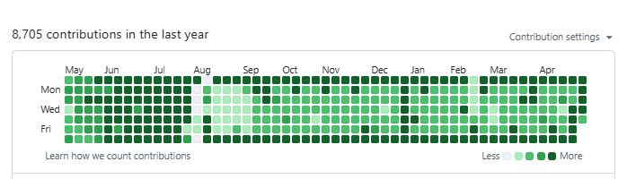

<details>
<summary>異常検知の手法群（ここをクリックして展開）</summary>

# 画像系の異常検知

## ニューラルネットワーク系異常検知

画像内の異常検知（Visual Anomaly Detection）には、先ほどのオートエンコーダ（AE）以外にも、データの性質や精度に合わせていくつかの代表的なアプローチがあります。

大きく分けて以下の4つのカテゴリーに分類できます。

### 1. 再構成ベース（Reconstruction-based）

「正常を学習し、復元できないものを異常とする」手法です。

* **AE (Autoencoder):** 最も基本的。
* **VAE (Variational Autoencoder):** データの分布を学習するため、AEよりノイズに強く、滑らかな復元が可能。
* **GAN (Generative Adversarial Networks):** 敵対的生成ネットワーク。正常画像を生成する能力が非常に高く、精細な異常検知に向く（例：AnoGAN）。

### 2. 特徴量抽出・統計ベース（Embedding-based）

最新の主流手法です。学習済みのAI（ResNetなど）を使って画像の特徴を数値化し、正常データの分布から外れたものを探します。

* **PaDiM:** 画像をパッチ（小さな領域）に分け、各場所の統計的な「正常分布」を記憶する。
* **PatchCore:** 正常な画像の特徴を「メモリバンク」に保存し、テスト画像と照合する。

### 3. 自己教師あり学習ベース（Self-supervised-based）

画像に意図的なノイズや加工を加え、それを元に戻す訓練を通して「正常」を深く理解させる手法です。

* **CutPaste:** 画像の一部を切り取って別の場所に貼るという「擬似的な異常」を自ら作り出し、それを当てる練習をさせる。

### 4. 分離・分類ベース（One-Class Classification）

「正常」を囲う境界線を作る手法です。

* **Deep SVDD:** 正常データが多次元空間上で一つの「点（中心）」に集まるように学習させる。

---

## 非ニューラルネットワーク系

計算負荷が低く、少量のデータでも動作する点や、数学的な説明責任を果たしやすいメリットがあります。

### 統計・確率分布ベース

* **ホテリングの $T^2$ 法:** データが単一の正規分布に従うと仮定。
* **マハラノビス・タグチ法 (MT法):** 相関関係を考慮して「単位空間」を定義。

### 距離・密度ベース

* **k近傍法 (k-NN):** 周りに仲間がいなければ異常と判断。
* **LOF (Local Outlier Factor):** 周囲の密度を考慮。

### 木構造（アンサンブル）ベース

* **アイソレーションフォレスト (Isolation Forest):** 切り分け回数が少ないものを異常とする。

---

## 行列分解

特に「低ランク行列復元」という枠組みで強力です。

#### RPCA (Robust Principal Component Analysis)

入力 $M$ を、低ランク（背景）$L$ とスパース（異常）$S$ に分解します。

### Pythonでの簡易実装イメージ（RPCA風）

```python
import numpy as np

# M: 画像をベクトル化して並べた行列
U, s, Vh = np.linalg.svd(M, full_matrices=False)

# 上位k個の特異値で「正常」を復元
k = 5
L = U[:, :k] @ np.diag(s[:k]) @ Vh[:k, :]

# 残差が「異常」
Anomaly_Sparse = M - L
```

</details>



