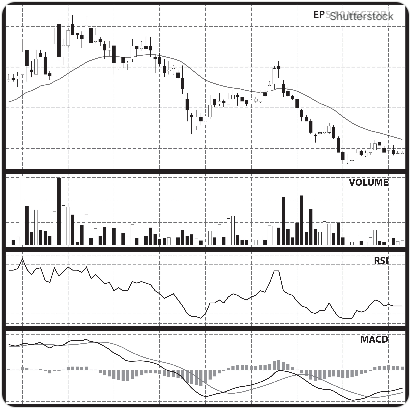

株のトレードをされる方であれば気になっている指標は25日移動平均線やMACD、デッドクロス / ゴールデンクロスなど様々です。
うちデイをされる方がよく使う"RSI"について扱ってみます。

## RSIとは？

RSI（Relative Strength Index：相対力指数）は、一言でいえば **「相場の過熱感（買われすぎ・売られすぎ）」を0〜100%の数値で示す指標** です。

1978年に米国のJ.W.ワイルダーによって考案され、現在でも世界中のトレーダーに最も愛用されているテクニカル指標の一つです。

### 計算方法

RSIは、一定期間（一般的には14日間）の「値上がり幅」と「値下がり幅」を合計し、そのうち **「値上がり幅が何%を占めているか」** を計算したものです。

$$
RSI = \frac{\text{一定期間の上げ幅の合計}}{\text{一定期間の上げ幅の合計} + \text{一定期間の下げ幅の合計}} \times 100
$$

具体例：

10日間のうち、合計で100円上がり、合計で50円下がった場合$$RSI = \frac{100}{100 + 50} \times 100 \approx 66.7\%$$となり、やや強気（買われ気味）な状態であることがわかります。

__見方__

1. 70%以上（買われすぎ）： 相場が過熱しており、そろそろ下落に転じる可能性があるサイン（売り検討）。
2. 30%以下（売られすぎ）： 売られすぎており、そろそろ反発して上昇に転じる可能性があるサイン（買い検討）。
3. 50%（中立）： 強気と弱気が拮抗している状態。50%を上に抜けると上昇トレンド、下に抜けると下降トレンドへの転換と見ることもあります。

## 要注意なパターン

株式のトレードにおいて、RSI（相対力指数）が30%を下回る「売られすぎ」の状態になっても、株価が反発せず低い数値に張り付いてしまうことがあります。

これは通常（レンジ相場）の反発とは異なり、  **「強い下降トレンド」** が発生している際に見られる現象です。通常の反発ケースと、戻らないケースの決定的な違いを解説します。

### 相場環境の違い：レンジかトレンドか

RSIはもともと、一定の幅で株価が上下する「レンジ相場」で威力を発揮する指標です。

* **通常の反発（レンジ相場）：**
株価が一時的に売られすぎると、自律反発を狙った買いが入り、RSIは速やかに中央（50%）に向かって戻ります。
* **戻らない場合（強い下降トレンド）：**
株価の下げ足が速く、かつ継続的な売り圧力がかかっている状態です。RSIは計算式上、下落日の値幅が上昇日の値幅を圧倒し続けると、数値が低いまま推移（張り付き）します。これを**「RSIの張り付き」**と呼びます。

### 投資家心理と「だまし」

RSIが低いまま戻らない時は、投資家の心理状態が通常とは異なります。

* **通常：** 「安くなったから買い場だ」という押し目買いの心理が働く。
* **戻らない場合：** 「どこまで下がるかわからない」という**恐怖による投げ売り（パニック売り）**や、業績悪化などの**悪材料の織り込み**が続いています。
> **注意点：** 逆張りの買いを入れると、さらなる下落に巻き込まれる「だまし」になりやすい局面です。

### 注目すべきサイン：ダイバージェンス

RSIが低水準で推移していても、いずれ反発する際には「予兆」が出ることがあります。それが**ダイバージェンス（逆行現象）**です。

| 現象 | 価格の動き | RSIの動き | 意味 |
| --- | --- | --- | --- |
| **通常の下落** | 安値を更新する | 安値を更新する | 下落トレンドが継続中 |
| **強気のダイバージェンス** | **安値を更新する** | **安値を切り上げる** | 下落の勢いが弱まり、反発が近いサイン |

## チェックすべきポイント

RSIが戻らない時は、以下の要素を組み合わせて判断することをお勧めします。

* **トレンドライン：** 下降トレンドラインを上に抜けるまでは「売られすぎ」でも買わない。
* **出来高：** RSIが低い位置で出来高が急増（セリングクライマックス）すれば、反発の可能性が高まります。
* **期間設定：** 標準の14日設定で張り付く場合、より長期（21日など）の設定でトレンドの強さを再確認する。

RSIは「売られすぎ」を教えるだけで、**「いつ反発するか」を保証するものではない**という点が、通常時との最大の違いです。

この動画では、RSIがなぜ「売られすぎ」で買っても機能しないことがあるのか、そしてダイバージェンスを使ってどのように精度の高いエントリーを行うかを解説しています。

[RSIの正しい使い方とだましの回避方法](https://www.youtube.com/watch?v=uB5fecSI1CU)

RSIの「張り付き（低い数値に留まること）」や「だまし」は、多くのトレーダーが直面する課題です。これらを回避し、精度を高めるための具体的な手法を4つのステップに分けて解説します。

### 他のインジケーターとの組み合わせ（フィルターをかける）

RSI単体で判断せず、トレンドの有無を確認する指標を組み合わせるのが最も効果的です。

* **ADX（平均方向性指数）の活用:**
ADXは「トレンドの強さ」を示す指標です。
* **ADXが高い（25〜30以上）:** トレンドが非常に強いことを意味します。この時、RSIが30％以下になっても「単なる売られすぎ」ではなく「強い下降トレンド」なので、逆張りは避けます。
* **ADXが低い:** レンジ相場である可能性が高いため、RSIの逆張りが機能しやすくなります。

* **移動平均線（MA）との位置関係:**
株価が長期移動平均線の下で推移している時は、RSIが低くても「戻り売り」の圧力が強いため、安易な買いは見送ります。

### 「ダイバージェンス」をエントリーの必須条件にする

RSIが30%を下回った瞬間に買うのではなく、**「ダイバージェンス（逆行現象）」**を確認してからエントリーすることで、だましを大幅に減らせます。

* **確認手順:**
1. 株価が前の安値を更新して下がっている。
2. しかし、RSIのボトム（谷）は前の安値圏より切り上がっている。

* **意味:** 下落の勢い（モメンタム）が衰えていることを示しており、張り付き状態から脱却する予兆となります。

### 時間軸を広げて確認する（マルチタイムフレーム分析）

5分足や15分足などの短い時間軸では、RSIは頻繁に張り付きます。

* **手法:** 日足や4時間足などの「上位足」のRSIを確認します。
* 上位足のRSIがまだ50%付近で下げ余地がある場合、下位足でRSIが30%以下になっても、それは単なる下落の始まりに過ぎない（＝張り付く）ことが多いです。
*  **「上位足も売られすぎ」かつ「下位足でダイバージェンス発生」** という条件が重なると、反発の確度は非常に高まります。

### RSI自体の「トレンドライン」を引く

RSIのグラフ自体にトレンドラインを引く手法も有効です。

* RSIの山と山（あるいは谷と谷）を結んでラインを引きます。
* 株価が横ばい、あるいは下落していても、**RSIが自身の引いたトレンドラインを上に抜けた時**を「だまし回避のエントリーポイント」とします。これは価格の動きに先行してモメンタムの変化を捉えるテクニックです。

### まとめ：実践的なルール作り

「だまし」を避けるためのシンプルなルール例です：

1. **RSI 30%以下になってもすぐ買わない。**
2. **RSIが30%を上に突き抜けて戻ってきたのを確認する。**（あるいは20%から30%へ回復するタイミング）
3. **その際、ADXが低下傾向にあるか、またはダイバージェンスが発生しているかを確認する。**

RSIは「どこまで下がるか」ではなく「売りの勢いが弱まったか」を見るための道具と割り切ることが、トレードの安定につながります。

まずは過去のチャートで、ADXが高い時のRSIと、低い時のRSIの動きを比較してみることから始めてみてはいかがでしょうか。

## 総括
RSIは非常に役に立つ指標です。
レンジの状態にあればかなり確度高く動向を見ることが出来ます。(アルゴやデイの人が参考にしているため)

1. RSI単体でのトレードはしない方が良い
2. ADXや、反発ラインを確認して現状を見定める
3. RSIで突発的に飛びつかないように買っても良い銘柄は事前にリストアップしておく
