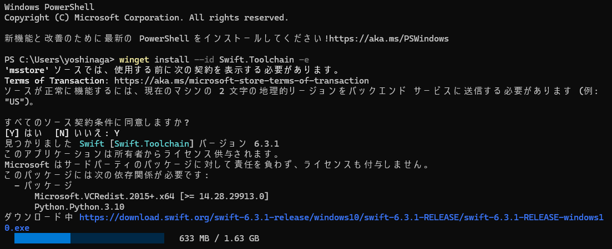

WindowsでSwiftの開発環境を構築する場合、**Windows Package Manager（winget）** を使う方法が比較的簡単で、依存関係も自動で解決してくれます。  
（Windows版Swiftは公式・コミュニティ双方で進化中であり、2026年時点ではまだ「実験的」な側面が強いことに注意してください。）

---

## 前提条件

- **OS**: Windows 11（開発者モードが使える環境）  
- **ツール**: winget（Windows 11なら標準で利用可能）  
- **エディタ**: Visual Studio Code など（任意）

---

## 手順（wingetを使う方法）

### 1. 開発者モードの有効化

Windowsの設定で「開発者モード」をオンにします。

1. 「設定」→「システム」→「開発者向け」を開きます。  
2. 「開発者モード」を「オン」にします。[Qiita](https://qiita.com/nak435/items/478ef704c04520ad7960)

※これにより、開発用の機能や権限が有効になります。

---

### 2. Visual Studio 2022 Community のインストール

Swift Toolchain が動作するために必要な Windows SDK や C++ ツールを含む Visual Studio 2022 Community をインストールします。

1. 管理者権限でコマンドプロンプトまたはPowerShellを開きます。  
2. 以下のコマンドを実行します。  
   ```cmd
   winget install --id Microsoft.VisualStudio.2022.Community --exact --force --custom "--add Microsoft.VisualStudio.Component.Windows11SDK.22000 --add Microsoft.VisualStudio.Component.VC.Tools.x86.x64"
   ```
   - ARM64環境の場合は、`--add Microsoft.VisualStudio.Component.VC.Tools.ARM64` も追加するのが推奨されています。[Qiita](https://qiita.com/nak435/items/478ef704c04520ad7960)

3. インストールが完了したら、Visual Studio を一度起動してライセンス同意などを行っておくと安心です。

---

### 3. Swift Toolchain のインストール

同じく winget を使って Swift Toolchain をインストールします。

1. 管理者権限でコマンドプロンプトまたはPowerShellを開きます。  
2. 以下のコマンドを実行します。  
   ```cmd
   winget install --id Swift.Toolchain -e
   ```
   - `-e` オプションは、インストーラを自動的に実行するための指定です。[Qiita](https://qiita.com/nak435/items/478ef704c04520ad7960)

3. インストールが完了したら、コマンドプロンプトやPowerShellを再起動します。




---

### 4. 動作確認

1. コマンドプロンプトまたはPowerShellで以下を実行します。  
   ```cmd
   swift --version
   ```
2. Swiftのバージョン情報が表示されれば、インストール成功です。[Qiita](https://qiita.com/nak435/items/478ef704c04520ad7960)

---

## 簡単なテスト（Hello World）

1. 作業用フォルダ（例: `C:\dev\swift-test`）を作成します。  
2. そのフォルダ内でコマンドプロンプトまたはPowerShellを開き、以下を実行します。  
   ```cmd
   swift package init --type executable
   ```
   - これで `Sources/main.swift` が生成されます。

3. ビルドと実行：
   ```cmd
   swift build
   swift run
   ```
   - 「Hello, world!」と表示されれば、Swiftの実行環境が正しく動いています。

---

## エディタの設定（任意）

- **Visual Studio Code** を使う場合：
  - 「Swift」拡張機能をインストールすると、シンタックスハイライトや補完が使えます。
  - ターミナル（PowerShell）から `swift build` や `swift run` を実行できます。

---

## 注意点

- Windows版Swiftは、主に **コマンドラインツール** や **サーバーサイドアプリ** などをターゲットにしています。  
- **iOSアプリ開発（シミュレータ・実機デバッグなど）は、現状macOS＋Xcodeがほぼ必須**です。WindowsでSwiftを学ぶことはできますが、iOSアプリを本格的に開発するにはMac環境が必要になります。[Publickey](https://www.publickey1.jp/blog/26/appleswiftwindowswindows_workgroup.html)

---

## まとめ

- Windows 11でSwiftを使うには、  
  1. 開発者モードをオンにする  
  2. wingetでVisual Studio 2022 Community（必要なSDK含む）を入れる  
  3. wingetでSwift Toolchainを入れる  
  4. `swift --version` で確認  
- これでコマンドラインからSwiftを実行できるようになります。

もし「iOSアプリを作りたい」のか「サーバーサイドやCLIツールを作りたい」のかなど、目的を教えていただければ、その用途に合わせてより具体的な開発フローもお伝えできます。