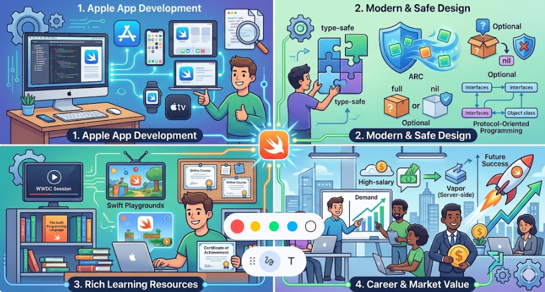

iPhoneアプリの開発をほんのちょっと必要になったので、開発に対応できるプログラム言語を調べました。
そして出てきたのがSwiftです。
どんな言語か興味がわいたので調べてみました。

## 概要
Swift（スウィフト）は、Appleが2014年に公開した**モダンな汎用プログラミング言語**です。主にiOS、macOS、watchOS、tvOSなどのAppleプラットフォーム向けアプリ開発で使われますが、サーバーサイドやLinux環境でも利用できます。

### 主な特徴

1. **安全性とパフォーマンスを重視**
   - コンパイル時に多くのエラーを検出する「型安全」な言語で、メモリ管理も自動（ARC）なので、比較的安全に書けます。
   - 実行速度はC言語に近い水準を目指しており、高速です。

2. **モダンで読みやすい構文**
   - 冗長になりがちなObjective-Cと比べて、シンプルで直感的な文法になっています。
   - 例：`print("Hello, world!")` だけで出力できます。

3. **オープンソース**
   - 2015年にオープンソース化され、Apple以外の環境（Linux、Windowsなど）でも使えます。
   - 言語仕様や標準ライブラリ、コンパイラ（LLVMベース）が公開されています。

4. **マルチパラダイム**
   - オブジェクト指向、関数型、プロトコル指向プログラミングなど、複数のスタイルを柔軟に組み合わせられます。

5. **Playgroundと対話的開発**
   - XcodeのPlayground機能で、コードを書きながらリアルタイムに結果を確認できます。学習やプロトタイピングに便利です。

### 主な用途

- **iOS / iPadOS / macOSアプリ開発**
  - iPhoneやMacのネイティブアプリは、現在はほとんどSwiftで書かれています。
- **サーバーサイド開発**
  - VaporやKituraといったWebフレームワークがあり、バックエンドAPIやWebサービスも構築可能です。
- **LinuxやWindowsでの開発**
  - 公式ツールチェーンやサードパーティの環境整備により、クロスプラットフォーム開発にも使われています。

### 歴史（ざっくり）

- 2014年：WWDCで発表、Objective-Cの後継として位置づけ。
- 2015年：Swift 2.0でオープンソース化。
- 2019年：Swift 5でABI安定化（バイナリ互換が安定）。
- 現在：Appleエコシステムの標準言語として広く普及。

### どんな人に向いているか

- iPhoneアプリやMacアプリを作りたい人
- モダンで安全な言語を学びたい人
- C/C++/Objective-Cの「古めかしさ」を避けたい人

## 現状の立ち位置

Swiftは、**「特定の目的（Apple系アプリ開発）に強い、中級〜上級寄りの学習言語」** というポジションに近いです。

### 学習言語としての位置づけ

__1. 最初の言語としては「ややニッチだが有力な選択肢」__
- **メリット**
  - Appleプラットフォーム（iPhone / iPad / Mac）のアプリ開発に直結するので、モチベーションが維持しやすい。
  - モダンで安全な設計（型安全、ARCなど）のため、**良いプログラミング習慣**を身につけやすい。
  - Playgroundで対話的に試せるので、初心者でも「動かす楽しさ」を感じやすい。

- **デメリット**
  - 学習環境が**Mac必須**（Windows/Linuxでは環境構築がやや面倒）。
  - iOS/macOSアプリ開発以外の用途（Web、ゲーム、データ分析など）では、PythonやJavaScriptほど汎用的ではない。
  - 型やオプショナルなど、初心者には少し難しい概念が早い段階で出てくる。

__2. 他の言語との比較での位置づけ__

- **Python**：  
  データ分析・AI・Web・スクリプトなど用途が広く、初学者向けの教材も豊富。  
  → 「まずプログラミングの全体像を掴みたい人」向け。

- **JavaScript**：  
  Webフロントエンドが中心で、ブラウザですぐ動かせる。  
  → 「Webアプリを作りたい人」向け。

- **Swift**：  
  Appleデバイス向けアプリ開発が主戦場。  
  → **「iPhoneアプリを作りたい」という明確な目的がある人**向け。

__3. 学習段階別のポジション__

- **初心者（初めての言語）**
  - 「iPhoneアプリを作りたい」という強い動機があるなら、Swiftは十分に良い選択肢です。
  - そうでなければ、PythonやJavaScriptの方が**環境構築のハードルが低く、応用範囲も広い**ことが多いです。

- **中級者（1つ以上言語を触ったことがある人）**
  - Swiftは「モダンな静的型付け言語」として、**良いステップアップ先**になります。
  - 型安全性、プロトコル指向、メモリ管理（ARC）などを学ぶことで、より堅牢なコードの書き方を身につけられます。

- **上級者・プロ**
  - Appleエコシステムの標準言語として、iOS/macOS開発では必須スキルです。
  - サーバーサイド（Vaporなど）やクロスプラットフォーム開発でも使われていますが、まだPython/Java/Goほど主流ではありません。

## 学習するメリット

Swiftを学ぶメリットは、大きく分けて次の4つです。

### 1. Appleプラットフォームのアプリ開発に直結する

- iPhone、iPad、Mac、Apple Watch、Apple TVなど、**Apple製品向けのネイティブアプリ**は、ほぼSwift（またはObjective-C）で書かれています。
- Appleが公式に推奨している言語なので、**ドキュメント・サンプルコード・コミュニティ**が豊富です。
- 「自分のアプリをApp Storeに出したい」という目標がある場合、Swiftはほぼ必須スキルになります。

### 2. モダンで安全な言語設計を学べる

Swiftは、C++やObjective-Cの反省を踏まえて設計された「モダンな言語」です。

- **型安全**：コンパイル時に多くのエラーを検出してくれるので、実行時エラーを減らせます。
- **メモリ管理（ARC）**：メモリ管理を自動で行ってくれるため、メモリリークや不正アクセスのリスクが減ります。
- **オプショナル型**：`nil`（値がない状態）を明示的に扱う仕組みがあり、「ぬるぽ（null参照）」によるクラッシュを防ぎやすいです。
- **プロトコル指向プログラミング**：クラス継承に頼らず、プロトコル（インターフェース）で設計するスタイルを学べます。

これらは、**「良いコードを書く習慣」** を身につける上で非常に役立ちます。

### 3. 学習環境・教材が充実している

- Apple公式の**Swift Playgrounds**アプリや、Xcodeの**Playground**機能で、対話的にコードを試せます。
- 公式ドキュメントやWWDCのセッション動画、書籍、オンラインコースなど、**学習リソースが豊富**です。
- iOS/macOSアプリ開発の需要が高いため、**「実務に近い形で学べる」** 教材も多いです。

### 4. キャリア・市場価値の面で有利

- iOS/macOSアプリ開発の求人は多く、**Swiftスキルを持つエンジニアの需要は高い**です。
- Appleエコシステムは高単価のユーザーが多いため、アプリビジネスも比較的成立しやすい傾向があります。
- サーバーサイド（Vaporなど）やクロスプラットフォーム開発でも使われ始めており、**応用範囲が広がりつつあります**。

## まとめ

- **「iPhoneアプリを作りたい」という目的がはっきりしている人**にとっては、Swiftは**非常に良い学習言語**です。
- 目的がまだ曖昧な場合や、Windows/Linux中心の環境で学ぶ場合は、**PythonやJavaScriptを先に学び、その後Swiftに進む**のが現実的です。
- プログラミング教育全体では、「初心者向けの汎用言語」というより、**「Appleプラットフォーム開発に特化した中級〜上級向けの実用言語」**という位置づけが近いです。

もし「自分はこういう目的で学びたい」という前提があれば、その条件に合わせて「Swiftが向いているかどうか」をもう少し具体的にアドバイスできます。
